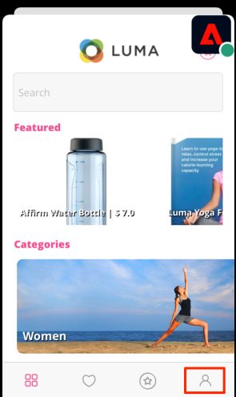

# 标识

了解如何在移动应用程序中收集身份数据。

Adobe Experience Platform Identity Service通过跨设备和系统桥接身份，允许您实时提供有影响力的个人数字体验，从而帮助您更好地了解客户及其行为。 标识字段和命名空间是将不同数据源连接在一起的粘合剂，用于构建360度实时客户档案。

进一步了解 [身份扩展](https://developer.adobe.com/client-sdks/documentation/identity-for-edge-network/) 和 [身份服务](https://experienceleague.adobe.com/docs/experience-platform/identity/home.html?lang=zh-Hans) 在文档中。

## 先决条件

* 成功构建并运行安装并配置了SDK的应用程序。

## 学习目标

在本课程中，您将执行以下操作：

* 更新标准标识。
* 设置自定义标识。
* 更新自定义标识。
* 验证身份图。
* 获取ECID和其他标识。

## 更新标准标识

首先在用户登录时更新用户的身份映射。

1. 导航到 `Login.swift` 如果Luma应用程序发现函数 `loginButt`.

   在Luma示例应用程序中，没有用户名或密码验证。 您只需点击按钮即可“登录”。

1. 创建 `IdentityMap` 和 `IdentityItem`.

   ```swift
   let identityMap: IdentityMap = IdentityMap()
   let emailIdentity = IdentityItem(id: emailAddress, authenticatedState: AuthenticatedState.authenticated)
   ```

1. 添加 `IdentityItem` 到 `IdentityMap`

   ```swift
   identityMap.add(item:emailIdentity, withNamespace: "Email")
   ```

1. 调用 `updateIdentities` 将数据发送到Platform Edge Network。

   ```swift
   Identity.updateIdentities(with: identityMap)
   ```

>[!NOTE]
>
>您可以在单个updateIdentities调用中发送多个标识。 您还可以修改以前发送的身份。


## 设置自定义身份命名空间

身份命名空间是的组件 [Identity Service](https://experienceleague.adobe.com/docs/experience-platform/identity/home.html?lang=zh-Hans) 用作与身份相关的上下文的指示器。 例如，它们将“name@email.com”的值作为电子邮件地址，将“443522”作为数字CRM ID。

1. 在数据收集界面中，选择 **[!UICONTROL 身份]** 从左边栏导航栏中。
1. 选择&#x200B;**[!UICONTROL 创建身份命名空间]**。
1. 提供 **[!UICONTROL 显示名称]** 之 `Luma CRM ID` 和 **[!UICONTROL 身份符号]** 值 `lumaCrmId`.
1. 选择 **[!UICONTROL 跨设备ID]**.
1. 选择&#x200B;**[!UICONTROL 创建]**。


## 更新自定义标识

现在您已经创建了自定义身份，请通过修改 `updateIdentities` 您在上一步中添加的代码。 只需创建一个IdentityItem并将其添加到IdentityMap即可。 下面是完整代码块的外观：

```swift
//Hardcoded identity values
let emailAddress = "testuser@gmail.com"
let crmId = "112ca06ed53d3db37e4cea49cc45b71e"

// Create identity map
let identityMap: IdentityMap = IdentityMap()
// Add email (standard)
let emailIdentity = IdentityItem(id: emailAddress, authenticatedState: AuthenticatedState.authenticated)
identityMap.add(item:emailIdentity, withNamespace: "Email")
// Add lumaCrmId (custom)
let crmIdentity = IdentityItem(id: crmId, authenticatedState: AuthenticatedState.authenticated)
identityMap.add(item: crmIdentity, withNamespace: "lumaCrmId")
// Update
Identity.updateIdentities(with: identityMap)
```

## 删除身份

您可以使用 `removeIdentity` 从存储的客户端IdentityMap中删除身份。 Identity扩展停止向Edge Network发送标识符。 使用此API不会从服务器端用户配置文件图或身份图中删除标识符。

添加以下内容 `removeIdentity` 注销按钮的代码点入 `Account.swift`.

```swift
// Logout
let logout = UIAlertAction(title: "Logout", style: .destructive, handler: { (action) -> Void in
    isLoggedIn = false;
    ////Hardcoded identity values
    let emailAddress = "testuser@gmail.com"
    let crmId = "112ca06ed53d3db37e4cea49cc45b71e"
    // Adobe Experience Platform - Remove Identity
    Identity.removeIdentity(item: IdentityItem(id: emailAddress), withNamespace: "Email")
    Identity.removeIdentity(item: IdentityItem(id: crmId), withNamespace: "lumaCrmId")
})
```

>[!NOTE]
>在上述示例中， `crmId` 和 `emailAddress` 虽然采用硬编码，但在实际应用程序中，值是动态的。

## 使用保证进行验证

1. 查看 [设置说明](assurance.md) 部分并将模拟器或设备连接到Assurance。
1. 在应用程序中，从右下角选择帐户图标。

   
1. 选择 **登录** 按钮。
1. 系统将显示用于输入用户名和密码的选项，这两个选项都是可选的，您只需选择 **登录**.

   
1. 在Assurance Web UI中查找 `Edge Identity Update Identities` 事件来自 `com.adobe.griffon.mobile` 供应商。
1. 选择事件并查看 `ACPExtensionEventData` 对象。 您应会看到已更新的身份。
   

## 使用身份图进行验证

一旦您完成 [Experience Platform课程](platform.md)，您还将能够在Platforms身份图查看器中确认身份捕获：


下一步： **[个人资料](profile.md)**

>[!NOTE]
>
>感谢您投入时间来了解Adobe Experience Platform Mobile SDK。 如果您有疑问、希望分享一般反馈或有关于未来内容的建议，请在此分享这些内容 [Experience League社区讨论帖子](https://experienceleaguecommunities.adobe.com/t5/adobe-experience-platform-launch/tutorial-discussion-implement-adobe-experience-cloud-in-mobile/td-p/443796)