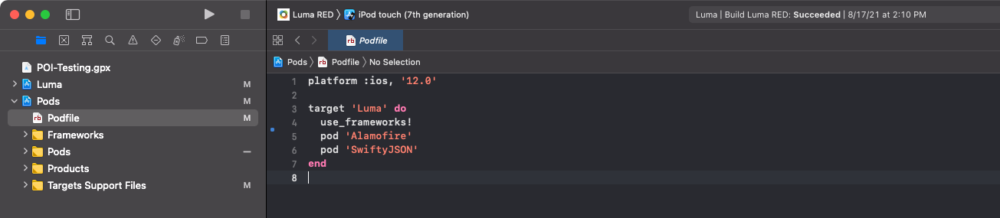

# 安装Adobe Experience Platform Mobile SDK

了解如何在移动应用程序中实施Adobe Experience Platform Mobile SDK。

## 先决条件

* 使用 [上一课](configure-tags.md).
* 开发环境文件ID，来自 [移动设备安装说明](configure-tags.md#generate-sdk-install-instructions).
* 已下载，空 [示例应用程序](https://github.com/Adobe-Marketing-Cloud/Luma-iOS-Mobile-App){target=&quot;_blank&quot;}。
* 体验 [XCode](https://developer.apple.com/xcode/){target=&quot;_blank&quot;}。
* 基本 [命令行](https://en.wikipedia.org/wiki/Command-line_interface){target=&quot;_blank&quot;}知识。

## 学习目标

在本课程中，您将：

* 更新CocoaPod文件。
* 导入所需的SDK。
* 注册扩展。

>[!NOTE]
>
>在移动设备应用程序实施中，术语“扩展”和“SDK”几乎可以互换。


## 更新PodFile

>[!NOTE]
>
> 如果你不熟悉可可豆荚，请查阅 [入门指南](https://guides.cocoapods.org/using/getting-started.html).

安装通常是一个简单的sudo命令：

```console
sudo gem install cocoapods
```

安装CocoaPods后，打开Podfile。



更新文件以包含以下Pod:

```swift
pod 'AEPCore', '~> 3'
pod 'AEPEdge', '~> 1'
pod 'AEPUserProfile', '~> 3'
pod 'AEPAssurance', '~> 3'
pod 'AEPServices', '~> 3'
pod 'AEPEdgeConsent', '~> 1'
pod 'AEPLifecycle', '~>3'
pod 'AEPMessaging', '~>1'
pod 'AEPEdgeIdentity', '~>1'
pod 'AEPSignal', '~>3'
```

>[!NOTE]
>
> `AEPMessaging` 仅当您计划使用Adobe Journey Optimizer实施推送消息时，才需要使用。 请阅读 [使用Adobe Journey Optimizer实施推送消息](journey-optimizer-push.md) 以了解更多信息。

将更改保存到Podfile后，导航到项目所在的文件夹并运行 `pod install` 命令来安装更改。


>[!NOTE]
>
> 如果您收到“在项目目录中找不到No Podfile”。 错误，您的终端位于错误文件夹中。 导航到包含您更新的Podfile的文件夹，然后重试。

如果要升级到最新版本，请运行 `pod update` 命令。

>[!INFO]
>
>如果你无法在自己的应用程序中使用CocoaPods，你可以了解其他 [支持的实施](https://github.com/adobe/aepsdk-core-ios#binaries) 在GitHub项目中。

## 构建CocoaPods

要构建CocoaPods，请打开 `Luma.xcworkspace`，然后选择 **产品**，后跟 **清理生成文件夹**.

>[!NOTE]
>
> 您可能需要设置 **仅构建活动架构** to **否**. 为此，请从项目导航器中选择Pod项目，然后选择 **生成设置**，并设置 **构建活动架构** to **否**.

您现在可以构建并运行项目。


>[!NOTE]
>
>Luma项目是在M1芯片组上使用Xcode v12.5构建的，并在iOS模拟器上运行。 如果您使用的是其他设置，则可能需要更改内部版本设置以反映您的架构。
>
>如果生成失败，请尝试还原 **构建活动架构** > **调试** 设置回 **是**.
>
>在创作本教程时使用了模拟器配置“iPod touch（第7代）”。

## 导入扩展

在 `.swift` ，请添加以下导入。 首先，将添加到 `AppDelegate.swift`.

```swift
import AEPUserProfile
import AEPAssurance
import AEPEdge
import AEPCore
import AEPEdgeIdentity
import AEPEdgeConsent
import AEPLifecycle
import AEPMessaging //Optional, used for AJO push messaging
import AEPSignal
import AEPServices
```

## 更新AppDelegate

在 `AppDelegate.swift` 文件中，将以下代码添加到 `didFinishLaunchingWithOptions`. 将currentAppId替换为您从 [上一课](configure-tags.md).

```swift
let currentAppId = "b5cbd1a1220e/bae66382cce8/launch-88492c6dcb6e-development"

let extensions = [Edge.self, Assurance.self, Lifecycle.self, UserProfile.self, Consent.self, AEPEdgeIdentity.Identity.self, Messaging.self]

MobileCore.setLogLevel(.trace)

MobileCore.registerExtensions(extensions, {
    MobileCore.configureWith(appId: currentAppId)
})
```

`Messaging.self` 仅当您计划按照所述通过Adobe Journey Optimizer实施推送消息时，才需要使用 [此处](journey-optimizer-push.md).

上述代码会执行以下操作：

* 注册所需的扩展。
* 配置MobileCore和其他扩展以使用您的标记属性配置。
* 启用调试日志记录。 有关更多详细信息和选项，请参阅 [移动SDK文档](https://aep-sdks.gitbook.io/docs/getting-started/enable-debug-logging).

>[!IMPORTANT]
>在生产应用程序中，您必须根据当前环境(dev/stag/prod)切换AppId。

下一个： **[设置保证](assurance.md)**

>[!NOTE]
>
>感谢您花时间了解Adobe Experience Platform Mobile SDK。 如果您有任何疑问、想要分享一般反馈或对未来内容提出建议，请就此分享 [Experience League社区讨论帖子](https://experienceleaguecommunities.adobe.com/t5/adobe-experience-platform-launch/tutorial-discussion-implement-adobe-experience-cloud-in-mobile/td-p/443796)