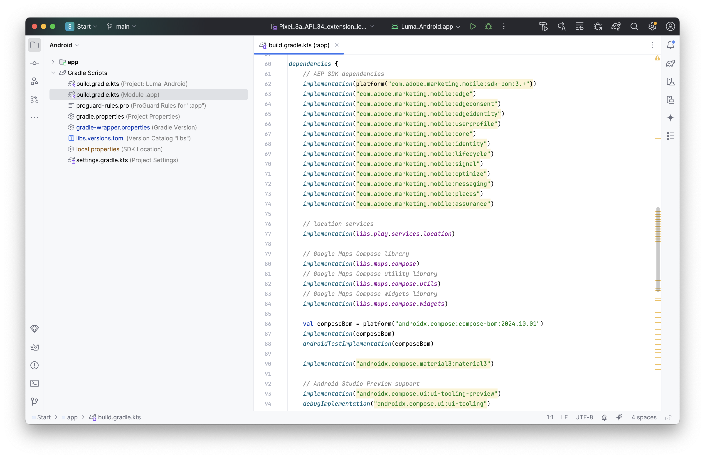

# 安装 Adobe Experience Platform Mobile SDK {#tutorial_install_mobile_sdks}

>[!CONTEXTUALHELP]
>
>id="platform_mobile_sdk_tutorial_install"
>title="安装 Adobe Experience Platform Mobile SDK"
>abstract="了解如何在移动应用程序中实施 Adobe Experience Platform Mobile SDK。"

了解如何在移动应用程序中实施 Adobe Experience Platform Mobile SDK。

## 先决条件

* 已成功使用[上一课程](configure-tags.md)中描述的扩展生成标记库。
* 来自[移动设备安装说明](configure-tags.md#generate-sdk-install-instructions)的开发环境文件ID。
* 已下载[iOS的示例应用程序](https://github.com/Adobe-Marketing-Cloud/Luma-iOS-Mobile-App)或[Android的示例应用程序](https://github.com/adobe/Luma-Android)。
* 体验[Xcode](https://developer.apple.com/xcode/) (iOS)或[Android Studio](https://developer.android.com/studio/intro?utm_source=android-studio) (Android)

## 学习目标

在本课程中，您将执行以下操作：

* 将所需的SDK添加到您的项目中。
* 注册扩展。

>[!NOTE]
>
>在移动应用程序实施中，术语&#x200B;*扩展*&#x200B;和&#x200B;*SDK*&#x200B;几乎可以互换。

>[!BEGINTABS]

>[!TAB iOS]

## Swift包管理器

使用Xcode的原生Swift包管理器添加单个包，而不使用CocoaPods和Pod文件(如[生成SDK安装说明](./configure-tags.md#generate-sdk-install-instructions)中所述)。 Xcode项目已经为您添加了所有包依赖项。 Xcode **[!UICONTROL 包依赖项]**&#x200B;屏幕应如下所示：

{zoomable="yes"}


在Xcode中，您可以使用&#x200B;**[!UICONTROL 文件]** > **[!UICONTROL 添加包……]**&#x200B;来添加包。 下表提供了用于添加包的URL的链接。 这些链接还将引导您了解有关每个特定包的更多信息。

| 包 | 描述 |
|---|---|
| [AEP Core](https://github.com/adobe/aepsdk-core-ios) | `AEPCore`、`AEPServices`和`AEPIdentity`扩展代表Adobe Experience Platform SDK的基础 — 使用SDK的每个应用程序都必须包含它们。 这些模块包含所有SDK扩展都需要的通用功能和服务集。<br/><ul><li>`AEPCore`包含事件中心的实现。 事件中心是在应用程序和SDK之间交付事件的机制。 事件中心还用于在扩展之间共享数据。</li><li>`AEPServices`提供平台支持所需的多种可重用的实现，包括网络、磁盘访问和数据库管理。</li><li>`AEPIdentity`实现与Adobe Experience Platform Identity服务的集成。</li><li>`AEPSignal`表示Adobe Experience Platform SDK Signal扩展，该扩展允许营销人员向其应用程序发送“信号”，以将数据发送到外部目标或打开URL。</li><li>`AEPLifecycle`表示Adobe Experience Platform SDK生命周期扩展，该扩展可帮助收集应用程序生命周期量度，如应用程序安装或升级信息、应用程序启动和会话信息、设备信息以及应用程序开发人员提供的任何其他上下文数据。</li></ul> |
| [AEP Edge](https://github.com/adobe/aepsdk-edge-ios) | Adobe Experience Platform Edge Network移动扩展(`AEPEdge`)允许您从移动应用程序向Adobe Edge Network发送数据。 通过此扩展，您可以更稳健地实施Adobe Experience Cloud功能，通过一个网络调用提供多个Adobe解决方案，同时将此信息转发到Adobe Experience Platform。<br/>Edge Network移动扩展是Adobe Experience Platform SDK的扩展。 该扩展需要`AEPCore`和`AEPServices`扩展才能进行事件处理，需要`AEPEdgeIdentity`扩展才能检索身份，如ECID。 |
| [AEP Edge标识](https://github.com/adobe/aepsdk-edgeidentity-ios) | Adobe Experience Platform Edge Identity移动扩展(`AEPEdgeIdentity`)在使用Adobe Experience Platform SDK和Edge Network扩展时，允许处理来自移动应用程序的用户身份数据。 |
| [AEP Edge同意](https://github.com/adobe/aepsdk-edgeconsent-ios) | Adobe Experience Platform同意收集移动扩展(`AEPConsent`)在使用Adobe Experience Platform SDK和Edge Network扩展时允许从移动应用程序收集同意首选项。 |
| [AEP用户配置文件](https://github.com/adobe/aepsdk-userprofile-ios) | Adobe Experience Platform User Profile Mobile扩展(`AEPUserProfile`)是管理Adobe Experience Platform SDK的用户配置文件的扩展。 |
| [AEP地标](https://github.com/adobe/aepsdk-places-ios) | Adobe Experience Platform Places扩展(`AEPPlaces`)允许您跟踪Adobe Places界面和Adobe数据收集标记规则中定义的地理位置事件。 |
| [AEP消息](https://github.com/adobe/aepsdk-messaging-ios) | Adobe Experience Platform消息扩展(`AEPMessaging`)允许您将推送通知令牌和推送通知点进反馈发送到Adobe Experience Platform。 |
| [AEP优化](https://github.com/adobe/aepsdk-optimize-ios) | Adobe Experience Platform优化扩展(`AEPOptimize`)提供了API，以使用Adobe Target或Adobe Journey Optimizer Offer Decisioning在Adobe Experience Platform Mobile SDK中启用实时个性化工作流。 它需要`AEPCore`和`AEPEdge`扩展才能将个性化查询事件发送到Experience Edge Network。 |
| [AEP Assurance](https://github.com/adobe/aepsdk-assurance-ios) | Adobe Experience Platform Assurance是Adobe Experience Cloud的一个产品，可帮助您检查、验证、模拟和验证在移动设备应用程序中收集数据或提供体验的方式。 |


## 导入扩展

在Xcode中打开示例应用程序的&#x200B;**[!UICONTROL 开始]**&#x200B;文件夹中的项目。

在Xcode中，导航到&#x200B;**[!DNL Luma]** > **[!DNL Luma]** > **[!UICONTROL AppDelegate]**，并确保以下导入是此源文件的一部分。

```swift
// import AEP MobileSDK libraries
import AEPCore
import AEPServices
import AEPIdentity
import AEPSignal
import AEPLifecycle
import AEPEdge
import AEPEdgeIdentity
import AEPEdgeConsent
import AEPUserProfile
import AEPPlaces
import AEPMessaging
import AEPOptimize
import AEPAssurance
```

对&#x200B;**[!DNL Luma]** > **[!DNL Luma]** > **[!DNL Utils]** > **[!UICONTROL MobileSDK]**&#x200B;执行相同操作。

## 更新AppDelegate

在Xcode项目导航器中导航到&#x200B;**[!DNL Luma]** > **[!DNL Luma]** > **AppDelegate**。

1. 将`@AppStorage`的`YOUR_ENVIRONMENT_ID_GOES_HERE`值`environmentFileId`替换为您从[生成SDK安装说明](configure-tags.md#generate-sdk-install-instructions)中的标记检索到的环境文件ID值。

   ```swift
   @AppStorage("environmentFileId") private var environmentFileId = "YOUR_ENVIRONMENT_ID_GOES_HERE"
   ```

1. 将以下代码添加到`application(_, didFinishLaunchingWithOptions)`函数。

   ```swift
   // Define extensions
   let extensions = [
       AEPIdentity.Identity.self,
       Lifecycle.self,
       Signal.self,
       Edge.self,
       AEPEdgeIdentity.Identity.self,
       Consent.self,
       UserProfile.self,
       Places.self,
       Messaging.self,
       Optimize.self,
       Assurance.self
   ]
   
   // Register extensions
   MobileCore.registerExtensions(extensions, {
       // Use the environment file id assigned to this application via Adobe Experience Platform Data Collection
       Logger.aepMobileSDK.info("Luma - using mobile config: \(self.environmentFileId)")
       MobileCore.configureWith(appId: self.environmentFileId)
   
       // set this to false or comment it when deploying to TestFlight (default is false),
       // set this to true when testing on your device.
       MobileCore.updateConfigurationWith(configDict: ["messaging.useSandbox": true])
       if appState != .background {
           // only start lifecycle if the application is not in the background
           MobileCore.lifecycleStart(additionalContextData: nil)
       }
   
       // assume unknown, adapt to your needs.
       MobileCore.setPrivacyStatus(.unknown)
   })
   ```

上述代码执行以下操作：

1. 注册所需的扩展。
1. 配置MobileCore和其他扩展以使用标记属性配置。
1. 启用调试日志记录。 有关更多详细信息和选项，请参阅[Adobe Experience Platform Mobile SDK文档](https://developer.adobe.com/client-sdks/documentation/getting-started/enable-debug-logging/)。
1. 启动生命周期监控。 有关更多详细信息，请参阅本教程中的[生命周期](lifecycle-data.md)步骤。
1. 将默认同意设置为“未知”。 有关更多详细信息，请参阅教程中的[同意](consent.md)步骤。

确保基于您为了（开发、暂存或生产）构建的标记环境中的`MobileCore.configureWith(appId: self.environmentFileId)`，使用`appId`更新`environmentFileId`。

>[!TAB Android]

## Gradle

您使用[生成SDK安装说明](./configure-tags.md#generate-sdk-install-instructions)中的依赖项通过Gradle与Android Studio的集成来添加单个包，Android Studio项目已经为您添加了所有包依赖项。

1. 选择作为工具。
1. 选择&#x200B;**[!UICONTROL Android]**&#x200B;视图。
1. 从左窗格中选择&#x200B;**[!UICONTROL Gradle脚本]** > **[!UICONTROL build.gradle.kts （模块:app）]**。 然后，在右侧窗格中，滚动直到看到`dependencies`为止。

   {zoomable="yes"}

在Android Studio中，您可以使用&#x200B;**[!UICONTROL 文件]** > **[!UICONTROL 项目结构……]**&#x200B;来添加模块依赖项。 选择&#x200B;**[!UICONTROL 依赖项]**，然后使用&#x200B;**[!UICONTROL 模块]** 添加模块。 下表提供了用于添加依赖关系模块的URL的链接。 这些链接还将引导您了解关于每个特定模块的更多信息。

| 包<br/>com.adobe.<br/>marketing.mobile： | 描述 |
|---|---|
| [核心](https://github.com/adobe/aepsdk-core-android) | `MobileCore`和`Identity`扩展代表Adobe Experience Platform SDK的基础。 使用SDK的每个应用程序都必须包含这些变量。 这些模块包含所有SDK扩展都需要的通用功能和服务集。<ul><li>`MobileCore`包含事件中心的实现。 事件中心是在应用程序和SDK之间交付事件的机制。 事件中心还用于在扩展之间共享数据，并提供平台支持所需的多种可重用实施，包括联网、磁盘访问和数据库管理。</li><li>`Identity`实现与Adobe Experience Platform Identity服务的集成。</li><li>`Signal`表示Adobe Experience Platform SDK的Signal扩展，该扩展允许营销人员向其应用程序发送“信号”，以将数据发送到外部目标或打开URL。</li><li>`Lifecycle`表示Adobe Experience Platform SDK的生命周期扩展，该扩展可帮助收集应用程序生命周期量度，如应用程序安装或升级信息、应用程序启动和会话信息、设备信息以及应用程序开发人员提供的任何其他上下文数据。</li></ul> |
| [边缘](https://github.com/adobe/aepsdk-edge-android) | Adobe Experience Platform Edge Network移动扩展(`AEPEdge`)允许您从移动应用程序向Adobe Edge Network发送数据。 通过此扩展，您可以更稳健地实施Adobe Experience Cloud功能，通过一个网络调用提供多个Adobe解决方案，同时将此信息转发到Adobe Experience Platform。<br/>Edge Network移动扩展是Adobe Experience Platform SDK的扩展。 该扩展需要`Mobile Core`和`Services`扩展才能进行事件处理。 以及用于检索身份的`Identity for Edge Network`扩展，如ECID。 |
| [edgeidentity](https://github.com/adobe/aepsdk-edgeidentity-android) | Adobe Experience Platform Edge Identity移动扩展在使用Adobe Experience Platform SDK和Edge Network扩展时，支持处理来自移动应用程序的用户身份数据。 |
| [edgeconsent](https://github.com/adobe/aepsdk-edgeconsent-android) | Adobe Experience Platform同意收集移动扩展在使用Adobe Experience Platform SDK和Edge Network扩展时，支持从移动应用程序收集同意首选项。 |
| [用户配置文件](https://github.com/adobe/aepsdk-userprofile-android) | Adobe Experience Platform User Profile Mobile扩展是一个扩展，用于管理Adobe Experience Platform SDK的用户配置文件。 |
| [aepplaces](https://github.com/adobe/aepsdk-places-android) | Adobe Places Service是一项地理位置服务，通过此服务，可使用具有位置感知功能的移动设备应用程序。 并通过使用丰富且易于使用的SDK界面以及灵活的关注点(POI)数据库来了解位置上下文。 有关更多信息，请参阅Places服务文档。<br/>此服务是Android 2.x Adobe Experience Platform SDK的Places移动扩展，需要核心扩展才能进行事件处理。 |
| [消息](https://github.com/adobe/aepsdk-messaging-android) | Adobe Experience Platform Messaging扩展可为您的移动应用程序提供推送通知、应用程序内消息和基于代码的体验。 此扩展还帮助您收集用户推送令牌并管理与Adobe Experience Platform服务的交互测量。 |
| [优化](https://github.com/adobe/aepsdk-optimize-android) | Adobe Experience Platform优化扩展提供了API，以使用Adobe Target或Adobe Journey Optimizer Offer Decisioning在Adobe Experience Platform SDK中启用实时个性化工作流。 它依赖于Mobile Core，并需要Edge扩展才能将个性化查询事件发送到Experience Edge Network。 |
| [保证](https://github.com/adobe/aepsdk-assurance-android) | Assurance（也称为项目Griffon）是Adobe Experience Platform的移动扩展，允许与Adobe Experience Platform Assurance集成。 该扩展可帮助您检查、验证、模拟和验证在移动设备应用程序中收集数据或提供体验的方式。 此扩展需要使用MobileCore。 |

## 导入扩展

在Android Studio中，导航到&#x200B;**[!UICONTROL 应用程序]** > **[!UICONTROL kotlin+java]** > **[!UICONTROL com.adobe.luma.tutorial.android]** > **[!UICONTROL LumaApplication]**，并确保源文件中包含下列导入。

```kotlin
import com.adobe.marketing.mobile.Assurance
import com.adobe.marketing.mobile.Edge
import com.adobe.marketing.mobile.Lifecycle
import com.adobe.marketing.mobile.LoggingMode
import com.adobe.marketing.mobile.Messaging
import com.adobe.marketing.mobile.MobileCore
import com.adobe.marketing.mobile.MobilePrivacyStatus
import com.adobe.marketing.mobile.Places
import com.adobe.marketing.mobile.Signal
import com.adobe.marketing.mobile.UserProfile
import com.adobe.marketing.mobile.edge.consent.Consent
import com.adobe.marketing.mobile.edge.identity.Identity
import com.adobe.marketing.mobile.optimize.Optimize
```

对&#x200B;**[!UICONTROL 应用程序]** > **[!UICONTROL kotlin+java]** > **[!UICONTROL com.adobe.luma.tutorial.android]** > **[!UICONTROL 模型]** > **[!UICONTROL MobileSDK]**&#x200B;执行相同的操作。


## 更新LumaApplication

在&#x200B;**[!UICONTROL Android]**&#x200B;视图中，导航到Android Studio中的&#x200B;**[!UICONTROL 应用程序]** > **[!UICONTROL kotlin+java]** > **[!UICONTROL com.adobe.luma.tutorial.android]** > **[!UICONTROL LumaApplication]**。

1. 将`"YOUR_ENVIRONMENT_FILE_ID"`中的`private var environmentFileId = "YOUR_ENVIRONMENT_ID_GOES_HERE"`替换为您从[生成SDK安装说明](configure-tags.md#generate-sdk-install-instructions)中的标记检索到的环境文件ID值。

   ```kotlin
   private var environmentFileId = "YOUR_ENVIRONMENT_ID_GOES_HERE"
   ```

1. 将以下代码添加到`override fun onCreate()`中的`class LumaApplication : Application()`函数。

   ```kotlin
   // Define extensions
   val extensions = listOf(
      Identity.EXTENSION,
      Lifecycle.EXTENSION,
      Signal.EXTENSION,
      Edge.EXTENSION,
      Consent.EXTENSION,
      UserProfile.EXTENSION,
      Places.EXTENSION,
      Messaging.EXTENSION,
      Optimize.EXTENSION,
      Assurance.EXTENSION
   )
   
   // Register extensions
   MobileCore.registerExtensions(extensions) {
   // Use the environment file id assigned to this application via Adobe Experience Platform Data Collection
     Log.i("Luma", "Using mobile config: $environmentFileId")
     MobileCore.configureWithAppID(environmentFileId)
   
     // set this to true when testing on your device, default is false.
     //MobileCore.updateConfiguration(mapOf("messaging.useSandbox" to true))
   
     // assume unknown, adapt to your needs.
     MobileCore.setPrivacyStatus(MobilePrivacyStatus.UNKNOWN)
   }
   ```

   上述代码执行以下操作：

   1. 注册所需的扩展。
   1. 配置MobileCore和其他扩展以使用标记属性配置。
   1. 启用调试日志记录。 有关更多详细信息和选项，请参阅[Adobe Experience Platform Mobile SDK文档](https://developer.adobe.com/client-sdks/documentation/getting-started/enable-debug-logging/)。
   1. 启动生命周期监控。 有关更多详细信息，请参阅本教程中的[生命周期](lifecycle-data.md)步骤。
   1. 将默认同意设置为“未知”。 有关更多详细信息，请参阅教程中的[同意](consent.md)步骤。

确保根据您为了（开发、暂存或生产）构建的标记环境中的环境文件ID，使用`MobileCore.configureWith(environmentFileId)`更新`environmentFileId`。


>[!ENDTABS]

>[!SUCCESS]
>
>您现在已安装必要的软件包，并更新了项目以注册所需的Adobe Experience Platform Mobile SDK扩展，您将在本教程的其余部分使用这些扩展。
>
>感谢您投入时间学习Adobe Experience Platform Mobile SDK。 如果您有任何疑问、希望分享一般反馈或有关于未来内容的建议，请在此[Experience League社区讨论帖子](https://experienceleaguecommunities.adobe.com/t5/adobe-experience-platform-data/tutorial-discussion-implement-adobe-experience-cloud-in-mobile/td-p/443796?profile.language=zh-Hans)上分享这些内容

下一步：**[设置Assurance](assurance.md)**
