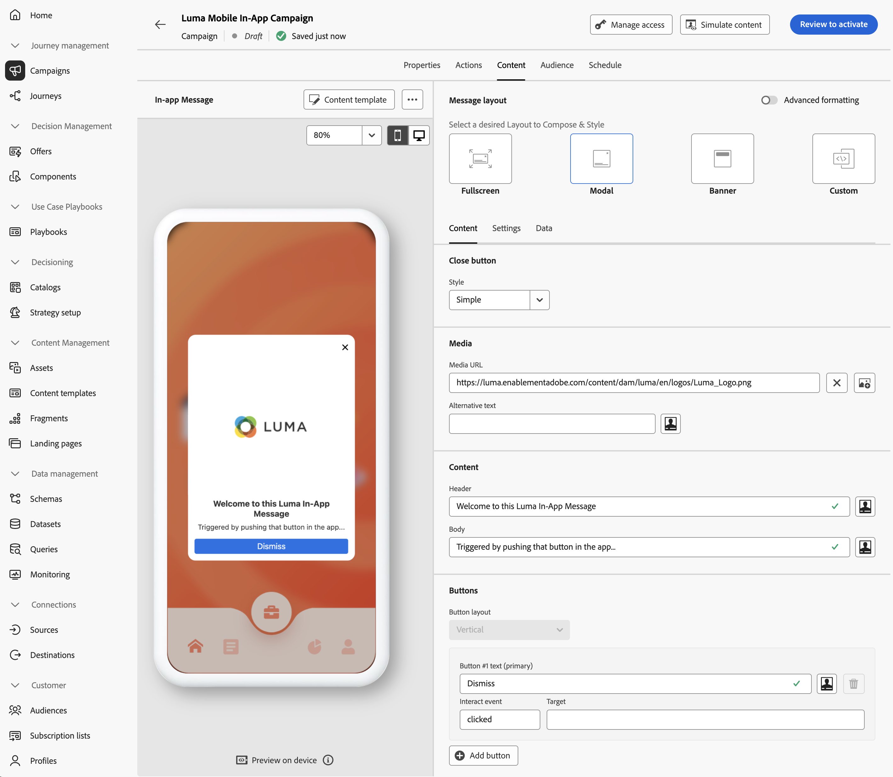

# 创建和发送应用程序内消息

了解如何使用Experience Platform Mobile SDK和Journey Optimizer为移动应用程序创建应用程序内消息。

Journey Optimizer允许您创建营销活动，以将应用程序内消息发送给目标受众。 Journey Optimizer中的营销活动用于通过各种渠道向特定受众投放一次性内容。 借助营销策划，可同时执行各种操作，可以立即执行，也可以根据指定的计划执行。 使用历程时(请参阅[Journey Optimizer推送通知](journey-optimizer-push.md)课程)，操作将按顺序执行。

{zoomable="yes"}

在使用Journey Optimizer发送应用程序内消息之前，必须确保进行适当的配置和集成。 要了解Journey Optimizer中的应用程序内消息传送数据流，请参阅[文档](https://experienceleague.adobe.com/en/docs/journey-optimizer/using/in-app/inapp-configuration)。

>[!NOTE]
>
>本课程是可选的，仅适用于希望发送应用程序内消息的Journey Optimizer用户。


## 先决条件

* 在安装和配置SDK的情况下成功构建和运行应用程序。
* 为Adobe Experience Platform设置应用程序。
* 访问Journey Optimizer和[推送通知的足够权限](https://experienceleague.adobe.com/en/docs/journey-optimizer/using/push/push-config/push-configuration)。 此外，您需要具有足够的权限才能使用以下Journey Optimizer功能。
   * 管理营销活动。
* 用于测试的物理iOS设备或模拟器。


## 学习目标

在本课程中，您将执行以下操作

* 在Journey Optimizer中创建渠道配置。
* 安装和配置Journey Optimizer标记扩展。
* 更新您的应用程序以注册Journey Optimizer标记扩展。
* 验证Assurance中的设置。
* 在Journey Optimizer中定义您自己的营销活动和应用程序内消息体验。
* 在应用程序中发送您自己的应用程序内消息。

## 设置

>[!TIP]
>
>如果您已将环境设置为[Journey Optimizer推送消息](journey-optimizer-push.md)课程的一部分，则您可能已执行了此设置部分中的某些步骤。


### 创建渠道配置

要开始，您必须创建渠道配置，以便能够从Journey Optimizer发送应用程序消息通知。

1. 在Journey Optimizer界面中，打开&#x200B;**[!UICONTROL 渠道]** > **[!UICONTROL 常规设置]** > **[!UICONTROL 渠道配置]**&#x200B;菜单，然后选择&#x200B;**[!UICONTROL 创建渠道配置]**。

1. 输入配置的名称和说明（可选）。 例如，`LumaInAppMessaging`和`Channel for in-app messaging`。

   >[!NOTE]
   >
   > 名称必须以字母(A-Z)开头。 它只能包含字母数字字符。 您还可以使用下划线 `_`、点 `.` 和连字符 `-` 符号。

1. 要为配置分配自定义或核心数据使用标签，您可以选择&#x200B;**[!UICONTROL 管理访问权限]**。 [了解有关对象级访问控制(OLAC)的更多信息](https://experienceleague.adobe.com/en/docs/journey-optimizer/using/access-control/object-based-access)。

1. 选择&#x200B;**应用程序内消息传送**&#x200B;渠道。

1. 选择&#x200B;**[!UICONTROL 营销操作]**&#x200B;以使用此配置将同意策略与消息关联。 所有与营销活动相关的同意政策都可以用来尊重客户的偏好。 [了解有关营销操作的更多信息](https://experienceleague.adobe.com/en/docs/journey-optimizer/using/privacy/consent/consent#surface-marketing-actions)。 例如：推送定位。

1. 选择要为其定义设置的平台。 通过此设置，您可以为每个平台指定目标应用程序，并确保跨多个平台的一致内容交付。

   >[!NOTE]
   >
   >对于iOS和Android平台，交付仅基于应用程序ID。 如果两个应用共享相同的应用程序ID，则无论在&#x200B;**[!UICONTROL 渠道配置]**&#x200B;中选择了什么平台，都会将内容交付给两者。

1. 输入要支持的平台的应用程序ID。

   {zoomable="yes"}

1. 选择&#x200B;**[!UICONTROL 提交]**&#x200B;以保存更改。

### 更新数据流配置

要确保将从您的移动应用程序发送到Edge Network的数据转发到Journey Optimizer，请更新您的Experience Edge配置。


1. 在数据收集UI中，选择&#x200B;**[!UICONTROL 数据流]**，然后选择您的数据流，例如&#x200B;**[!DNL Luma Mobile App]**。
1. 为选择&#x200B;**[!UICONTROL 更多]**，然后从上下文菜单中选择 **[!UICONTROL 编辑]**。
1. 在&#x200B;**[!UICONTROL 数据流]** >  > **[!UICONTROL Adobe Experience Platform]**&#x200B;屏幕中，确保已选择&#x200B;**[!UICONTROL Adobe Journey Optimizer]**。 有关详细信息，请参阅[Adobe Experience Platform设置](https://experienceleague.adobe.com/en/docs/experience-platform/datastreams/configure)。
1. 要保存数据流配置，请选择&#x200B;**[!UICONTROL 保存]**。


   {zoomable="yes"}


### 安装Journey Optimizer标记扩展

要使您的应用程序能够与Journey Optimizer配合使用，必须更新标记属性。

1. 导航到&#x200B;**[!UICONTROL 标记]** > **[!UICONTROL 扩展]** > **[!UICONTROL 目录]**。
1. 打开您的属性，例如&#x200B;**[!DNL Luma Mobile App Tutorial]**。
1. 选择&#x200B;**[!UICONTROL 目录]**。
1. 搜索&#x200B;**[!UICONTROL Adobe Journey Optimizer]**&#x200B;扩展。
1. 安装扩展。

当&#x200B;*仅*&#x200B;在您的应用程序中使用应用程序内消息时，在&#x200B;**[!UICONTROL 安装扩展]**&#x200B;或&#x200B;**[!UICONTROL 配置扩展]**&#x200B;中，您无需配置任何内容。 如果您已按照本教程中的[推送通知](journey-optimizer-push.md)课程进行操作，则会发现对于&#x200B;**[!UICONTROL 开发]**&#x200B;环境，已从&#x200B;**[!UICONTROL 事件数据集]**&#x200B;列表中选择&#x200B;**[!UICONTROL AJO推送跟踪体验事件数据集]**&#x200B;数据集。


### 在应用程序中实施Journey Optimizer

如前面的课程中所述，安装移动标记扩展仅提供配置。 接下来，您必须安装并注册消息传送SDK。 如果未清除这些步骤，请查看[安装SDK](install-sdks.md)部分。

>[!NOTE]
>
>如果您已完成[安装SDK](install-sdks.md)部分，则表明已安装SDK，您可以跳过此步骤。
>

>[!BEGINTABS]

>[!TAB iOS]

1. 在Xcode中，确保将[AEP消息](https://github.com/adobe/aepsdk-messaging-ios)添加到包依赖关系中的包列表中。 请参阅[Swift包管理器](install-sdks.md#swift-package-manager)。
1. 在Xcode项目导航器中导航到&#x200B;**[!DNL Luma]** > **[!DNL Luma]** > **[!UICONTROL AppDelegate]**。
1. 确保`AEPMessaging`是导入列表的一部分。

   `import AEPMessaging`

1. 请确保`Messaging.self`是正在注册的扩展数组的一部分。

   ```swift
   let extensions = [
       AEPIdentity.Identity.self,
       Lifecycle.self,
       Signal.self,
       Edge.self,
       AEPEdgeIdentity.Identity.self,
       Consent.self,
       UserProfile.self,
       Places.self,
       Messaging.self,
       Optimize.self,
       Assurance.self
   ]
   ```

>[!TAB Android]

1. 在Android Studio中，确保[aepsdk-messaging-android](https://github.com/adobe/aepsdk-messaging-android)是&#x200B;**[!UICONTROL Android]** **[!UICONTROL ChevronDown]** > 中&#x200B;**[!UICONTROL build.gradle.kts]**&#x200B;的依赖项的一部分。 查看[Gradle](install-sdks.md#gradle)。
1. 在Android Studio项目导航器中导航到&#x200B;**[!UICONTROL Android]**  **[!DNL app]** > **[!DNL kotlin+java]** > **[!UICONTROL com.adobe.luma.tutorial.android]** > **[!UICONTROL LumaApplication]**。
1. 确保`com.adobe.marketing.mobile.Messaging`是导入列表的一部分。

   `import import com.adobe.marketing.mobile.Messaging`

1. 请确保`Messaging.EXTENSION`是正在注册的扩展数组的一部分。

   ```kotlin
   val extensions = listOf(
       Identity.EXTENSION,
       Lifecycle.EXTENSION,
       Signal.EXTENSION,
       Edge.EXTENSION,
       Consent.EXTENSION,
       UserProfile.EXTENSION,
       Places.EXTENSION,
       Messaging.EXTENSION,
       Optimize.EXTENSION,
       Assurance.EXTENSION
   )
   ```

>[!ENDTABS]

## 使用Assurance验证设置

1. 查看[设置说明](assurance.md#connecting-to-a-session)部分以将模拟器或设备连接到Assurance。
1. 在Assurance用户界面中，选择&#x200B;**[!UICONTROL 配置]**。
   {zoomable="yes"}
1. 选择旁边的&#x200B;**[!UICONTROL 加号]**&#x200B;按钮。
1. 选择&#x200B;**[!UICONTROL 保存]**。
   {zoomable="yes"}
1. 从左侧导航中选择&#x200B;**[!UICONTROL 应用程序内消息传送]**。
1. 选择&#x200B;**[!UICONTROL 验证]**&#x200B;选项卡。 确认您没有收到任何错误。

   {zoomable="yes"}


## 创建您自己的应用程序内消息

要创建您自己的应用程序内消息，您必须在Journey Optimizer中定义一个促销活动，以根据发生的事件触发应用程序内消息。 这些事件可以是：

* 数据发送到Adobe Experience Platform，
* 通过Mobile Core通用API的核心跟踪事件（如操作）或PII数据的状态或集合，
* 应用程序生命周期事件，例如启动、安装、升级、关闭或崩溃，
* 地理位置事件，例如进入或退出目标点。

在本教程中，您将使用Mobile Core通用API和与扩展无关的API（请参阅[Mobile Core通用API](https://developer.adobe.com/client-sdks/documentation/mobile-core/#mobile-core-generic-apis)）来促进对用户屏幕、操作和PII数据的事件跟踪。 这些API生成的事件将发布到SDK事件中心，可供扩展使用。 SDK事件中心提供了与所有Mobile Platform SDK扩展绑定的核心数据结构。 事件中心维护已注册的扩展和内部模块的列表、已注册的事件侦听器的列表以及共享状态数据库。

SDK事件中心发布和接收来自已注册的扩展的事件数据，以简化与Adobe和第三方解决方案的集成。 例如，安装优化扩展后，事件中心会通过Journey Optimizer — 决策管理选件引擎处理所有请求和交互。

1. 在Journey Optimizer UI中，从左边栏中选择&#x200B;**[!UICONTROL 促销活动]**。
1. 选择&#x200B;**[!UICONTROL 创建营销活动]**。
1. 在&#x200B;**[!UICONTROL 创建营销活动]**&#x200B;对话框中，选择 **[!UICONTROL 计划 — 营销]**，然后选择&#x200B;**[!UICONTROL 确认]**。
1. 在&#x200B;**[!UICONTROL Campaign - *YYYY-MM-DD HH:MM:SS UTC+XX:XX*]**&#x200B;屏幕中：

   1. 在&#x200B;**[!UICONTROL 属性]**&#x200B;选项卡中：

      1. 输入促销活动的名称，例如，`Luma Mobile In-App Campaign`。
      1. （可选）添加描述。


   1. 选择&#x200B;**[!UICONTROL 操作]**&#x200B;选项卡。

      1. 在&#x200B;**[!UICONTROL 显示消息if]**&#x200B;下，选择 **[!UICONTROL 添加操作]**。 从下拉菜单中选择&#x200B;**[!UICONTROL 应用程序内消息]**。
      1. 从&#x200B;**[!UICONTROL 应用程序内消息配置]**&#x200B;下拉菜单中，选择您的配置。 例如，**[!UICONTROL LumaInAppMessaging]**。
      1. 选择 **[!UICONTROL 编辑触发器]**。
      1. 在&#x200B;**[!UICONTROL 应用程序内消息触发器]**&#x200B;对话框中：

         1. 选择&#x200B;**[!UICONTROL 应用程序启动项]**，然后从下拉菜单中选择&#x200B;**[!UICONTROL 跟踪操作]**。
         1. 选择 **[!UICONTROL 添加条件]**。
         1. 从下拉菜单中选择&#x200B;**[!UICONTROL 操作]**&#x200B;和&#x200B;**[!UICONTROL 等于]**。
         1. 输入`in-app`。
         1. 选择 **[!UICONTROL 添加条件]**。
         1. 从下拉菜单中选择&#x200B;**[!UICONTROL 上下文数据]**，然后输入`showMessage`。
         1. 从下拉菜单中选择&#x200B;**[!UICONTROL equals]**，然后输入`true`。

            {zoomable="yes"}
         1. 选择&#x200B;**[!UICONTROL 完成]**。

   1. 返回主营销活动定义屏幕，选择&#x200B;**[!UICONTROL Content]**&#x200B;选项卡。

      1. 启用&#x200B;**[!UICONTROL 高级格式化]**。
      1. 选择&#x200B;**[!UICONTROL 模式]**&#x200B;作为&#x200B;**[!UICONTROL 消息传递布局]**。 在&#x200B;**[!UICONTROL 切换布局]**&#x200B;对话框中，选择&#x200B;**[!UICONTROL 更改布局]**。
      1. 在&#x200B;**[!UICONTROL Content]**&#x200B;选项卡中。
         1. 为`https://luma.enablementadobe.com/content/dam/luma/en/logos/Luma_Logo.png`媒体URL **[!UICONTROL 输入]**。
         1. 输入&#x200B;**[!UICONTROL 标头]**，例如`Welcome to this Luma In-App Message`，并输入&#x200B;**[!UICONTROL 正文]**，例如`Triggered by pushing that button in the app...`。

         {zoomable="yes"}

      1. 选择&#x200B;**[!UICONTROL 设置]**&#x200B;选项卡。
         1. 在&#x200B;**[!UICONTROL 消息]**&#x200B;中选择&#x200B;**[!UICONTROL 自定义大小]**。
         1. 禁用&#x200B;**[!UICONTROL 适合内容]**。
         1. 将&#x200B;**[!UICONTROL 高度]**&#x200B;设置为&#x200B;**[!UICONTROL 75%]**。

         {zoomable="yes"}

1. 选择&#x200B;**[!UICONTROL 查看以激活]**。 要选择性地编辑&#x200B;**[!UICONTROL Content]**、**[!UICONTROL Properties]**、**[!UICONTROL Actions]**&#x200B;或更高版本的任何配置，请选择。
1. 在&#x200B;**[!UICONTROL 查看以激活（*促销活动名称*）]**&#x200B;屏幕中，选择&#x200B;**[!UICONTROL 激活]**。
1. 一段时间后，您会在&#x200B;**_营销活动_**&#x200B;列表中看到状态为&#x200B;**[!UICONTROL 实时]**&#x200B;的&#x200B;**[!UICONTROL 营销活动名称]**。
   {zoomable="yes"}


## 触发应用程序内消息

您已具备发送应用程序内消息的所有条件。 剩下的是如何在应用程序中触发此应用程序内消息的。

>[!BEGINTABS]

>[!TAB iOS]

1. 在Xcode项目导航器中，转到&#x200B;**[!DNL Luma]** > **[!DNL Luma]** > **[!DNL Utils]** > **[!UICONTROL MobileSDK]**。 查找`func sendTrackAction(action: String, data: [String: Any]?)`函数，并根据参数[`MobileCore.track`和](https://developer.adobe.com/client-sdks/documentation/mobile-core/api-reference/#trackaction)添加以下代码以调用`action` `data`函数。


   ```swift
   // Send trackAction event
   MobileCore.track(action: action, data: data)
   ```

1. 转到Xcode项目导航器中的&#x200B;**[!DNL Luma]** > **[!DNL Luma]** > **[!DNL Views]** > **[!DNL General]** > **[!UICONTROL ConfigView]**。 查找应用程序内消息按钮的代码并添加以下代码：

   ```swift
   // Setting parameters and calling function to send in-app message
   Task {
       MobileSDK.shared.sendTrackAction(action: "in-app", data: ["showMessage": "true"])
   }
   ```

>[!TAB Android]

1. 在Android Studio导航器中，转到&#x200B;**[!UICONTROL Android]**  > **[!DNL app]** > **[!DNL kotlin+java]** > **[!DNL com.adobe.luma.tutorial.android]** > **[!DNL models]** > **[!UICONTROL MobileSDK]**。 查找`fun sendTrackAction(action: String, data: Map<String, String>?)`函数，并根据参数[`MobileCore.track`和](https://developer.adobe.com/client-sdks/documentation/mobile-core/api-reference/#trackaction)添加以下代码以调用`action` `data`函数。


   ```kotlin
   // Send trackAction event
   MobileCore.track(action, data)
   ```

1. 在Android Studio导航器中，转到&#x200B;**[!UICONTROL Android]**  > **[!DNL app]** > **[!DNL kotlin+java]** > **[!DNL com.adobe.luma.tutorial.androi]** > **[!DNL views]** > **[!UICONTROL ConfigView.kt]**。 查找`onInAppMessageClick`处理程序按钮的代码并添加以下代码：

   ```kotlin
   // Setting parameters and calling function to send in-app message
   MobileSDK.shared.sendTrackAction(
       "in-app",
       mapOf("showMessage" to "true")
   )
   ```

>[!ENDTABS]

## 使用应用程序进行验证

您可以在应用程序本身中验证应用程序内消息。

>[!BEGINTABS]

>[!TAB iOS]

1. 使用，在模拟器中或在Xcode的物理设备上重建并运行应用程序。

1. 转到&#x200B;**[!UICONTROL 设置]**&#x200B;选项卡。

1. 点按&#x200B;**[!UICONTROL 应用程序内消息]**。 您会在应用程序中看到应用程序内消息。

   


>[!TAB Android]

1. 使用，在模拟器中或在Android Studio的物理设备上重建并运行应用程序。

1. 转到&#x200B;**[!UICONTROL 设置]**&#x200B;选项卡。

1. 点按&#x200B;**[!UICONTROL 应用程序内消息]**。 您会在应用程序中看到应用程序内消息。

   


>[!ENDTABS]


## 验证Assurance中的实施

您可以在Assurance UI中验证应用程序内消息。

1. 查看[设置说明](assurance.md#connecting-to-a-session)部分以将模拟器或设备连接到Assurance。
1. 选择&#x200B;**[!UICONTROL 应用程序内消息传送]**。
1. 选择&#x200B;**[!UICONTROL 事件列表]**。
1. 选择&#x200B;**[!UICONTROL 显示消息]**&#x200B;条目。
1. 检查原始事件，特别是`html`，其中包含应用程序内消息的完整布局和内容。
   {zoomable="yes"}


## 后续步骤

现在，您应该拥有所有相关和适用的所有工具，以便开始添加应用程序内消息。 例如，根据您在应用程序中跟踪的特定交互来促销产品。

>[!SUCCESS]
>
>您已为应用程序内消息传送启用应用程序，并使用Journey Optimizer和Experience Platform Mobile SDK的Journey Optimizer扩展添加了应用程序内消息传送促销活动。
>
>感谢您投入时间学习Adobe Experience Platform Mobile SDK。 如果您有任何疑问、希望分享一般反馈或有关于未来内容的建议，请在此[Experience League社区讨论帖子](https://experienceleaguecommunities.adobe.com/t5/adobe-experience-platform-data/tutorial-discussion-implement-adobe-experience-cloud-in-mobile/td-p/443796)上分享这些内容。

下一步： **[创建和显示选件](journey-optimizer-offers.md)**
