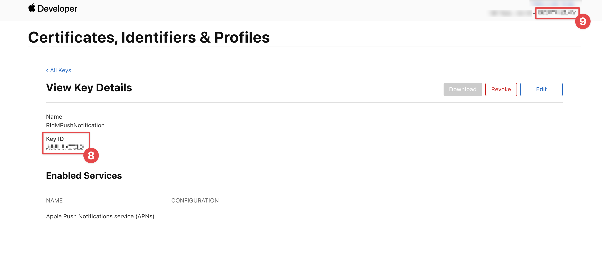
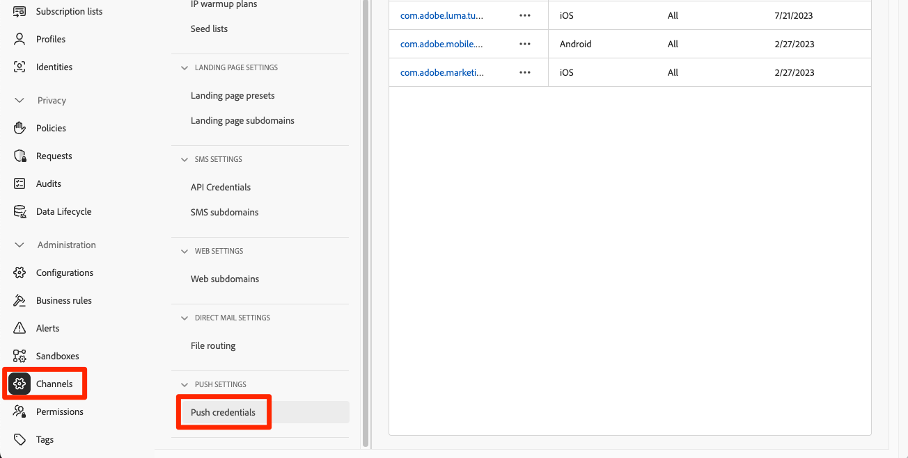
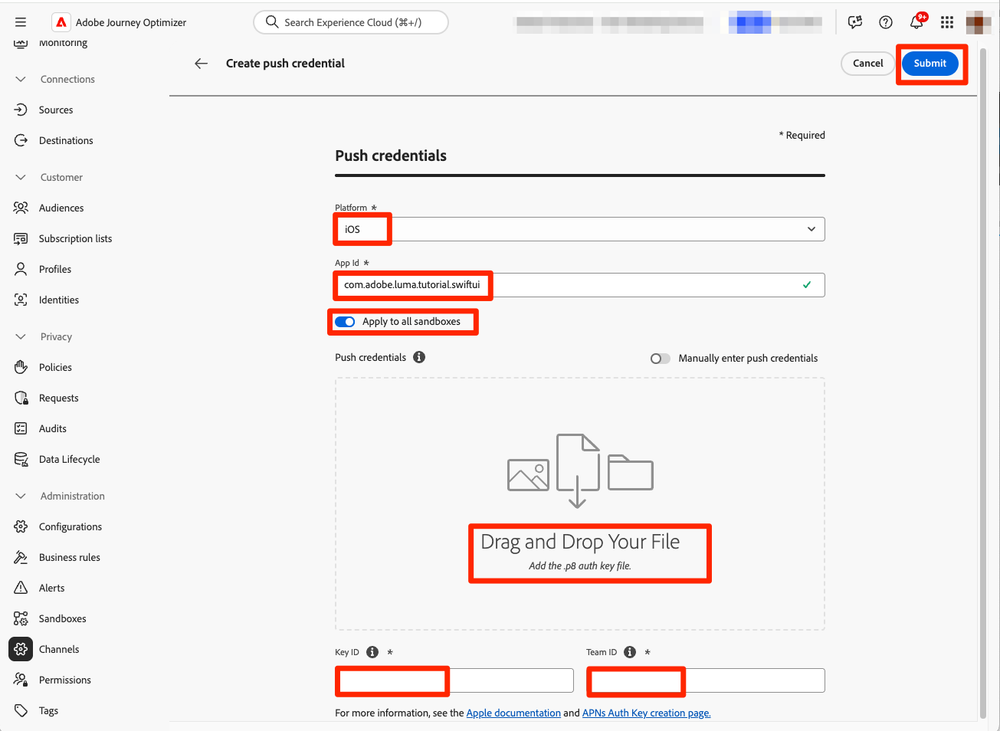

# 创建和发送推送通知

了解如何使用Experience Platform Mobile SDK和Journey Optimizer为移动应用程序创建推送通知。

Journey Optimizer允许您创建历程并向目标受众发送消息。 在使用Journey Optimizer发送推送通知之前，您必须确保已进行适当的配置和集成。 要了解Journey Optimizer中的推送通知数据流，请参阅[文档](https://experienceleague.adobe.com/docs/journey-optimizer/using/push/push-config/push-gs.html)。


>[!NOTE]
>
>本课程是可选的，仅适用于希望发送推送通知的Journey Optimizer用户。


## 先决条件

* 在安装和配置SDK的情况下成功构建并运行应用程序。
* 为Adobe Experience Platform设置应用程序。
* 访问Journey Optimizer和足够的权限，如[此处](https://experienceleague.adobe.com/docs/journey-optimizer/using/push/push-config/push-configuration.html?lang=en)所述。 此外，您需要具有足够的权限才能使用以下Journey Optimizer功能。
   * 创建推送凭据。
   * 创建推送渠道配置。
   * 创建旅程。
   * 创建消息。
   * 创建消息预设。
* **付费Apple开发人员帐户**&#x200B;具有创建证书、标识符和密钥的足够访问权限。
* 用于测试的物理iOS设备或模拟器。

## 学习目标

在本课程中，您将执行以下操作

* 向Apple推送通知服务(APN)注册应用程序ID。
* 在Journey Optimizer中创建渠道配置。
* 更新您的架构以包含推送消息字段。
* 安装和配置Journey Optimizer标记扩展。
* 更新您的应用程序以注册Journey Optimizer标记扩展。
* 验证Assurance中的设置。
* 从Assurance发送测试消息
* 在Journey Optimizer中定义您自己的推送通知事件、历程和体验。
* 从应用程序内发送您自己的推送通知。


## 设置

>[!TIP]
>
>如果您已将环境设置为[Journey Optimizer应用程序内消息传送](journey-optimizer-inapp.md)课程的一部分，则您可能已执行了此设置部分中的某些步骤。

### 向APN注册应用程序ID

以下步骤并非特定于Adobe Experience Cloud，而是旨在引导您完成APN配置。

#### 创建私钥

1. 在Apple开发人员门户中，导航到&#x200B;**[!UICONTROL 密钥]**。
1. 要创建密钥，请选择&#x200B;**[!UICONTROL +]**。
   

1. 提供&#x200B;**[!UICONTROL 密钥名称]**。
1. 选中&#x200B;**[!UICONTROL Apple推送通知服务] (APN)**&#x200B;复选框。
1. 选择&#x200B;**[!UICONTROL 继续]**。
   
1. 查看配置并选择&#x200B;**[!UICONTROL 注册]**。
1. 下载`.p8`私钥。 当您配置Journey Optimizer推送凭据时，将在下一个练习中使用它。
1. 记下&#x200B;**[!UICONTROL 密钥ID]**。 当您配置Journey Optimizer推送凭据时，将在下一个练习中使用它。
1. 记下&#x200B;**[!UICONTROL 团队ID]**。 当您配置Journey Optimizer推送凭据时，将在下一个练习中使用它。
   

其他文档可在[此处](https://help.apple.com/developer-account/#/devcdfbb56a3)找到。


#### 在Journey Optimizer中添加应用程序推送凭据

接下来，您需要在Journey Optimizer中添加移动应用程序推送凭据。 （在该产品的早期版本中，这些组件作为数据收集中“应用程序表面”配置的一部分添加）。

需要移动设备应用程序推送凭据注册，才能授权Adobe代表您发送推送通知。 请参阅下面详述的步骤：

1. 在Journey Optimizer界面中，打开&#x200B;**[!UICONTROL 渠道]** > **[!UICONTROL 推送设置]** > **[!UICONTROL 推送凭据]**&#x200B;菜单。

1. 选择&#x200B;**[!UICONTROL 创建推送凭据]**。


   

1. 从&#x200B;**[!UICONTROL 平台]**&#x200B;下拉列表中，选择&#x200B;**iOS**&#x200B;操作系统。

1. 在&#x200B;**[!UICONTROL 应用程序ID]** (iOS捆绑包ID)字段中输入移动应用程序捆绑包ID。 例如，com.adobe.luma.tutorial.swiftui

1. 启用&#x200B;**[!UICONTROL 应用到所有沙盒]**&#x200B;选项以使这些推送凭据在所有沙盒中可用。 如果特定沙盒对于同一平台和应用程序ID对拥有自己的凭据，则这些特定于沙盒的凭据将优先。

1. 拖放您在上一个练习中获得的.p8 **Apple推送通知身份验证密钥**&#x200B;文件。

1. 提供&#x200B;**[!UICONTROL 密钥ID]**，在创建`p8`身份验证密钥期间分配的10字符字符串。 可在Apple开发人员门户页面的&#x200B;**证书、标识符和配置文件**&#x200B;页面的&#x200B;**[!UICONTROL 密钥]**&#x200B;选项卡下找到它。 （您在上一个练习中应该已经注意到。）

1. 提供&#x200B;**[!UICONTROL 团队ID]**。 团队ID是一个值，可以在&#x200B;**成员资格**&#x200B;选项卡下方或Apple开发人员门户页面顶部找到。 （您在上一个练习中应该已经注意到。）

   Journey Optimizer中的

1. 单击&#x200B;**[!UICONTROL 提交]**&#x200B;以创建推送凭据配置。

#### 在Journey Optimizer中创建推送的渠道配置

创建推送凭据配置后，必须创建配置才能从Journey Optimizer发送推送通知。

1. 在Journey Optimizer界面中，打开&#x200B;**[!UICONTROL 渠道]** > **[!UICONTROL 常规设置]** > **[!UICONTROL 渠道配置]**&#x200B;菜单，然后选择&#x200B;**[!UICONTROL 创建渠道配置]**。

   

1. 输入配置的名称和说明（可选）。

   >[!NOTE]
   >
   > 名称必须以字母(A-Z)开头。 它只能包含字母数字字符。 您还可以使用下划线 `_`、点 `.` 和连字符 `-` 符号。


1. 要为配置分配自定义或核心数据使用标签，您可以选择&#x200B;**[!UICONTROL 管理访问权限]**。 [了解有关对象级访问控制(OLAC)的更多信息](https://experienceleague.adobe.com/en/docs/journey-optimizer/using/access-control/object-based-access)。

1. 选择&#x200B;**推送**&#x200B;渠道。


1. 选择&#x200B;**[!UICONTROL 营销操作]**&#x200B;以使用此配置将同意策略关联到消息。 所有与营销活动相关的同意政策均可利用，以尊重客户的偏好。 [了解有关营销操作的更多信息](https://experienceleague.adobe.com/en/docs/journey-optimizer/using/privacy/consent/consent#surface-marketing-actions)。

1. 选择您的&#x200B;**[!UICONTROL 平台]**。

1. 选择与上述配置的推送凭据相同的&#x200B;**[!UICONTROL 应用程序ID]**。

1. 选择&#x200B;**[!UICONTROL 提交]**&#x200B;以保存更改。

   


### 更新数据流配置

要确保将从您的移动应用程序发送到Edge Network的数据转发到Journey Optimizer，请更新您的Experience Edge配置。

1. 在数据收集UI中，选择&#x200B;**[!UICONTROL 数据流]**，然后选择您的数据流，例如&#x200B;**[!DNL Luma Mobile App]**。
1. 为&#x200B;**[!UICONTROL Experience Platform]**&#x200B;选择，然后从上下文菜单中选择 **[!UICONTROL 编辑]**。
1. 在&#x200B;**[!UICONTROL 数据流]** >  > **[!UICONTROL Adobe Experience Platform]**&#x200B;屏幕中：

   1. 如果尚未选择，请从&#x200B;**[!UICONTROL 配置文件数据集]**&#x200B;中选择&#x200B;**[!UICONTROL AJO推送配置文件数据集]**。 使用`MobileCore.setPushIdentifier` API调用（请参阅[注册推送通知的设备令牌](#register-device-token-for-push-notifications)）时需要此配置文件数据集，以确保将推送通知的唯一标识符（即推送标识符）存储为用户配置文件的一部分。

   1. 已选择&#x200B;**[!UICONTROL Adobe Journey Optimizer]**。 有关详细信息，请参阅[Adobe Experience Platform设置](https://experienceleague.adobe.com/docs/experience-platform/datastreams/configure.html?lang=en#aep)。

   1. 要保存数据流配置，请选择&#x200B;**[!UICONTROL 保存]**。

   


### 安装Journey Optimizer标记扩展

要使您的应用程序能够与Journey Optimizer配合使用，必须更新标记属性。

1. 导航到&#x200B;**[!UICONTROL 标记]** > **[!UICONTROL 扩展]** > **[!UICONTROL 目录]**，
1. 打开您的属性，例如&#x200B;**[!DNL Luma Mobile App Tutorial]**。
1. 选择&#x200B;**[!UICONTROL 目录]**。
1. 搜索&#x200B;**[!UICONTROL Adobe Journey Optimizer]**&#x200B;扩展。
1. 安装扩展。
1. 在&#x200B;**[!UICONTROL 安装扩展]**&#x200B;对话框中
   1. 选择一个环境，例如&#x200B;**[!UICONTROL 开发]**。
   1. 从&#x200B;**[!UICONTROL 事件数据集]**&#x200B;列表中选择&#x200B;**[!UICONTROL AJO推送跟踪体验事件数据集]**&#x200B;数据集。
   1. 选择&#x200B;**[!UICONTROL 保存到库并生成]**。

      

>[!NOTE]
>
>如果您未看到&#x200B;**[!UICONTROL AJO推送跟踪体验事件数据集]**&#x200B;作为一个选项，请联系客户关怀团队。
>

## 使用Assurance验证设置

1. 查看[设置说明](assurance.md#connecting-to-a-session)部分以将模拟器或设备连接到Assurance。
1. 在Assurance用户界面中，选择&#x200B;**[!UICONTROL 配置]**。
   
1. 选择&#x200B;**[!UICONTROL 推送调试]**&#x200B;旁边的。
1. 选择&#x200B;**[!UICONTROL 保存]**。
   
1. 从左侧导航中选择&#x200B;**[!UICONTROL 推送调试]**。
1. 选择&#x200B;**[!UICONTROL 验证设置]**&#x200B;选项卡。
1. 从&#x200B;**[!UICONTROL 客户端]**&#x200B;列表中选择您的设备。
1. 确认您没有收到任何错误。
   
1. 选择&#x200B;**[!UICONTROL 发送测试推送]**&#x200B;选项卡。
1. （可选）更改&#x200B;**[!UICONTROL 标题]**&#x200B;和&#x200B;**[!UICONTROL 正文]**&#x200B;的默认详细信息
1. 选择 **[!UICONTROL 发送测试推送通知]**。
1. 检查&#x200B;**[!UICONTROL 测试结果]**。
1. 您应会看到测试推送通知显示在应用程序中。

   


## 签名

发送推送通知需要对Luma应用进行签名，**需要付费Apple开发人员帐户**。

要更新应用程序的签名，请执行以下操作：

1. 在Xcode中转到您的应用程序。
1. 在项目导航器中选择&#x200B;**[!DNL Luma]**。
1. 选择&#x200B;**[!DNL Luma]**&#x200B;目标。
1. 选择&#x200B;**签名和功能**&#x200B;选项卡。
1. 配置&#x200B;**[!UICONTROL 自动管理签名]**、**[!UICONTROL 团队]**&#x200B;和&#x200B;**[!UICONTROL 捆绑包标识符]**，或者使用您的特定Apple开发配置详细信息。

   >[!IMPORTANT]
   >
   >请确保使用&#x200B;_唯一_&#x200B;捆绑标识符并替换`com.adobe.luma.tutorial.swiftui`捆绑标识符，因为每个捆绑标识符必须是唯一的。 通常，您使用反向DNS格式来打包的ID字符串，如`com.organization.brand.uniqueidentifier`。 例如，本教程的完成版本使用`com.adobe.luma.tutorial.swiftui`。


   {zoomable="yes"}


## 向应用程序添加推送通知功能

>[!IMPORTANT]
>
>要在iOS应用程序中实施和测试推送通知，您必须拥有&#x200B;**付费** Apple开发人员帐户。 如果您没有付费Apple开发人员帐户，则可以跳过本课程的剩余部分。

1. 在Xcode中，从&#x200B;**[!UICONTROL TARGETS]**&#x200B;列表中选择&#x200B;**[!DNL Luma]**，选择&#x200B;**[!UICONTROL 签名和功能]**&#x200B;选项卡，选择&#x200B;**[!UICONTROL +功能]**&#x200B;按钮，然后选择&#x200B;**[!UICONTROL 推送通知]**。 这使您的应用程序能够接收推送通知。

1. 接下来，您必须向应用程序添加通知扩展。 返回&#x200B;**[!DNL General]**&#x200B;选项卡并选择&#x200B;**[!UICONTROL 目标]**&#x200B;部分底部的&#x200B;**[!UICONTROL +]**&#x200B;图标。

1. 系统将提示您为新目标选择模板。 选择&#x200B;**[!UICONTROL 通知服务扩展]**，然后选择&#x200B;**[!UICONTROL 下一步]**。

1. 在下一个窗口中，使用`NotificationExtension`作为扩展的名称，然后单击&#x200B;**[!UICONTROL 完成]**&#x200B;按钮。

现在，您应该将推送通知扩展添加到应用程序中，类似于以下屏幕。


## 在应用程序中实施Journey Optimizer

如前面的课程中所述，安装移动标记扩展仅提供配置。 接下来，您必须安装并注册消息传送SDK。 如果未清除这些步骤，请查看[安装SDK](install-sdks.md)部分。

>[!NOTE]
>
>如果您已完成[安装SDK](install-sdks.md)部分，则表明已安装SDK，您可以跳过此步骤。
>

1. 在Xcode中，确保将[AEP消息](https://github.com/adobe/aepsdk-messaging-ios)添加到包依赖关系中的包列表中。 请参阅[Swift包管理器](install-sdks.md#swift-package-manager)。
1. 在Xcode项目导航器中导航到&#x200B;**[!DNL Luma]** > **[!DNL Luma]** > **[!UICONTROL AppDelegate]**。
1. 确保`AEPMessaging`是导入列表的一部分。

   `import AEPMessaging`

1. 请确保`Messaging.self`是正在注册的扩展数组的一部分。

   ```swift
   let extensions = [
       AEPIdentity.Identity.self,
       Lifecycle.self,
       Signal.self,
       Edge.self,
       AEPEdgeIdentity.Identity.self,
       Consent.self,
       UserProfile.self,
       Places.self,
       Messaging.self,
       Optimize.self,
       Assurance.self
   ]
   ```

## 注册推送通知的设备令牌

1. 将[`MobileCore.setPushIdentifier`](https://developer.adobe.com/client-sdks/documentation/mobile-core/api-reference/#setpushidentifier) API添加到`func application(_ application: UIApplication, didRegisterForRemoteNotificationsWithDeviceToken deviceToken: Data)`函数。

   ```swift
   // Send push token to Mobile SDK
   MobileCore.setPushIdentifier(deviceToken)
   ```

   此函数检索与安装应用程序的设备特有的设备令牌。 然后，使用您设置的依赖于Apple推送通知服务(APN)的配置来设置推送通知投放令牌。

>[!IMPORTANT]
>
>`MobileCore.updateConfigurationWith(configDict: ["messaging.useSandbox": true])`确定推送通知是使用APNs沙盒还是生产服务器来发送推送通知。 在模拟器中或在设备上测试您的应用程序时，请确保`messaging.useSandbox`设置为`true`，以便您接收推送通知。 在使用Apple的Testflight部署应用程序以进行生产测试时，请确保将`messaging.useSandbox`设置为`false`，否则生产应用程序将无法接收推送通知。


## 创建自己的推送通知

要创建自己的推送通知，您必须在Journey Optimizer中定义一个事件，以触发负责发送推送通知的历程。

### 更新您的架构

您即将定义一个新的事件类型，该类型还不能作为您在架构中定义的事件列表的一部分使用。 您稍后在触发推送通知时使用此事件类型。

1. 在Journey Optimizer UI中，从左边栏中选择&#x200B;**[!UICONTROL 架构]**。
1. 在选项卡栏中选择&#x200B;**[!UICONTROL 浏览]**。
1. 选择您的架构，例如&#x200B;**[!DNL Luma Mobile App Event Schema]**&#x200B;以将其打开。
1. 在架构编辑器中：
   1. 选择&#x200B;**[!UICONTROL eventType]**&#x200B;字段。
   1. 在&#x200B;**[!UICONTROL 字段属性]**&#x200B;窗格中，向下滚动以查看事件类型可能值的列表。 选择&#x200B;**[!UICONTROL 添加行]**，并将`application.test`添加为&#x200B;**[!UICONTROL VALUE]**，将`[!UICONTROL Test event for push notification]`添加为`DISPLAY NAME`。
   1. 选择&#x200B;**[!UICONTROL 应用]**。
   1. 选择&#x200B;**[!UICONTROL 保存]**。

      

### 定义事件

Journey Optimizer中的事件允许您统一触发历程以发送消息，例如推送通知。 有关详细信息，请参阅[关于事件](https://experienceleague.adobe.com/docs/journey-optimizer/using/configuration/configure-journeys/events-journeys/about-events.html?lang=en)。

1. 在Journey Optimizer UI中，从左边栏中选择&#x200B;**[!UICONTROL 配置]**。

1. 在&#x200B;**[!UICONTROL 仪表板]**&#x200B;屏幕中，选择&#x200B;**[!UICONTROL 事件]**&#x200B;拼贴中的&#x200B;**[!UICONTROL 管理]**&#x200B;按钮。

1. 在&#x200B;**[!UICONTROL 事件]**&#x200B;屏幕中，选择&#x200B;**[!UICONTROL 创建事件]**。

1. 在&#x200B;**[!UICONTROL 编辑事件event1]**&#x200B;窗格中：

   1. 输入`LumaTestEvent`作为事件的&#x200B;**[!UICONTROL Name]**。
   1. 提供&#x200B;**[!UICONTROL 描述]**，例如`Test event to trigger push notifications in Luma app`。

   1. 选择您之前在[从&#x200B;**[!UICONTROL 架构]**&#x200B;列表创建XDM架构](create-schema.md)中创建的移动应用体验事件架构，例如&#x200B;**[!DNL Luma Mobile App Event Schema v.1]**。
   1. 选择&#x200B;**[!UICONTROL 字段]**&#x200B;列表旁边的。

      

      在&#x200B;**[!UICONTROL 字段]**&#x200B;对话框中，确保选择以下字段(位于始终选择的默认字段之上（**[!UICONTROL _id]**、**[!UICONTROL id]**&#x200B;和&#x200B;**[!UICONTROL 时间戳]**）。 您可以使用下拉列表在&#x200B;**[!UICONTROL Selected]**、**[!UICONTROL All]**&#x200B;和&#x200B;**[!UICONTROL Primary]**&#x200B;之间切换，或者使用字段。

      * **[!UICONTROL 已识别应用程序(ID)]**，
      * **[!UICONTROL 事件类型(eventType)]**，
      * **[!UICONTROL 主要（主要）]**。

      

      然后选择&#x200B;**[!UICONTROL 确定]**。

   1. 选择&#x200B;**[!UICONTROL 事件ID条件]**&#x200B;字段旁边的。

      1. 在&#x200B;**[!UICONTROL 添加事件ID条件]**&#x200B;对话框中，将&#x200B;**[!UICONTROL 事件类型(eventType)]**&#x200B;拖放到&#x200B;**[!UICONTROL 将元素拖放到此处]**。
      1. 在弹出窗口中，滚动到底部并选择&#x200B;**[!UICONTROL application.test]**（这是您之前作为[更新架构](#update-your-schema)的一部分添加到事件类型列表中的事件类型）。 然后向上滚动到顶部并选择&#x200B;**[!UICONTROL 确定]**。
      1. 选择&#x200B;**[!UICONTROL 确定]**&#x200B;以保存条件。

         

   1. 从&#x200B;**[!UICONTROL 命名空间]**&#x200B;列表中选择&#x200B;**[!UICONTROL ECID (ECID)]**。 自动使用&#x200B;**[!UICONTROL 映射identityMap]**&#x200B;的键ECID的第一个元素的ID填充&#x200B;**[!UICONTROL 配置文件标识符]**&#x200B;字段。
   1. 选择&#x200B;**[!UICONTROL 保存]**。

      

您刚刚创建了一个事件配置，该配置基于您之前在本教程中创建的“移动应用程序体验事件”架构。 此事件配置将使用您的特定事件类型(`application.test`)筛选传入的体验事件，因此，只有从该移动应用程序发起的特定类型的事件才会触发您在下一步中构建的历程。 在现实场景中，您可能希望从外部服务发送推送通知，但可以应用相同的概念：从外部应用程序将体验事件发送到Experience Platform，该事件具有可用于在这些事件触发历程之前应用条件的特定字段。

### 创建历程

您的下一步是创建在收到相应的事件时触发推送通知发送的历程。

1. 在Journey Optimizer UI中，从左边栏中选择&#x200B;**[!UICONTROL 历程]**。
1. 选择&#x200B;**[!UICONTROL 创建历程]**。
1. 在&#x200B;**[!UICONTROL 历程属性]**&#x200B;面板中：

   1. 输入历程的&#x200B;**[!UICONTROL 名称]**，例如`Luma - Test Push Notification Journey`。
   1. 输入历程的&#x200B;**[!UICONTROL 描述]**，例如`Journey for test push notifications in Luma mobile app`。
   1. 确保已选择&#x200B;**[!UICONTROL 允许重新进入]**，并将&#x200B;**[!UICONTROL 重新进入等待期]**&#x200B;设置为&#x200B;**[!UICONTROL 30]** **[!UICONTROL 秒]**。
   1. 选择&#x200B;**[!UICONTROL 确定]**。

      

1. 返回历程画布，从&#x200B;**[!UICONTROL EVENTS]**，将 **[!DNL LumaTestEvent]**&#x200B;拖放到画布上，其中显示&#x200B;**[!UICONTROL 选择一个进入事件或读取受众活动]**。

   * 在&#x200B;**[!UICONTROL Events： LumaTestEvent]**&#x200B;面板中，输入&#x200B;**[!UICONTROL 标签]**，例如`Luma Test Event`。

1. 从&#x200B;**[!UICONTROL ACTIONS]**&#x200B;下拉列表中，将 **[!UICONTROL 推送]**&#x200B;拖放到显示于&#x200B;**[!DNL LumaTestEvent]**&#x200B;活动右侧的上。 在&#x200B;**[!UICONTROL 操作：推送]**&#x200B;窗格中：

   1. 提供&#x200B;**[!UICONTROL 标签]**，例如`Luma Test Push Notification`，提供&#x200B;**[!UICONTROL 描述]**，例如`Test push notification for Luma mobile app`，从&#x200B;**[!UICONTROL 类别]**&#x200B;列表中选择&#x200B;**[!UICONTROL 事务型]**，并从&#x200B;**[!UICONTROL 推送表面]**&#x200B;中选择&#x200B;**[!DNL Luma]**。
   1. 选择 **[!UICONTROL 编辑内容]**&#x200B;以开始编辑实际的推送通知。

      

      在&#x200B;**[!UICONTROL 推送通知]**&#x200B;编辑器中：

      1. 输入&#x200B;**[!UICONTROL 标题]**，例如`Luma Test Push Notification`，并输入&#x200B;**[!UICONTROL 正文]**，例如`Test push notification for Luma mobile app`。
      1. 或者，您可以在&#x200B;**[!UICONTROL 添加媒体]**&#x200B;中输入指向图像(.png或.jpg)的链接。 如果这样做，图像将成为推送通知的一部分。
      1. 要保存并退出编辑器，请选择。

         

   1. 要保存并完成推送通知定义，请选择&#x200B;**[!UICONTROL 确定]**。

1. 您的历程应如下所示。 选择&#x200B;**[!UICONTROL 发布]**&#x200B;以发布并激活您的历程。
   


## 触发推送通知

您已具备发送推送通知的所有要素。 剩下的问题是如何触发此推送通知。 实质上，它与您之前看到的相同：只需发送具有适当有效负载的体验事件（如[Events](events.md)中的）。

此时，您即将发送的体验事件未构建为简单的XDM词典。 您即将使用表示推送通知有效负载的`struct`。 定义专用数据类型是如何在应用程序中实施构建体验事件有效负载的替代方法。

1. 在Xcode项目导航器中导航到&#x200B;**[!DNL Luma]** > **[!DNL Luma]** > **[!UICONTROL 模型]** > **[!UICONTROL XDM]** > **[!UICONTROL TestPushPayload]**，并检查代码。

   ```swift
   import Foundation
   
   // MARK: - TestPush
   struct TestPushPayload: Codable {
      let application: Application
      let eventType: String
   }
   
   // MARK: - Application
   struct Application: Codable {
      let id: String
   }
   ```

   该代码表示您要发送的用于触发测试推送通知历程的以下简单有效负载

   ```json
   {
      "eventType": string,
      "application" : [
          "id": string
      ]
   }
   ```

1. 在Xcode项目导航器中导航到&#x200B;**[!DNL Luma]** > **[!DNL Luma]** > **[!DNL Utils]** > **[!UICONTROL MobileSDK]**，并将以下代码添加到`func sendTestPushEvent(applicationId: String, eventType: String)`：

   ```swift
   // Create payload and send experience event
   Task {
       let testPushPayload = TestPushPayload(
           application: Application(
               id: applicationId
           ),
           eventType: eventType
       )
       // send the final experience event
       await sendExperienceEvent(
           xdm: testPushPayload.asDictionary() ?? [:]
       )
   }
   ```

   此代码使用提供给函数（`applicationId`和`eventType`）的参数创建一个`testPushPayload`实例，然后在将有效负载转换为字典时调用`sendExperienceEvent`。 这一次，该代码还通过使用基于`await`和`async`的Swift并发模型来考虑调用Adobe Experience Platform SDK的异步方面。

1. 在Xcode项目导航器中导航到&#x200B;**[!DNL Luma]** > **[!DNL Luma]** > **[!DNL Views]** > **[!DNL General]** > **[!UICONTROL ConfigView]**。 在推送通知按钮定义中，添加以下代码以发送测试推送通知体验事件有效负载，以便在点击该按钮时触发您的历程。

   ```swift
   // Setting parameters and calling function to send push notification
   Task {
       let eventType = testPushEventType
       let applicationId = Bundle.main.bundleIdentifier ?? "No bundle id found"
       await MobileSDK.shared.sendTestPushEvent(applicationId: applicationId, eventType: eventType)
   }
   ```


## 使用应用程序进行验证

1. 使用，在模拟器中或在Xcode的物理设备上重建并运行应用程序。

1. 转到&#x200B;**[!UICONTROL 设置]**&#x200B;选项卡。

1. 点按&#x200B;**[!UICONTROL 推送通知]**。 您会看到推送通知显示在应用程序中。

   


## 后续步骤

现在，您应该拥有在应用程序中处理推送通知的所有工具。 例如，您可以在Journey Optimizer中构建一个历程，当应用程序用户登录时，该历程会发送欢迎推送通知。 或确认推送通知（当用户在该应用程序中购买产品时）。 或输入位置的地理围栏（如您在[位置](places.md)课程中所见）。

>[!SUCCESS]
>
>现在，您已使用适用于Experience Platform Mobile SDK的Journey Optimizer和Journey Optimizer扩展为推送通知启用应用程序。
>
>感谢您投入时间学习Adobe Experience Platform Mobile SDK。 如果您有任何疑问、希望分享一般反馈或有关于未来内容的建议，请在此[Experience League社区讨论帖子](https://experienceleaguecommunities.adobe.com/t5/adobe-experience-platform-data/tutorial-discussion-implement-adobe-experience-cloud-in-mobile/td-p/443796)上分享这些内容。

下一步： **[创建并发送应用程序内消息](journey-optimizer-inapp.md)**
