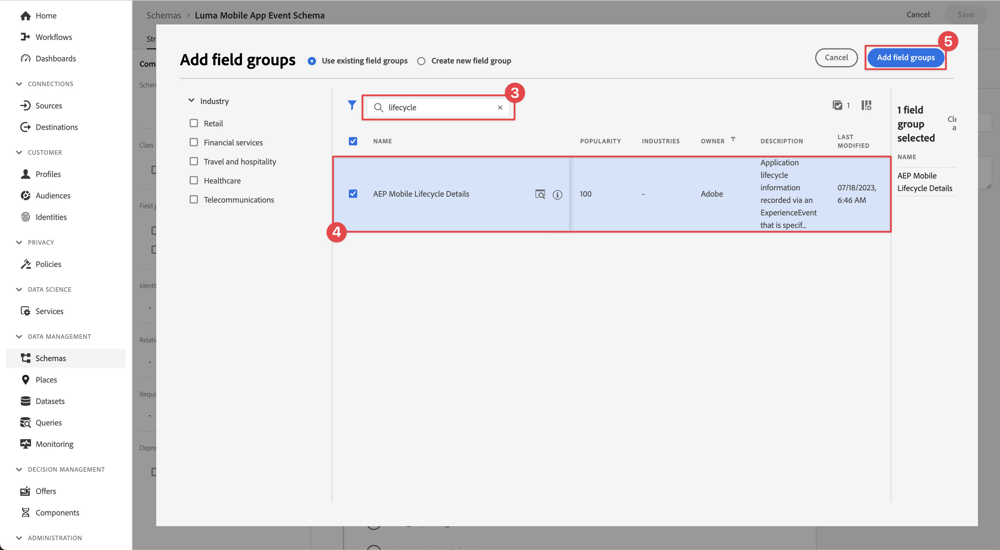

# 收集生命周期数据

了解如何在移动应用程序中收集生命周期数据。

Adobe Experience Platform Mobile SDK生命周期扩展支持来自您的移动应用程序的收集生命周期数据。 Adobe Experience PlatformEdge Network扩展会将此生命周期数据发送到PlatformEdge Network，之后将根据您的数据流配置将其转发到其他应用程序和服务。 在产品文档中了解有关[生命周期扩展](https://developer.adobe.com/client-sdks/documentation/lifecycle-for-edge-network/)的更多信息。


## 先决条件

* 在安装和配置SDK的情况下成功构建和运行应用程序。 在本课程中，您已启动生命周期监控。 请参阅[安装SDK — 更新AppDelegate](install-sdks.md#update-appdelegate)以进行审核。
* 已按照[上一课程](install-sdks.md)中的说明注册Assurance扩展。

## 学习目标

在本课程中，您将执行以下操作：

<!--
* Add lifecycle field group to the schema.
* -->
* 在应用程序在前台与后台之间切换时，通过正确启动/暂停来实现准确的生命周期量度。
* 将数据从应用程序发送到平台Edge Network。
* 在Assurance中进行验证。

<!--
## Add lifecycle field group to schema

The Consumer Experience Event field group you added in the [previous lesson](create-schema.md) already contains the lifecycle fields, so you can skip this step. If you don't use Consumer Experience Event field group in your own app, you can add the lifecycle fields by doing the following:

1. Navigate to the schema interface as described in the [previous lesson](create-schema.md).
1. Open the **Luma Mobile App Event Schema** schema and select **[!UICONTROL Add]** next to Field groups.
    
1. In the search bar, enter "lifecycle".
1. Select the checkbox next to **[!UICONTROL AEP Mobile Lifecycle Details]**.
1. Select **[!UICONTROL Add field groups]**.
    
1. Select **[!UICONTROL Save]**.
    
-->

## 实施更改

现在，您可以更新项目以注册生命周期事件。

1. 在Xcode项目导航器中导航到&#x200B;**[!DNL Luma]** > **[!DNL Luma]** > **[!UICONTROL SceneDelegate]**。

1. 启动后，如果您的应用程序正在从后台恢复，iOS可能会调用您的`sceneWillEnterForeground:`委托方法，并且您要在此触发生命周期启动事件。 将此代码添加到`func sceneWillEnterForeground(_ scene: UIScene)`：

   ```swift
   // When in foreground start lifecycle data collection
   MobileCore.lifecycleStart(additionalContextData: nil)
   ```

1. 当应用程序进入后台时，您希望暂停来自应用程序的`sceneDidEnterBackground:`委托方法的生命周期数据收集。 将此代码添加到`func sceneDidEnterBackground(_ scene: UIScene)`：

   ```swift
   // When in background pause lifecycle data collection
   MobileCore.lifecyclePause()
   ```

## 使用保证功能进行验证

1. 查看[设置说明](assurance.md#connecting-to-a-session)部分以将模拟器或设备连接到Assurance。
1. 将应用程序发送到后台。 在保证UI中检查&#x200B;**[!UICONTROL LifecyclePause]**&#x200B;事件。
1. 将应用程序置于前台。 在保证UI中检查&#x200B;**[!UICONTROL LifecycleResume]**事件。
   


## 将数据转发到平台Edge Network

上一个练习将前台和后台事件调度到Adobe Experience Platform Mobile SDK。 要将这些事件转发到PlatformEdge Network，请执行以下操作：

1. 在Tags属性中选择&#x200B;**[!UICONTROL 规则]**。
   
1. 选择&#x200B;**[!UICONTROL 初始内部版本]**&#x200B;作为要使用的库。
1. 选择&#x200B;**[!UICONTROL 创建新规则]**。
   
1. 在&#x200B;**[!UICONTROL 创建规则]**&#x200B;屏幕中，为&#x200B;**[!UICONTROL 名称]**&#x200B;输入`Application Status`。
1. 在&#x200B;**[!UICONTROL EVENTS]**&#x200B;下选择 **[!UICONTROL 添加]**。
   
1. 在&#x200B;**[!UICONTROL 事件配置]**&#x200B;步骤中：
   1. 选择&#x200B;**[!UICONTROL 移动核心]**&#x200B;作为&#x200B;**[!UICONTROL 扩展]**。
   1. 选择&#x200B;**[!UICONTROL 前台]**&#x200B;作为&#x200B;**[!UICONTROL 事件类型]**。
   1. 选择&#x200B;**[!UICONTROL 保留更改]**。
      
1. 返回&#x200B;**[!UICONTROL 创建规则]**&#x200B;屏幕，选择&#x200B;**[!UICONTROL 移动核心 — 前台]**&#x200B;旁边的 **[!UICONTROL 添加]**。
   
1. 在&#x200B;**[!UICONTROL 事件配置]**&#x200B;步骤中：
   1. 选择&#x200B;**[!UICONTROL 移动核心]**&#x200B;作为&#x200B;**[!UICONTROL 扩展]**。
   1. 选择&#x200B;**[!UICONTROL 背景]**&#x200B;作为&#x200B;**[!UICONTROL 事件类型]**。
   1. 选择&#x200B;**[!UICONTROL 保留更改]**。
      
1. 返回&#x200B;**[!UICONTROL 创建规则]**&#x200B;屏幕，在&#x200B;**[!UICONTROL 操作]**&#x200B;下选择 **[!UICONTROL 添加]**。
   
1. 在&#x200B;**[!UICONTROL 操作配置]**&#x200B;步骤中：
   1. 选择&#x200B;**[!UICONTROL Adobe体验Edge Network]**&#x200B;作为&#x200B;**[!UICONTROL 扩展]**。
   1. 选择&#x200B;**[!UICONTROL 将事件转发到Edge Network]**&#x200B;作为&#x200B;**[!UICONTROL 操作类型]**。
   1. 选择&#x200B;**[!UICONTROL 保留更改]**。
      
1. 选择&#x200B;**[!UICONTROL 保存到库]**。
   
1. 选择&#x200B;**[!UICONTROL 生成]**以重新生成库。
   

成功构建资产后，事件将发送到PlatformEdge Network，并根据数据流配置转发到其他应用程序和服务。

您应该会看到包含Assurance中的XDM数据的&#x200B;**[!UICONTROL 应用程序关闭（后台）]**&#x200B;和&#x200B;**[!UICONTROL 应用程序启动（前台）]**&#x200B;事件。


>[!SUCCESS]
>
>您现在已将应用程序设置为将应用程序状态（前台、后台）事件发送到Adobe Experience PlatformEdge Network以及您在数据流中定义的所有服务。
>
> 感谢您投入时间学习Adobe Experience Platform Mobile SDK。 如果您有任何疑问、希望分享一般反馈或有关于未来内容的建议，请在此[Experience League社区讨论帖子](https://experienceleaguecommunities.adobe.com/t5/adobe-experience-platform-data/tutorial-discussion-implement-adobe-experience-cloud-in-mobile/td-p/443796)上分享这些内容

下一步： **[跟踪事件数据](events.md)**
