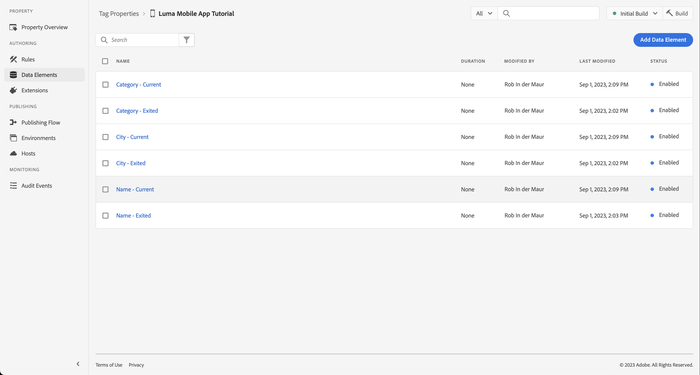
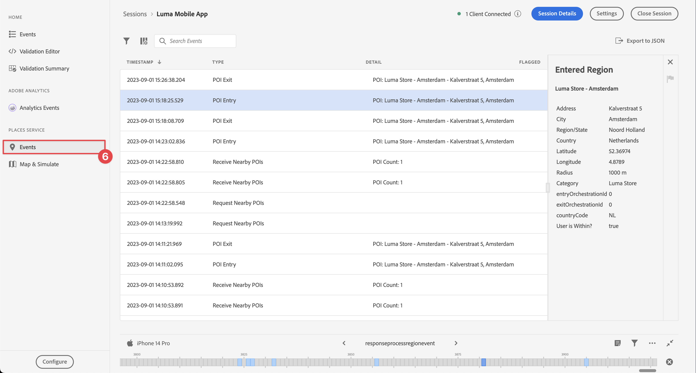

# 使用地标

了解如何在应用程序中使用Places地理位置服务。

Adobe Experience Platform数据收集位置服务是一种地理位置服务，它使具有位置感知的移动应用程序能够了解位置上下文。 该服务使用丰富且易于使用的SDK接口，并随附了灵活的兴趣点(POI)数据库。

## 先决条件

* 所有包依赖项都已放置在Xcode项目中。
* 在AppDelegate中注册的扩展。
* 已将MobileCore配置为使用开发appId。
* 导入的SDK。
* 通过上述更改成功构建并运行应用程序。

## 学习目标

在本课程中，您将执行以下操作

* 了解如何在Places服务中定义目标点。
* 使用Places扩展更新您的标记属性。
* 更新您的架构以捕获地理位置事件。
* 验证Assurance中的设置。
* 更新您的应用程序以注册Places扩展。
* 从应用程序中的Places服务实施地理位置跟踪。


## 设置

要使Places服务在您的应用程序和Mobile SDK中正常工作，您必须进行一些设置。

### 定义地标

您可以在Places服务中定义一些目标点。

1. 在数据收集UI中，选择 **[!UICONTROL 地标]**.
1. 选择 .
1. 从上下文菜单中，选择 **[!UICONTROL 管理库]**.
   
1. 在 **[!UICONTROL 管理库]** 对话框，选择 **[!UICONTROL 新建]**.
1. 在 **[!UICONTROL 创建库]** 对话框输入 **[!UICONTROL 名称]**&#x200B;例如 `Luma`.
1. 选择 **[!UICONTROL 确认]**.
   
1. 要关闭 **[!UICONTROL 管理库]** 对话框，选择 **[!UICONTROL 关闭]**.
1. 返回 **[!UICONTROL POI管理]**，选择 **[!UICONTROL 导入POI]**.
1. 选择 **[!UICONTROL 开始]** 在 **[!UICONTROL 导入位置]** 对话框。
1. 选择 **[!DNL Luma]** 从图书馆名单上，
1. 选择&#x200B;**[!UICONTROL 下一步]**。
   
1. 下载 [Luma POI ZIP文件](assets/luma_pois.csv.zip) 然后将其提取到您计算机上的某个位置。
1. 在 **[!UICONTROL 导入位置]** 对话框，拖放提取的 `luma_pois.csv` 文件到 **[!UICONTROL 选择CSV文件 — 拖放文件]**. 您应该看到 **[!UICONTROL 验证成功]** - **[!UICONTROL 已成功验证CSV文件]**.
1. 选择 **[!UICONTROL 开始导入]**. 您应该看到 **[!UICONTROL 成功]** - **[!UICONTROL 已成功添加6个新POI]**.
1. 选择 **[!UICONTROL 完成]**.
1. 在 **[!UICONTROL POI管理]**，您应该会看到六个新的Luma商店已添加到列表中。 您可以在以下内容之间切换：  列表和  映射视图。
   .


### Install Places扩展

1. 导航到 **[!UICONTROL 标记]** 并找到您的移动标记资产并打开该资产。
1. 选择 **[!UICONTROL 扩展]**.
1. 选择 **[!UICONTROL 目录]**.
1. 搜索 **[!UICONTROL 地标]** 扩展。
1. 安装扩展。

   

1. 在 **[!UICONTROL 安装扩展]** 对话框：
   1. 选择 **[!DNL Luma]** 从 **[!UICONTROL 选择库]** 列表。
   1. 确保已选取工作库，例如 **[!UICONTROL 初始构建]**.
   1. 选择 **[!UICONTROL 保存到库并生成]** 从 **[!UICONTROL 保存到库]**.
      .

1. 已重建您的库。


### 验证您的架构

验证您的架构是否如中定义 [创建架构](create-schema.md)，整合了收集POI和地理位置数据所需的字段组和类。

1. 导航到数据收集界面并选择 **[!UICONTROL 架构]** 从左边栏开始。
1. 选择 **[!UICONTROL 浏览]** 从顶部栏中。
1. 选择您的架构以将其打开。
1. 在架构编辑器中，选择 **[!UICONTROL 使用者体验事件]**.
1. 您看到 **[!UICONTROL placeContext]** 对象和字段，用于捕获POI交互和地理位置数据。
   .


### 更新您的标记属性

适用于标记的Places扩展提供了用于监视地理位置事件的功能，并允许您根据这些事件触发操作。 您可以使用此功能最大程度地减少必须在应用程序中实施的API编码。

**数据元素**

首先创建多个数据元素。

1. 转到数据收集UI中的标记属性。
1. 选择 **[!UICONTROL 数据元素]** 从左边栏开始。
1. 选择&#x200B;**[!UICONTROL 添加数据元素]**。
1. 在 **[!UICONTROL 创建数据元素]** 屏幕，输入名称，例如 `Name - Entered`.
1. 选择 **[!UICONTROL 地标]** 从 **[!UICONTROL 扩展名]** 列表。
1. 选择 **[!UICONTROL 名称]** 从 **[!UICONTROL 数据元素类型]** 列表。
1. 选择 **[!UICONTROL 当前POI]** 下 **[!UICONTROL TARGET]**.
1. 选择 **[!UICONTROL 保存到库]**.
   

1. 使用下表中的信息重复步骤4 - 8以创建其他数据元素。

   | 名称 | 扩展 | 数据元素类型 | TARGET |
   |---|---|---|---|
   | `Name - Exited` | Places | 名称 | 上次退出的POI |
   | `Category - Current` | Places | 类别 | 当前POI |
   | `Category - Exited` | Places | 类别 | 上次退出的POI |
   | `City - Current` | Places | 城市 | 当前POI |
   | `City - Exited` | Places | 城市 | 上次退出的POI |

   您应该拥有以下数据元素列表。

   

**规则**

接下来，您将定义用于这些数据元素的规则。

1. 在标记属性中，选择 **[!UICONTROL 规则]** 从左边栏开始。
1. 选择 **[!UICONTROL 添加规则]**.
1. 在 **[!UICONTROL 创建规则]** 屏幕中，输入规则的名称，例如 `POI - Entry`.
1. 选择  下 **[!UICONTROL 活动]**.
   1. 选择 **[!UICONTROL 地标]** 从 **[!UICONTROL 扩展名]** 列出并选择 **[!UICONTROL 输入POI]** 从 **[!UICONTROL 事件类型]** 列表。
   1. 选择&#x200B;**[!UICONTROL 保留更改]**。
      .
1. 选择  下 **[!UICONTROL 操作]**.
   1. 选择 **[!UICONTROL 移动核心]** 从 **[!UICONTROL 扩展名]** 列表，选择 **[!UICONTROL 附加数据]** 从 **[!UICONTROL 操作类型]** 列表。 此操作附加有效负荷数据。
   1. 在 **[!UICONTROL JSON有效负载]**，粘贴以下有效负载：

      ```json
      {
          "xdm": {
              "eventType": "location.entry",
              "placeContext": {
                  "geo": {
                      "city": "{%%City - Current%%}"
                  },
                  "POIinteraction": {
                      "poiDetail": {
                          "name": "{%%Name - Current%%}",
                          "category": "{%%Category - Current%%}"
                      },
                      "poiEntries": {
                          "value": 1
                      }
                  }
              }
          }
      }
      ```

      您还可以插入 `{%% ... %%}` JSON中的数据元素占位符值，方法是选择 . 弹出对话框允许您选择创建的任何数据元素。

   1. 选择&#x200B;**[!UICONTROL 保留更改]**。
      

1. 选择  旁边的 **[!UICONTROL 移动核心 — 附加数据]** 操作。
   1. 选择 **[!UICONTROL Adobe Experience Platform边缘网络]** 从 **[!UICONTROL 扩展名]** 列出并选择 **[!UICONTROL 将事件转发到Edge Network]**. 此操作确保将事件和其他有效负载数据转发到Platform Edge Network。
   1. 选择&#x200B;**[!UICONTROL 保留更改]**。

1. 要保存规则，请选择 **[!UICONTROL 保存到库]**.

   

让我们再创建一个规则

1. 在 **[!UICONTROL 创建规则]** 屏幕中，输入规则的名称，例如 `POI - Exit`.
1. 选择  下 **[!UICONTROL 活动]**.
   1. 选择 **[!UICONTROL 地标]** 从 **[!UICONTROL 扩展名]** 列出并选择 **[!UICONTROL 退出POI]** 从 **[!UICONTROL 事件类型]** 列表。
   1. 选择&#x200B;**[!UICONTROL 保留更改]**。
1. 选择  下 **[!UICONTROL 操作]**.
   1. 选择 **[!UICONTROL 移动核心]** 从 **[!UICONTROL 扩展名]** 列表，选择 **[!UICONTROL 附加数据]** 从 **[!UICONTROL 操作类型]** 列表。
   1. 在 **[!UICONTROL JSON有效负载]**，粘贴以下有效负载：

      ```json
      {
          "xdm": {
              "eventType": "location.exit",
              "placeContext": {
                  "geo": {
                      "city": "{%%City - Exited%%}"
                  },
                  "POIinteraction": {
                      "poiExits": {
                          "value": 1
                      },
                      "poiDetail": {
                          "name": "{%%Name - Exited%%}",
                          "category": "{%%Category - Exited%%}"
                      }
                  }
              }
          }
      }
      ```

   1. 选择&#x200B;**[!UICONTROL 保留更改]**。

1. 选择  旁边的 **[!UICONTROL 移动核心 — 附加数据]** 操作。
   1. 选择 **[!UICONTROL Adobe Experience Platform边缘网络]** 从 **[!UICONTROL 扩展名]** 列出并选择 **[!UICONTROL 将事件转发到Edge Network]**.
   1. 选择&#x200B;**[!UICONTROL 保留更改]**。

1. 要保存规则，请选择 **[!UICONTROL 保存到库]**.

   


要确保发布标记中的所有更改，请执行以下操作

1. 选择 **[!UICONTROL 初始构建]** 作为要生成的库。
1. 选择 **[!UICONTROL 生成]**.
   


## 验证Assurance中的设置

要在Assurance中验证设置，请执行以下操作：

1. 转到Assurance UI。
1. 如果左边栏中尚不可用，请选择 **[!UICONTROL 配置]** 在左边栏中选择  旁边 **[!UICONTROL 活动]** 和 **[!UICONTROL 映射和模拟]** 下 **[!UICONTROL PLACES服务]**.
1. 选择&#x200B;**[!UICONTROL 保存]**。
1. 选择 **[!UICONTROL 映射和模拟]** 在左边栏中。
1. 将地图移动到某个POI的位置。
1. 选择  模拟加载POI。 使用圆圈和pin标识您的POI。
1. 选择您的POI。
1. 从弹出窗口中，选择  **[!UICONTROL 模拟进入事件]**.
   
1. 选择 **[!UICONTROL 活动]** 从左边栏中，您应该会看到模拟的事件。
   


## 在应用程序中实施地标

如前面的课程中所述，安装移动标记扩展仅提供配置。 接下来，您必须安装并注册Places SDK。 如果这些步骤不明确，请查阅 [安装SDK](install-sdks.md) 部分。

>[!NOTE]
>
>如果您已完成 [安装SDK](install-sdks.md) 部分，则已安装Places SDK，您可以跳过此步骤。
>

1. 在Xcode中，确保 [AEP Places](https://github.com/adobe/aepsdk-places-ios) 会添加到包依赖关系中的包列表中。 请参阅 [Swift包管理器](install-sdks.md#swift-package-manager).
1. 导航到 **[!DNL Luma]** > **[!DNL Luma]** > **[!DNL AppDelegate]** 在Xcode项目导航器中。
1. 确保 `AEPPlaces` 是导入列表的一部分。

   ```swift
   import AEPPlaces
   ```

1. 确保 `Places.self` 是您注册的扩展数组的一部分。

   ```swift
   let extensions = [
       AEPIdentity.Identity.self,
       Lifecycle.self,
       Signal.self,
       Edge.self,
       AEPEdgeIdentity.Identity.self,
       Consent.self,
       UserProfile.self,
       Places.self,
       Messaging.self,
       Optimize.self,
       Assurance.self
   ]
   ```

1. 导航到 **[!DNL Luma]** > **[!DNL Luma]** > **[!DNL Utils]** > **[!UICONTROL MobileSDK]** 在Xcode项目导航器中查找 `func processRegionEvent(regionEvent: PlacesRegionEvent, forRegion region: CLRegion) async` 函数。 添加以下代码：

   ```swift
   // Process geolocation event
   Places.processRegionEvent(regionEvent, forRegion: region)
   ```

   此 [`Places.processRegionEvent`](https://developer.adobe.com/client-sdks/documentation/places/api-reference/#processregionevent) API将地理位置信息传递给Places服务。

1. 导航到 **[!DNL Luma]** > **[!DNL Luma]** > **[!DNL Views]** > **[!DNL Location]** > **[!DNL GeofenceSheet]** 在Xcode的项目导航器中。

   1. 对于“输入”按钮，输入以下代码

   ```swift
   // Simulate geofence entry event
   Task {
       await MobileSDK.shared.processRegionEvent(regionEvent: .entry, forRegion: region)
   }
   ```

   1. 对于“退出”按钮，输入以下代码

   ```swift
   // Simulate geofence exit event
   Task {
       await MobileSDK.shared.processRegionEvent(regionEvent: .exit, forRegion: region)
   }
   ```

## 使用应用程序进行验证

1. 在设备或模拟器中打开您的应用程序。

1. 转到 **[!UICONTROL 位置]** 选项卡。

1. 四处移动（拖动）地图，以确保蓝色中间圆圈位于某个POI的上方，例如伦敦。

1. 点按  直到您看到类别和名称显示在带有图钉的红色位置的标签中。

1. 点按POI的标签，这会打开 **[!UICONTROL 附近POI]** 工作表。

   

1. 按 **[!UICONTROL 登入]** 或 **[!UICONTROL 退出]** 按钮来模拟应用程序中的地理围栏进入和地理围栏退出事件。

   

1. 您应会在Assurance UI中看到这些事件。


## 后续步骤

您现在应该拥有所有工具，以便开始在应用程序中为地理位置功能添加更多功能。 在设置应用程序后，由于已将事件转发到边缘网络， [Experience Platform](platform.md)时，您应该会看到应用程序中所用用户档案所显示的体验事件。

在本教程的Journey Optimizer部分中，您将看到体验事件可用于触发历程(请参阅 [推送通知](journey-optimizer-inapp.md) 和 [应用程序内消息传送](journey-optimizer-push.md) Journey Optimizer)。 例如，通常情况下，当用户进入实体商店的地理围栏时，向应用程序用户发送推送通知并促销某些产品。

您已看到应用程序功能的实施，这些功能主要由Places服务以及您在标记属性中定义的数据元素和规则驱动。 因此，请最大限度地减少应用程序中的代码。 或者，您可以使用直接在应用程序中实施相同的功能 [`Edge.sendEvent`](https://developer.adobe.com/client-sdks/documentation/edge-network/api-reference/#sendevent) API(请参阅 [活动](events.md) ，以了解更多信息)，XDM有效负载中包含填充的 `placeContext` 对象。

>[!SUCCESS]
>
>现在，您已使用Experience PlatformMobile SDK中的Places扩展为地理定位服务启用应用程序。
>
>感谢您投入时间学习Adobe Experience Platform Mobile SDK。 如果您有疑问、希望分享一般反馈或有关于未来内容的建议，请在此共享它们 [Experience League社区讨论帖子](https://experienceleaguecommunities.adobe.com/t5/adobe-experience-platform-data/tutorial-discussion-implement-adobe-experience-cloud-in-mobile/td-p/443796).

下一步： **[将数据映射到Adobe Analytics](analytics.md)**
