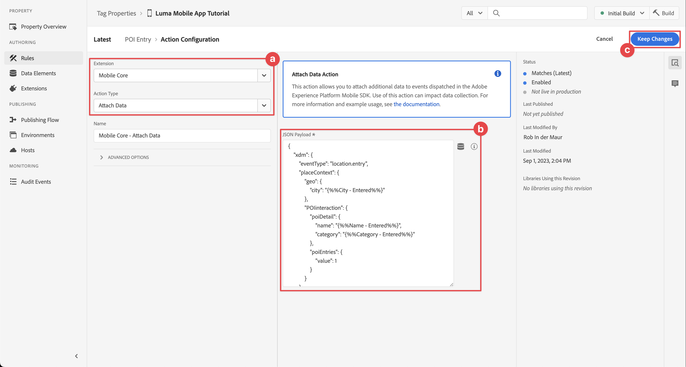

# 使用地标

了解如何在应用程序中使用Places地理位置服务。

Adobe Experience Platform数据收集位置服务是一种地理位置服务，它使具有位置感知的移动应用程序能够了解位置上下文。 该服务使用丰富且易于使用的SDK界面，并随附了灵活的兴趣点(POI)数据库。

## 先决条件

* 所有包依赖项都已放置在Xcode项目中。
* 在AppDelegate中注册的扩展。
* 已将MobileCore配置为使用开发appId。
* 导入的SDK。
* 通过上述更改成功构建并运行应用程序。

## 学习目标

在本课程中，您将执行以下操作

* 了解如何在Places服务中定义目标点。
* 使用Places扩展更新您的标记属性。
* 更新您的架构以捕获地理位置事件。
* 验证Assurance中的设置。
* 更新您的应用程序以注册Places扩展。
* 从应用程序中的Places服务实施地理位置跟踪。


## 设置

要使Places服务在您的应用程序内但在Mobile SDK中正常工作，您必须进行一些设置。

### 定义地标

您可以在Places服务中定义一些目标点。

1. 在数据收集UI中，选择&#x200B;**[!UICONTROL 地标]**。
1. 选择。
1. 从上下文菜单中选择&#x200B;**[!UICONTROL 管理库]**。
   {zoomable="yes"}
1. 在&#x200B;**[!UICONTROL 管理库]**&#x200B;对话框中，选择&#x200B;**[!UICONTROL 新建]**。
1. 在&#x200B;**[!UICONTROL 创建库]**&#x200B;对话框中，输入&#x200B;**[!UICONTROL 名称]**，例如`Luma`。
1. 选择&#x200B;**[!UICONTROL 确认]**。
   {zoomable="yes"}
1. 要关闭&#x200B;**[!UICONTROL 管理库]**&#x200B;对话框，请选择&#x200B;**[!UICONTROL 关闭]**。
1. 返回&#x200B;**[!UICONTROL POI管理]**，选择&#x200B;**[!UICONTROL 导入POI]**。
1. 在&#x200B;**[!UICONTROL 导入地标]**&#x200B;对话框中选择&#x200B;**[!UICONTROL 开始]**。
1. 从库列表中选择&#x200B;**[!DNL Luma]**，
1. 选择&#x200B;**[!UICONTROL 下一步]**。
   {zoomable="yes"}
1. 下载[Luma POI ZIP文件](assets/luma_pois.csv.zip)并将其解压缩到计算机上的某个位置。
1. 在&#x200B;**[!UICONTROL 导入地标]**&#x200B;对话框中，将提取的`luma_pois.csv`文件拖放到&#x200B;**[!UICONTROL 选择CSV文件 — 拖放您的文件]**。 您应会看到&#x200B;**[!UICONTROL 验证成功]** - **[!UICONTROL 已成功验证CSV文件]**。
1. 选择&#x200B;**[!UICONTROL 开始导入]**。 您应该看到&#x200B;**[!UICONTROL 成功]** - **[!UICONTROL 已成功添加6个新POI]**。
1. 选择&#x200B;**[!UICONTROL 完成]**。
1. 在&#x200B;**[!UICONTROL POI管理]**&#x200B;中，您应该会看到六个新的Luma商店已添加到列表中。 您可以在列表和映射视图之间切换。
   {zoomable="yes"}。


### Install Places扩展

1. 导航到&#x200B;**[!UICONTROL 标记]**，找到您的移动标记属性并打开该属性。
1. 选择&#x200B;**[!UICONTROL 扩展]**。
1. 选择&#x200B;**[!UICONTROL 目录]**。
1. 搜索&#x200B;**[!UICONTROL Places]**&#x200B;扩展。
1. 安装扩展。

   

1. 在&#x200B;**[!UICONTROL 安装扩展]**&#x200B;对话框中：
   1. 从&#x200B;**[!DNL Luma]**&#x200B;选择库&#x200B;**[!UICONTROL 列表中选择]**。
   1. 请确保已选择您的工作库，例如&#x200B;**[!UICONTROL 初始内部版本]**。
   1. 从&#x200B;**[!UICONTROL 保存到库]**&#x200B;中选择&#x200B;**[!UICONTROL 保存到库并生成]**。
      {zoomable="yes"}。

1. 已重建您的库。


### 验证您的架构

验证您的架构（如[创建架构](create-schema.md)中所定义）是否合并了必要的字段组和类以收集POI和地理位置数据。

1. 导航到数据收集界面，然后从左边栏中选择&#x200B;**[!UICONTROL 架构]**。
1. 从顶部栏中选择&#x200B;**[!UICONTROL 浏览]**。
1. 选择您的架构以将其打开。
1. 在架构编辑器中，选择&#x200B;**[!UICONTROL 使用者体验事件]**。
1. 您看到&#x200B;**[!UICONTROL placeContext]**&#x200B;对象，其中包含用于捕获POI交互和地理位置数据的对象和字段。
   {zoomable="yes"}。


### 更新您的标记属性

适用于标记的Places扩展提供了用于监视地理位置事件的功能，并允许您根据这些事件触发操作。 您可以使用此功能最大程度地减少必须在应用程序中实施的API编码。

**数据元素**

首先创建多个数据元素。

1. 转到数据收集UI中的标记属性。
1. 从左边栏中选择&#x200B;**[!UICONTROL 数据元素]**。
1. 选择&#x200B;**[!UICONTROL 添加数据元素]**。
1. 在&#x200B;**[!UICONTROL 创建数据元素]**&#x200B;屏幕中，输入名称，例如`Name - Entered`。
1. 从&#x200B;**[!UICONTROL 扩展]**&#x200B;列表中选择&#x200B;**[!UICONTROL 地标]**。
1. 从&#x200B;**[!UICONTROL 数据元素类型]**&#x200B;列表中选择&#x200B;**[!UICONTROL 名称]**。
1. 选择&#x200B;**[!UICONTROL TARGET]**&#x200B;下的&#x200B;**[!UICONTROL 当前POI]**。
1. 选择&#x200B;**[!UICONTROL 保存到库]**。
   {zoomable="yes"}

1. 使用下表中的信息重复步骤4 - 8以创建其他数据元素。

   | 名称 | 扩展 | 数据元素类型 | TARGET |
   |---|---|---|---|
   | `Name - Exited` | Places | 名称 | 上次退出的POI |
   | `Category - Current` | Places | 类别 | 当前POI |
   | `Category - Exited` | Places | 类别 | 上次退出的POI |
   | `City - Current` | Places | 城市 | 当前POI |
   | `City - Exited` | Places | 城市 | 上次退出的POI |

   您应该拥有以下数据元素列表。

   {zoomable="yes"}

**规则**

接下来，您将定义用于这些数据元素的规则。

1. 在标记属性中，从左边栏选择&#x200B;**[!UICONTROL 规则]**。
1. 选择&#x200B;**[!UICONTROL 添加规则]**。
1. 在&#x200B;**[!UICONTROL 创建规则]**&#x200B;屏幕中，输入规则的名称，例如`POI - Entry`。
1. 选择下的&#x200B;**[!UICONTROL 添加]**。
   1. 从&#x200B;**[!UICONTROL 扩展]**&#x200B;列表中选择&#x200B;**[!UICONTROL 地标]**，并从&#x200B;**[!UICONTROL 事件类型]**&#x200B;列表中选择&#x200B;**[!UICONTROL 输入POI]**。
   1. 选择&#x200B;**[!UICONTROL 保留更改]**。
      。
1. 选择下的&#x200B;**[!UICONTROL 添加]**。
   1. 从&#x200B;**[!UICONTROL 扩展]**&#x200B;列表中选择&#x200B;**[!UICONTROL 移动核心]**，从列表&#x200B;**[!UICONTROL 操作类型]**&#x200B;中选择&#x200B;**[!UICONTROL 附加数据]**。 此操作附加有效负荷数据。
   1. 在&#x200B;**[!UICONTROL JSON有效负载]**&#x200B;中，粘贴以下有效负载：

      ```json
      {
          "xdm": {
              "eventType": "location.entry",
              "placeContext": {
                  "geo": {
                      "city": "{%%City - Current%%}"
                  },
                  "POIinteraction": {
                      "poiDetail": {
                          "name": "{%%Name - Current%%}",
                          "category": "{%%Category - Current%%}"
                      },
                      "poiEntries": {
                          "value": 1
                      }
                  }
              }
          }
      }
      ```

      您还可以通过选择`{%% ... %%}`数据数据元素占位符值。 弹出对话框允许您选择创建的任何数据元素。

   1. 选择&#x200B;**[!UICONTROL 保留更改]**。
      {zoomable="yes"}

1. 选择操作旁边的&#x200B;**[!UICONTROL 添加]**。
   1. 从&#x200B;**[!UICONTROL 扩展]**&#x200B;列表中选择&#x200B;**[!UICONTROL Adobe Experience Platform Edge Network]**，然后选择&#x200B;**[!UICONTROL 将事件转发到Edge Network]**。 此操作确保将事件和其他有效负载数据转发到Platform Edge Network。
   1. 选择&#x200B;**[!UICONTROL 保留更改]**。

1. 要保存规则，请选择&#x200B;**[!UICONTROL 保存到库]**。

   {zoomable="yes"}

让我们再创建一个规则

1. 在&#x200B;**[!UICONTROL 创建规则]**&#x200B;屏幕中，输入规则的名称，例如`POI - Exit`。
1. 选择下的&#x200B;**[!UICONTROL 添加]**。
   1. 从&#x200B;**[!UICONTROL 扩展]**&#x200B;列表中选择&#x200B;**[!UICONTROL 地标]**，并从&#x200B;**[!UICONTROL 事件类型]**&#x200B;列表中选择&#x200B;**[!UICONTROL 退出POI]**。
   1. 选择&#x200B;**[!UICONTROL 保留更改]**。
1. 选择下的&#x200B;**[!UICONTROL 添加]**。
   1. 从&#x200B;**[!UICONTROL 扩展]**&#x200B;列表中选择&#x200B;**[!UICONTROL 移动核心]**，从&#x200B;**[!UICONTROL 操作类型]**&#x200B;列表中选择&#x200B;**[!UICONTROL 附加数据]**。
   1. 在&#x200B;**[!UICONTROL JSON有效负载]**&#x200B;中，粘贴以下有效负载：

      ```json
      {
          "xdm": {
              "eventType": "location.exit",
              "placeContext": {
                  "geo": {
                      "city": "{%%City - Exited%%}"
                  },
                  "POIinteraction": {
                      "poiExits": {
                          "value": 1
                      },
                      "poiDetail": {
                          "name": "{%%Name - Exited%%}",
                          "category": "{%%Category - Exited%%}"
                      }
                  }
              }
          }
      }
      ```

   1. 选择&#x200B;**[!UICONTROL 保留更改]**。

1. 选择操作旁边的&#x200B;**[!UICONTROL 添加]**。
   1. 从&#x200B;**[!UICONTROL 扩展]**&#x200B;列表中选择&#x200B;**[!UICONTROL Adobe Experience Platform Edge Network]**，然后选择&#x200B;**[!UICONTROL 将事件转发到Edge Network]**。
   1. 选择&#x200B;**[!UICONTROL 保留更改]**。

1. 要保存规则，请选择&#x200B;**[!UICONTROL 保存到库]**。

   {zoomable="yes"}


要确保发布标记中的所有更改，请执行以下操作

1. 选择&#x200B;**[!UICONTROL 初始生成]**&#x200B;作为要生成的库。
1. 选择&#x200B;**[!UICONTROL 生成]**。
   {zoomable="yes"}


## 验证Assurance中的设置

要验证Assurance中的设置，请执行以下操作：

1. 转到Assurance UI。
1. 如果左边栏中尚不可用，请在左边栏中选择&#x200B;**[!UICONTROL 配置]**，然后选择旁边的&#x200B;**[!UICONTROL 添加]**&#x200B;和&#x200B;**[!UICONTROL PLACES SERVICE]**&#x200B;下的&#x200B;**[!UICONTROL 映射和模拟]**。
1. 选择&#x200B;**[!UICONTROL 保存]**。
1. 在左边栏中选择&#x200B;**[!UICONTROL 映射和模拟]**。
1. 将地图移至您的某个POI的位置。
1. 选择模拟加载POI。 使用圆圈和pin标识您的POI。
1. 选择您的POI。
1. 从弹出窗口中，选择 **[!UICONTROL 模拟进入事件]**。

   {zoomable="yes"}

1. 从左边栏中选择&#x200B;**[!UICONTROL 事件]**，您应该会看到模拟的事件。

   {zoomable="yes"}


## 在应用程序中实施地标

如前面的课程中所述，安装移动标记扩展仅提供配置。 接下来，您必须安装并注册Places SDK。 如果未清除这些步骤，请查看[安装SDK](install-sdks.md)部分。

>[!NOTE]
>
>如果您已完成[安装SDK](install-sdks.md)部分，则Places SDK已安装，您可以跳过此步骤。
>

>[!IMPORTANT]
>
>在您的应用程序中设置适用于Android的映射SDK需要您设置账单，因为您的使用会产生费用。 您可以使用唯一的应用程序ID和SHA-1密钥来限制成本。 有关更多详细信息，请参阅[映射Android的SDK](https://developers.google.com/maps/documentation/android-sdk/overview)。 如果您不想设置帐单或产生成本，请跳过本课程。

>[!BEGINTABS]

>[!TAB iOS]

1. 在Xcode中，确保将[AEP Places](https://github.com/adobe/aepsdk-places-ios)添加到包依赖关系中的包列表中。 请参阅[Swift包管理器](install-sdks.md#swift-package-manager)。
1. 在Xcode项目导航器中导航到&#x200B;**[!DNL Luma]** > **[!DNL Luma]** > **[!DNL AppDelegate]**。
1. 确保`AEPPlaces`是导入列表的一部分。

   ```swift
   import AEPPlaces
   ```

1. 请确保`Places.self`是正在注册的扩展数组的一部分。

   ```swift
   let extensions = [
       AEPIdentity.Identity.self,
       Lifecycle.self,
       Signal.self,
       Edge.self,
       AEPEdgeIdentity.Identity.self,
       Consent.self,
       UserProfile.self,
       Places.self,
       Messaging.self,
       Optimize.self,
       Assurance.self
   ]
   ```

1. 在Xcode项目导航器中导航到&#x200B;**[!DNL Luma]** > **[!DNL Luma]** > **[!DNL Utils]** > **[!UICONTROL MobileSDK]**，然后找到`func processRegionEvent(regionEvent: PlacesRegionEvent, forRegion region: CLRegion) async`函数。 添加以下代码：

   ```swift
   // Process geolocation event
   Places.processRegionEvent(regionEvent, forRegion: region)
   ```

   此[`Places.processRegionEvent`](https://developer.adobe.com/client-sdks/documentation/places/api-reference/#processregionevent) API将地理位置信息传递给Places服务。

1. 在Xcode的项目导航器中导航到&#x200B;**[!DNL Luma]** > **[!DNL Luma]** > **[!DNL Views]** > **[!DNL Location]** > **[!DNL GeofenceSheet]**。

   1. 对于“录入”按钮，输入以下代码：

      ```swift
      // Simulate geofence entry event
      Task {
          await MobileSDK.shared.processRegionEvent(regionEvent: .entry, forRegion: region)
      }
      ```

   1. 对于“退出”按钮，输入以下代码：

      ```swift
      // Simulate geofence exit event
      Task {
          await MobileSDK.shared.processRegionEvent(regionEvent: .exit, forRegion: region)
      }
      ```

>[!TAB Android]

1. 在Android Studio中，确保[aepsdk-places-android](https://github.com/adobe/aepsdk-places-android)是&#x200B;**[!UICONTROL Android:app]** ChevronDown **&#x200B;**&#x200B;Gradle脚本build.gradle.kts （模块&#x200B;**[!UICONTROL ）]**&#x200B;的依赖项的一部分。 查看[Gradle](install-sdks.md#gradle)。
1. 在Android Studio项目导航器中导航到&#x200B;**[!UICONTROL Android]**  > **[!DNL app]** > **[!DNL kotlin+java]** > **[!UICONTROL com.adobe.luma.tutorial.android]** > **[!UICONTROL LumaApplication]**。
1. 确保`com.adobe.marketing.mobile.Messaging`是导入列表的一部分。

   `import import com.adobe.marketing.mobile.Places`

1. 请确保`Places.EXTENSION`是正在注册的扩展数组的一部分。

   ```kotlin
   val extensions = listOf(
       Identity.EXTENSION,
       Lifecycle.EXTENSION,
       Signal.EXTENSION,
       Edge.EXTENSION,
       Consent.EXTENSION,
       UserProfile.EXTENSION,
       Places.EXTENSION,
       Messaging.EXTENSION,
       Optimize.EXTENSION,
       Assurance.EXTENSION
   )
   ```

1. 在Android Studio项目导航器中导航到&#x200B;**[!UICONTROL Android]**  > **[!DNL app]** > **[!DNL kotlin+java]** > **[!UICONTROL com.adobe.luma.tutorial.android]** > **[!UICONTROL 模型]** > **[!UICONTROL MobileSDK]**。 查找`suspend fun processGeofence(geofence: Geofence?, transitionType: Int)`函数。 添加以下代码：

   ```kotlin
   // Process geolocation event
   Places.processGeofence(geofence, transitionType)
   ```

   此[`Places.processRegionEvent`](https://developer.adobe.com/client-sdks/documentation/places/api-reference/#processregionevent) API将地理位置信息传递给Places服务。


1. 在Android Studio项目导航器中导航到&#x200B;**[!UICONTROL Android]**  > **[!DNL app]** > **[!DNL kotlin+java]** > **[!UICONTROL com.adobe.luma.tutorial.android]** > **[!UICONTROL 视图]** > **[!UICONTROL LocationView.k]**。

   1. 对于“录入”按钮，输入以下代码：

      ```kotlin
      // Simulate geofence entry event
      coroutineScope.launch {
          MobileSDK.shared.processGeofence(
             region,
             Geofence.GEOFENCE_TRANSITION_ENTER
          )
      }
      ```

   1. 对于“退出”按钮，输入以下代码：

      ```kotlin
      // Simulate geofence entry event
      coroutineScope.launch {
          MobileSDK.shared.processGeofence(
              region,
              Geofence.GEOFENCE_TRANSITION_EXIT
          )
      }
      ```

>[!ENDTABS]

## 使用应用程序进行验证

验证应用程序中的地理位置功能：

>[!BEGINTABS]

>[!TAB iOS]

1. 在设备或模拟器中打开您的应用程序。

1. 转到&#x200B;**[!UICONTROL 位置]**&#x200B;选项卡。

1. 四处移动（拖动）地图，以确保蓝色中间圆圈位于您的某个POI上方，例如伦敦。

1. 点按 ，直到您看到类别和名称显示在带有pin的红色位置的标签中。

1. 点按POI的标签，这将打开&#x200B;**[!UICONTROL 附近POI]**&#x200B;工作表。

   

1. 按&#x200B;**[!UICONTROL 进入]**&#x200B;或&#x200B;**[!UICONTROL 退出]**&#x200B;按钮以模拟来自应用程序的地理围栏进入和退出事件。

   

1. 您应会在Assurance UI中看到这些事件。 在Events和Places Service事件中。

>[!TAB Android]

1. 转到&#x200B;**[!UICONTROL 位置]**&#x200B;选项卡。

1. 选择&#x200B;**[!UICONTROL 使用和/或模拟地理围栏]**。

1. 点按显示的红色圆圈中的某个位置。

   


1. 按&#x200B;**[!UICONTROL 进入]**&#x200B;或&#x200B;**[!UICONTROL 退出]**&#x200B;按钮以模拟来自应用程序的地理围栏进入和退出事件。

   

1. 您应会在Assurance UI中看到这些事件。


>[!ENDTABS]


## 后续步骤

您现在应该拥有所有工具，以便开始在应用程序中为地理位置功能添加更多功能。 由于您已将事件转发到Edge Network，因此，在为[Experience Platform](platform.md)设置应用程序后，您应该会看到应用程序中使用的配置文件所显示的体验事件。

在本教程的Journey Optimizer部分中，您会看到体验事件可用于触发历程(请参阅[推送通知](journey-optimizer-inapp.md)和使用Journey Optimizer的[应用程序内消息传送](journey-optimizer-push.md))。 例如，通常情况下，当用户进入实体商店的地理围栏时，向应用程序用户发送推送通知并促销某些产品。

为您的应用程序实施的地理位置功能正在最大限度地减少代码。 您在标记属性中定义的Places服务、数据元素和规则提供了大多数功能。 或者，您可以使用包含填充的[`Edge.sendEvent`对象的XDM有效负载，通过](https://developer.adobe.com/client-sdks/documentation/edge-network/api-reference/#sendevent) [&#x200B; API（有关详细信息，请参阅](events.md)事件`placeContext`）直接在您的应用程序中实施相同的功能。

>[!SUCCESS]
>
>现在，您已使用Experience Platform Mobile SDK中的Places扩展为地理定位服务启用应用程序。
>
>感谢您投入时间学习Adobe Experience Platform Mobile SDK。 如果您有任何疑问、希望分享一般反馈或有关于未来内容的建议，请在此[Experience League社区讨论帖子](https://experienceleaguecommunities.adobe.com/t5/adobe-experience-platform-data/tutorial-discussion-implement-adobe-experience-cloud-in-mobile/td-p/443796?profile.language=zh-Hans)上分享这些内容。

下一步：**[将数据映射到Adobe Analytics](analytics.md)**
