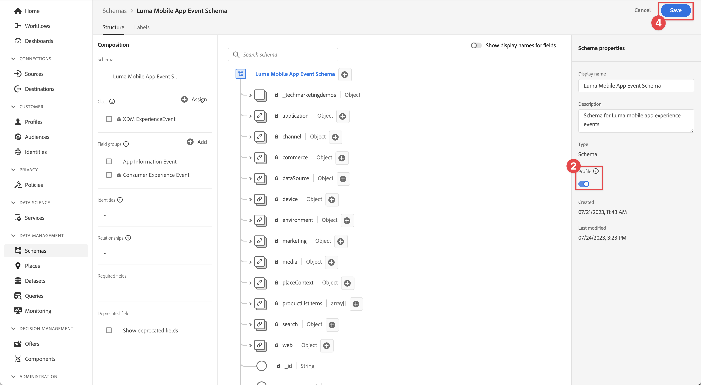

# 将数据发送到Experience Platform

了解如何将移动应用程序数据发送到Adobe Experience Platform。

本可选课程与Real-time Customer Data Platform (Real-Time CDP)、Journey Optimizer和Customer Journey Analytics的所有客户都相关。 Experience Platform是Experience Cloud产品的基础，它是一个开放系统，可将您的所有数据(Adobe和非Adobe)转换为强大的客户档案。 这些客户配置文件会实时更新，并使用AI驱动的见解来帮助您在每个渠道中提供正确的体验。

在之前的课程中收集并发送到PlatformEdge Network的[event](events.md)、[lifecycle](lifecycle-data.md)和[identity](identity.md)数据将转发到您在数据流中配置的服务，包括Adobe Experience Platform。

## 先决条件

必须配置您的组织并授予Adobe Experience Platform权限。

如果您没有访问权限，可以[跳过本课程](install-sdks.md)。

## 学习目标

在本课程中，您将执行以下操作：

* 创建Experience Platform数据集。
* 配置数据流以将数据转发到Experience Platform。
* 验证数据集中的数据。
* 为Real-time Customer Profile启用架构和数据集。
* 验证实时客户档案中的数据。
* 验证身份图中的数据。

## 创建数据集

所有成功引入Adobe Experience Platform的数据将作为数据集保留在数据湖中。 数据集是用于数据集合（通常是表）的存储和管理结构，其中包含架构（列）和字段（行）。 数据集还包含描述其存储的数据的各方面特性的元数据。有关信息，请参阅[文档](https://experienceleague.adobe.com/docs/experience-platform/catalog/datasets/overview.html?lang=zh-Hans)。

1. 通过从右上角的“应用程序”菜单中选择该Experience Platform界面，可导航到该界面。

1. 从左侧导航菜单中选择&#x200B;**[!UICONTROL 数据集]**。

1. 选择 **[!UICONTROL 创建数据集]**。

1. 选择&#x200B;**[!UICONTROL 从架构]**&#x200B;创建数据集。
   

1. 搜索您的架构。 例如在搜索字段中使用`Luma Mobile`。
1. 选择您的架构，例如&#x200B;**[!DNL Luma Mobile App Event Schema]**。

1. 选择&#x200B;**[!UICONTROL 下一步]**。
   

1. 提供&#x200B;**[!UICONTROL Name]**，例如`Luma Mobile App Events Dataset`和&#x200B;**[!UICONTROL Description]**。

1. 选择&#x200B;**[!UICONTROL 完成]**。
   

## 添加Adobe Experience Platform数据流服务

要将XDM数据从Edge Network发送到Adobe Experience Platform，请将Adobe Experience Platform服务添加到您设置的数据流，作为[创建数据流](create-datastream.md)的一部分。

>[!IMPORTANT]
>
>您只能在创建事件数据集后启用Adobe Experience Platform服务。

1. 在数据收集UI中，选择&#x200B;**[!UICONTROL 数据流]**&#x200B;和您的数据流。

1. 然后选择 **[!UICONTROL 添加服务]**。

1. 从[!UICONTROL 服务]列表中选择&#x200B;**[!UICONTROL Adobe Experience Platform]**。

1. 通过将&#x200B;**[!UICONTROL 已启用]**&#x200B;切换为开启来启用服务。

1. 选择您之前创建的&#x200B;**[!UICONTROL 事件数据集]**，例如&#x200B;**[!DNL Luma Mobile App Event Dataset]**。

1. 选择&#x200B;**[!UICONTROL 保存]**。

   
1. 最终配置应如下所示。

   

## 验证数据集中的数据

现在，您已创建一个数据集并更新数据流以将数据发送到Experience Platform，所有发送到PlatformEdge Network的XDM数据将转发到Platform并登陆数据集。

打开应用程序，然后导航到要跟踪事件的屏幕。 您还可以触发生命周期量度。

在Platform界面中打开数据集。 您应该会看到数据批次到达数据集。 数据通常每15分钟以微批次的形式访问一次，因此您可能不会立即看到您的数据。

您还应该能够使用&#x200B;**[!UICONTROL 预览数据集]**&#x200B;功能查看示例记录和字段：

用于验证数据的更强大的工具是Platform的[查询服务](https://experienceleague.adobe.com/docs/platform-learn/tutorials/queries/explore-data.html?lang=zh-CN)。

## 启用Real-time Customer Profile

Experience Platform的实时客户资料允许您构建每个客户的整体视图，该视图将来自多个渠道的数据（包括在线、离线、CRM和第三方数据）整合在一起。 用户档案允许您将不同的客户数据整合到一个统一的视图中，并提供每个客户交互的带时间戳的可操作帐户。

### 启用架构

1. 打开您的架构，例如&#x200B;**[!DNL Luma Mobile App Event Schema]**。
1. 启用&#x200B;**[!UICONTROL 配置文件]**。
1. 选择&#x200B;**[!UICONTROL 此架构的数据将在identityMap字段中包含主标识。对话框中的]**。
1. **[!UICONTROL 保存]**&#x200B;架构。

   启用架构

### 启用数据集

1. 打开您的数据集，例如&#x200B;**[!DNL Luma Mobile App Event Dataset]**。
1. 启用&#x200B;**[!UICONTROL 配置文件]**。

   启用数据集

### 验证配置文件中的数据

打开应用程序，然后导航到要在其中跟踪事件的屏幕，例如：登录Luma应用程序并购买。

使用Assurance查找在identityMap中传递的某个身份（电子邮件、lumaCrmId或ECID），例如CRM Id。

在平台界面中，

1. 导航到&#x200B;**[!UICONTROL 配置文件]**，然后从顶部栏中选择&#x200B;**[!UICONTROL 浏览]**。
1. 指定您刚刚捕获的标识详细信息，例如&#x200B;**[!UICONTROL 标识命名空间]**&#x200B;的`Luma CRM ID`以及您为&#x200B;**[!UICONTROL 标识值]**&#x200B;复制的值。 然后选择&#x200B;**[!UICONTROL 视图]**。
1. 要查看详细信息，请选择配置文件。

在&#x200B;**[!UICONTROL 详细信息]**&#x200B;屏幕上，您可以看到有关用户的基本信息，包括&#x200B;**[!UICONTROL **&#x200B;链接身份&#x200B;**]**：

在&#x200B;**[!UICONTROL 事件]**&#x200B;上，您可以看到从移动应用实施中为此用户收集的事件：

在配置文件详细信息屏幕中：

1. 要查看身份图形，请单击链接或导航到&#x200B;**[!UICONTROL 身份]**，然后从顶部栏中选择&#x200B;**[!UICONTROL 身份图形]**。
1. 若要查找标识值，请将`Luma CRM ID`指定为&#x200B;**[!UICONTROL 标识命名空间]**，将复制的值指定为&#x200B;**[!UICONTROL 标识值]**。 然后选择&#x200B;**[!UICONTROL 视图]**。

   此可视化显示了在用户档案中链接到一起的所有身份及其来源。 下面是一个由完成此Mobile SDK教程(Data Source 2)和[Web SDK教程](https://experienceleague.adobe.com/docs/platform-learn/implement-web-sdk/overview.html?lang=zh-Hans)(Data Source 1)而收集的数据构建的标识图示例：

   

## 后续步骤

营销人员和Analytics还可处理在Experience Platform中捕获的数据很多事情，包括在Customer Journey Analytics中分析数据以及在Real-time Customer Data Platform中构建区段。 你开了一个好头！

>[!SUCCESS]
>
>您现在已将应用程序设置为将数据不仅发送到Edge Network，还发送到Adobe Experience Platform。 感谢您投入时间学习Adobe Experience Platform Mobile SDK。 如果您有疑问、希望共享一般反馈或有关于未来内容的建议，请在此[Experience League社区讨论帖子](https://experienceleaguecommunities.adobe.com/t5/adobe-experience-platform-data/tutorial-discussion-implement-adobe-experience-cloud-in-mobile/td-p/443796)上共享它们。

下一步： **[创建并发送推送通知](journey-optimizer-push.md)**
