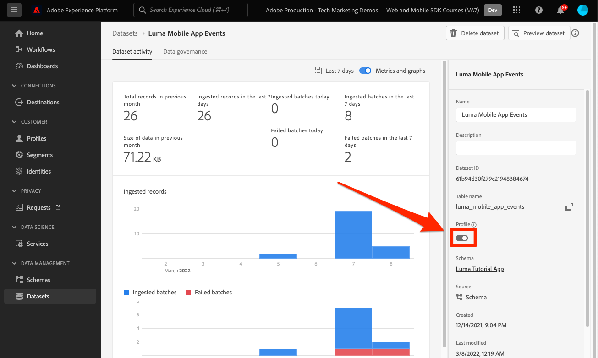

# 将数据发送到Adobe Experience Platform

了解如何将数据发送到Adobe Experience Platform。

此可选课程与Real-time Customer Data Platform(Real-Time CDP)、Journey Optimizer和Customer Journey Analytics的所有客户相关。 Experience Platform是Experience Cloud产品的基础，是一个开放系统，可将您的所有数据(Adobe和非Adobe)转换为强大的客户用户档案，以便实时更新并使用AI驱动的分析来帮助您在每个渠道中提供正确的体验。

的 [事件](events.md), [生命周期](lifecycle-data.md)和 [身份](identity.md) 您在前面的课程中收集并发送到Platform Edge Network的数据会转发到数据流中配置的服务，包括Adobe Experience Platform。

## 先决条件

您的组织必须进行配置并授予Adobe Experience Platform的权限。

如果您没有访问权限，则可以 [跳过本课](install-sdks.md).

## 学习目标

在本课程中，您将：

* 创建Experience Platform数据集。
* 验证数据集中的数据。
* 为实时客户配置文件启用您的架构和数据集。
* 在实时客户资料中验证数据。
* 验证身份图中的数据。

## 创建数据集

成功摄取到Adobe Experience Platform的所有数据都将作为数据集保留在数据湖中。 数据集是用于数据集合的存储和管理结构，通常是表格，其中包含架构（列）和字段（行）。数据集还包含描述其存储的数据的各方面特性的元数据。请参阅 [文档](https://experienceleague.adobe.com/docs/experience-platform/catalog/datasets/overview.html?lang=zh_Hans) 中。

1. 从右上方的3x3菜单中选择Experience Platform界面，以导航到该界面。
   

1. 选择 **[!UICONTROL 数据集]** 菜单中。

1. **[!UICONTROL 创建数据集]**.
   

1. 选择 **[!UICONTROL 从架构创建数据集]**.
   

1. 搜索您的架构并选择。

1. 选择&#x200B;**[!UICONTROL 下一步]**。
   

1. 提供 **[!UICONTROL 名称]**, **[!UICONTROL 描述]**，然后选择 **[!UICONTROL 完成]**.
   

## 更新数据流

创建数据集后，请确保 [更新数据流](create-datastream.md) 添加Adobe Experience Platform。 此更新可确保数据流入平台。

## 验证数据集中的数据

现在，您已创建一个数据集并更新了数据流以将数据发送到Experience Platform，发送到Platform Edge Network的所有XDM数据都将转发到Platform并登陆该数据集。

打开应用程序，然后导航到要在其中跟踪事件的屏幕。 您还可以触发生命周期量度。

在Platform界面中打开您的数据集。 您应会看到数据以批量方式到达数据集

您还应该能够使用 **[!UICONTROL 预览数据集]** 功能：

Platform提供了更强大的数据验证工具 [查询服务](https://experienceleague.adobe.com/docs/platform-learn/tutorials/queries/explore-data.html?lang=zh-CN).

## 启用实时客户资料

Experience Platform的实时客户资料允许您为每个单独的客户构建一个整体视图，该视图将来自多个渠道的数据（包括在线、离线、CRM和第三方数据）进行整合。 利用用户档案，可将不同的客户数据整合到统一视图中，为每次客户互动提供一个可操作且加盖时间戳的帐户。

### 启用架构

1. 打开架构
1. 启用 **[!UICONTROL 用户档案]**
1. 选择 **[!UICONTROL 此架构的数据将在identityMap字段中包含主标识。]** 模式窗口
1. **[!UICONTROL 保存]** 架构

   

### 启用数据集

1. 打开数据集
1. 启用 **[!UICONTROL 用户档案]**

   

### 在配置文件中验证数据

打开应用程序，然后导航到要在其中跟踪事件的屏幕。 登录到Luma应用程序并购买产品。

使用“保证”功能查找identityMap（电子邮件、lumaCrmId或ECID）中传递的身份之一：

>[!TIP]
>
>   的值 `lumaCrmId` is `112ca06ed53d3db37e4cea49cc45b71e`

在Platform界面中，导航到 **[!UICONTROL 用户档案]** > **[!UICONTROL 浏览]**，查找您刚刚抓取的标识值，然后打开用户档案：

在 **[!UICONTROL 详细信息]** 屏幕中，您可以看到有关用户的基本信息，包括 **[!UICONTROL **&#x200B;关联身份&#x200B;**]**:

在 **[!UICONTROL 事件]**，则可以查看从移动设备应用程序实施中为此用户收集的事件：

在配置文件详细信息屏幕中，单击链接以查看身份图或导航到 **[!UICONTROL 标识]** > **[!UICONTROL 身份图]** 查找标识值。 此可视化图表显示了在用户档案中链接在一起的所有身份及其来源。 以下是一个标识图的示例，该图由完成本Mobile SDK教程（数据源2）和 [Web SDK教程](https://experienceleague.adobe.com/docs/platform-learn/implement-web-sdk/overview.html?lang=zh-Hans) （数据源1）：

营销人员和分析人员可以利用Experience Platform中捕获的数据执行更多操作，包括在Customer Journey Analytics中分析数据并在Real-time Customer Data Platform中构建区段。 你开局不错！

下一个： **[使用Journey Optimizer推送消息](journey-optimizer-push.md)**

>[!NOTE]
>
>感谢您花时间了解Adobe Experience Platform Mobile SDK。 如果您有任何疑问、想要分享一般反馈或对未来内容提出建议，请就此分享 [Experience League社区讨论帖子](https://experienceleaguecommunities.adobe.com/t5/adobe-experience-platform-launch/tutorial-discussion-implement-adobe-experience-cloud-in-mobile/td-p/443796)
