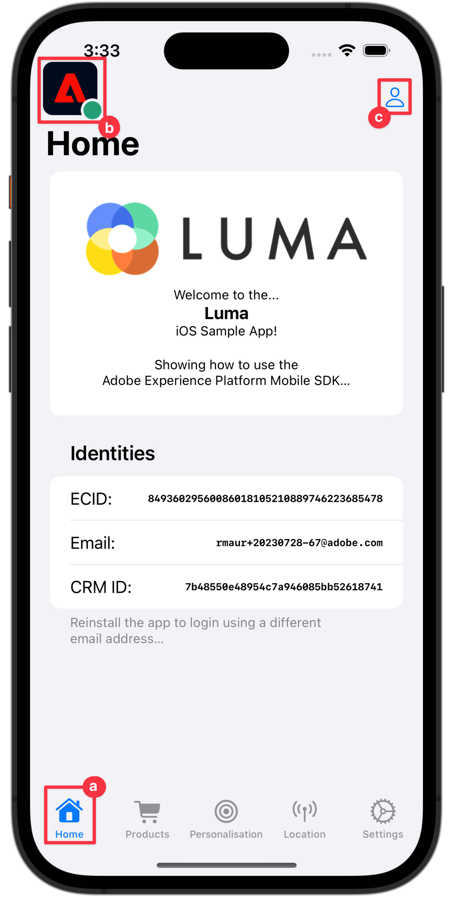

# 收集配置文件数据

了解如何在移动应用程序中收集用户档案数据。

您可以使用Profile扩展在客户端存储有关用户的属性。 此信息以后可用于在线或离线情景中定位和个性化消息，而无需连接到服务器以获得最佳性能。 配置文件扩展管理客户端操作配置文件(CSOP)，提供对API做出反应的方式，更新用户配置文件属性，并将用户配置文件属性作为已生成事件与系统的其他部分共享。

配置文件数据由其他扩展用于执行与配置文件相关的操作。 规则引擎扩展就是一个示例，该扩展会使用用户档案数据并根据用户档案数据运行规则。 在文档中了解有关[配置文件扩展](https://developer.adobe.com/client-sdks/documentation/profile/)的更多信息

>[!IMPORTANT]
>
>本课程中介绍的配置文件功能与Adobe Experience Platform中的实时客户配置文件功能以及基于平台的应用程序不同。


## 先决条件

* 在安装和配置SDK的情况下成功构建和运行应用程序。

## 学习目标

在本课程中，您将执行以下操作：

* 设置或更新用户属性。
* 检索用户属性。


## 设置和更新用户属性

快速了解用户过去或最近是否进行了购买有助于在应用程序中定位和/或个性化。 让我们在Luma应用程序中设置它。

1. 在Xcode项目导航器中导航到&#x200B;**[!DNL Luma]** > **[!DNL Luma]** > **[!DNL Utils]** > **[!DNL MobileSDK]**，然后找到`func updateUserAttribute(attributeName: String, attributeValue: String)`函数。 添加以下代码：

   ```swift
   // Create a profile map, add attributes to the map and update profile using the map
   var profileMap = [String: Any]()
   profileMap[attributeName] = attributeValue
   UserProfile.updateUserAttributes(attributeDict: profileMap)
   ```

   此代码：

   1. 设置名为`profileMap`的空字典。

   1. 使用`attributeName` （例如`isPaidUser`）和`attributeValue` （例如`yes`）将元素添加到词典。

   1. 使用`profileMap`词典作为[`UserProfile.updateUserAttributes`](https://developer.adobe.com/client-sdks/documentation/profile/api-reference/#updateuserattributes) API调用的`attributeDict`参数的值。

1. 导航到Xcode项目导航器中的&#x200B;**[!DNL Luma]** > **[!DNL Luma]** > **[!DNL Views]** > **[!DNL Products]** > **[!DNL ProductView]**，并在购买代码中找到`updateUserAttributes`的调用 按钮)。 添加以下代码：

   ```swift
   // Update attributes
   MobileSDK.shared.updateUserAttribute(attributeName: "isPaidUser", attributeValue: "yes")
   ```


## 获取用户属性

更新了用户的属性后，其他AdobeSDK便可以使用该属性，但您也可以显式检索属性，以使应用程序按所需的方式运行。

1. 在Xcode项目导航器中导航到&#x200B;**[!DNL Luma]** > **[!DNL Luma]** > **[!DNL Views]** > **[!DNL General]** > **[!DNL HomeView]**，然后找到`.onAppear`修饰符。 添加以下代码：

   ```swift
   // Get attributes
   UserProfile.getUserAttributes(attributeNames: ["isPaidUser"]) { attributes, error in
       if attributes?.count ?? 0 > 0 {
           if attributes?["isPaidUser"] as? String == "yes" {
               showBadgeForUser = true
           }
           else {
               showBadgeForUser = false
           }
       }
   }
   ```

   此代码：

   1. 在`attributeNames`数组中调用具有`isPaidUser`属性名称的[`UserProfile.getUserAttributes`](https://developer.adobe.com/client-sdks/documentation/profile/api-reference/#getuserattributes) API作为单个元素。
   1. 然后检查`isPaidUser`属性的值，当`yes`时，在 工具栏右上角的图标。

其他文档可在[此处](https://developer.adobe.com/client-sdks/documentation/profile/api-reference/#getuserattributes)找到。

## 使用保证功能进行验证

1. 查看[设置说明](assurance.md#connecting-to-a-session)部分以将模拟器或设备连接到Assurance。
1. 运行应用程序以登录并与产品交互。

   1. 将“Assurance（保证）”图标向左移动。
   1. 在选项卡栏中选择&#x200B;**[!UICONTROL 主页]**。
   1. 要打开“登录”工作表，请选择 按钮。

      

   1. 要插入随机电子邮件和客户ID，请选择 按钮。
   1. 选择&#x200B;**[!UICONTROL 登录]**。

      

   1. 在选项卡栏中选择&#x200B;**[!DNL Products]**。
   1. 选择一个产品。
   1. 选择 。
   1. 选择 。
   1. 选择 。

      

   1. 返回到&#x200B;**[!UICONTROL 主页]**&#x200B;屏幕。 您应该会看到已添加徽章 。

      


1. 在Assurance UI中，您应该会看到具有更新的`profileMap`值的&#x200B;**[!UICONTROL UserProfileUpdate]**&#x200B;和&#x200B;**[!UICONTROL getUserAttributes]**事件。
   

>[!SUCCESS]
>
>您现在已设置应用程序，以更新Edge Network和（设置后）Adobe Experience Platform中用户档案的属性。
>
>感谢您投入时间学习Adobe Experience Platform Mobile SDK。 如果您有疑问、希望共享一般反馈或有关于未来内容的建议，请在此[Experience League社区讨论帖子](https://experienceleaguecommunities.adobe.com/t5/adobe-experience-platform-data/tutorial-discussion-implement-adobe-experience-cloud-in-mobile/td-p/443796)上共享它们。

下一步： **[使用地标](places.md)**
