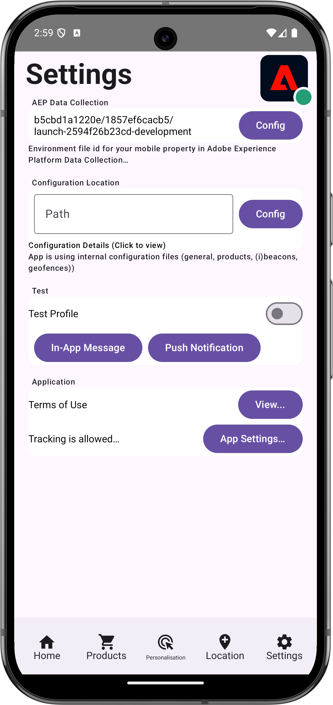

# 处理Web视图

了解如何在移动应用程序中通过WebViews处理数据收集。

## 先决条件

* 在安装和配置SDK的情况下成功构建和运行应用程序。

## 学习目标

在本课程中，您将执行以下操作：

* 了解为什么您的应用程序中必须对WebViews进行特别考虑。
* 了解防止跟踪问题所需的代码。

## 潜在的跟踪问题

当您从应用程序的本机部分和应用程序内的WebView发送数据时，会生成单独的(Experience Cloud标识)ECID。 这些单独的ECID会导致断开连接的点击以及夸大的访问和访客数据。 有关ECID的详细信息，请参阅[ECID概述](https://experienceleague.adobe.com/en/docs/experience-platform/identity/features/ecid)。

要解决断开连接的点击和夸大的数据，您需要将用户的ECID从应用程序的本机部分传递到您可能要在应用程序中使用的WebView。

WebView中使用的AEP Edge Identity扩展可收集当前ECID并将其添加到URL，而不是向Adobe发送请求以获取一个新ID。 然后，实施将使用此ECID来请求URL。

## 实施

要实施Web视图，请执行以下操作：

>[!BEGINTABS]

>[!TAB iOS]

导航到&#x200B;**[!DNL Luma]** > **[!DNL Luma]** > **[!DNL Views]** > **[!DNL Info]** > **[!DNL TermsOfServiceSheet]**，并在`func loadUrl()`类中找到`final class SwiftUIWebViewModel: ObservableObject`函数。 添加以下调用以处理Web视图：

```swift
// Handle web view
AEPEdgeIdentity.Identity.getUrlVariables {(urlVariables, error) in
    if let error = error {
        print("Error with Webview", error)
        return;
    }
    
    if let urlVariables: String = urlVariables {
        urlString.append("?" + urlVariables)
        guard let url = URL(string: urlString) else {
            return
        }
        DispatchQueue.main.async {
            self.webView.load(URLRequest(url: url))
        }
    }
    Logger.aepMobileSDK.info("Successfully retrieved urlVariables for WebView, final URL: \(urlString)")
}
```

[`AEPEdgeIdentity.Identity.getUrlVariables`](https://developer.adobe.com/client-sdks/documentation/identity-for-edge-network/api-reference/#geturlvariables) API为URL设置变量以包含所有相关信息，如ECID等。 在本例中，您使用的是本地文件，但相同的概念也适用于远程页面。

您可以在`Identity.getUrlVariables`Identity for Edge Network扩展API参考指南[中了解有关](https://developer.adobe.com/client-sdks/documentation/identity-for-edge-network/api-reference/#geturlvariables) API的更多信息。


>[!TAB Android]

导航到&#x200B;**[!UICONTROL Android]**  > **[!DNL app]** > **[!DNL kotlin+java]** > **[!DNL com.adobe.luma.tutorial.android]** > **[!DNL views]** > **[!DNL WebViewModel]**，并在`fun loadUrl()`中找到`class WebViewModel: ViewModel()`函数。 添加以下调用以处理Web视图：

```kotlin
// Handle web view
Identity.getUrlVariables {
    urlVariables = it
    val baseUrl = getHtmlFileUrl("tou.html")

    val finalUrl = if (urlVariables.isNotEmpty()) {
        "$baseUrl?$urlVariables"
    } else {
        baseUrl
    }

    Handler(Looper.getMainLooper()).post {
        webView.loadUrl(finalUrl)
    }
    MobileSDK.shared.logInfo("TermsOfServiceSheet - loadUrl: Successfully loaded WebView with URL: $finalUrl")
}
```

[`Identity.getUrlVariables`](https://developer.adobe.com/client-sdks/documentation/identity-for-edge-network/api-reference/#geturlvariables) API为URL设置变量以包含所有相关信息，如ECID等。 在本例中，您使用的是本地文件，但相同的概念也适用于远程页面。

您可以在`Identity.getUrlVariables`Identity for Edge Network扩展API参考指南[中了解有关](https://developer.adobe.com/client-sdks/documentation/identity-for-edge-network/api-reference/#geturlvariables) API的更多信息。

>[!ENDTABS]

## 在应用程序中验证

要执行代码，请执行以下操作：

1. 查看[设置说明](assurance.md#connecting-to-a-session)部分以将模拟器或设备连接到Assurance。
1. 转到应用程序中的&#x200B;**[!UICONTROL 设置]**
1. 点按&#x200B;**[!DNL View...]**&#x200B;按钮以显示&#x200B;**[!DNL Terms of Use]**。

>[!BEGINTABS]

>[!TAB iOS]

 

>[!TAB Android]

 

>[!ENDTABS]


## 使用 Assurance 进行验证

1. 在Assurance UI中，查找来自&#x200B;**[!UICONTROL com.adobe.griffon.mobile]**&#x200B;供应商的&#x200B;**[!UICONTROL Edge标识响应URL变量]**&#x200B;事件。
1. 选择事件并查看&#x200B;**[!UICONTROL ACPExtensionEventData]**&#x200B;对象中的&#x200B;**[!UICONTROL urlvariable]**&#x200B;字段，确认URL中存在以下参数： `adobe_mc`、`mcmid`和`mcorgid`。

   {zoomable="yes"}

   `urvariables`字段示例如下所示：

   * 原始（带转义字符）

     ```html
     adobe_mc=TS%3D1636526122%7CMCMID%3D79076670946787530005526183384271520749%7CMCORGID%3D7ABB3E6A5A7491460A495D61%40AdobeOrg
     ```

   * 美化

     ```html
     adobe_mc=TS=1636526122|MCMID=79076670946787530005526183384271520749|MCORGID=7ABB3E6A5A7491460A495D61@AdobeOrg
     ```

很遗憾，调试Web会话的功能有限。 例如，您无法在浏览器中使用Adobe Experience Platform Debugger继续调试Webview会话。

>[!NOTE]
>
>Platform Web SDK（版本2.11.0或更高版本）以及使用`VisitorAPI.js`时，支持通过这些URL参数拼接访客。


>[!SUCCESS]
>
>现在，您已经将应用程序设置为在Webview中根据URL显示内容，该URL使用与Adobe Experience Platform Mobile SDK已颁发的ECID相同的ECID。
>
>感谢您投入时间学习Adobe Experience Platform Mobile SDK。 如果您有任何疑问、希望分享一般反馈或有关于未来内容的建议，请在此[Experience League社区讨论帖子](https://experienceleaguecommunities.adobe.com/t5/adobe-experience-platform-data/tutorial-discussion-implement-adobe-experience-cloud-in-mobile/td-p/443796)上分享这些内容

下一个： **[标识](identity.md)**
