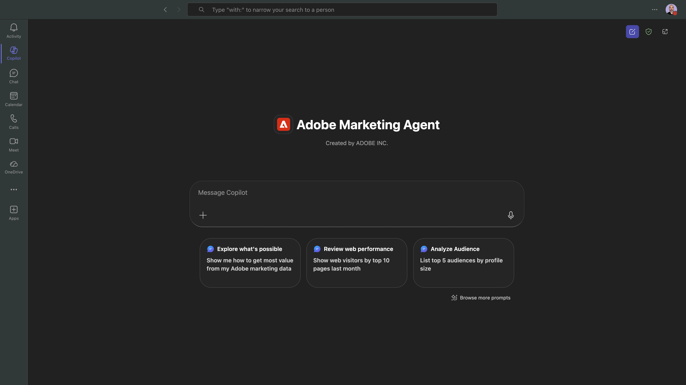
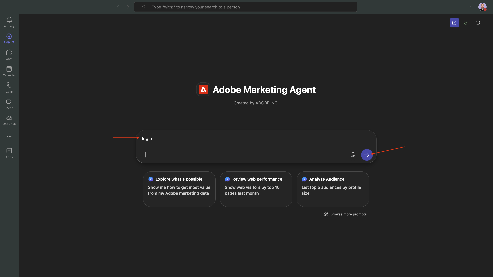
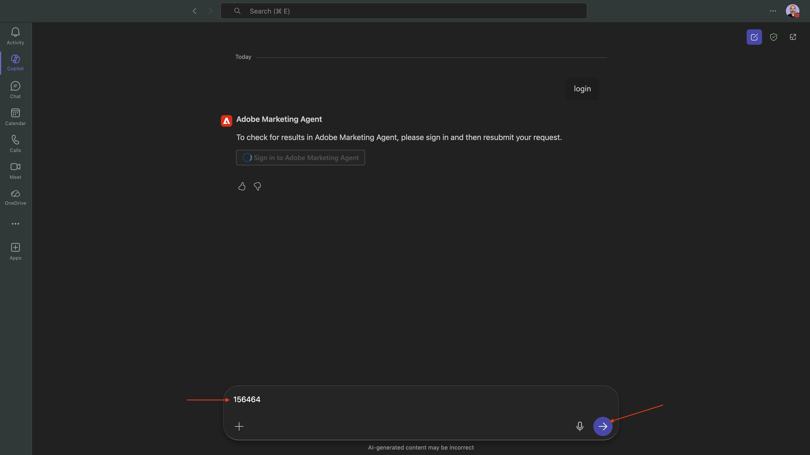
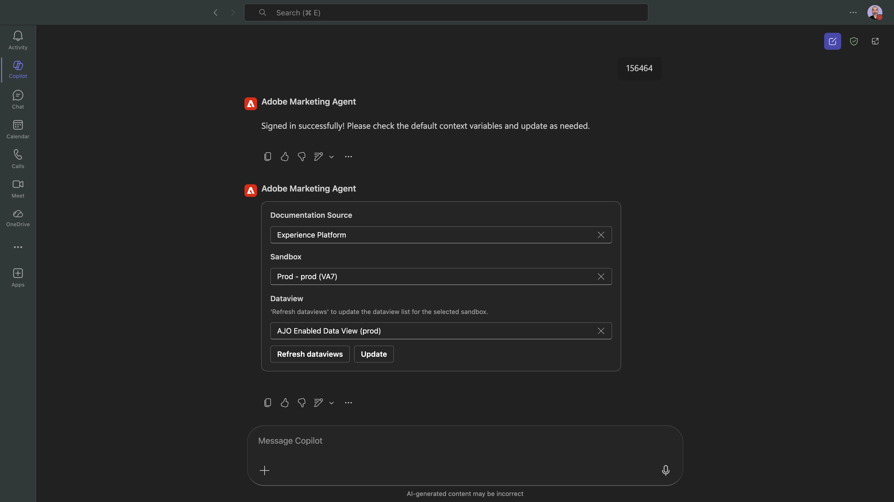
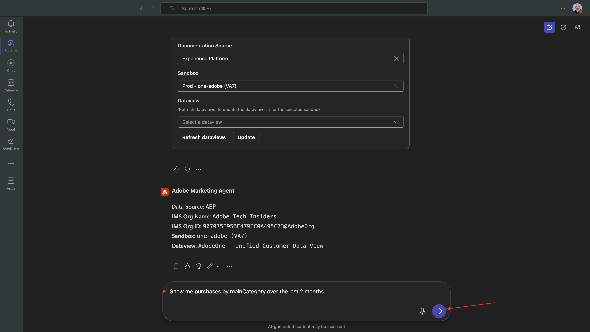
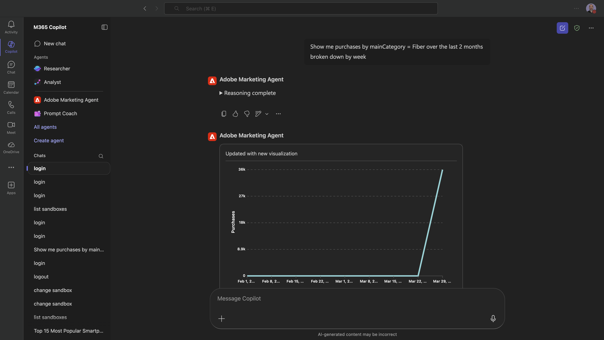
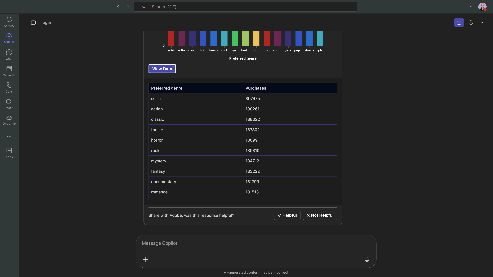
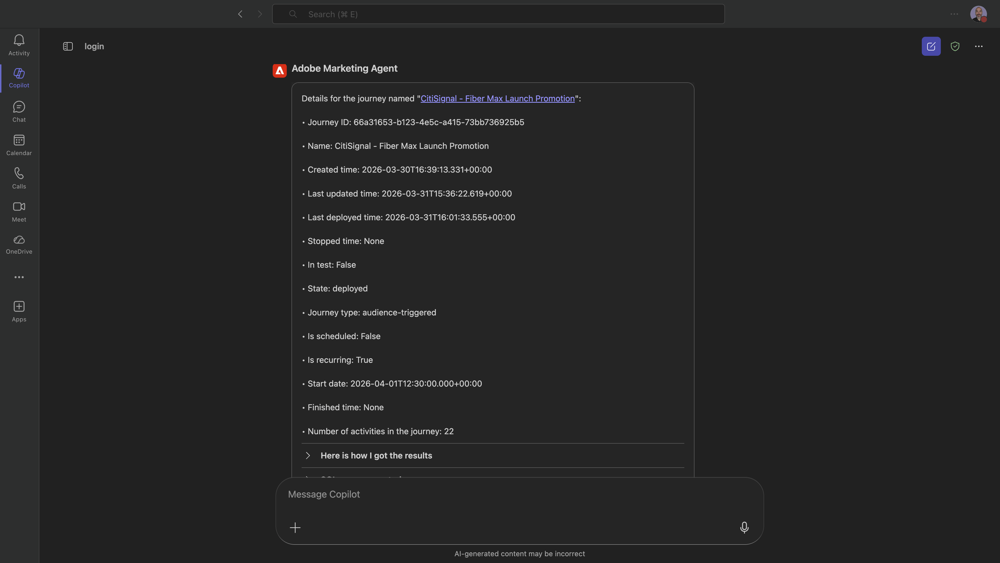
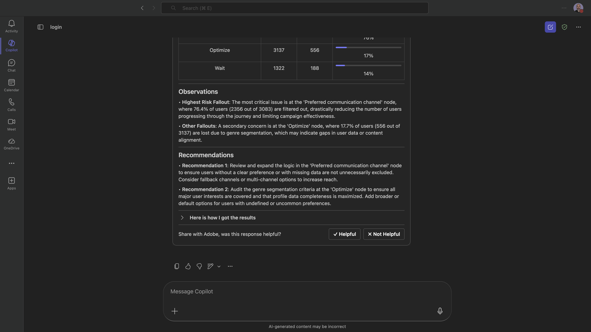

# 1.1.3Adobe Marketing Agent for Microsoft 365 Copilot

## 先决条件

要按照本实验中的以下步骤进行操作，需要以下访问权限：

- 访问Real-Time CDP、Journey Optimizer和Customer Journey Analytics
- 访问Adobe Experience Cloud中的AI助手
- 对AEP Agent Orchestrator的访问权限
- 访问Microsoft 365 Copilot

## 视频

在本视频中，您将获得本练习涉及的所有步骤的解释和演示。

>[!VIDEO](https://video.tv.adobe.com/v/3479158?quality=12&learn=on)

## 1.1.3.1将Adobe Marketing Agent添加到Microsoft 365 Teams &amp; Copilot

打开Microsoft Teams并使用您的帐户详细信息登录。 登录后，您应该会看到此内容。

单击&#x200B;**应用**。


选择&#x200B;**管理你的应用**。


选择&#x200B;**上载应用**。


选择&#x200B;**上传自定义应用**。


选择教师提供给您的清单文件，然后单击&#x200B;**打开**。


单击&#x200B;**添加**。


单击&#x200B;**使用Copilot**&#x200B;打开。


Adobe Marketing Agent现在已成功加载。



输入提示`login`并单击&#x200B;**发送**&#x200B;按钮。



单击&#x200B;**登录到Adobe Marketing Agent**。


此时将打开一个新窗口，要求您使用Adobe帐户凭据登录。


然后，您会看到正在生成类似的代码。 单击&#x200B;**复制**&#x200B;以复制代码。


将该代码粘贴到Copilot的Adobe Marketing Agent窗口中，然后单击&#x200B;**发送**&#x200B;按钮。



然后，您应该会看到类似以下的内容。 您现在已成功登录到Microsoft 365 Copilot中的Adobe Marketing Agent。



## 1.1.3.2在Adobe Marketing Agent中设置上下文

在通过Copilot与Adobe Marketing Agent进一步交互之前，需要设置上下文。

在本练习中，需要将上下文设置为使用：

- **沙盒**： **Prod — 一个Adobe (VA7)**

  沙盒设置有助于在询问问题时识别沙盒AI助手应查看的沙盒。

- **数据视图**： **AdobeOne — 统一客户数据视图**

  数据视图设置有助于确定在询问问题时数据视图AI助手应查看的数据视图。

首先，将沙盒更改为正确的沙盒，然后单击&#x200B;**刷新数据视图**。


然后，选择正确的数据视图并单击&#x200B;**更新**。


您应该会看到此内容。 上下文现已正确设置，以便您接下来可以开始发送特定提示。


## 1.1.3.3从总体购买趋势开始，锚定上下文并放大fibre

**意图**

获得全面的类别需求信息 — 移动设备、固定电话、Internet、电视、光纤 — 专门针对最近60天的数据。 这设定了纽约推出后的季节性、促销效果和区域差异的基线。

输入以下&#x200B;**提示**&#x200B;并单击&#x200B;**发送**&#x200B;按钮。

```
Show me purchases by mainCategory over the last 2 months.
```



您应该会看到以下内容：


输入以下&#x200B;**提示**&#x200B;并单击&#x200B;**发送**&#x200B;按钮。

```
Show me purchases by mainCategory = Fiber over the last 2 months broken down by week
```


然后，您应该会看到此内容，其中深入介绍特定于光纤的趋势。



## 1.1.3.4将订单与内容首选项关联

**意图**

测试特定类型（例如SciFi、Sports、Drama）的偏好可预测宽带升级行为的假设，特别是对于高带宽需求。

首先，您需要找到用于存储流派首选项的字段。

输入以下&#x200B;**提示**&#x200B;并单击&#x200B;**发送**&#x200B;按钮。

```
Which field is used to store the preferred genre
```


您应该会看到此内容，它显示用于流派的字段为&#x200B;**`--aepTenantId--.individualCharacteristics.telco.mediaPreferences.favouriteGenre`**。


利用这些信息，您可以开始向下钻取购买数据。

输入以下&#x200B;**提示**&#x200B;并单击&#x200B;**发送**&#x200B;按钮。

```
Show me purchases by preferred genre for the last 2 months until today
```


您应该会看到此内容。 单击&#x200B;**查看数据**。


您应该会看到此内容。



## 1.1.3.5标识现有光纤历程

**意图**

了解标题中包含“Fiber”的活动历程或最近结束的历程，例如“Fiber Upgrade NYC - September”、“Fiber Trial - Streaming Bundle”。

输入以下&#x200B;**提示**&#x200B;并单击&#x200B;**发送**&#x200B;按钮。

```
What journeys exist? 
```


然后，您应该会看到历程列表。


输入以下&#x200B;**提示**&#x200B;并单击&#x200B;**发送**&#x200B;按钮。

```
Which of these journeys has 'Fiber' in its name?
```


您应该会看到此内容。


输入以下&#x200B;**提示**&#x200B;并单击&#x200B;**发送**&#x200B;按钮。

```
Show me the details of the journey 'CitiSignal - Fiber Max Launch Promotion'
```


您应该会看到此内容。



## 1.1.3.6通过流失分析验证历程性能

**意图**

您希望了解历程性能流失，以了解历程中是否有任何节点或条件正在经历大量用户档案被删除的情况。 这有助于了解历程中是否需要其他调整。

输入以下&#x200B;**提示**&#x200B;并单击&#x200B;**发送**&#x200B;按钮。

```
Create a fall-out report on the "CitiSignal - Fiber Max Launch Promotion" journey
```


您应该会看到此内容。


再向下滚动一点，以查看观察结果和建议。



您现在已经完成了这个实验。

## 后续步骤

转到[Adobe Marketing Agent for Google Gemini Enterprise](./ex4.md){target="_blank"}

返回[Agent Orchestrator](./agentorchestrator.md){target="_blank"}

[返回所有模块](./../../../overview.md){target="_blank"}
