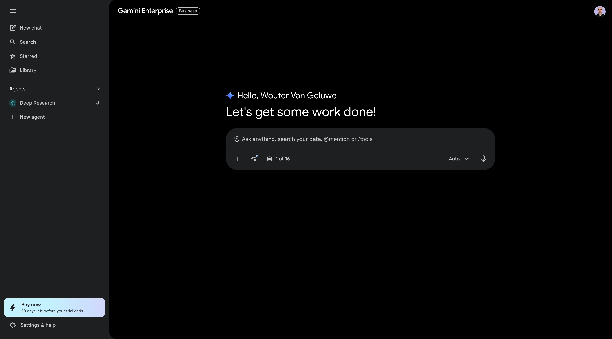
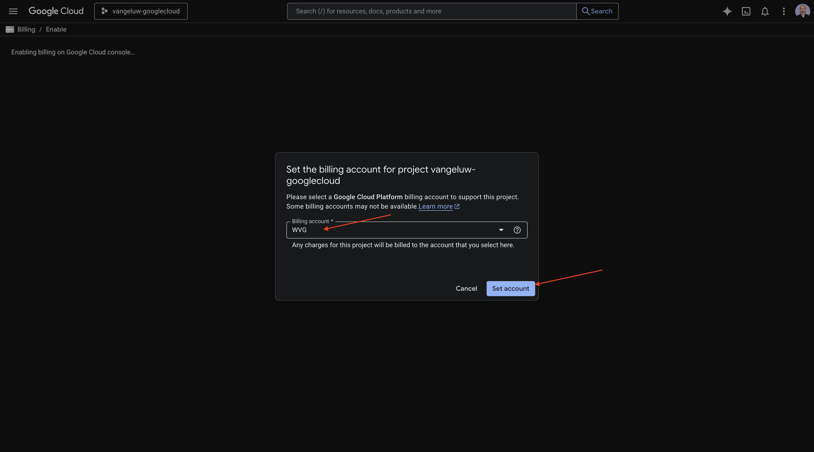
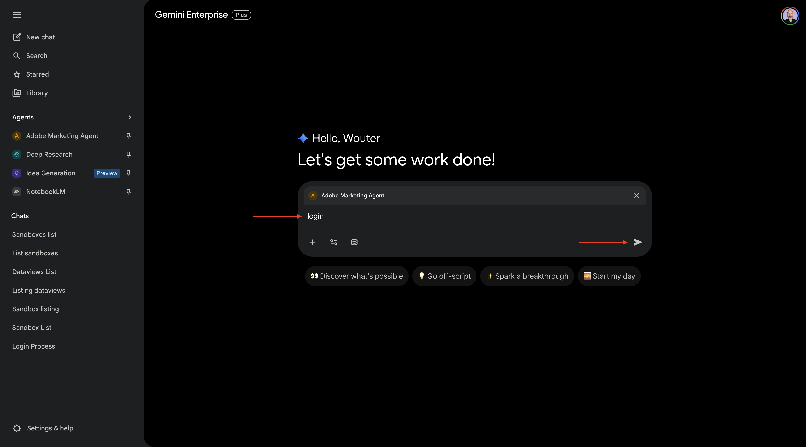
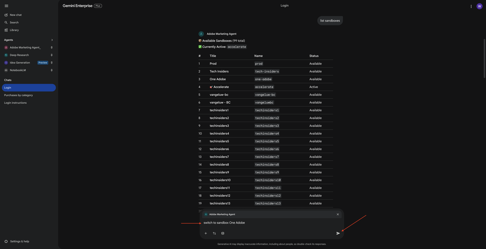
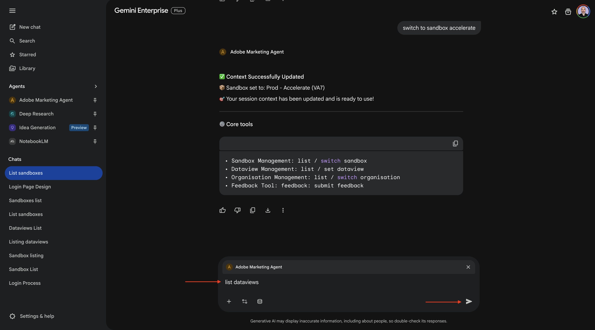
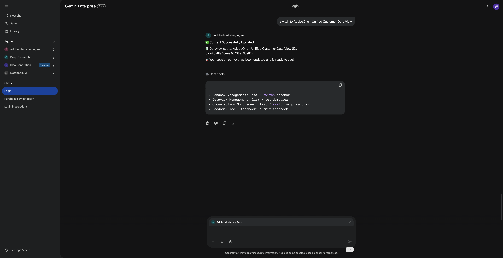
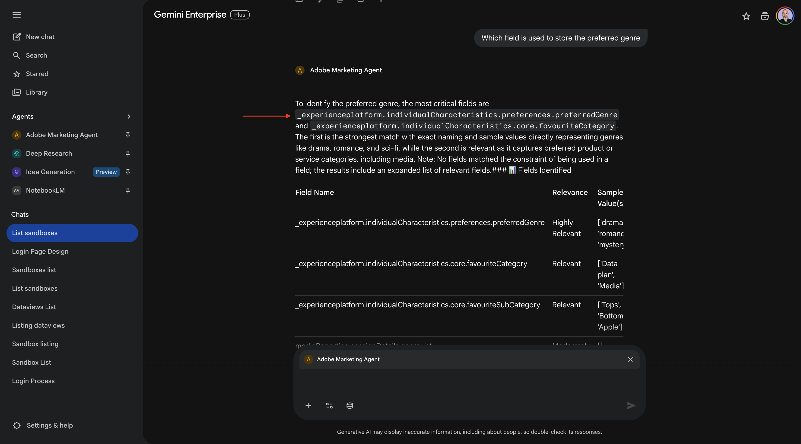
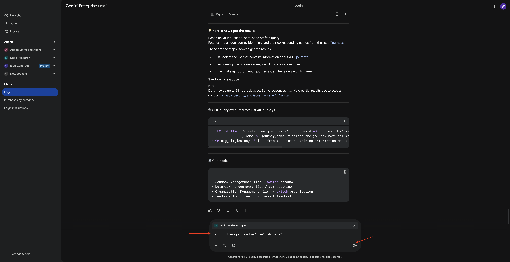

# 1.1.4 Adobe Marketing Agent适用于Google Gemini Enterprise

[!BADGE Beta 版]

+++Beta详细信息
通过将Adobe Marketing Agent与Google Gemini Enterprise Beta结合使用，您在此确认Beta是“按原样”提供的，不提供任何形式的担保。 Adobe没有义务维护、更正、更新、更改、修改或以其他方式支持Beta。 建议您谨慎使用，切勿依赖此类Beta和/或随附材料的正确功能或性能。 Beta被视为Adobe的机密信息。  您向Beta提供的任何“反馈”（有关Beta的信息，包括但不限于您在使用Adobe时遇到的问题或缺陷、建议、改进和推荐）均会分配给Adobe，其中包括针对该反馈的所有权利、标题和兴趣。

+++

## 先决条件

要按照本实验中的以下步骤进行操作，需要以下访问权限：

- 访问Real-Time CDP、Journey Optimizer和Customer Journey Analytics
- 访问Adobe Experience Cloud中的AI助手
- 对AEP Agent Orchestrator的访问权限
- 访问Google Gemini Enterprise

## 视频

在本视频中，您将获得本练习涉及的所有步骤的解释和演示。

>[!VIDEO](https://video.tv.adobe.com/v/3481322?quality=12&learn=on)

## 1.1.4.1对Google Gemini Enterprise的访问权限

转到[https://cloud.google.com/gemini-enterprise](https://cloud.google.com/gemini-enterprise)。 单击&#x200B;**开始30天免费试用**。


输入您的Google帐户的电子邮件地址，然后单击&#x200B;**通过电子邮件继续**。


提供您的名字和姓氏，然后单击&#x200B;**同意并开始使用**。


单击&#x200B;**我稍后将执行此操作**。


您应该会看到此内容。



转到[https://cloud.google.com/gemini-enterprise](https://cloud.google.com/gemini-enterprise)。

然后您应该会看到类似这样的内容。 您可能还必须先创建账单帐户，然后在此选择它。



单击&#x200B;**开始30天免费试用**。


单击&#x200B;**继续并激活API**。


单击&#x200B;**创建**。


您应该会看到此内容。


## 1.1.4.2使用A2A创建自定义代理

转到[https://console.cloud.google.com/gemini-enterprise](https://console.cloud.google.com/gemini-enterprise)。 单击&#x200B;**代理**。


单击&#x200B;**+添加代理**。


通过A2A **选择**&#x200B;自定义代理。


粘贴&#x200B;**代理卡片JSON**。

>[!NOTE]
>
>请与您的Adobe代表联系，以获取&#x200B;**代理卡JSON**&#x200B;信息。


粘贴&#x200B;**代理卡片JSON**&#x200B;后，单击&#x200B;**预览代理详细信息**。


然后您应该会看到类似这样的内容。 向下滚动并单击&#x200B;**下一步**。


然后您应该会看到类似这样的内容。


填写实例的字段。

- **客户端ID**：

```
--aepImsOrgId--
```

- **客户端密钥**：

```
AdobeMarketingAgent
```

- **授权URL**：

```
https://XXX.adobe.io/authorize
```

- **令牌URL**：

```
https://XXX.adobe.io/token
```

- **范围**：

```
openid email profile
```

单击&#x200B;**完成**。


您应该会看到此内容。


## 1.1.4.3登录Adobe Marketing Agent

转到&#x200B;**概述**，然后单击&#x200B;**预览**。


单击&#x200B;**开始**


转到&#x200B;**代理**。 您应该在那里看到&#x200B;**Adobe Marketing Agent**。


单击3个点&#x200B;**...**，然后选择&#x200B;**Pin**。


转到&#x200B;**新聊天**&#x200B;并在聊天中输入符号&#x200B;**@**。 单击&#x200B;**Adobe Marketing Agent**。


输入命令`login`，然后单击&#x200B;**发送**。



您应该会看到此内容。 单击&#x200B;**授权**。


单击&#x200B;**允许访问**&#x200B;并使用Adobe ID完成登录，然后在出现提示时选择实例`--aepImsOrgName--`。


您应该会看到此内容。


## 1.1.4.4在Adobe Marketing Agent中设置上下文

在通过Copilot与Adobe Marketing Agent进一步交互之前，需要设置上下文。

在本练习中，需要将上下文设置为使用：

- **沙盒**： **Prod — 加速(VA7)**

  沙盒设置有助于在询问问题时识别沙盒AI助手应查看的沙盒。

- **数据视图**： **加速2026 B2C**

数据视图设置有助于确定在询问问题时数据视图AI助手应查看的数据视图。

要更改沙盒，请输入以下命令并单击&#x200B;**发送**&#x200B;按钮。

```javascript
list sandboxes
```


然后，您应该会看到类似以下的内容。 输入命令`switch to sandbox accelerate`并单击&#x200B;**发送**&#x200B;按钮。



您应该会看到此内容。 要更改数据视图，请输入以下命令并单击&#x200B;**发送**&#x200B;按钮。

```javascript
list dataviews
```



然后，您应该会看到类似以下的内容。 输入命令`switch dataview to Accelerate 2026 B2C`并单击&#x200B;**发送**&#x200B;按钮。


您应该会看到此内容。 上下文现已正确设置，以便您接下来可以开始发送特定提示。



## 1.1.4.5从总体购买趋势开始，锚定上下文并放大fibre

**意图**

获得全面的类别需求信息 — 移动设备、固定电话、Internet、电视、光纤 — 专门针对最近60天的数据。 这设定了纽约推出后的季节性、促销效果和区域差异的基线。

输入以下&#x200B;**提示**&#x200B;并单击&#x200B;**发送**&#x200B;按钮。

```javascript
Show me purchases by mainCategory over the last 7 months.
```


您应该会看到以下内容：


输入以下&#x200B;**提示**&#x200B;并单击&#x200B;**发送**&#x200B;按钮。

```javascript
Show me purchases by mainCategory = Fiber over the last 7 months broken down by week
```


然后，您应该会看到此内容，其中深入介绍特定于光纤的趋势。


## 1.1.4.6将订单与内容首选项关联

**意图**

测试特定类型（例如SciFi、Sports、Drama）的偏好可预测宽带升级行为的假设，特别是对于高带宽需求。

首先，您需要找到用于存储流派首选项的字段。

输入以下&#x200B;**提示**&#x200B;并单击&#x200B;**发送**&#x200B;按钮。

```javascript
Which field is used to store the preferred genre
```


您随后应该会看到此消息，其中显示用于流派的字段为&#x200B;**_experienceplatform.individualCharactations.preferences.preferredGenre**。



利用这些信息，您可以开始向下钻取购买数据。

输入以下&#x200B;**提示**&#x200B;并单击&#x200B;**发送**&#x200B;按钮。

```javascript
Show me ordersYTD by preferredGenre for the last 7 months
```


您应该会看到此内容。


## 1.1.4.7标识现有光纤历程

**意图**

了解标题中包含“Fiber”的活动历程或最近结束的历程，例如“Fiber Upgrade NYC - September”、“Fiber Trial - Streaming Bundle”。

输入以下&#x200B;**提示**&#x200B;并单击&#x200B;**发送**&#x200B;按钮。

```javascript
What journeys exist? 
```


然后，您应该会看到历程列表。


输入以下&#x200B;**提示**&#x200B;并单击&#x200B;**发送**&#x200B;按钮。

```javascript
Which of these journeys has 'Fiber' in its name?
```



您应该会看到此内容。


输入以下&#x200B;**提示**&#x200B;并单击&#x200B;**发送**&#x200B;按钮。

```javascript
Show me the details of the journey 'CitiSignal - Fiber Max Launch Promotion'
```


您应该会看到此内容。


## 1.1.4.8通过流失分析验证历程性能

**意图**

您希望了解历程性能流失，以了解历程中是否有任何节点或条件正在经历大量用户档案被删除的情况。 这有助于了解历程中是否需要其他调整。

输入以下&#x200B;**提示**&#x200B;并单击&#x200B;**发送**&#x200B;按钮。

```javascript
Create a fall-out report on the "CitiSignal - Fiber Max Launch Promotion" journey
```


您应该会看到此内容。


您现在已经完成了这个实验。

## 后续步骤

转到[1.1.5 Adobe Marketing Agent以用于克劳德](./ex5.md){target="_blank"}

返回[Agent Orchestrator](./agentorchestrator.md){target="_blank"}

[返回所有模块](./../../../overview.md){target="_blank"}
