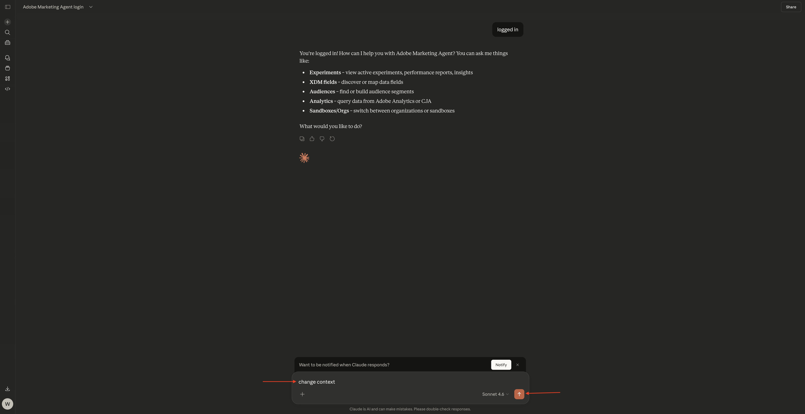

# 1.1.5Adobe Marketing Agent为克劳德

[!BADGE Beta 版]

+++Beta详细信息
通过将Adobe Marketing Agent与Claude Beta配合使用，您在此确认Beta是“按原样”提供的，不提供任何形式的担保。 Adobe没有义务维护、更正、更新、更改、修改或以其他方式支持Beta。 建议您谨慎使用，切勿依赖此类Beta和/或随附材料的正确功能或性能。 Beta被视为Adobe的机密信息。  您向Beta提供的任何“反馈”（有关Beta的信息，包括但不限于您在使用Adobe时遇到的问题或缺陷、建议、改进和推荐）均会分配给Adobe，其中包括针对该反馈的所有权利、标题和兴趣。

+++

## 先决条件

要按照本实验中的以下步骤进行操作，需要以下访问权限：

- 访问Real-Time CDP、Journey Optimizer和Customer Journey Analytics
- 访问Adobe Experience Cloud中的AI助手
- 对AEP Agent Orchestrator的访问权限
- 访问克劳德

## 视频

在本视频中，您将获得本练习涉及的所有步骤的解释和演示。

>[!VIDEO](https://video.tv.adobe.com/v/3482212?quality=12&learn=on)

本实验正在开发中。

## 1.1.5.1在Claude.ai中为CJA创建自定义应用程序

>[!NOTE]
>
>在Claude.ai中使用Adobe Marketing Agent需要满足以下条件：
>- 付费版本的Claude.ai

转到[https://claude.ai/](https://claude.ai/){target="_blank"}并使用您的帐户详细信息登录。 登录后，您应该会看到此内容。


单击以打开您的帐户，然后选择&#x200B;**设置**。


转到&#x200B;**连接器**，然后单击&#x200B;**转到自定义**。


单击&#x200B;**+**，然后选择&#x200B;**添加自定义连接器**。


填写以下字段：

- **名称**： `Adobe Marketing Agent`
- **MCP服务器URL**：请与您的Adobe代表核实

单击&#x200B;**添加**。


您应该会看到此内容。 单击&#x200B;**+**&#x200B;开始新聊天。


单击&#x200B;**+**&#x200B;图标，转到&#x200B;**连接器**&#x200B;并确保已启用&#x200B;**Adobe Marketing Agent****。


## 1.1.5.2验证并设置上下文

在通过Claude.ai进一步与Adobe Marketing Agent交互之前，您需要登录并设置上下文。

输入以下提示并单击&#x200B;**发送**。

```
login to Adobe Marketing Agent
```


选择&#x200B;**始终允许**。


单击链接以登录Adobe Marketing Agent**。


单击&#x200B;**打开链接**。


单击&#x200B;**允许访问**。


在成功进行身份验证后，您应该会看到此内容。 回到克劳德身边。


输入以下命令并单击&#x200B;**发送**。

```javascript
logged in
```


您现在已成功登录。 下一步是设置上下文。 输入以下提示并单击&#x200B;**发送**。


```javascript
change context
```



选择&#x200B;**组织**。 您还可以重复此命令以稍后更改沙盒和数据视图。


输入实例的名称，然后单击&#x200B;**发送**。


选择&#x200B;**始终允许**。


然后您应该会看到类似这样的内容。


如果沙盒尚未正确设置，您可以使用以下命令更改为需要使用的沙盒。 单击&#x200B;**发送**。 或者，您可以使用上述命令`change context`，然后选择&#x200B;**沙盒**

```javascript
change sandbox to --aepSandboxName--
```


如果尚未正确设置数据视图，则可以使用以下命令更改到您需要使用的沙盒（用数据视图的名称替换以下命令中的XXX）。 单击&#x200B;**发送**。 或者，您可以使用上述命令`change context`，然后选择&#x200B;**数据视图**

```javascript
change dataview to XXX
```


正确设置&#x200B;**组织**、**沙盒**&#x200B;和&#x200B;**数据视图**&#x200B;后，您就可以开始向Adobe Marketing Agent提问了。

## 后续步骤

返回[Agent Orchestrator](./agentorchestrator.md){target="_blank"}

[返回所有模块](./../../../overview.md){target="_blank"}
