# 1.1.6人工智能工具

## 先决条件

要按照本实验中的以下步骤进行操作，需要以下访问权限：

- 访问Real-Time CDP、Journey Optimizer和Customer Journey Analytics
- 访问Adobe Experience Cloud中的AI助手
- 对AEP Agent Orchestrator的访问权限
- 需要在系统上安装Node.js 18+

## 1.1.6.1访问Agent Orchestrator

转到[https://ao.adobe.io/](https://ao.adobe.io/)。 使用您的Adobe帐户登录。 在登录后，通过如下所示更改选择实例和沙盒，确保选择了正确的实例和沙盒。


## 1.1.6.2设置您的上下文

输入以下命令并单击&#x200B;**发送**。

```
list dataviews
```

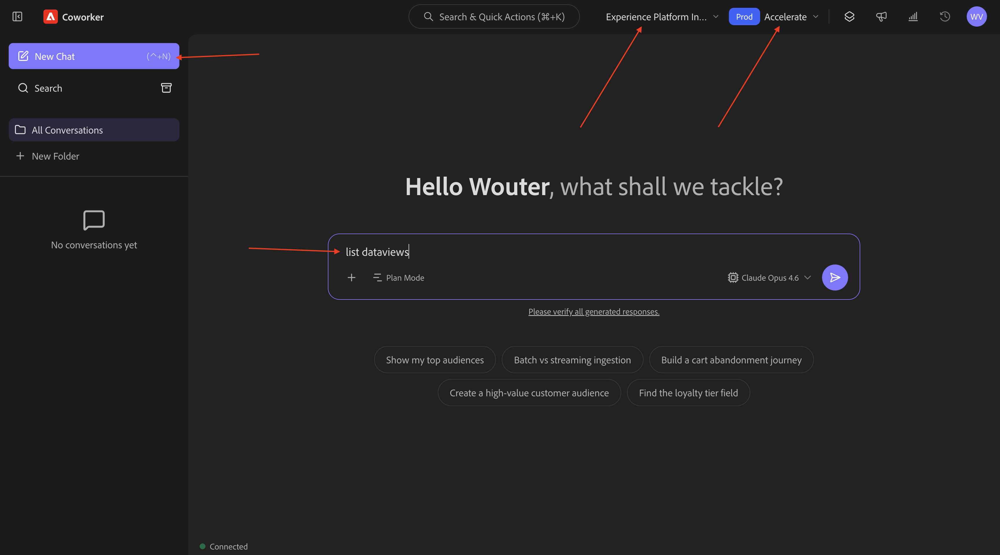

您可能会收到此请求。 提供所需的权限。


您可能会收到此请求。 提供所需的权限。


您应该会看到此内容。 输入以下命令并单击&#x200B;**发送**。

```
switch to dataview AdobeOne - Unified Customer Data View
```


您应该会看到此内容。


## 1.1.6.3从总体购买趋势开始，锚定上下文并放大fibre

**意图**

获得全面的类别需求信息 — 移动设备、固定电话、Internet、电视、光纤 — 专门针对最近60天的数据。 这设定了纽约推出后的季节性、促销效果和区域差异的基线。

输入以下&#x200B;**提示**&#x200B;并单击&#x200B;**发送**&#x200B;按钮。

```javascript
Show me purchases by mainCategory over the last 2 months.
```


您应该会看到以下内容：


输入以下&#x200B;**提示**&#x200B;并单击&#x200B;**发送**&#x200B;按钮。

```javascript
Show me purchases by mainCategory = Fiber over the last 2 months per week
```


然后，您应该会看到此内容，其中深入介绍特定于光纤的趋势。


## 1.1.6.4将订单与内容首选项关联

**意图**

测试特定类型（例如SciFi、Sports、Drama）的偏好可预测宽带升级行为的假设，特别是对于高带宽需求。

首先，您需要找到用于存储流派首选项的字段。

输入以下&#x200B;**提示**&#x200B;并单击&#x200B;**发送**&#x200B;按钮。

```javascript
Which field is used to store the favourite genre?
```

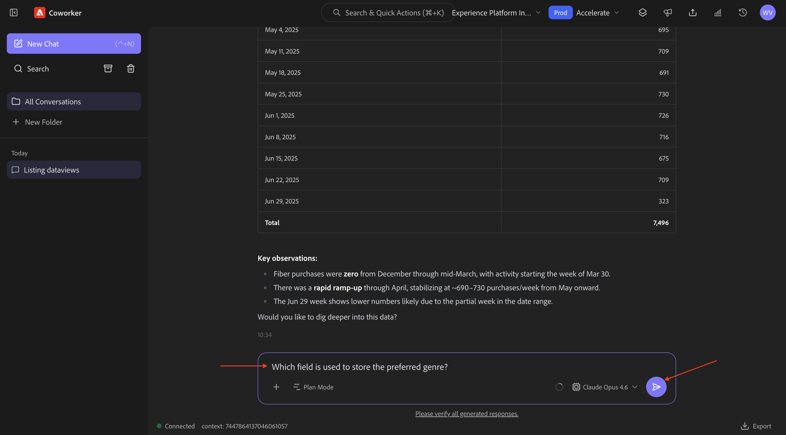

您应该会看到此内容，它显示用于流派的字段为&#x200B;**`--aepTenantId--.individualCharacteristics.telco.mediaPreferences.favouriteGenre`**。


利用这些信息，您可以开始向下钻取购买数据。

输入以下&#x200B;**提示**&#x200B;并单击&#x200B;**发送**&#x200B;按钮。

```javascript
Show me purchases by favourite genre for the last 2 months
```


您应该会看到此内容。


## 1.1.6.5标识现有光纤历程

**意图**

了解标题中包含“Fiber”的活动历程或最近结束的历程，例如“Fiber Upgrade NYC - September”、“Fiber Trial - Streaming Bundle”。

输入以下&#x200B;**提示**&#x200B;并单击&#x200B;**发送**&#x200B;按钮。

```javascript
What journeys exist? 
```


然后您应该会看到类似这样的内容。


输入以下&#x200B;**提示**&#x200B;并单击&#x200B;**发送**&#x200B;按钮。

```javascript
Which of these journeys has 'Fiber' in its name?
```


您应该会看到此内容。 单击其中一个历程上的链接。


随后将打开一个新窗口，您将立即转到历程详细信息概述。


## 1.1.6.6检查使用的受众

**意图**：

了解“CitiSignal — 光纤最大发布促销活动”历程的种子定义 — 哪些特征会推动定位（例如，“SciFi流派偏好设置”、“4+设备”、“流≥300GB/月”）。

输入以下&#x200B;**提示**&#x200B;并单击&#x200B;**发送**&#x200B;按钮。

```javascript
What was the initial audience in the journey named CitiSignal - Fiber Max Launch Promotion?
```

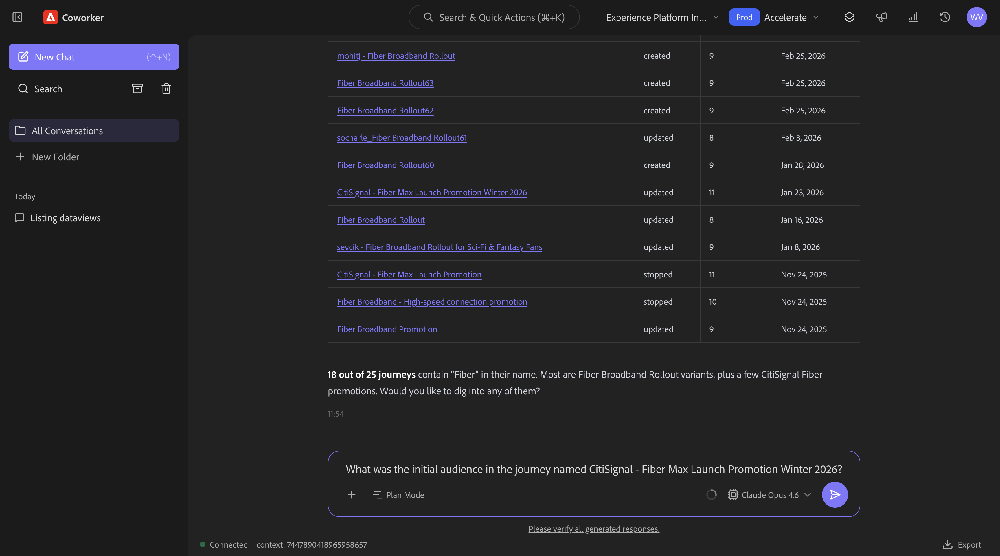

您应该会看到此内容。


## 1.1.6.7通过流失分析验证历程性能

**意图**

您希望了解历程性能流失，以了解历程中是否有任何节点或条件正在经历大量用户档案被删除的情况。 这有助于了解历程中是否需要其他调整。

输入以下&#x200B;**提示**&#x200B;并单击&#x200B;**发送**&#x200B;按钮。

```javascript
Create a fall-out report on the "CitiSignal - Fiber Max Launch Promotion" journey
```

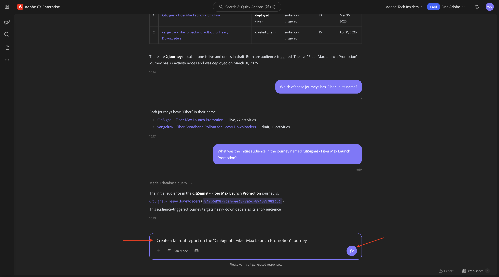

您应该会看到此内容。


## 1.1.6.8创建新受众

**意图**

根据上述发现和研究，消费大量数据的客户与更喜欢科幻或幻想类型的客户之间存在相关性。 现在，您将在受众中组合这些属性。

输入以下&#x200B;**提示**&#x200B;并单击&#x200B;**发送**&#x200B;按钮。

```javascript
Create an audience that combines people with an average download usage per month of over 2000 GB and a preferred genre of sci-fi or fantasy.
```


如果相似，则现有受众已经可用，您应会看到一条类似的消息。

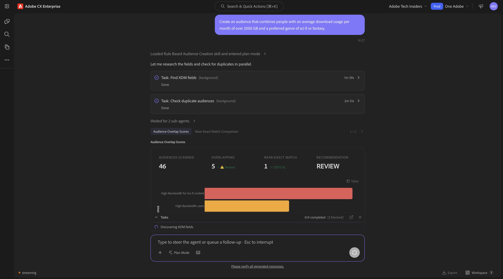

查看计划。 单击&#x200B;**批准计划**。


您的受众现已创建。


>[!NOTE]
>
>创建新受众时，需要24小时才能使AI Assistant进一步使用这些受众。

## 1.1.6.9查找与高使用率对应的现有受众，并检查它们是否在使用中

**意图**：

找到任何名为“大量下载者”的受众（由每月数据使用阈值定义）。

>[!NOTE]
>
>在上一步中，您创建了一个新受众，请记住，需要24小时，该受众才可供AI助手进一步使用。 现在，您应该改用另一个已存在的受众。

输入以下&#x200B;**提示**&#x200B;并单击&#x200B;**发送**&#x200B;按钮。

```javascript
Is there an audience that has "heavy downloaders" in the title?
```


您应该会看到此内容。 您现在想要查看您的所有受众以及他们在过去几天中的更改情况。

输入以下&#x200B;**提示**&#x200B;并单击&#x200B;**发送**&#x200B;按钮。

```javascript
List how much these audiences changed over the last few days.
```


您应该会看到此内容。 单击&#x200B;**显示更多**。


您应该会看到此内容。 单击以关闭右窗格。

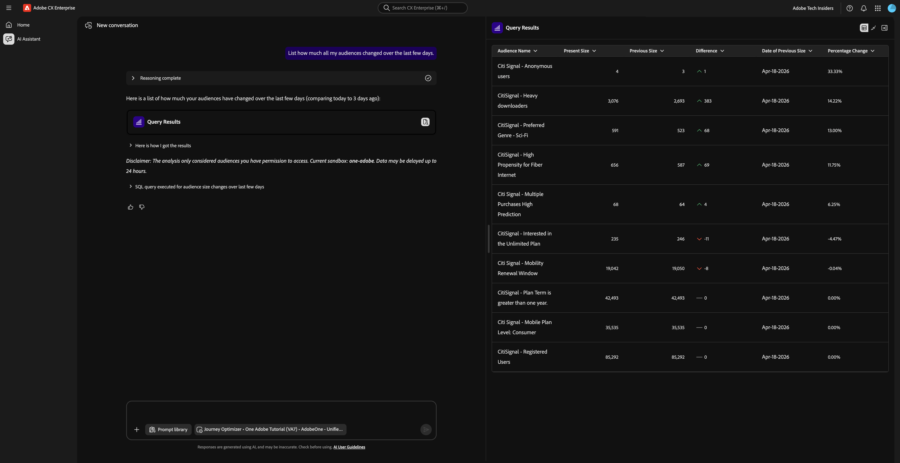

向下滚动一点以查看AI Assistant执行的步骤。

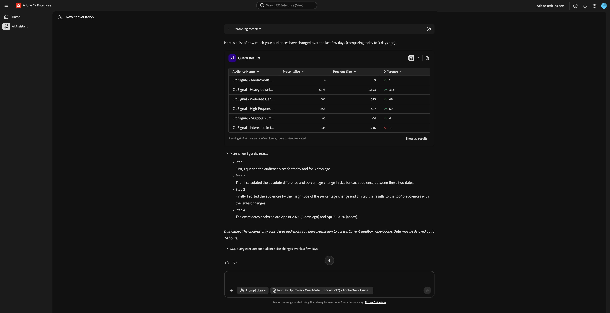

有一些现有的受众已支持“大量下载者”。 让我们看看它们是否已在使用中。

输入以下&#x200B;**提示**&#x200B;并单击&#x200B;**发送**&#x200B;按钮。

```javascript
Which of the above are used in a journey? 
```

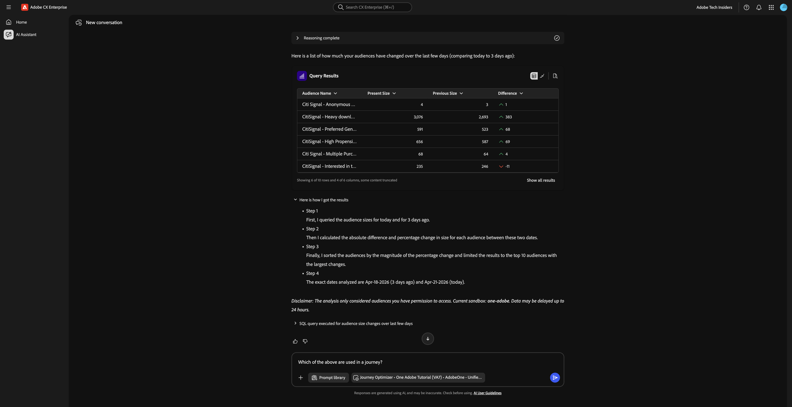

然后，您应该会看到类似以下的内容。


您现在应该验证该历程是否处于活动状态。 输入以下&#x200B;**提示**&#x200B;并单击&#x200B;**发送**&#x200B;按钮。

```javascript
Are these journeys active? 
```


然后，您应该会看到类似以下的内容。 这些历程当前均未运行。

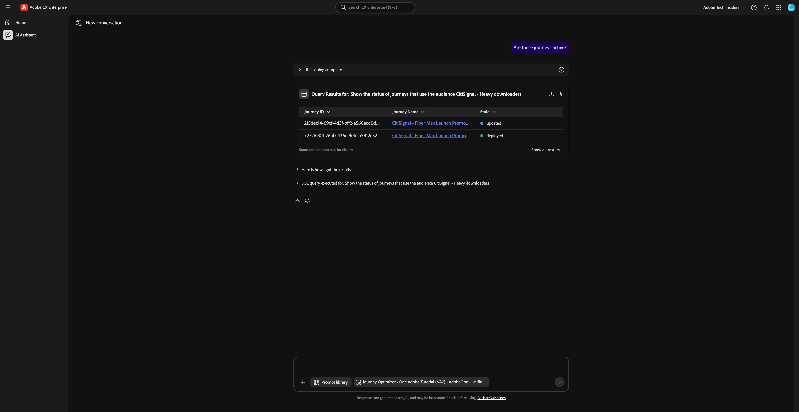

对于即将推出的Fiber Max，您现在应创建一个新历程。

## 1.1.6.10为Fiber Max启动项创建新历程

**意图**：

构建以复合受众为目标的新历程：

喜欢科幻片∩大量下载者。

输入以下&#x200B;**提示**&#x200B;并单击&#x200B;**发送**&#x200B;按钮。

```javascript
Create a  journey towards the audience Heavy Downloaders - Sci-Fi Preference_kbaa_5207bf. The journey is for the rollout of fiber broadband. There will 2 versions of an email  based on  a split of the audience based on who is in the "Eligble for Fiber upgrade" audience.  After 3 days, profiles from both email treatments who have not purchased fibre max will be sent a follow up email. 
```


您应该会看到此内容。 输入`yes`并单击“生成”。


您应该会看到此内容。 输入`yes`并单击“生成”。


您应该会看到此内容。 输入`The first one`并单击“发送”。


您应该会看到此内容。 输入`yes`并单击“发送”。

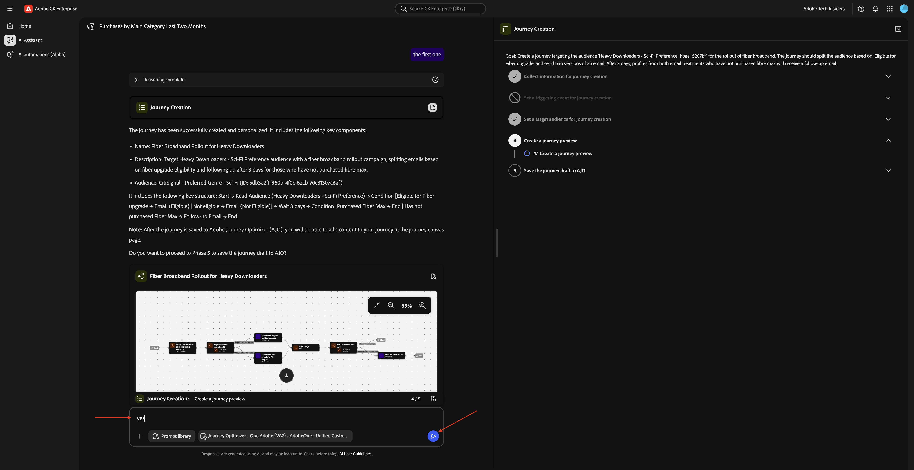

查看响应。 输入`yes`并单击“发送”。


单击&#x200B;**审阅**。


使用您的LDAP更新历程名称以使其唯一。 单击&#x200B;**保存**。


您的历程现在已在草稿模式下创建。

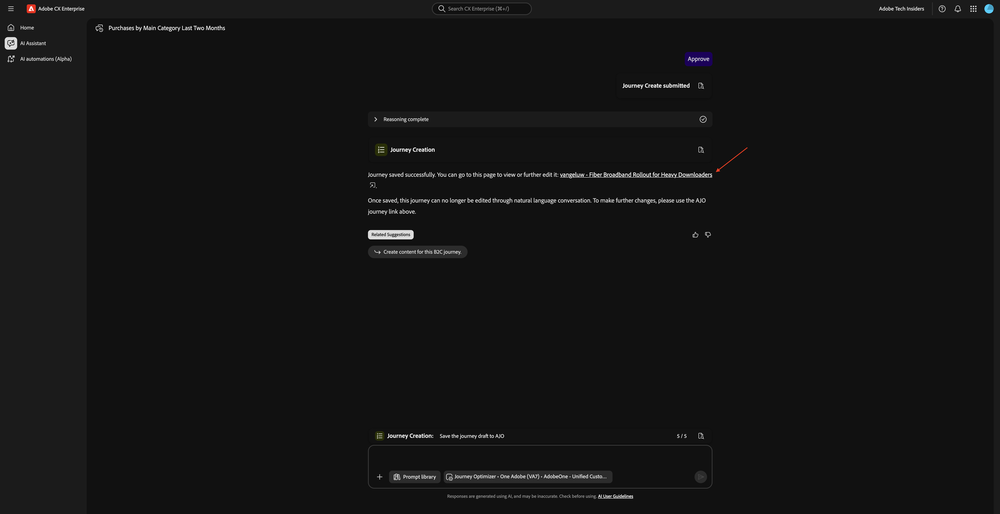

## 1.1.6.11历程冲突管理

输入以下&#x200B;**提示**&#x200B;并单击&#x200B;**发送**&#x200B;按钮。

```javascript
How can I manage journey conflicts?
```


查看信息。


向下滚动并选择&#x200B;**源**&#x200B;以查找该信息源自Experience League。


输入以下&#x200B;**提示**&#x200B;并单击&#x200B;**发送**&#x200B;按钮。

```javascript
List any conflicts for the journey +CitiSignal Fiber Max
```

然后从列表中手动选择历程&#x200B;**CitiSignal - Fiber Max启动项促销活动**。

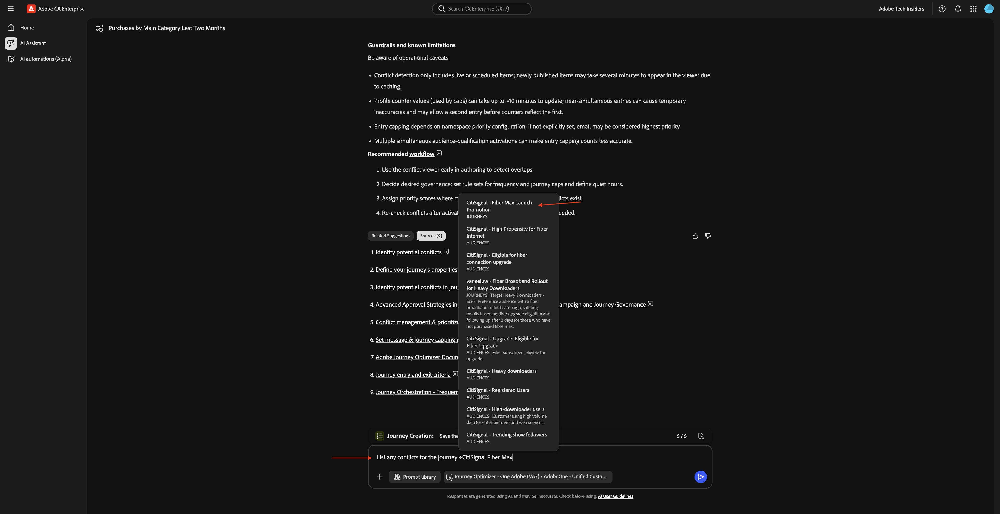

您应该会看到此内容。 单击&#x200B;**发送**。


查看历程冲突信息。


向下滚动以查找更多历程冲突详细信息。


## 1.1.6.12个试验

输入以下&#x200B;**提示**&#x200B;并单击&#x200B;**发送**&#x200B;按钮。

```javascript
How are the experiments performing for the journey named 'CitiSignal - Fiber Max Launch Promotion'?
```


您应该会看到以下内容：

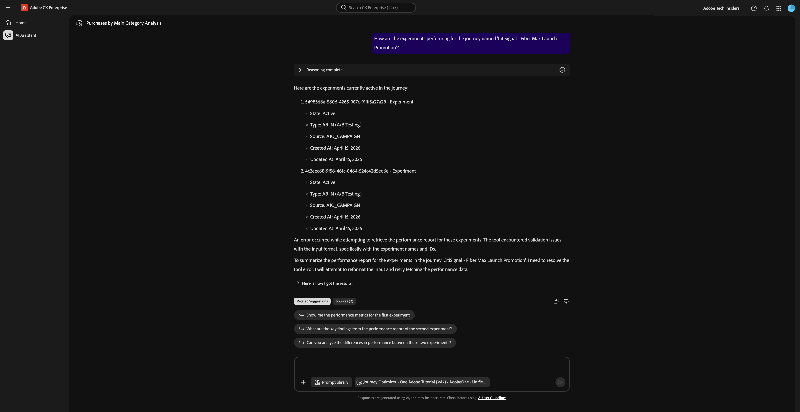

向下滚动，然后单击建议之一。 单击&#x200B;**发送**。

>[!NOTE]
>
>建议是动态的，因此在每次生成响应时，您应该会看到不同的建议。 您的建议可能不同于此屏幕快照中显示的建议。


然后，您应该会看到与所选建议相关的详细答案。


您现在已经完成了这个实验。

## 后续步骤

返回[Agent Orchestrator](./agentorchestrator.md){target="_blank"}

[返回所有模块](./../../../overview.md){target="_blank"}

