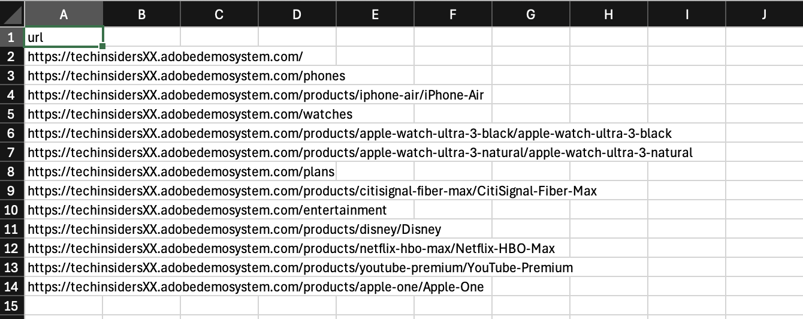
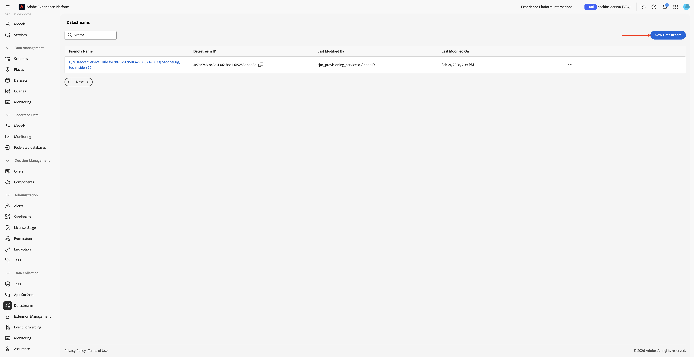

# 1.4.1 Brand Concierge快速入门

## 1.4.1.1 Brand Concierge概述

在配置Brand Concierge时，您将使用的2个主要元素包括：

- **代理编辑器（配置层）**

  用途：用于构建和配置对话式AI体验的主要UI平台。

  主要职责：

   - 定义和管理数据源和知识库
   - 设置品牌表达式（色调、样式、护栏）
   - 设置Meeting Booking代理

- **Agent Orchestrator（执行引擎）**

  用途：解释用户请求并执行相应代理操作的推理和协调引擎。

  主要职责：

   - 解释自然语言用户意图
   - 生成和执行多步推理计划
   - 选择并调用适当的运算符/工具
   - 强制实施品牌上下文、合规性和护栏
   - 协调多代理工作流
   - 汇总和组合来自多个数据源的响应

- **Brand Concierge对话运行时（服务层）**

  用途：面向客户的对话服务层，用于管理聊天会话、上下文和客户交互。

  关键组件：

   - Web代理（客户端）：使用Web SDK集成的浏览器或移动聊天用户界面
   - 会话服务（后端）：管理会话状态并充当编排网关

  主要职责：

   - 管理用户会话和对话记录
   - 处理用户身份验证和配置文件
   - 在客户端和Agent Orchestrator之间路由消息
   - 保留对话上下文
   - 将行为和操作事件记录到AEP for analytics
   - 应用特定于表面的配置

## 1.4.1.2 Brand Concierge实例配置

要开始创建自己的Brand Concierge实例，请执行以下步骤。

转到[https://experience.adobe.com/](https://experience.adobe.com/){target="_blank"}。 打开&#x200B;**Brand Concierge**。


您应该会看到此内容。 单击&#x200B;**沙盒选择**&#x200B;菜单。 选择已分配给您的沙盒。 该沙盒应命名为`techinsidersX`（将X替换为您分配的编号）。


接下来，填写以下变量：

- **公司名称**：花旗信号

- **门房名称**： `CitiSignal Sales Assistant`。

在&#x200B;**下输入以下文本：您希望礼宾人员做什么？**。

```javascript
Brand Concierge should help customers find their best device, plan or entertainment deal. Brand Concierge should help users discover internet plans, entertainment deals,  and help find the best available packages. Brand Concierge should also answer questions about devices such as phones and watches.
```

- **网站链接**：提供您正在使用的网站的链接

单击&#x200B;**继续**。


您应该会看到此内容。 此信息是基于AI在上一页上提供的输入生成的。 查看信息，在您满意后，单击&#x200B;**生成礼宾**。


您应该会看到此内容。 单击&#x200B;**面向消费者的产品咨询**&#x200B;旁边的&#x200B;**+添加**。


您应该会看到此内容。 使用以下文本填写以下字段。

**在提供推荐之前，门房应该了解产品或受众什么？**

```
CitiSignal is a telecommunications company that sells devices such as phones and watches and that sells internet services such as their lead product CitiSignal Fiber Max. On top of that, CitiSignal sells entertainment services that offer premium streaming services at a discounted price. CitiSignal is targeting these 3 personas primarily: Smart Home Families, Online Gamers and Remote Professionals.
```

**礼宾员在提供推荐时是否有任何业务规则或限制？**

```
Prioritize positioning the CitiSignal Fiber Max offering.
```

**礼宾员是否应该遵循或避免任何特定的关键字或短语？**

```
Competitor pricing, competitor products
```

单击&#x200B;**保存**。


单击&#x200B;**箭头**&#x200B;返回上一屏幕。


转到&#x200B;**知识Source**，然后单击&#x200B;**构建您的知识源**。


选择&#x200B;**网站链接**&#x200B;并单击&#x200B;**继续**。


您应该会看到此内容。 输入`CitiSignal website`作为知识源的名称。

您现在需要上传一个包含您网站链接的csv文件。 下载[CitiSignal网站链接CSV文件](./assets/citisignal-website-links.csv)到您的桌面。

单击&#x200B;**浏览文件**。


打开文件&#x200B;**citisignal-website-links.csv**，并更新链接以指向您自己的CitiSignal网站。



选择您刚刚下载和编辑的文件&#x200B;**citisignal-website-links.csv**。 单击&#x200B;**打开**。


您的文件现已添加到此知识源中。 单击&#x200B;**添加**。


您应该会看到此内容。 单击&#x200B;**构建您的知识源**。


选择&#x200B;**产品目录**&#x200B;并单击&#x200B;**继续**。


您应该会看到此内容。 输入`CitiSignal Products`作为知识源的名称。 单击&#x200B;**浏览文件**，然后从设备中选择&#x200B;**浏览**。


您现在需要上传一个包含您网站链接的csv文件。 将[CitiSignal产品目录](./assets/CitiSignal-catalog.json.zip)下载到您的桌面并解压缩。


选择文件&#x200B;**CitiSignal-catalog.json**，然后单击&#x200B;**打开**。


您应该会看到此内容。 单击&#x200B;**添加**。


你以后会回到这里的。 处理将需要10-20分钟，因此您必须在稍后阶段返回此处以验证处理是否成功。


## 1.4.1.3个AEP入门培训步骤

Brand Concierge使用Adobe Experience Platform存储对话中的交互数据。 Brand Concierge与Experience Platform之间的连接需要数据流由Brand Concierge配置和使用。

### 数据流

转到[https://experience.adobe.com/](https://experience.adobe.com/){target="_blank"}。 打开&#x200B;**Experience Platform**。


确保您选择了正确的沙盒，应将其命名为`techinsidersX`。 在左侧菜单中，向下滚动并选择&#x200B;**数据流**。


单击&#x200B;**新建数据流**。



输入&#x200B;**数据流名称** `--aepUserLdap-- - Brand Concierge`，然后选择&#x200B;**映射架构** `cja-brand-concierge-sb-XXX`。

单击&#x200B;**保存**。


您的数据流现已配置完成。 复制数据流名称和数据流ID，并将其写在计算机上的文本文件中。


### 数据流配置管理

下一步是启用Brand Concierge配置管理API以配置您刚刚创建的数据流。 在请求处理期间解决IMS组织ID和沙盒详细信息时需要此信息。

转到&#x200B;**主页**，然后选择&#x200B;**管理员控件**。


转到&#x200B;**数据流配置管理**，然后单击&#x200B;**添加配置**。


粘贴您之前创建的数据流的&#x200B;**数据流ID**。 单击&#x200B;**保存**。


然后您应该会看到类似这样的内容。


## 1.4.1.4样式配置管理

转到&#x200B;**样式配置管理**。 单击&#x200B;**初始化样式配置**。


输入&#x200B;**品牌名称** `CitiSignal`，然后单击&#x200B;**初始化样式配置**。


您应该会看到此内容。


## 1.4.1.5 Agent Orchestrator清单

转到&#x200B;**更新清单**。 您应该会看到此内容。 查看每个字段中的信息，并根据需要进行更改。

在现有文本末尾的字段&#x200B;**多模式问题响应提示**&#x200B;中添加以下文本。 不要删除存在的文本，只需在现有的文本之上添加以下文本即可。

```
# Product Catalog (Fallback Reference)

Use this catalog when <Documents> doesn't return relevant results:

## CONNECTIVITY
**CitiSignal Fiber Max**
- Description: High-speed fiber internet with blazing-fast speeds, seamless streaming, ultra-responsive gaming, crystal-clear video calls. No data caps, no throttling. Future-ready for smart homes.
- Image: https://delivery-p168681-e1803036.adobeaemcloud.com/adobe/assets/urn:aaid:aem:cdb9e163-f9f5-4338-9d62-9807b61c082f/as/CitiSignal-Fiber-Max.webp
- URL: https://main--citisignal-aem-accs--woutervangeluwe.aem.page/products/citisignal-fiber-max/CitiSignal-Fiber-Max

## ENTERTAINMENT
**Disney Plus**
- Description: Streaming home of Disney, Pixar, Marvel, Star Wars, National Geographic. Unlimited entertainment, new releases, original series, classic movies.
- Image: https://delivery-p168681-e1803036.adobeaemcloud.com/adobe/assets/urn:aaid:aem:b3bbe91a-e307-43bd-845f-1c77e7ba28df/as/Disney.webp
- URL: https://main--citisignal-aem-accs--woutervangeluwe.aem.page/products/disney/Disney

**Netflix + HBO Max**
- Description: Unlimited TV shows and movies. Watch as much as you want, whenever you want.
- Image: https://delivery-p168681-e1803036.adobeaemcloud.com/adobe/assets/urn:aaid:aem:883be2a0-6c42-4508-b9ac-1e3a33235081/as/Netflix-HBO-Max.webp
- URL: https://main--citisignal-aem-accs--woutervangeluwe.aem.page/products/netflix-hbo-max/Netflix-HBO-Max

**YouTube Premium**
- Description: Ad-free YouTube, YouTube Music, YouTube Kids. Watch offline, in background, on the go.
- Image: https://delivery-p168681-e1803036.adobeaemcloud.com/adobe/assets/urn:aaid:aem:ac2a8c66-8740-4fce-bd3a-8106db9e556f/as/YouTube-Premium.webp
- URL: https://main--citisignal-aem-accs--woutervangeluwe.aem.page/products/youtube-premium/YouTube-Premium

**Apple One**
- Description: Apple Music (100M+ songs), Apple TV+, Apple Arcade, iCloud+. Complete Apple ecosystem bundle.
- Image: https://delivery-p168681-e1803036.adobeaemcloud.com/adobe/assets/urn:aaid:aem:94126f30-931a-447e-9cef-f58c60dbb17c/as/Apple-One.webp
- URL: https://main--citisignal-aem-accs--woutervangeluwe.aem.page/products/apple-one/Apple-One

## DEVICES
**iPhone Air Sky Blue**
- Description: Slim iPhone with A19 Pro chip, 48MP camera, 6.5\" display, Apple Intelligence, all-day battery. Titanium frame, Ceramic Shield 2.
- Image: https://delivery-p168681-e1803036.adobeaemcloud.com/adobe/assets/urn:aaid:aem:0c4b1537-8268-4507-98e6-bbb03faa3ad1/as/iPhone-Air.webp
- URL: https://main--citisignal-aem-accs--woutervangeluwe.aem.page/products/iphone-air/iPhone-Air?optionsUIDs=Y29uZmlndXJhYmxlLzkzLzIw

**iPhone Air Cloud White**
- Description: Slim iPhone with A19 Pro chip, 48MP camera, 6.5\" display, Apple Intelligence, all-day battery. Titanium frame, Ceramic Shield 2.
- Image: https://delivery-p168681-e1803036.adobeaemcloud.com/adobe/assets/urn:aaid:aem:30447a9c-c037-4df3-ae88-4127b9ec325e/as/iPhone-Air.webp
- URL: https://main--citisignal-aem-accs--woutervangeluwe.aem.page/products/iphone-air/iPhone-Air?optionsUIDs=Y29uZmlndXJhYmxlLzkzLzI

**iPhone Air Space Black**
- Description: Slim iPhone with A19 Pro chip, 48MP camera, 6.5\" display, Apple Intelligence, all-day battery. Titanium frame, Ceramic Shield 2.
- Image: https://main--citisignal-aem-accs--woutervangeluwe.aem.page/products/iphone-air/iPhone-Air?optionsUIDs=Y29uZmlndXJhYmxlLzkzLzIz
- URL: https://main--citisignal-aem-accs--woutervangeluwe.aem.page/products/iphone-air/iPhone-Air?optionsUIDs=Y29uZmlndXJhYmxlLzkzLzIz

**iPhone Air Light Gold**
- Description: Slim iPhone with A19 Pro chip, 48MP camera, 6.5\" display, Apple Intelligence, all-day battery. Titanium frame, Ceramic Shield 2.
- Image: https://delivery-p168681-e1803036.adobeaemcloud.com/adobe/assets/urn:aaid:aem:ffa7b752-87ab-427f-a631-382fc67e7530/as/iPhone-Air.webp
- URL: https://main--citisignal-aem-accs--woutervangeluwe.aem.page/products/iphone-air/iPhone-Air?optionsUIDs=Y29uZmlndXJhYmxlLzkzLzIx

**Apple Watch Ultra 3-Black**
- Description: Rugged smartwatch with 42hr battery, satellite communication, titanium case, dual-frequency GPS, hypertension notifications.
- Image: https://delivery-p168681-e1803036.adobeaemcloud.com/adobe/assets/urn:aaid:aem:d33f4f49-1239-45b8-a6e6-b97f12177e06/as/Apple-Watch-Ultra-3.webp
- URL: https://main--citisignal-aem-accs--woutervangeluwe.aem.page/products/apple-watch-ultra-3/Apple-Watch-Ultra-3?optionsUIDs=Y29uZmlndXJhYmxlLzE4MS8yNA%3D%3D

**Apple Watch Ultra 3-Natural**
- Description: Rugged smartwatch with 42hr battery, satellite communication, titanium case, dual-frequency GPS, hypertension notifications.
- Image: https://delivery-p168681-e1803036.adobeaemcloud.com/adobe/assets/urn:aaid:aem:8f107329-66f1-43fd-b505-b1c16892379f/as/Apple-Watch-Ultra-3.webp
- URL: https://main--citisignal-aem-accs--woutervangeluwe.aem.page/products/apple-watch-ultra-3/Apple-Watch-Ultra-3?optionsUIDs=Y29uZmlndXJhYmxlLzE4MS8yNQ%3D%3D

# Sales Strategy

## Primary Focus: Connectivity Products
- When users ask about internet, connectivity, streaming, or home services, recommend **CitiSignal Fiber Max**.
- Highlight: blazing-fast fiber speeds, seamless streaming, no data caps, no throttling, future-ready.

## Entertainment Upselling Strategy
- After discussing connectivity, PROACTIVELY suggest entertainment products.
- Use natural transitions like:
  - \"With speeds like these, you'll want entertainment that keeps up...\"
  - \"Many of our customers enhance their experience with...\"
  - \"To get the most out of your connection...\"
- Match recommendations to user context:
  - Families with kids → **Disney Plus**
  - Movie/TV enthusiasts → **Netflix + HBO Max**
  - Ad-free YouTube fans → **YouTube Premium**
  - Apple ecosystem users → **Apple One**
```


进行更改后，向上滚动并单击&#x200B;**更新清单**。


## 1.4.1.6完成知识源设置

转到&#x200B;**知识源**。 10-20分钟后，两个知识源的&#x200B;**状态**&#x200B;应为&#x200B;**已完成**。 一旦两个知识源的状态为&#x200B;**成功**，请单击&#x200B;**主页**。


您应该会看到此内容。 单击&#x200B;**网站链接**&#x200B;卡片上的&#x200B;**+连接**。


选择知识源&#x200B;**CitiSignal网站**，然后单击&#x200B;**保存**。


您应该会看到此内容。 在&#x200B;**产品目录**&#x200B;卡片上单击&#x200B;**+连接**。


选择知识源&#x200B;**CitiSignal产品**，然后单击&#x200B;**保存**。


您应该会看到此内容。 单击&#x200B;**预览**&#x200B;开始与您的Brand Concierge交互。


您现在可以开始询问与提供的知识源相关的问题。


输入问题`what products do you sell?`并单击&#x200B;**发送**。


然后，您应该获得类似的响应。


您的Brand Concierge实例现在已准备好在您的网站上实施。

## 后续步骤

转到[在您的网站上实施Brand Concierge](./ex2.md){target="_blank"}

返回[Brand Concierge](./brandconcierge.md){target="_blank"}

[返回所有模块](./../../../overview.md){target="_blank"}
