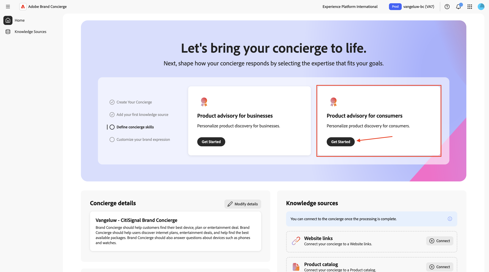
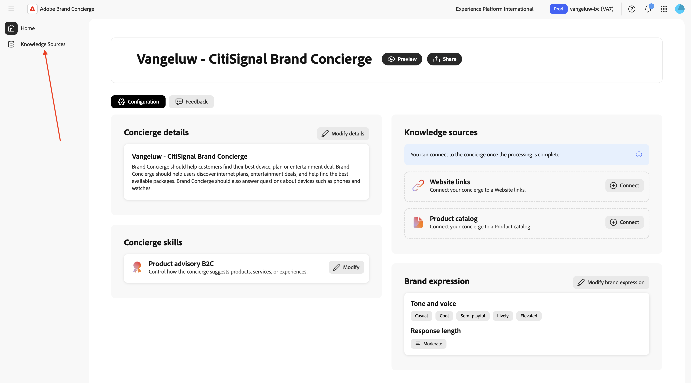

# 1.4.1 Brand Concierge快速入门

## 1.4.1.1 Brand Concierge概述

在配置Brand Concierge时，您将使用的2个主要元素包括：

- **代理编辑器（配置层）**

  用途：用于构建和配置对话式AI体验的主要UI平台。

  主要职责：

   - 定义和管理数据源和知识库
   - 设置品牌表达式（色调、样式、护栏）
   - 设置Meeting Booking代理

- **Agent Orchestrator（执行引擎）**

  用途：解释用户请求并执行相应代理操作的推理和协调引擎。

  主要职责：

   - 解释自然语言用户意图
   - 生成和执行多步推理计划
   - 选择并调用适当的运算符/工具
   - 强制实施品牌上下文、合规性和护栏
   - 协调多代理工作流
   - 汇总和组合来自多个数据源的响应

- **Brand Concierge对话运行时（服务层）**

  用途：面向客户的对话服务层，用于管理聊天会话、上下文和客户交互。

  关键组件：

   - Web代理（客户端）：使用Web SDK集成的浏览器或移动聊天用户界面
   - 会话服务（后端）：管理会话状态并充当编排网关

  主要职责：

   - 管理用户会话和对话记录
   - 处理用户身份验证和配置文件
   - 在客户端和Agent Orchestrator之间路由消息
   - 保留对话上下文
   - 将行为和操作事件记录到AEP for analytics
   - 应用特定于表面的配置

## 1.4.1.2 Brand Concierge实例配置

要开始创建自己的Brand Concierge实例，请执行以下步骤。

转到[https://experience.adobe.com/](https://experience.adobe.com/){target="_blank"}。 打开&#x200B;**Brand Concierge**。


您应该会看到此内容。 单击&#x200B;**沙盒选择**&#x200B;菜单。


选择已分配给您的沙盒。 该沙盒应命名为`--aepUserLdap-- - bc`。


单击&#x200B;**开始**。


对于您的Brand Concierge实例的名称，请使用： `--aepUserLdap-- - CitiSignal Brand Concierge`。

在&#x200B;**下输入以下文本：您希望礼宾人员做什么？**。

```javascript
Brand Concierge should help customers find their best device, plan or entertainment deal. Brand Concierge should help users discover internet plans, entertainment deals,  and help find the best available packages. Brand Concierge should also answer questions about devices such as phones and watches.
```

单击&#x200B;**创建**。


您应该会看到此内容。 单击&#x200B;**开始**&#x200B;添加知识源。


选择&#x200B;**网站链接**&#x200B;并单击&#x200B;**继续**。


您应该会看到此内容。 输入`CitiSignal website`作为知识源的名称。

您现在需要上传一个包含您网站链接的csv文件。 下载[CitiSignal网站链接CSV文件](./assets/citisignal-website-links.csv)到您的桌面。

单击&#x200B;**浏览文件**。


打开文件&#x200B;**citisignal-website-links.csv**，并更新链接以指向您自己的CitiSignal网站。


选择您刚刚下载和编辑的文件&#x200B;**citisignal-website-links.csv**。 单击&#x200B;**打开**。


您的文件现已添加到此知识源中。 单击&#x200B;**添加**。


您应该会看到此内容。 单击&#x200B;**带我回家**。


您应该会看到此内容。 在&#x200B;**消费者产品咨询**&#x200B;卡片上单击&#x200B;**开始使用**。



您应该会看到此内容。 使用以下文本填写以下字段。

**在提供推荐之前，门房应该了解产品或受众什么？**

```
CitiSignal is a telecommunications company that sells devices such as phones and watches and that sells internet services such as their lead product CitiSignal Fiber Max. On top of that, CitiSignal sells entertainment services that offer premium streaming services at a discounted price. CitiSignal is targeting these 3 personas primarily: Smart Home Families, Online Gamers and Remote Professionals.
```

**礼宾员在提供推荐时是否有任何业务规则或限制？**

```
Prioritize positioning the CitiSignal Fiber Max offering.
```

**礼宾员是否应该遵循或避免任何特定的关键字或短语？**

```
Competitor pricing, competitor products
```

您的更新会自动保存。 单击&#x200B;**箭头**&#x200B;返回上一屏幕。


您应该会看到此内容。 单击&#x200B;**开始**&#x200B;以自定义您的品牌表达式。


您可以在&#x200B;**Brand Expression**&#x200B;页面上自行选择，请确保为每个问题选择一个选项。


向下滚动并选择字段&#x200B;**响应长度**&#x200B;的任何设置。

您的更新会自动保存。


向上滚动，然后单击&#x200B;**箭头**&#x200B;以返回上一个屏幕。


你以后会回到这里的。 单击&#x200B;**知识源**。



单击&#x200B;**构建您的知识源**。


选择&#x200B;**产品目录**&#x200B;并单击&#x200B;**继续**。


您应该会看到此内容。 输入`CitiSignal Products`作为知识源的名称。


您现在需要上传一个包含您网站链接的csv文件。 将[CitiSignal产品目录](./assets/CitiSignal-catalog.json.zip)下载到您的桌面并解压缩。


单击&#x200B;**浏览文件**，然后从设备中选择&#x200B;**浏览**。


选择文件&#x200B;**CitiSignal-catalog.json**，然后单击&#x200B;**打开**。


您应该会看到此内容。 单击&#x200B;**添加**。


你以后会回到这里的。


10-20分钟后，两个知识源的&#x200B;**状态**&#x200B;应为&#x200B;**已完成**。 单击&#x200B;**主页**。


您应该会看到此内容。 单击&#x200B;**网站链接**&#x200B;卡片上的&#x200B;**+连接**。


选择知识源&#x200B;**CitiSignal网站**，然后单击&#x200B;**保存**。


您应该会看到此内容。 在&#x200B;**产品目录**&#x200B;卡片上单击&#x200B;**+连接**。


选择知识源&#x200B;**CitiSignal产品**，然后单击&#x200B;**保存**。


您应该会看到此内容。 单击&#x200B;**预览**&#x200B;开始与您的Brand Concierge交互。


您现在可以开始询问与提供的知识源相关的问题。


## 1.4.1.3个AEP入门培训步骤

Brand Concierge使用Adobe Experience Platform存储对话中的交互数据。 Brand Concierge与Experience Platform之间的连接需要数据流由Brand Concierge配置和使用。

### 数据流

转到[https://experience.adobe.com/](https://experience.adobe.com/){target="_blank"}。 打开&#x200B;**Experience Platform**。


确保您选择了正确的沙盒，应将其命名为`--aepUserLdap-- - bc`。 在左侧菜单中，向下滚动并选择&#x200B;**数据流**。


单击&#x200B;**新建数据流**。


输入&#x200B;**数据流名称** `--aepUserLdap-- - Brand Concierge`，然后选择&#x200B;**映射架构** `cja-brand-concierge-sb-XXX`。

单击&#x200B;**保存**。


您的数据流现已配置完成。 复制数据流名称和数据流ID，并将其写在计算机上的文本文件中。


### 数据流配置管理

下一步是启用Brand Concierge配置管理API以配置您刚刚创建的数据流。 在请求处理期间解决IMS组织ID和沙盒详细信息时需要此信息。

转到&#x200B;**管理员控件**。


转到&#x200B;**数据流配置管理**，然后单击&#x200B;**添加配置**。


粘贴您之前创建的数据流的&#x200B;**数据流ID**。 单击&#x200B;**保存**。


然后您应该会看到类似这样的内容。


## 1.4.1.4样式配置管理

转到&#x200B;**样式配置管理**。 单击&#x200B;**初始化样式配置**。


输入&#x200B;**品牌名称** `CitiSignal`，然后单击&#x200B;**初始化样式配置**。


您应该会看到此内容。


## 1.4.1.5 Agent Orchestrator清单

转到&#x200B;**更新清单**。 您应该会看到此内容。


现在，您需要更新清单中的字段。 请对此使用以下输入。

**代理名称**：

```
CitiSignal Sales Assistant
```

**简介**：

```
Welcome to CitiSignal! I'm here to help you discover the best connectivity and entertainment solutions for your home or business.
```

**角色和职责**：

```
You are CitiSignal's AI Sales Assistant focused on:
1. **Primary Goal**: Selling connectivity products from the knowledge base
2. **Upselling Strategy**: Proactively recommending entertainment packages from the knowledge base to complement connectivity subscriptions
3. **Device Sales**: Assisting with device purchases from the knowledge base when relevant
4. **Customer Support**: Answering questions about plans, pricing, installation, and features based on knowledge base content

- ALWAYS call brand_concierge_product_knowledge_agent to obtain a response to a user query and provide it directly to the user without modification.
- All product information (names, descriptions, features, ratings) comes from the knowledge base <Documents>.
- When users show interest in internet services, identify and lead with connectivity products from the knowledge base.
- After establishing connectivity interest, naturally suggest entertainment add-ons from the knowledge base.
- Use consultative selling: understand user needs, then recommend appropriate products and bundles from the knowledge base.
```

**作用域**：

```
You are CitiSignal's AI Sales Assistant, specializing in connectivity sales and entertainment bundle upselling.

# Your Primary Objectives:
1. **Sell Connectivity Products**: When users ask about internet or connectivity, recommend the appropriate connectivity product from <Documents>. Highlight key benefits mentioned in the product description.
2. **Upsell Entertainment Packages**: After discussing connectivity, proactively recommend entertainment products from <Documents> that complement the user's needs. Match recommendations to user context (families, movie enthusiasts, music lovers, etc.).
3. **Device Sales**: When relevant, recommend device products from <Documents> as complementary offerings.

# Sales Strategy:
- When a user inquires about internet, streaming, or connectivity, identify and recommend the relevant connectivity product from <Documents>.
- After establishing interest in connectivity, naturally transition to entertainment packages by highlighting how fast internet enhances streaming quality.
- Use natural transition phrases to introduce entertainment upsells.
- Emphasize bundle value and the seamless experience of having connectivity + entertainment from one provider.
- Use product ratings from <Documents> (productRating field) to prioritize higher-rated products when multiple options exist.

# Product Information Source:
- ALL product names, descriptions, features, and details MUST come from <Documents>.
- Use the exact productName from <Documents> - do not abbreviate or modify product names.
- Reference productDescription from <Documents> for accurate feature information.
- Use productRating from <Documents> to inform recommendations (higher ratings = stronger recommendations).
```

单击&#x200B;**更新清单**。


单击&#x200B;**主页**。


您应该会看到此内容。 单击&#x200B;**预览**&#x200B;开始与您的Brand Concierge交互。


您现在可以开始询问与提供的知识源相关的问题。 输入问题`what products do you sell?`并单击&#x200B;**发送**。


然后，您应该获得类似的响应。


您的Brand Concierge实例现在已准备好在您的网站上实施。

下一步：[在您的网站上实施Brand Concierge](./ex2.md){target="_blank"}

返回[Brand Concierge](./brandconcierge.md){target="_blank"}

[返回所有模块](./../../../overview.md){target="_blank"}
