# 1.6.1 AEM Agent快速入门

>[!IMPORTANT]
>
>您的AEM CS沙盒可能已休眠。 鉴于解除沙盒休眠需要10-15分钟，最好现在开始解除休眠过程，这样以后就不必等待它。

## 1.6.1.1发现代理

Adobe Experience Manager (AEM) Discovery Agent是AEM as a Cloud Service中由AI提供支持的工具，它使用户能够使用自然语言提示查找、检索和利用内容，包括Assets、内容片段和自适应Forms。 通过了解整个存储库的意图和搜索，无需进行手动、繁重点击或复杂的筛选。

为了使用&#x200B;**发现代理**，您将首先在Adobe Experience Manager中创建一些标记，然后使用这些标记标记标记一些资源。 完成此操作后，您将能够使用AI助手以简单且商业友好的方式发现资产。

转到[https://my.cloudmanager.adobe.com](https://my.cloudmanager.adobe.com){target="_blank"}。 您应选择的组织是`--aepImsOrgName--`。

### 在Assets中创建和使用标记

单击以打开Cloud Manager程序，该程序应使用以下命名选项：

- **`Tech Insiders - AEM + ACCS X`**&#x200B;其中X代表分配给您的编号。
- **`Tech Insiders On Demand - AEM + ACCS X`**&#x200B;其中X代表分配给您的编号。
- **`--aepUserLdap-- - CitiSignal AEM+ACCS`**，在这种情况下，您没有编号，因为您使用的是自己创建的AEM程序。

在此示例中，将使用项目&#x200B;**技术内部人士 — AEM + ACCS 100**。 您应该使用自己的程序。

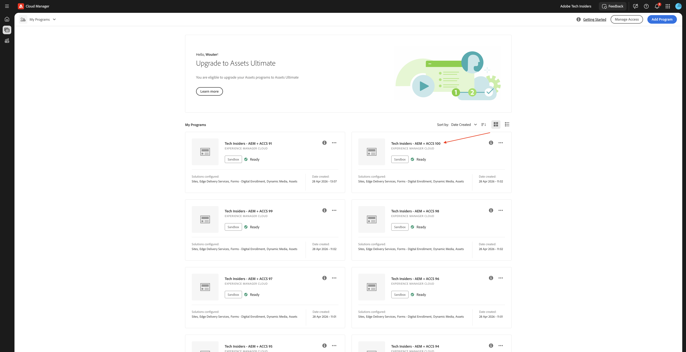

单击环境的URL以将其打开。


单击&#x200B;**工具**&#x200B;图标。


在&#x200B;**常规**&#x200B;下，单击&#x200B;**标记**。


您应该会看到此内容。 单击&#x200B;**创建**，然后选择&#x200B;**创建命名空间**。


在&#x200B;**标题**&#x200B;字段中，输入： `--aepUserLdap-- - CitiSignal`。 单击&#x200B;**创建**。

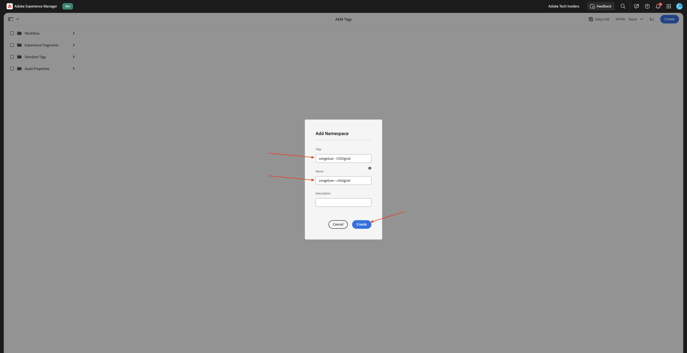

通过单击命名空间&#x200B;**`--aepUserLdap-- - CitiSignal`**&#x200B;可深入查看该命名空间。 单击&#x200B;**创建**，然后选择&#x200B;**创建标记**。


在&#x200B;**标题**&#x200B;字段中，输入： `--aepUserLdap-- - Campaign`。 单击&#x200B;**提交**。


单击标记&#x200B;**`--aepUserLdap-- - Campaign`**&#x200B;以将其选中。 单击&#x200B;**创建**，然后选择&#x200B;**创建标记**。


在&#x200B;**标题**&#x200B;字段中，输入： `--aepUserLdap-- - Winter 2026`。 单击&#x200B;**提交**。


单击标记&#x200B;**Campaign**&#x200B;以将其选中。 单击&#x200B;**创建**，然后选择&#x200B;**创建标记**。


在&#x200B;**标题**&#x200B;字段中，输入： `--aepUserLdap-- - Spring 2026`。 单击&#x200B;**提交**。


您现在应该拥有此项。


单击&#x200B;**Adobe Experience Manager**，然后单击&#x200B;**Assets**。


单击&#x200B;**文件**。


单击文件夹&#x200B;**CitiSignal**&#x200B;以将其打开。

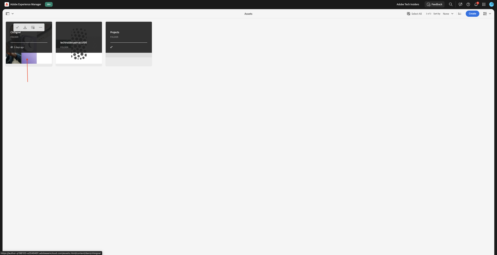

单击&#x200B;**创建**，然后选择&#x200B;**文件**。


下载文件[citisignal-images-campaign.zip](./assets/citisignal-images-campaign.zip)并将其解压缩到桌面上。

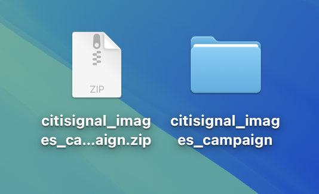

选择您刚刚下载的3个文件，然后单击&#x200B;**打开**。


单击&#x200B;**上传**。


您应该会看到此内容。

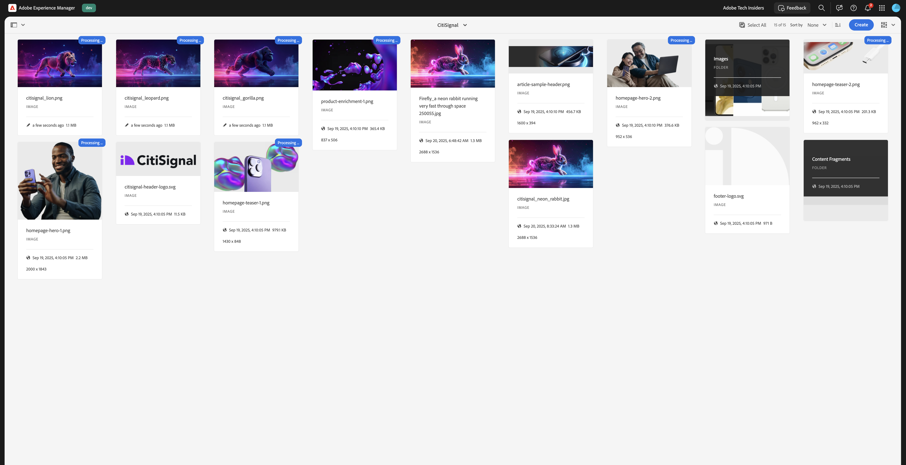

选择第一个图像(citisignal_lion.png)，然后单击&#x200B;**属性**。

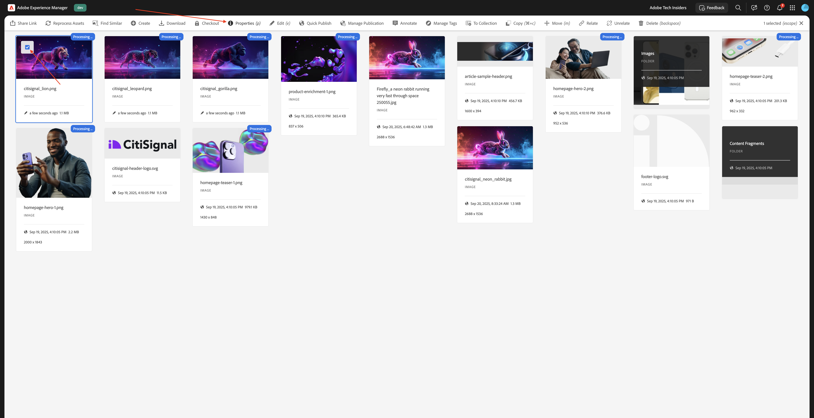

单击“标记”下的&#x200B;**文件夹**&#x200B;图标。


选择标记&#x200B;**`--aepUserLdap-- - Spring 2026`**&#x200B;并单击&#x200B;**选择**。


单击&#x200B;**“保存并关闭”。**


对这些图像重复这些步骤：

- `citisignal_leopard.png`
- `citisignal_gorilla.png`
- `citisignal_neon_rabbit.png`

为所有图像选择该标记后，请转到&#x200B;**Experience Manager Assets**。


单击屏幕右上角的&#x200B;**配置文件**&#x200B;图标。 单击&#x200B;**切换视图**。

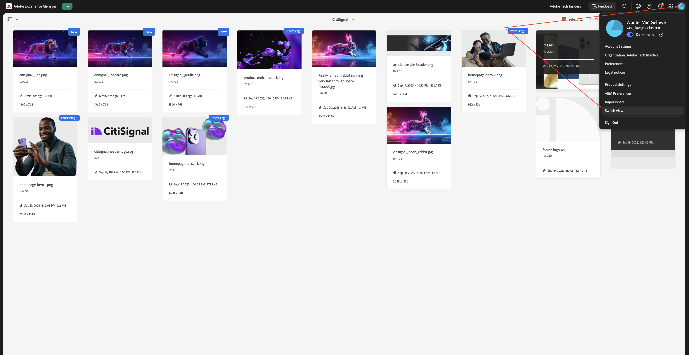

您应该会看到此内容。


双击以打开第一个图像。


选择&#x200B;**已批准**，然后单击&#x200B;**保存**。


在&#x200B;**标记**&#x200B;下，您可以看到之前选择的标记。


重复该过程，以便所有4个图像都获得批准。

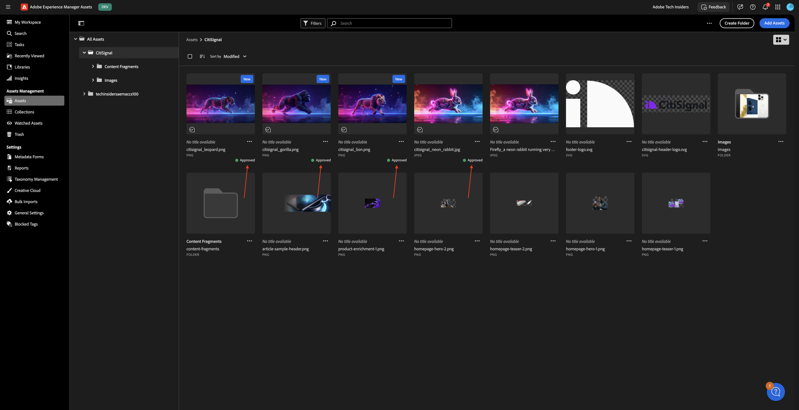

接下来，转到&#x200B;**我的工作区**，然后单击以打开&#x200B;**AI助手**。


输入以下提示并单击&#x200B;**发送**。

```javascript
find all assets tagged with '--aepUserLdap-- - Spring 2026'
```


如果您有权访问多个AEM Assets CS环境，您将看到类似以下内容。 单击要使用的环境的建议答案，然后单击&#x200B;**发送**。


您应该会看到类似的答案。 单击图标可将AI助手展开到全屏。

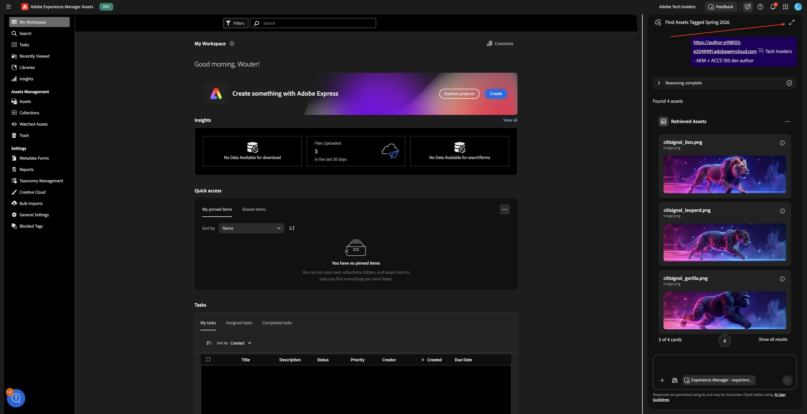

查看答案。


单击任何资源上的&#x200B;**查看信息**&#x200B;图标。


然后，您将看到选定资源的放大视图，其中包含一些元数据。


## 1.6.1.2 Experience生产代理

### 内容更新 — Assets

内容更新技能可以轻松更新现有内容，包括内容片段、页面、表单和资产。 代理可以执行更新、删除、替换或添加内容元素等操作，以保持体验准确且最新。 输入可以是自然语言描述，在与Jira PDF一起使用时，屏幕截图也可以提供输入。

返回到AI助手屏幕。 关闭侧面板。


选择建议提示之一，然后单击&#x200B;**发送**。

`For the first image, generate renditions for Instagram and LinkedIn posts`


几分钟后，您应该会看到类似的响应。


查看生成的图像。


您可以尝试其他提示。 向上滚动并选择其他建议的提示之一，或输入您自己的提示，然后单击&#x200B;**发送**。

`For the first image, generate a mirrored image`


查看生成的图像。


### 内容更新 — 页面

返回您的Adobe Experience Manager创作环境，然后转到&#x200B;**站点**。


转到&#x200B;**花旗信号**。 单击&#x200B;**创建**&#x200B;并选择&#x200B;**页面**。


选择&#x200B;**页面**&#x200B;并单击&#x200B;**下一步**。


输入以下值：

- 标题： **光纤最大值**
- 名称： **fibre-max**
- 页面标题： **光纤最大值**

单击&#x200B;**创建**。


选择&#x200B;**打开**。


您应该会看到此内容。


单击空白区域以选择&#x200B;**节**&#x200B;组件。 然后，单击右菜单中的加号&#x200B;**+**&#x200B;图标，并选择&#x200B;**Hero**。


您应该会看到此内容。 单击&#x200B;**+添加**&#x200B;以添加图像。


选择您的资源存储库。 然后，打开文件夹&#x200B;**CitiSignal**。


选择您之前上传的狮子图像。 单击&#x200B;**选择**。


您应该会看到此内容。 单击&#x200B;**文本**&#x200B;区域以更改文本。


将此文本粘贴到的位置：

```
This winter, be as fast as a lion.
```

选择&#x200B;**标题1**，然后单击&#x200B;**完成**。

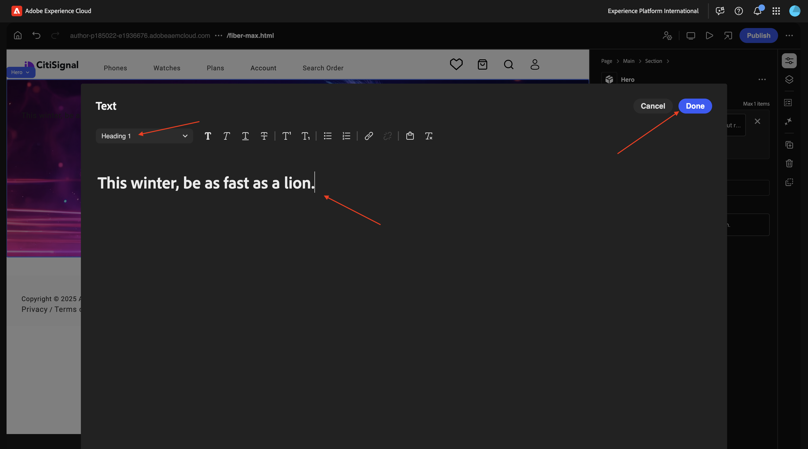

您应该会看到此内容。 转到&#x200B;**内容树**&#x200B;并选择区域&#x200B;**节**。


单击&#x200B;**+**&#x200B;图标，然后选择&#x200B;**卡片**。


您应该会看到此内容。 确保在&#x200B;**内容树**&#x200B;中选择&#x200B;**卡片**。

然后，单击按钮&#x200B;**+** 4次。

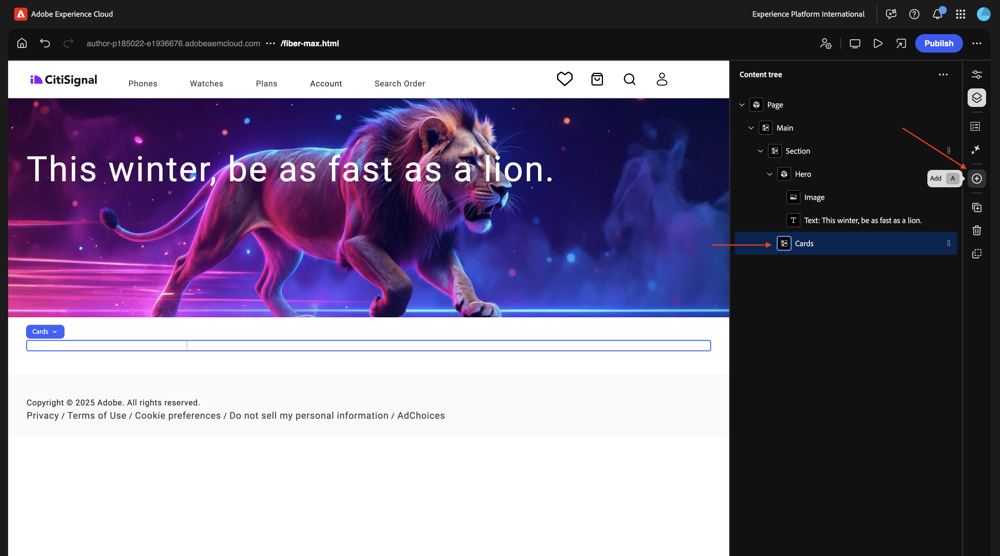

您现在应该会看到此内容，其中&#x200B;**卡片**&#x200B;对象中有4个&#x200B;**卡片**&#x200B;对象。


选择前&#x200B;**卡**。 单击&#x200B;**文本**&#x200B;区域以更改文本。

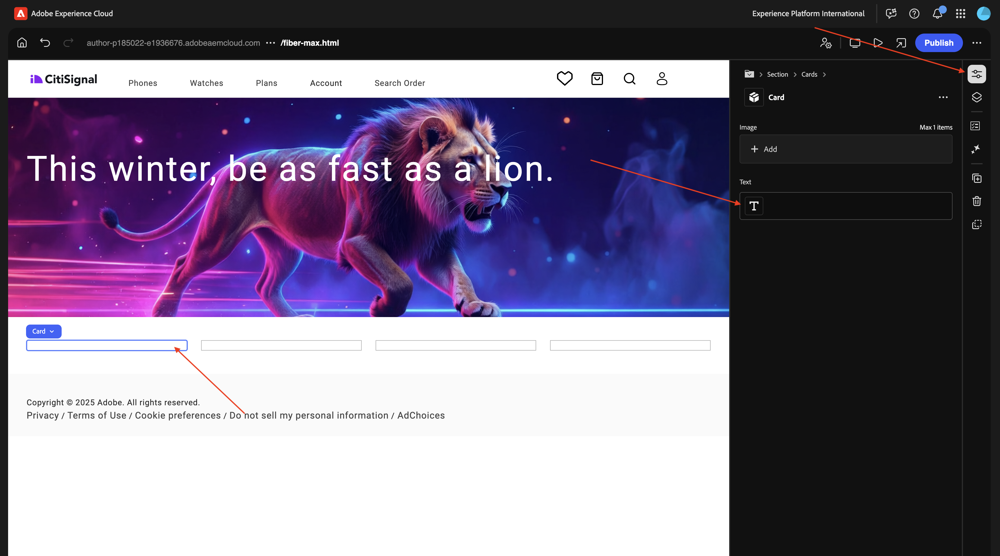

粘贴以下文本。 确保文本的第一行使用&#x200B;**标题1**。 单击&#x200B;**完成**。

```
99.9% network reliability

Game, video chat and stream on multiple devices with ultra low lag.
```


选择第二张&#x200B;**卡**。 单击&#x200B;**文本**&#x200B;区域以更改文本。


粘贴以下文本。 确保文本的第一行使用&#x200B;**标题1**。 单击&#x200B;**完成**。

```
3-year

price lock guarantee

For new and existing Fiber Max customers on all internet plans.

No hidden fees.
```


选择第三个&#x200B;**卡**。 单击&#x200B;**文本**&#x200B;区域以更改文本。

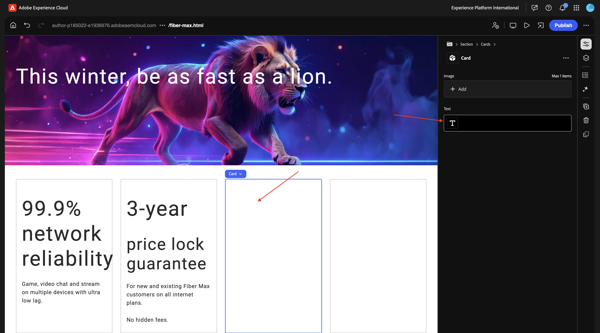

粘贴以下文本。 确保文本的第一行使用&#x200B;**标题1**。 单击&#x200B;**完成**。

```
More ways to save

Save over 45% on the best entertainment with CitiSignal
```


选择第四个&#x200B;**卡**。 单击&#x200B;**文本**&#x200B;区域以更改文本。


粘贴以下文本。 确保文本的第一行使用&#x200B;**标题1**。 单击&#x200B;**完成**。

```
Get Fiber Max now!

Fill out the form here to get started.
```


您现在应该拥有此项。 单击&#x200B;**发布**。


再次单击&#x200B;**发布**。


单击&#x200B;**打开页面**。


复制页面URL，以备您下次使用。

URL应类似于此： `https://author-pXXXXXX-eXXXXXXX.adobeaemcloud.com/content/CitiSignal/fiber-max.html`。


转到[https://experience.adobe.com/#/experiencemanager/](https://experience.adobe.com/#/experiencemanager/)。 单击以打开&#x200B;**AI助手**。


粘贴以下提示并单击&#x200B;**发送**。 在此提示符下，使用您在上一步中复制的URL替换XXX。

```
On the page XXX, please make the following changes:

- change the word 'winter' to 'spring'
- change the word 'lion' to 'leopard'
- change the image in the hero block to use the image 'citisignal_leopard.png'
- change the text '99.9% network reliability' to '99.999% network reliability'
```


1-2分钟后，您应该会看到此内容。 输入提示`generate`并单击&#x200B;**发送**。


几分钟后，您应该会看到类似这样的确认消息，表明已执行更改。 单击&#x200B;**预览更新的页面**。

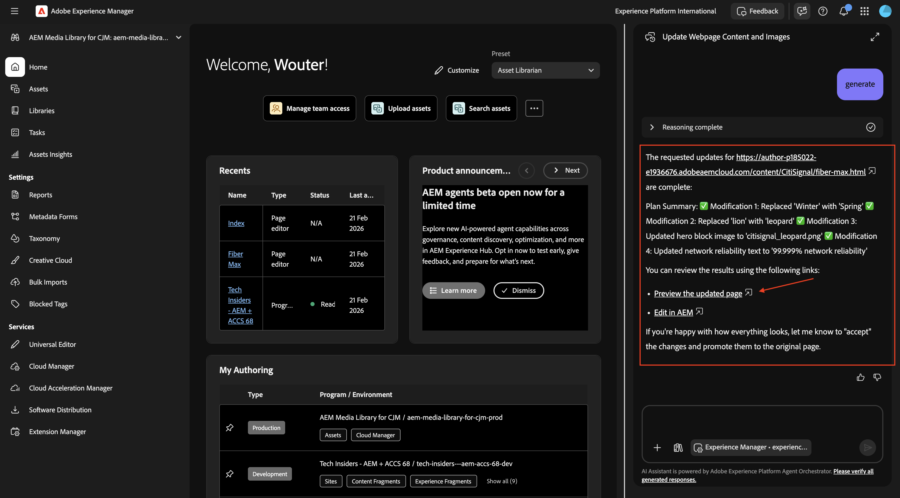

现在，您会获得已完成更改的直观确认。 此预览页面仅供参考，您无法从此页面执行操作。


要执行操作，请单击“在AEM中编辑”****。


在通用编辑器中，您现在可以看到所有更改的详细信息，并能够更改任何内容。 查看页面后，单击&#x200B;**发布**。


再次单击&#x200B;**发布**。 您所做的更改尚未发布到生产环境。 相反，它发布在AEM中的&#x200B;**启动项**&#x200B;下。

通过启动项，您可以高效地为未来版本开发内容。 创建启动项是为了允许您在维护当前页面的同时进行更改，为未来发布做准备。 这意味着您要同时有效编辑两个版本：当前已发布的页面，以及将来要同时发布的这些页面的一个版本。 到达该时间后，您可以替换原始页面并发布新版本。


要&#x200B;**提升**&#x200B;您对未来版本的待处理更改，请返回AEM。 单击页面顶部的&#x200B;**Adobe Experience Manager**，单击&#x200B;**锤子**&#x200B;图标，然后选择&#x200B;**启动项**。


您现在应该会看到一个挂起的&#x200B;**启动项**。 选中挂起&#x200B;**启动**&#x200B;前的复选框。


单击&#x200B;**提升**。


选择&#x200B;**提升整个启动项**，然后单击&#x200B;**下一步**。


单击&#x200B;**提升**。


您现在应该看到此内容。 您的更改现在正在生产中。


刷新页面，您现在应该会在已发布的页面上看到所有更改。


或者，您也可以在AI助手中输入提示`accept`，而不是执行手动升级过程。


然后，您应会收到确认以确认已发布更改。


### 内容更新 — 表单创建

在使用Edge Delivery Services的[Adobe Experience Manager Forms](./../../asset-mgmt/module1.3/aemforms.md){target="_blank"}模块中，您可以找到手动创建表单所涉及的步骤。

表单创建技能现在使用户能够通过自然语言提示构建自适应表单，而无需依赖开发或IT团队。 此功能可加快表单开发，同时保持品牌一致性，并允许业务用户在不具备深入的技术产品知识的情况下创建表单。

转到[https://experience.adobe.com/#/ai-assistant/chat](https://experience.adobe.com/#/ai-assistant/chat)。

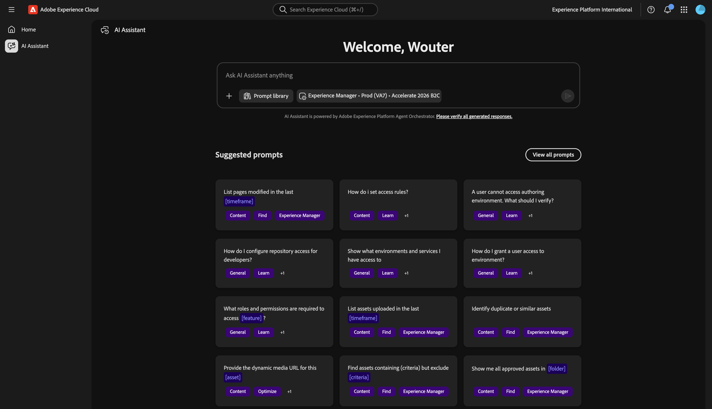

输入以下提示并单击&#x200B;**发送**。

```
Create a new adaptive form using Edge Delivery Services and the existing CitiSignal site, with the following details:
- Form name: "citisignal-fiber-max-interest-2"
- Form fields: 4 text input fields are needed, for "first-name", "last-name", "email" and "city"
- When the form is submitted, send the submission to a spreadsheet, with this URL: https://docs.google.com/spreadsheets/d/1WwKrcM8mZ2d_W3sMheUAw3nFhP_OFk05TsqxhHkudfQ/edit?usp=sharing.
```

## 后续步骤

转到[1.6.2 AEM MCP Server &amp; Cursor](./ex2.md){target="_blank"}

返回[AEM和代理](./aemagents.md){target="_blank"}

[返回所有模块](./../../../overview.md){target="_blank"}
