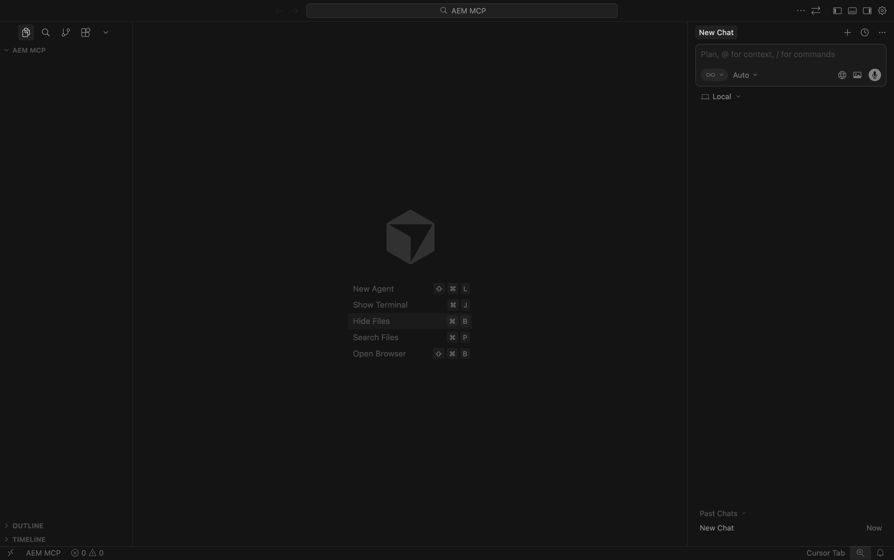
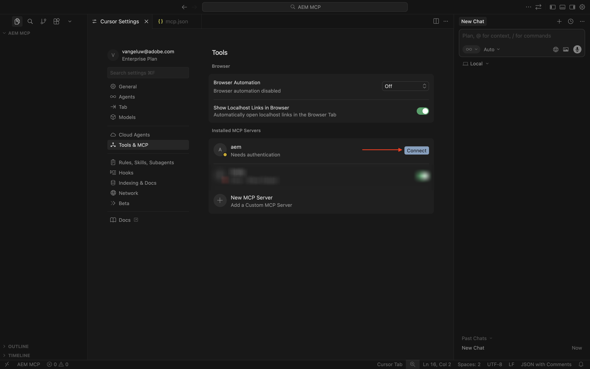
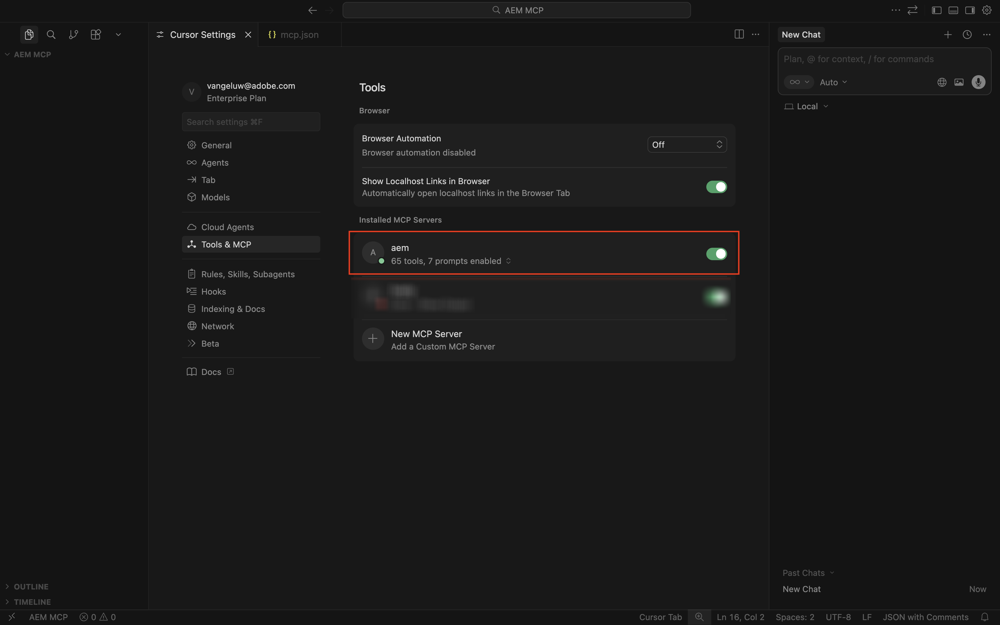
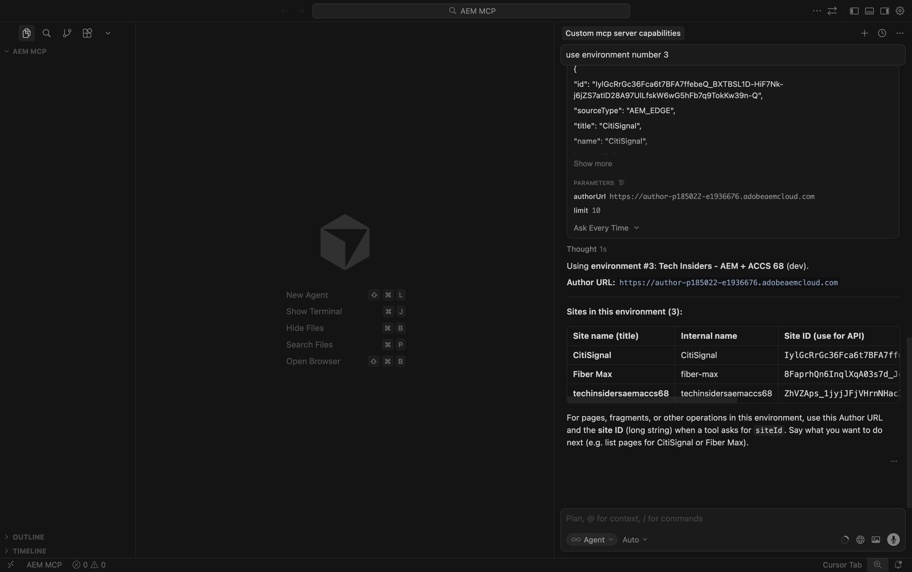
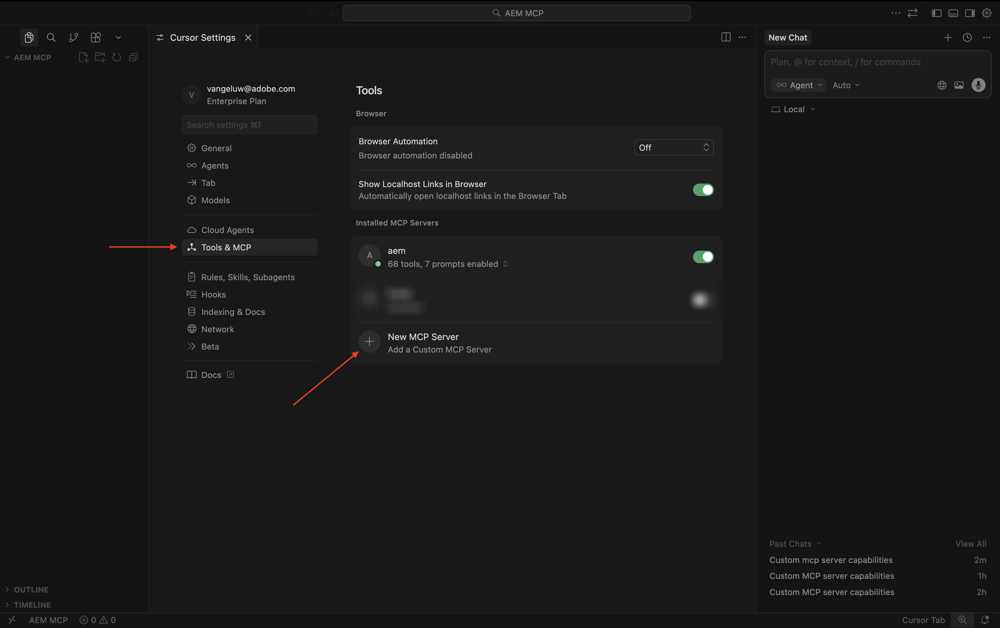

# 1.6.2 AEM MCP服务器和光标

>[!IMPORTANT]
>
>要完成此练习，您需要有权访问有效的AEM Sites和具有EDS环境的Assets CS ，并且需要为您使用的IMS组织启用各种AEM代理。
>
>如果您还没有这样的环境，请转到练习[Adobe Experience Manager Cloud Service和Edge Delivery Services](./../../../modules/asset-mgmt/module2.1/aemcs.md){target="_blank"}。 按照上面的说明进行操作，您将有权访问此类环境。

>[!IMPORTANT]
>
>如果您之前已使用AEM Sites和AEM CS环境配置了Assets CS项目，则可能是您的AEM CS沙盒已休眠。 鉴于解除此类沙盒的休眠需要10-15分钟，最好现在就启动解除休眠过程，这样以后就不必等待它。


以下是所有可用的AEM MCP服务器：

- https://mcp.adobeaemcloud.com/adobe/mcp/content
- https://mcp.adobeaemcloud.com/adobe/mcp/content-readonly （只读内容操作）
- https://mcp.adobeaemcloud.com/adobe/mcp/content-updater （公开Experience Production Agent中的相应技能）
- https://mcp.adobeaemcloud.com/adobe/mcp/experience-governance （显示用于获取和检查页面品牌策略的技能）
- https://mcp.adobeaemcloud.com/adobe/mcp/discovery (显示在AEM环境中发现内容的技能)

在本练习中，您将找到有关如何使用这些特定MCP服务器的说明：

- https://mcp.adobeaemcloud.com/adobe/mcp/content
- https://mcp.adobeaemcloud.com/adobe/mcp/discovery

您可以使用以下说明为其他可用的AEM MCP服务器设置类似的MCP服务器，因为此过程非常相似。

## 1.6.2.1 Experience Production Agent光标MCP服务器安装程序

在您的桌面上新建一个空文件夹。


打开光标。 单击&#x200B;**打开项目**。


选择您之前创建的文件夹，然后单击&#x200B;**打开**。


单击&#x200B;**是，我信任作者**。


您应该会看到此内容。 使用键盘快捷键`Cmd + Shift + J`打开“光标”设置。 您应该会看到此内容。 转到&#x200B;**工具&amp; MCP**。



单击&#x200B;**+新MCP服务器**。


将以下MCP服务器添加到文件&#x200B;**mcp.json**。 可能有其他MCP服务器已在此文件中指定 — 请勿删除这些服务器，而只需添加以下新行。 保存更改。

```json
"aem": {
    "url": "https://mcp.adobeaemcloud.com/adobe/mcp/content"
    }
```


切换回选项卡&#x200B;**光标设置**。 您现在应该会看到MCP服务器列表中添加了一个名为&#x200B;**aem**&#x200B;的工具。 单击&#x200B;**连接**&#x200B;以使用您的Adobe帐户进行身份验证。



单击&#x200B;**打开**，以防您看到此消息。 然后，您应在浏览器中进行身份验证。


在成功进行身份验证后，您应该会看到类似这样的内容。



关闭&#x200B;**Cursor Settings**&#x200B;和&#x200B;**mcp.json**&#x200B;选项卡。 将以下提示粘贴到聊天中，然后单击&#x200B;**发送**。

```
I just created a new custom mcp server named 'aem'. what can I do with that?
```


单击&#x200B;**运行**。


此时，您应该会看到类似的响应。


如您所见，与上一个练习中使用AI Assistant相比，类似的功能通过“光标”中的MCP服务器显示。

输入以下提示并单击&#x200B;**发送**。

```javascript
List AEM Author instances
```


然后您应该会看到类似这样的内容。 搜索要使用的环境，然后输入以下提示并单击&#x200B;**发送**。

```javascript
use environment number X
```


您应该会看到此内容。



粘贴以下提示并单击&#x200B;**发送**。 在此提示符下，用您在上一个练习中复制的URL替换XXX。

```
On the page https://author-p185022-e1936676.adobeaemcloud.com/content/CitiSignal/fiber-max.html, please make the following changes:

- change the word 'winter' to 'summer'
- change the text 'be as fast as a leopard' to 'dominate your internet like a gorilla'
- change the image in the hero block to use the image 'citisignal_gorilla.png'
- change the text '99.9% network reliability' to '99.998% network reliability'
```


1-2分钟后，您应会收到类似的响应。 复制URL并在浏览器中打开页面。


您应该会看到此内容。


输入以下提示并单击&#x200B;**发送**。

```javascript
promote the changes by creating a new launch and promoting it
```


1-2分钟后，更改已提升。


您现在可以在您的网站上实时查看更改。


欢迎您探索AEM MCP服务器的其他功能。

## 1.6.2.2发现代理光标MCP服务器安装程序

使用键盘快捷键`Cmd + Shift + J`打开“光标”设置。 您应该会看到此内容。 转到&#x200B;**工具&amp; MCP**。 单击&#x200B;**+新MCP服务器**。



将以下MCP服务器添加到文件&#x200B;**mcp.json**。 可能有其他MCP服务器已在此文件中指定 — 请勿删除这些服务器，而只需添加以下新行。 保存更改。

```
,
"aem-discovery": {
    "url": "https://mcp.adobeaemcloud.com/adobe/mcp/discovery"
}
```


切换回选项卡&#x200B;**光标设置**。 您现在应该会看到MCP服务器列表中添加了一个名为&#x200B;**aem**&#x200B;的工具。 单击&#x200B;**连接**&#x200B;以使用您的Adobe帐户进行身份验证。


进行验证后，您应该会看到此内容。


关闭&#x200B;**Cursor Settings**&#x200B;和&#x200B;**mcp.json**&#x200B;选项卡。 将以下提示粘贴到聊天中，然后单击&#x200B;**发送**。

```
I just created a new custom mcp server named 'aem-discovery'. what can I do with that?
```


```
for the environment https://author-pXXXXXX-eXXXXXXX.adobeaemcloud.com/, list all assets tagged with 'Spring 2026'
```


然后您应该会看到类似这样的内容。


## 后续步骤

返回[AEM和代理](./aemagents.md){target="_blank"}

[返回所有模块](./../../../overview.md){target="_blank"}
