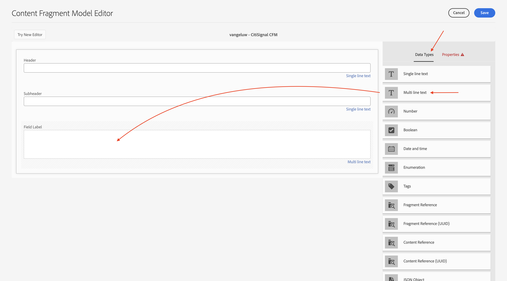
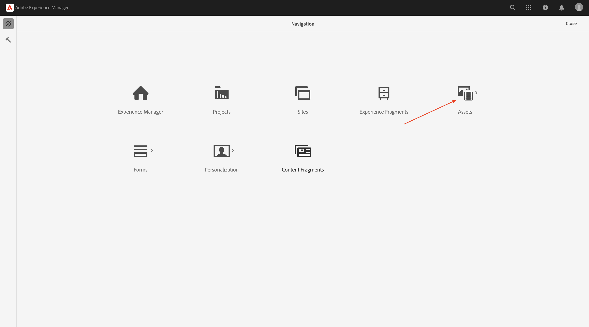
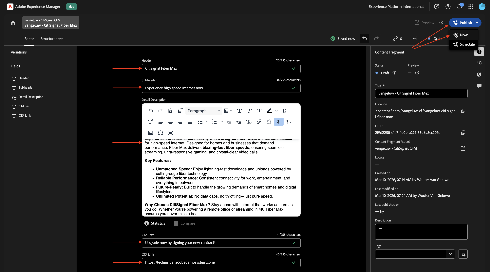
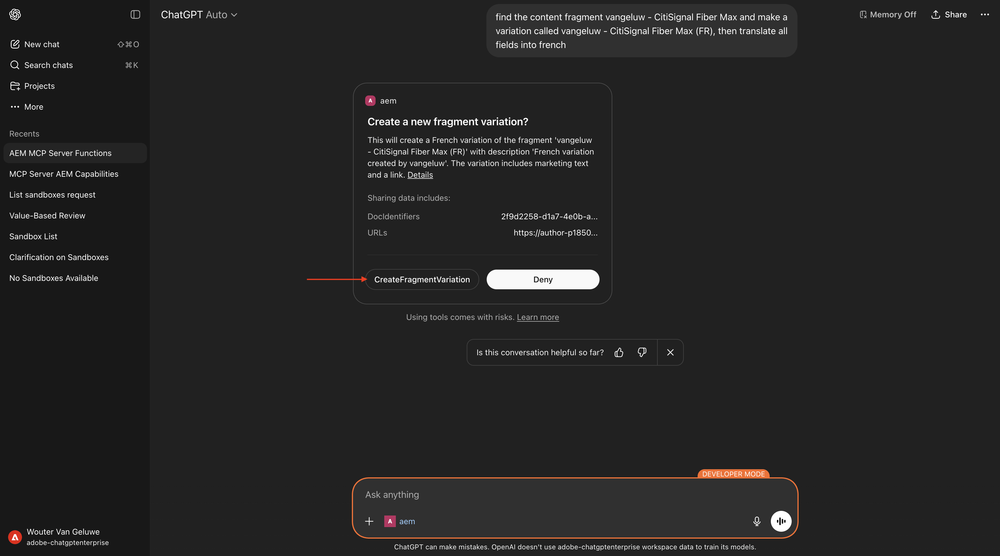
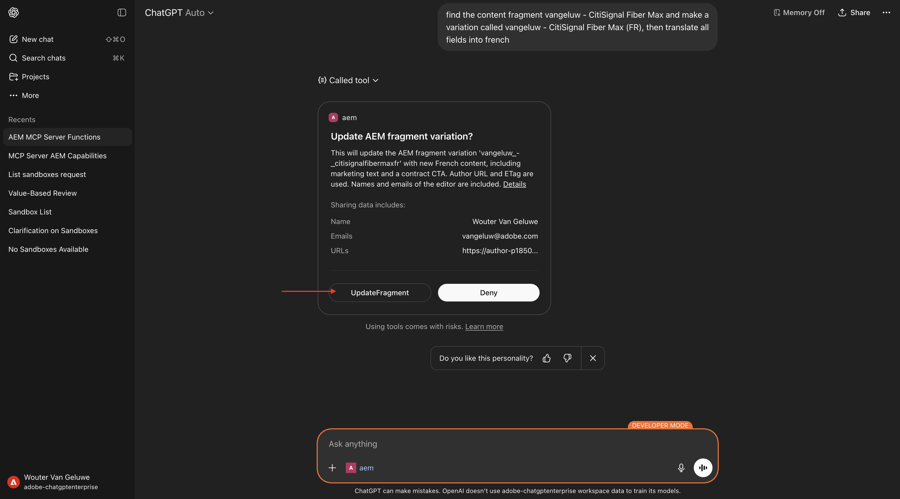
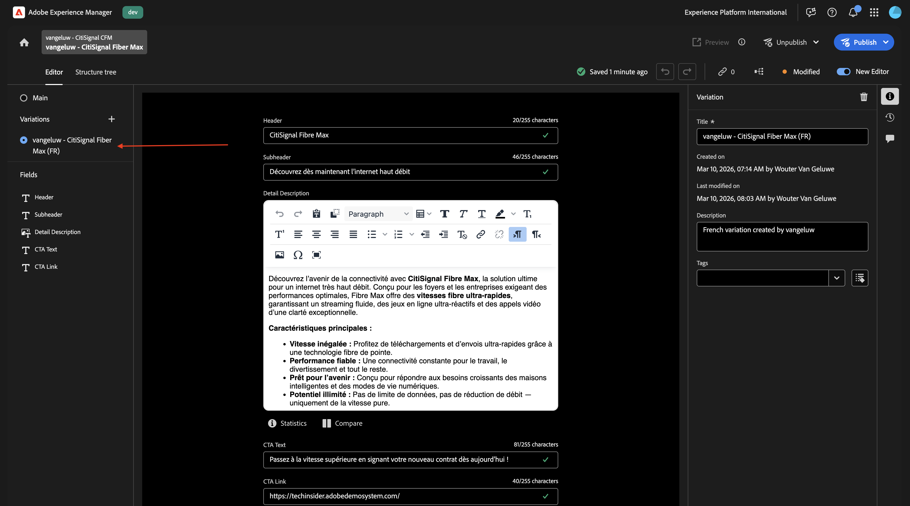

# 1.6.3使用ChatGPT和MCP服务器扩展内容片段

>[!IMPORTANT]
>
>要完成此练习，您需要有权访问有效的AEM Sites和具有EDS环境的Assets CS ，并且需要为您使用的IMS组织启用各种AEM代理。
>
>如果您还没有这样的环境，请转到练习[Adobe Experience Manager Cloud Service和Edge Delivery Services](./../../../modules/asset-mgmt/module2.1/aemcs.md){target="_blank"}。 按照上面的说明进行操作，您将有权访问此类环境。

>[!IMPORTANT]
>
>如果您之前已使用AEM Sites和AEM CS环境配置了Assets CS项目，则可能是您的AEM CS沙盒已休眠。 鉴于解除此类沙盒的休眠需要10-15分钟，最好现在就启动解除休眠过程，这样以后就不必等待它。

## 1.6.3.1创建内容片段模型

返回您的Adobe Experience Manager创作环境，转到&#x200B;**工具**，然后转到&#x200B;**配置浏览器**。


单击&#x200B;**创建**。


对`Content Fragments`标题&#x200B;**和**&#x200B;名称&#x200B;**字段使用**。

确保同时启用了&#x200B;**内容片段模型**&#x200B;和&#x200B;**GraphQL持久查询**&#x200B;选项。

单击&#x200B;**创建**。


返回到Adobe Experience Manager创作环境，然后转到&#x200B;**内容片段**。


转到&#x200B;**内容片段模型**，选择您的配置&#x200B;**内容片段**，然后单击&#x200B;**创建**。


使用名称`--aepUserLdap-- - CitiSignal CFM`。 单击&#x200B;**创建并打开**。


您应该会看到此内容。 将&#x200B;**单行文本**&#x200B;字段拖放到画布上。


将字段&#x200B;**字段标签**&#x200B;更改为`Header`。


返回&#x200B;**数据类型**。 将&#x200B;**单行文本**&#x200B;字段拖放到画布上。


将字段&#x200B;**字段标签**&#x200B;更改为`Subheader`。


返回&#x200B;**数据类型**。 将&#x200B;**多行文本**&#x200B;字段拖放到画布上。



将字段&#x200B;**字段标签**&#x200B;更改为`Detail Description`。


返回&#x200B;**数据类型**。 将&#x200B;**单行文本**&#x200B;字段拖放到画布上。


将字段&#x200B;**字段标签**&#x200B;更改为`CTA Text`。


返回&#x200B;**数据类型**。 将&#x200B;**单行文本**&#x200B;字段拖放到画布上。


将字段&#x200B;**字段标签**&#x200B;更改为`CTA Link`。 单击&#x200B;**保存**。


您应该会看到此内容。


选择您的内容片段模型并单击&#x200B;**发布**。


单击&#x200B;**发布**。


## 1.6.3.2创建内容片段

返回到Adobe Experience Manager创作环境，然后转到&#x200B;**内容片段**。


您应该会看到此内容。 单击&#x200B;**创建**，然后选择&#x200B;**文件夹**。


输入标题： `--aepUserLdap-- - CF`。 单击&#x200B;**创建**。


返回您的Adobe Experience Manager创作环境，然后转到&#x200B;**Assets**。



转到&#x200B;**文件**。


选择您刚刚创建的文件夹（应命名为`--aepUserLdap-- - CF`），然后单击&#x200B;**属性**。


转到&#x200B;**云服务**，然后单击&#x200B;**文件夹**&#x200B;图标。


选择您之前创建的云配置，该配置应命名为&#x200B;**内容片段**。 单击&#x200B;**选择**。


您应该看到此内容。 单击&#x200B;**“保存并关闭”。**


返回到Adobe Experience Manager创作环境，然后转到&#x200B;**内容片段**。


您应该会看到此内容。 单击&#x200B;**创建**，然后选择&#x200B;**内容片段**。


选择您之前创建的&#x200B;**内容片段模型**，它应该命名为`--aepUserLdap-- - CitiSignal CFM`。 使用名称`--aepUserLdap-- CitiSignal Fiber Max`。

单击&#x200B;**创建并打开**。


您应该会看到此内容。


填写以下字段：

- **标头**： `CitiSignal Fiber Max`
- **子标头**： `Experience high speed internet now`
- **详细信息描述**：

```
Experience the future of connectivity with CitiSignal Fiber Max, the ultimate solution for high-speed internet. Designed for homes and businesses that demand performance, Fiber Max delivers blazing-fast fiber speeds, ensuring seamless streaming, ultra-responsive gaming, and crystal-clear video calls.

Key Features:

Unmatched Speed: Enjoy lightning-fast downloads and uploads powered by cutting-edge fiber technology.
Reliable Performance: Consistent connectivity for work, entertainment, and everything in between.
Future-Ready: Built to handle the growing demands of smart homes and digital lifestyles.
Unlimited Potential: No data caps, no throttling—just pure speed.
Why Choose CitiSignal Fiber Max? Stay ahead with internet that works as hard as you do. Whether you’re powering a remote office or streaming in 4K, Fiber Max ensures you never miss a beat.
```

**CTA文本**： `Upgrade now by signing your new contract!`
**CTA链接**： `https://techinsiders68.adobedemosystem.com/`

单击&#x200B;**发布**，然后选择&#x200B;**立即**。



单击&#x200B;**发布**。


## 1.6.3.3在ChatGPT中配置MCP服务器

>[!NOTE]
>
>在ChatGPT中使用Adobe Marketing Agent需要满足以下条件：
>- OpenAI的ChatGPT Enterprise的付费版本
>- 使用ChatGPT Enterprise Web客户端

转到[https://chatgpt.com/](https://chatgpt.com/){target="_blank"}并使用您的帐户详细信息登录。 登录后，您应该会看到此内容。 单击您的用户名，然后选择&#x200B;**设置**。


转到&#x200B;**应用**，然后选择&#x200B;**高级设置**。


打开&#x200B;**开发人员模式**，然后单击&#x200B;**上一步**。


单击&#x200B;**创建应用程序**。


填写以下字段：

- **名称**： `aem`
- **MCP服务器URL**： `https://mcp.adobeaemcloud.com/adobe/mcp/content`
- **身份验证**： `OAuth`

选中&#x200B;**我了解并希望继续**&#x200B;的复选框。

单击&#x200B;**创建**。


ChatGPT现在将尝试连接到您的Adobe帐户。 选择&#x200B;**允许访问**，然后您必须使用您的Adobe帐户登录。

成功登录后，您应该会看到Adobe Marketing Agent现在已成功连接。


## 1.6.3.4在ChatGPT中使用AEM MCP服务器

关闭此窗口。


您应该会看到此内容。 单击&#x200B;**+**&#x200B;图标，转到&#x200B;**更多**，然后选择&#x200B;**aem**。


输入以下提示并单击&#x200B;**发送**。

```
I just created a new custom mcp server named 'aem'. what can I do with that?
```


然后您应该会看到类似这样的内容。 输入以下提示并单击&#x200B;**发送**。

```
use the author url https://author-pXXXXXX-eXXXXXXX.adobeaemcloud.com/ from now on
```


然后您应该会看到类似这样的内容。 输入以下提示并单击&#x200B;**发送**。

```
find the content fragment --aepUserLdap-- - CitiSignal Fiber Max and make a variation called --aepUserLdap-- - CitiSignal Fiber Max (FR), then translate all fields into french
```


单击&#x200B;**CreateFragmentVariation**。



单击&#x200B;**UpdateFragment**。



您应该会看到此内容。 已成功创建您的片段变量。


您现在还可以在AEM UI中看到新变量。



## 后续步骤

返回[AEM和代理](./aemagents.md){target="_blank"}

[返回所有模块](./../../../overview.md){target="_blank"}