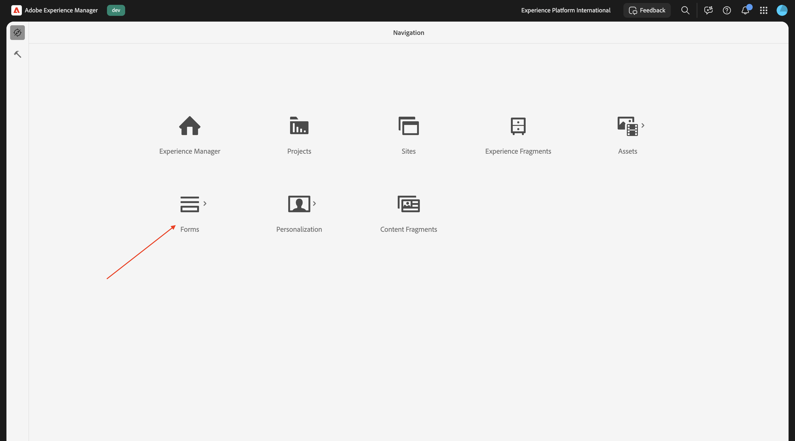
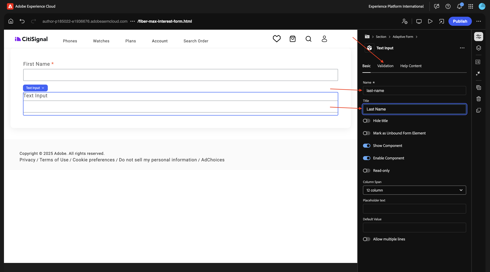
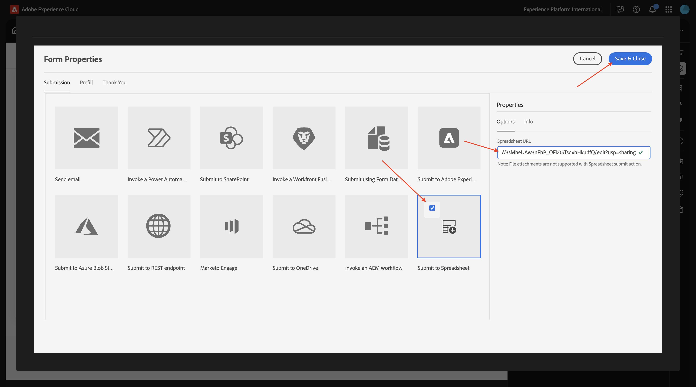

# 1.3.1创建您的第一个表单

>[!IMPORTANT]
>
>要完成本练习，您需要有权访问启用了AEM Assets Dynamic Media的有效AEM Assets CS创作环境。
>
>如果没有此类环境，请转到[Adobe Experience Manager Cloud Service和Edge Delivery Services](./../../../modules/asset-mgmt/module2.1/aemcs.md){target="_blank"}。 按照上面的说明进行操作，您将有权访问此类环境。

>[!IMPORTANT]
>
>如果您之前已使用AEM CS环境配置了AEM Assets CS项目，则可能是您的AEM CS沙盒已休眠。 鉴于解除此类沙盒的休眠需要10-15分钟，最好现在就启动解除休眠过程，这样以后就不必等待它。

## 将AEM Forms与Edge Delivery Services结合使用的1.3.1.1环境要求

在配置第一个表单之前，需要满足许多要求，然后才能执行以下步骤。

### 项目设置

在Cloud Manager计划的&#x200B;**解决方案和加载项**&#x200B;中，**Forms**&#x200B;需要启用。


### 个块

在Github存储库中，您需要具有以下可用块：

- **表单**
- **embed-adaptive-form**


### 脚本

在Github存储库中，您需要提供以下脚本：

- **form-editor-support.css**
- **form-editor-support.js**


此外，在&#x200B;**editor-support.js**&#x200B;文件中，需要进行以下更改才能在通用编辑器中启用编辑表单。

- 将函数声明从&#x200B;**function attachEventListners(main)**&#x200B;更改为&#x200B;**async function attachEventListners(main)**
- 添加第152行和第153行：

```
const module = await import('./form-editor-support.js');
module.attachEventListners(main);
```


此外，在文件&#x200B;**editor-support.js**&#x200B;中，将行更改为90-92，如下所示：

```
if (block.dataset.aueModel === 'form') {
        return true;
      } else if (newBlock) {
```


### paths.json

请验证Github存储库配置，尤其是文件&#x200B;**paths.json**。 以下行需要出现在文件中：

- 在映射下： **&quot;/content/forms/af/：/forms/&quot;**
- 在includes下：**&quot;/content/forms/af/&quot;**

```json
{
  "mappings": [
    "/content/CitiSignal/:/",
    "/content/CitiSignal/configuration:/.helix/config.json",
    "/content/CitiSignal/headers:/.helix/headers.json",
    "/content/CitiSignal/metadata:/metadata.json",
    "/content/CitiSignal.resource/enrichment/enrichment.json:/enrichment/enrichment.json",
    "/content/forms/af/:/forms/"
  ],
  "includes": [
    "/content/CitiSignal/",
    "/content/forms/af/"
  ]
}
```


设置好这些要求后，即可创建第一个表单。

## 1.3.1.2创建表单

转到[https://my.cloudmanager.adobe.com](https://my.cloudmanager.adobe.com){target="_blank"}。 您应选择的组织是`--aepImsOrgName--`。 打开您的环境。


转到&#x200B;**Forms**。



转到&#x200B;**Forms和文档**。


单击&#x200B;**创建**，然后选择&#x200B;**自适应表单**。


选择&#x200B;**Edge Delivery Services**，然后选择&#x200B;**空白页面**。 单击&#x200B;**创建**。


您应该会看到此内容。 填写以下字段：

- **标题**： `Fiber Max Interest Form`
- **名称**：应基于字段&#x200B;**标题**&#x200B;自动填充。
- **Github URL**：提供链接到您网站的Github存储库的路径

单击&#x200B;**创建**。


单击&#x200B;**创建**&#x200B;后，**Universal Editor**&#x200B;应会自动打开，您应该会看到类似这样的内容。 单击图标以打开&#x200B;**内容树**。


在&#x200B;**内容树**&#x200B;中选择对象&#x200B;**自适应表单**。


然后，单击&#x200B;**+**&#x200B;图标以添加新元素，并选择&#x200B;**文本输入**。


在&#x200B;**内容树**&#x200B;中，选择字段&#x200B;**文本输入**。


转到&#x200B;**基本**&#x200B;视图。 你应该看看这个。

填写以下字段：

- **名称**： `first-name`
- **标题**： `First Name`

然后，转到&#x200B;**验证**。


翻转开关以使其成为必填字段。 填写以下字段：

- **错误消息**： `Enter your first name`
- **模式**： `[A-Za-z][A-Za-z ]+`
- **模式错误消息**： `Letters only!`


在&#x200B;**内容树**&#x200B;中，选择字段&#x200B;**自适应表单**。 单击&#x200B;**+**&#x200B;图标，然后选择&#x200B;**文本输入**。


在&#x200B;**内容树**&#x200B;中，选择新创建的字段&#x200B;**文本输入**。 转到&#x200B;**属性**。


转到&#x200B;**基本**&#x200B;视图。 你应该看看这个。

填写以下字段：

- **名称**： `last-name`
- **标题**： `Last Name`

然后，转到&#x200B;**验证**。



翻转开关以使其成为必填字段。 填写以下字段：

- **错误消息**： `Enter your last name`
- **模式**： `[A-Za-z][A-Za-z ]+`
- **模式错误消息**： `Letters only!`


在&#x200B;**内容树**&#x200B;中，选择字段&#x200B;**自适应表单**。 单击&#x200B;**+**&#x200B;图标，然后选择&#x200B;**文本输入**。


在&#x200B;**内容树**&#x200B;中，选择新创建的字段&#x200B;**文本输入**。 转到&#x200B;**属性**。


转到&#x200B;**基本**&#x200B;视图。 你应该看看这个。

填写以下字段：

- **名称**： `email`
- **标题**： `Email`

然后，转到&#x200B;**验证**。


翻转开关以使其成为必填字段。 填写以下字段：

- **错误消息**： `Enter your email address`
- **模式**： `^[^@]+@[^@]+\.[^@]+$`
- **模式错误消息**： `Please verify your email address!`


在&#x200B;**内容树**&#x200B;中，选择字段&#x200B;**自适应表单**。 单击&#x200B;**+**&#x200B;图标，然后选择&#x200B;**文本输入**。


在&#x200B;**内容树**&#x200B;中，选择新创建的字段&#x200B;**文本输入**。


转到&#x200B;**基本**&#x200B;视图。 你应该看看这个。

填写以下字段：

- **名称**： `city`
- **标题**： `city`

然后，转到&#x200B;**验证**。


翻转开关以使其成为必填字段。 填写以下字段：

- **错误消息**： `Enter your city`
- **模式**： `[A-Za-z][A-Za-z ]+`
- **模式错误消息**： `Letters only!`


单击&#x200B;**发布**。


再次单击&#x200B;**发布**。


单击以打开您的表单。


然后，您可以填写表单，但您尚无法提交表单。


发布表单后，该表单现在也可在您的Edge Delivery Services域中使用，如下所示：

`https://main--techinsidersXX-citisignal-aem-accs--woutervangeluwe.aem.page/forms/fiber-max-interest-form`


## 1.3.1.3提交表单

若要提交表单，需要满足以下条件：

- **提交**&#x200B;按钮
- **提交**&#x200B;操作

此外，在本练习中，您应该使用Google电子表格来记录此表单的提交情况。

### Google电子表格

转到[https://drive.google.com](https://drive.google.com)并创建新的空白电子表格。


命名您的文件`citisignal-fiber-max-interest`。

在第1行中，在单元格A-B-C-D中输入以下字段名称：

- 名字
- 姓氏
- 电子邮件
- 城市

然后，单击&#x200B;**共享**。


使用&#x200B;**forms@adobe.com**&#x200B;和&#x200B;**编辑者**&#x200B;级访问权限共享文件。

然后，单击&#x200B;**复制链接**。

单击&#x200B;**发送**。


在下一步中，您将需要使用复制的链接。

### “提交”按钮

要配置&#x200B;**提交**&#x200B;按钮，请转到&#x200B;**内容树**，选择&#x200B;**自适应表单**，单击&#x200B;**+**&#x200B;图标，然后选择&#x200B;**提交**。


您应该会看到此内容。


### 提交操作

提交操作是通用编辑器扩展的一部分。

>[!NOTE]
>
>如果您没有看到&#x200B;**编辑表单属性**&#x200B;图标，则表示尚未为您的环境启用此扩展。 要启用此扩展，请转到[https://experience.adobe.com/#/aem/extension-manager](https://experience.adobe.com/#/aem/extension-manager)并启用&#x200B;**编辑表单属性**&#x200B;扩展。
>
>

单击&#x200B;**编辑表单属性**&#x200B;图标。


选择&#x200B;**提交到电子表格**。 粘贴您之前创建的Google工作表的URL。

单击&#x200B;**“保存并关闭”。**



>[!NOTE]
>
>如果您收到错误401 — 未授权，则可能是未授权。 因为您的环境尚未启用以使用Google工作表。 请联系您的Adobe代表以启用环境。

单击&#x200B;**发布**。


再次单击&#x200B;**发布**。


然后，您可以刷新网站，填写表单并单击&#x200B;**提交**。


然后，您的提交应该会成功。


如果您随后查看了Google表，则也应当会看到该处提交的成功报表。


您现在已成功完成此练习。

## 后续步骤

返回至[Adobe Experience Manager Forms和Edge Delivery Services](./aemforms.md){target="_blank"}

[返回所有模块](./../../../overview.md){target="_blank"}
