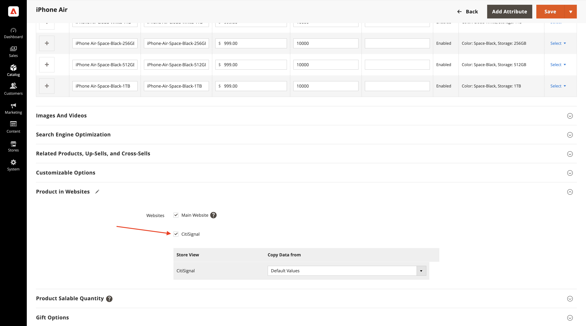

# 1.5.1 Adobe Commerce as a Cloud Service快速入门

转到[https://experience.adobe.com/](https://experience.adobe.com/){target="_blank"}。 确保您处于正确的环境，该环境应名为`--aepImsOrgName--`。 单击&#x200B;**Commerce**。

## 1.5.1.1创建您的ACCS实例

您应该会看到此内容。 单击&#x200B;**+添加实例**。

填写以下字段：

- **实例名称**： `--aepUserLdap-- - ACCS`
- **环境**： `Sandbox`
- **地区**： `North America`

单击&#x200B;**添加实例**。

您即将创建的实例。 这可能需要5-10分钟。

实例准备就绪后，单击您的实例以将其打开。

## 1.5.1.2设置您的CitiSignal商店

您应该会看到此内容。 单击&#x200B;**使用Adobe ID登录**，然后登录。

登录后，您应该会看到此主页。 第一步是在Commerce建立CitiSignal商店。 单击&#x200B;**商店**。

单击&#x200B;**所有商店**。

单击&#x200B;**创建网站**。

填写以下字段：

- **名称**： `CitiSignal`
- **代码**： `citisignal`

单击&#x200B;**保存网站**。

那你就该回到这里来。 单击&#x200B;**创建存储**。

填写以下字段：

- **网站**： `CitiSignal`
- **名称**： `CitiSignal`
- **代码**： `citisignal`
- **根类别**： `Default Category`

单击&#x200B;**保存存储**。

那你就该回到这里来。 单击&#x200B;**创建商店视图**。

填写以下字段：

- **存储**： `CitiSignal`
- **名称**： `CitiSignal`
- **代码**： `citisignal`
- **状态**： `Enabled`

单击&#x200B;**保存商店视图**。

然后，您应该会看到此消息。 单击&#x200B;**确定**。

那你就该回到这里来。 单击&#x200B;**CitiSignal**&#x200B;网站以将其打开。

选中此复选框可将此网站设置为默认网站。

单击&#x200B;**保存网站**。

那你就该回到这里来。

## 1.5.1.3配置类别和产品

转到&#x200B;**目录**，然后选择&#x200B;**类别**。

选择&#x200B;**默认类别**，然后单击&#x200B;**添加子类别**。

输入名称`Phones`，然后单击&#x200B;**保存**。

选择&#x200B;**默认类别**，然后再次单击&#x200B;**添加子类别**。

输入名称`Watches`，然后单击&#x200B;**保存**。

然后，您应该创建2个类别。

接下来，转到&#x200B;**目录**，然后选择&#x200B;**产品**。

您应该会看到此内容。 单击&#x200B;**添加产品**。

配置您的产品，如下所示：

- **产品名称**： `iPhone Air`
- **SKU**： `iPhone-Air`
- **价格**： `999`
- **数量**： `10000`
- **类别**：选择`Phones`

单击&#x200B;**保存**。

向下滚动到&#x200B;**配置**&#x200B;并单击&#x200B;**创建配置**。

您应该会看到此内容。 单击&#x200B;**新建属性**。

将&#x200B;**默认标签**&#x200B;设置为`Storage`，然后单击&#x200B;**管理选项**&#x200B;下的&#x200B;**添加选项**。

在所有3列中使用名称`256GB`配置第一个选项，然后再次单击&#x200B;**添加选项**。

在所有3列中使用名称`512GB`配置第二个选项，然后再次单击&#x200B;**添加选项**。

在所有3列中使用名称`1TB`配置第三个选项。

向下滚动到&#x200B;**店面属性**。 将以下选项设置为&#x200B;**是**：

- **在搜索中使用**
- **允许Storefront上的HTML标签**
- **在店面的目录页面上可见**
- **在产品列表中使用**

向上滚动并单击&#x200B;**保存属性**。

您应该会看到此内容。 选择&#x200B;**颜色**&#x200B;和&#x200B;**存储**&#x200B;的两个属性，然后单击&#x200B;**下一步**。

您应该会看到此内容。 您现在需要添加可用的颜色选项。 为此，请单击&#x200B;**创建新值**。

输入值`Sky-Blue`并单击&#x200B;**创建新值**。

输入值`Light-Gold`并单击&#x200B;**创建新值**。

输入值`Cloud-White`并单击&#x200B;**创建新值**。

输入值`Space-Black`。 单击&#x200B;**全选**

选择&#x200B;**存储**&#x200B;下的全部3个选项，然后单击&#x200B;**下一步**。

保留默认设置，然后单击&#x200B;**下一步**。

您应该会看到此内容。 单击&#x200B;**生成产品**。

将每个产品的&#x200B;**数量**&#x200B;设置为`10000`。 单击&#x200B;**保存**。

向下滚动到Websites **中的**&#x200B;产品，并选中&#x200B;**CitiSignal**&#x200B;的复选框。

单击&#x200B;**保存**。

单击&#x200B;**确认**。

您应该会看到此内容。 单击&#x200B;**上一步**。

您现在可以在产品目录中看到产品&#x200B;**iPhone Air**&#x200B;及其变体。

下一步：[将ACCS连接到AEM Sites CS/EDS店面](./ex2.md){target="_blank"}

返回[Adobe Commerce as a Cloud Service](./accs.md){target="_blank"}

[返回所有模块](./../../../overview.md){target="_blank"}
