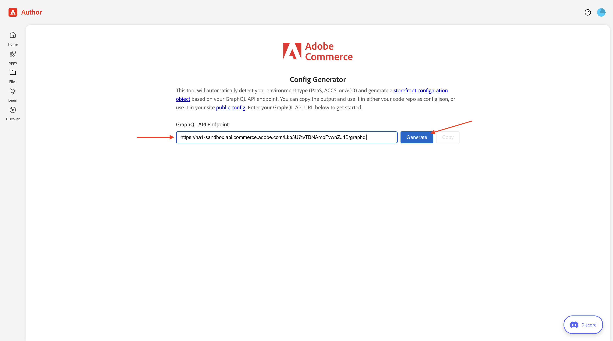
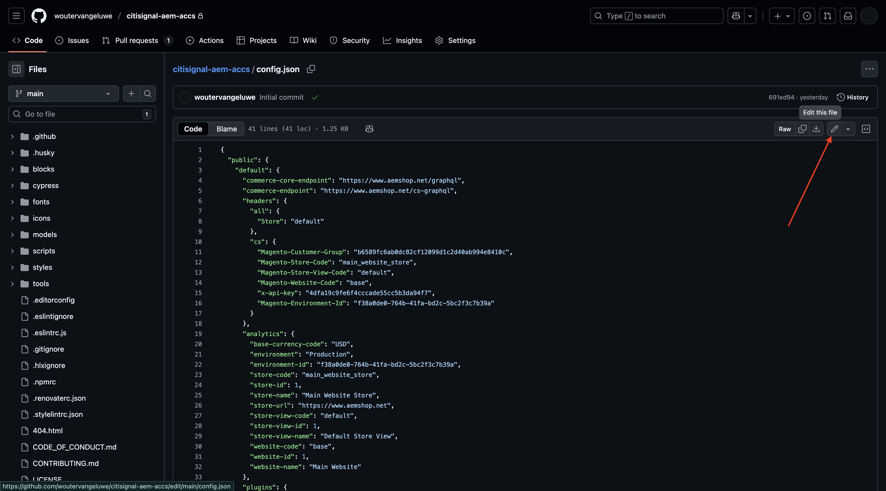
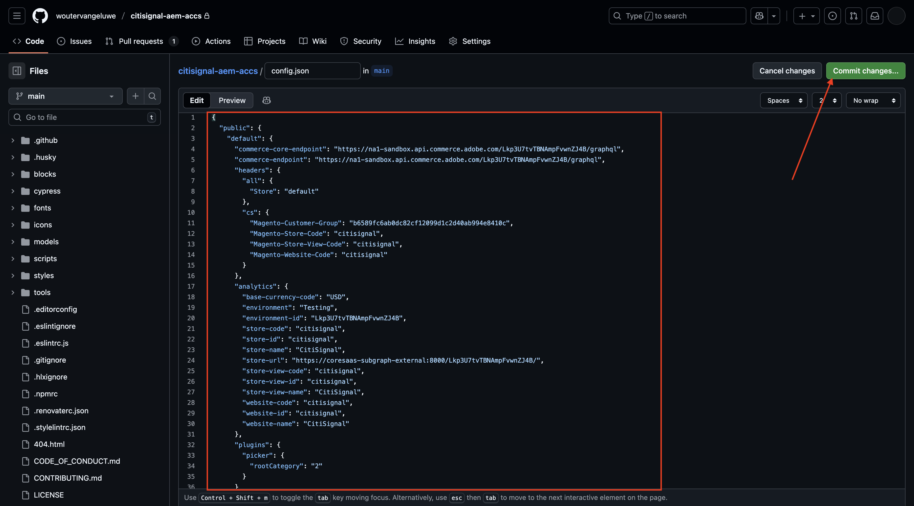

# 1.5.2将ACCS连接到AEM Sites CS/EDS Storefront

>[!IMPORTANT]
>
>要完成此练习，您需要有权访问有效的AEM Sites和具有EDS环境的Assets CS 。
>
>如果您还没有这样的环境，请转到练习[Adobe Experience Manager Cloud Service和Edge Delivery Services](./../../../modules/asset-mgmt/module2.1/aemcs.md){target="_blank"}。 按照上面的说明进行操作，您将有权访问此类环境。

>[!IMPORTANT]
>
>如果您之前已使用AEM Sites和AEM CS环境配置了Assets CS项目，则可能是您的AEM CS沙盒已休眠。 鉴于解除此类沙盒的休眠需要10-15分钟，最好现在就启动解除休眠过程，这样以后就不必等待它。

在本练习中，您会将AEM Sites CS/EDS店面链接到ACCS后端。 目前，当您打开AEM Sites CS/EDS店面并转到&#x200B;**手机**&#x200B;产品列表页面时，您尚未看到任何产品。

在本练习结束时，您应该会看到AEM Sites CS/EDS店面的&#x200B;**电话**&#x200B;产品列表页面上显示了您在上一个练习中配置的产品。

转到[https://experience.adobe.com/](https://experience.adobe.com/){target="_blank"}。 确保您处于正确的环境，该环境应名为`--aepImsOrgName--`。 单击&#x200B;**Commerce**。

单击ACCS实例旁边的&#x200B;**信息**&#x200B;图标，该实例应命名为`--aepUserLdap-- - ACCS`。

您应该会看到此内容。 复制&#x200B;**GraphQL终结点**。

转到[https://da.live/app/adobe-commerce/storefront-tools/tools/config-generator/config-generator](https://da.live/app/adobe-commerce/storefront-tools/tools/config-generator/config-generator)。 您现在需要生成一个config.json文件，该文件用于将您的AEM Sites CS店面链接到ACCS后端。

在&#x200B;**配置生成器**&#x200B;页面上，粘贴您复制的&#x200B;**GraphQL端点** URL。

单击&#x200B;**生成**。

复制完整生成的JSON有效负载。

转到在设置AEM Sites CS/EDS环境时创建的GitHub存储库。 该存储库是在[1.1.2设置您的AEM CS环境](./../../../modules/asset-mgmt/module2.1/ex3.md){target="_blank"}练习中创建的，应命名为&#x200B;**citisignal-aem-accs**。

在根目录中，向下滚动并单击以打开文件&#x200B;**config.json**。

单击&#x200B;**编辑**&#x200B;图标。

请删除当前所有文本，并通过粘贴您在&#x200B;**配置生成器**&#x200B;页面上复制的JSON有效负载来替换这些文本。

单击&#x200B;**提交更改……**。

单击&#x200B;**提交更改**。

**config.json**&#x200B;文件现已更新。 您应会在几分钟内在网站上看到所做的更改。 验证是否成功提取更改的方法是转到&#x200B;**手机**&#x200B;产品页面。 您现在应该会看到页面上出现&#x200B;**iPhone Air**。

要访问您的网站，您需要转到`main--citisignal-aem-accs--XXX.aem.page`和/或`main--citisignal-aem-accs--XXX.aem.live`，然后使用您的GitHub用户帐户替换XXX，本例中为`woutervangeluwe`。

在此示例中，完整URL将变为：
`https://main--citisignal-aem-accs--woutervangeluwe.aem.page`和/或`https://main--citisignal-aem-accs--woutervangeluwe.aem.live`。

虽然产品现在已成功显示，但还没有可用于产品的图像。 您将在下一个练习中设置与AEM Assets CS的链接，以获取产品图像。

下一步：[将ACCS连接到AEM Assets CS](./ex3.md){target="_blank"}

返回[Adobe Commerce as a Cloud Service](./accs.md){target="_blank"}

[返回所有模块](./../../../overview.md){target="_blank"}
