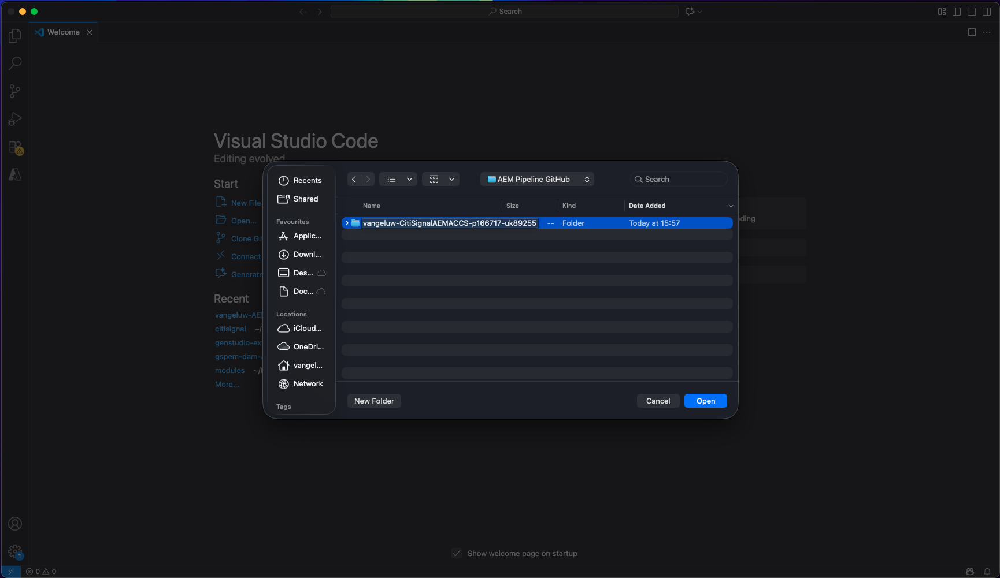
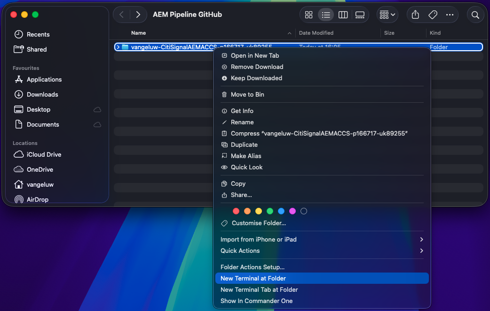
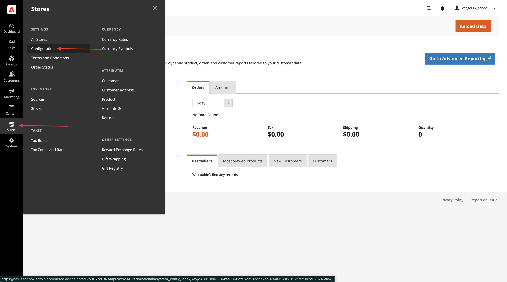
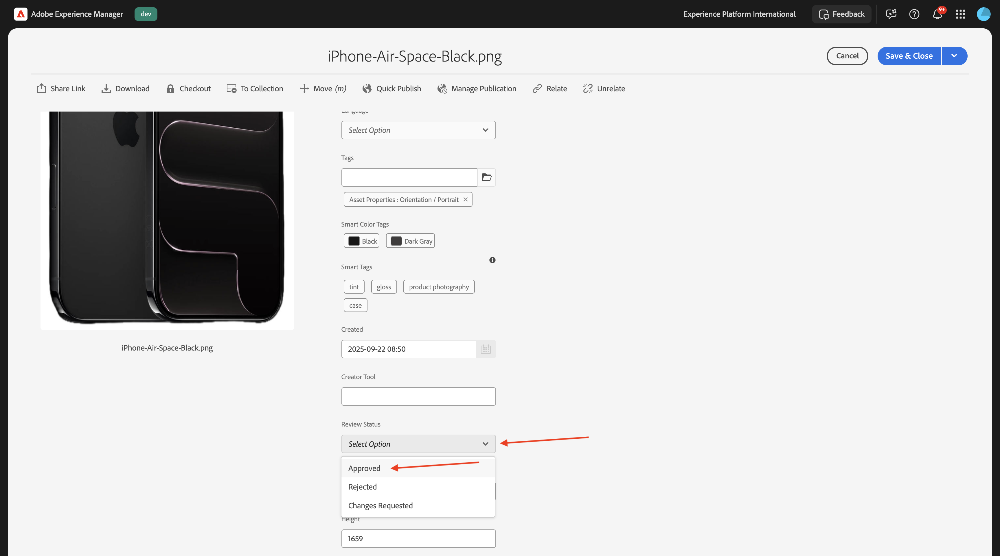
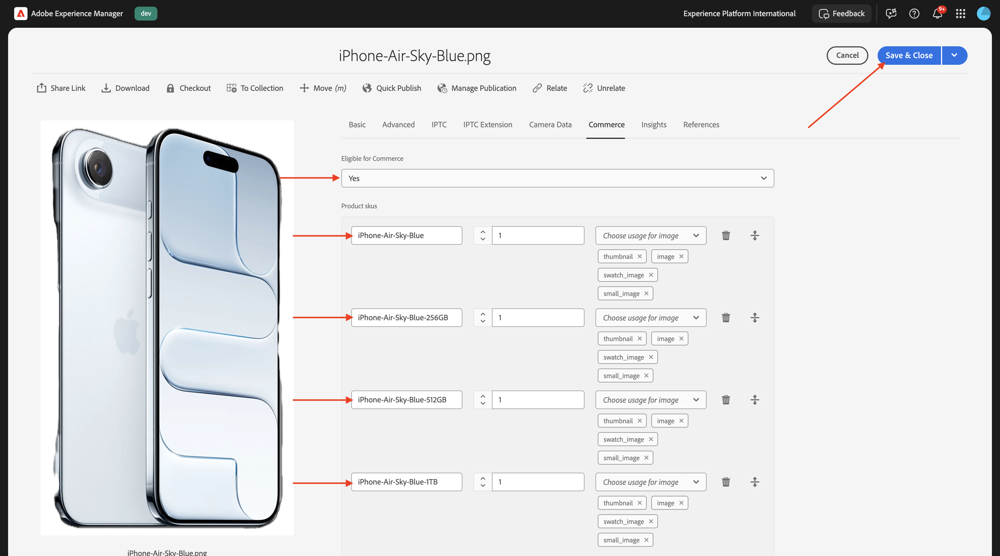
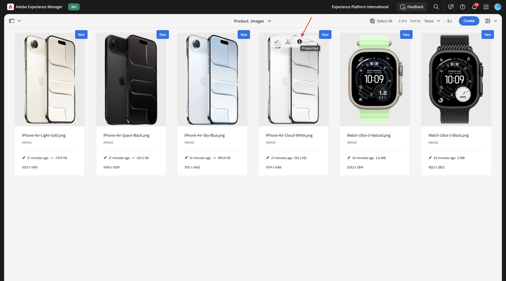

# 1.5.3将ACCS连接到AEM Assets CS

>[!IMPORTANT]
>
>要完成此练习，您需要有权访问有效的AEM Sites和具有EDS环境的Assets CS 。
>
>如果您还没有这样的环境，请转到练习[Adobe Experience Manager Cloud Service和Edge Delivery Services](./../../../modules/asset-mgmt/module2.1/aemcs.md){target="_blank"}。 按照上面的说明进行操作，您将有权访问此类环境。

>[!IMPORTANT]
>
>如果您之前已使用AEM Sites和AEM CS环境配置了Assets CS项目，则可能是您的AEM CS沙盒已休眠。 鉴于解除此类沙盒的休眠需要10-15分钟，最好现在就启动解除休眠过程，这样以后就不必等待它。

完成上一个练习后，您可以看到ACCS将某个产品返回到您的网站，但该产品还没有图像。 在本练习结束时，您应该也会看到所返回的图像。


## 1.5.3.1更新管道配置

转到[https://my.cloudmanager.adobe.com](https://my.cloudmanager.adobe.com){target="_blank"}。 您应选择的组织是`--aepImsOrgName--`。

单击以打开您的Cloud Manager项目，该项目应称为`--aepUserLdap-- - CitiSignal AEM+ACCS`。


向下滚动一点，然后单击&#x200B;**管道**&#x200B;选项卡上的&#x200B;**访问存储库信息**。


您应该会看到此内容。 单击&#x200B;**生成密码**。


再次单击&#x200B;**生成密码**。


然后，您应该拥有可用的密码。 接下来，单击&#x200B;**Git命令行**&#x200B;字段旁边的&#x200B;**复制**&#x200B;图标。


在计算机上的所选位置创建新目录，并将其命名为&#x200B;**AEM管道GitHub**。


右键单击文件夹，然后选择&#x200B;**在文件夹新建终端**。


您应该会看到此内容。


将之前复制的&#x200B;**Git命令行**&#x200B;命令粘贴到“终端”窗口中。


您需要输入用户名。 从Cloud Manager的程序管道&#x200B;**Access存储库信息**&#x200B;复制用户名，然后按&#x200B;**Enter**。


接下来，您需要输入密码。 从Cloud Manager的程序管道&#x200B;**Access存储库信息**&#x200B;复制密码并按&#x200B;**Enter**。


这可能需要一分钟。 完成后，您将拥有链接到项目管道的Git存储库的本地副本。


您将在&#x200B;**AEM管道GitHub**&#x200B;目录中看到一个新目录。 打开该目录。


选择该目录中的所有文件并删除所有文件。


确保目录为空。


转到[https://github.com/ankumalh/assets-commerce](https://github.com/ankumalh/assets-commerce)。 单击&#x200B;**&lt;>代码**，然后选择&#x200B;**下载ZIP**。 下载文件，然后将其放到桌面上。


接下来，将文件&#x200B;**assets-commerce-main.zip**&#x200B;复制到桌面上并解压缩。 打开文件夹&#x200B;**assets-commerce-main**。


将所有文件从目录&#x200B;**assets-commerce-main**&#x200B;复制到程序管道存储库目录的空目录中。


接下来，打开&#x200B;**Microsoft Visual Studio Code**，并在&#x200B;**Microsoft Visual Studio Code**&#x200B;中打开包含您程序的管道存储库的文件夹。



转到左侧菜单中的&#x200B;**搜索**&#x200B;并搜索`<my-app>`。 您需要使用`<my-app>`替换`--aepUserLdap--citisignalaemaccs`的所有实例。

单击&#x200B;**全部替换**&#x200B;图标。


单击&#x200B;**替换**。


新文件现在可以上传回Git存储库，该存储库链接到项目的管道存储库。 为此，请打开文件夹&#x200B;**AEM Pipeline GitHub**，并右键单击包含新文件的文件夹。 选择&#x200B;**新建位于文件夹**&#x200B;的终端。



您应该会看到此内容。 粘贴命令`git add .`并按&#x200B;**Enter**。


您应该会看到此内容。 粘贴命令`git commit -m "add assets integration"`并按&#x200B;**Enter**。


您应该会看到此内容。 粘贴命令`git push origin main`并按&#x200B;**Enter**。


您应该会看到此内容。 您所做的更改现已部署到项目的管道Git存储库。


返回Cloud Manager并单击&#x200B;**关闭**。


在更改管道的Git存储库后，您需要再次运行&#x200B;**部署到开发**&#x200B;管道。 单击3个点&#x200B;**...**&#x200B;并选择&#x200B;**运行**。


单击&#x200B;**运行**。 运行管道部署可能需要10-15分钟。 继续之前，您需要等待管道部署成功完成。


## 1.5.3.2在ACCS中启用AEM Assets集成

返回到ACCS实例。 在左侧菜单中，转到&#x200B;**商店**，然后选择&#x200B;**配置**。



在菜单中向下滚动到&#x200B;**ADOBE SERVICES**，然后打开&#x200B;**AEM Assets集成**。 您应该会看到此内容。


填写以下变量：

- **AEM Assets项目ID**：您可以从AEM CS创作URL获取项目ID。 在此示例中，项目ID为`166717`。


- **AEM Assets环境ID**：您可以从AEM CS创作URL获取环境ID。 在此示例中，环境ID为`1786231`。


- **资产选择器IMS客户端ID**：设置为`1`
- **同步已启用**：设置为`Yes`
- **可视化所有者**：设置为`AEM Assets`
- **资源匹配规则**： `Match by product SKU`
- **按产品SKU属性名称匹配**： `commerce:skus`

单击&#x200B;**保存配置**。


您应该会看到此内容。


## 1.5.3.3更新config.json

转到在设置AEM Sites CS/EDS环境时创建的GitHub存储库。 该存储库是在[1.1.2设置您的AEM CS环境](./../../../modules/asset-mgmt/module2.1/ex3.md){target="_blank"}练习中创建的，应命名为&#x200B;**citisignal-aem-accs**。

在根目录中，向下滚动并单击以打开文件&#x200B;**config.json**。 单击&#x200B;**编辑**&#x200B;图标以更改文件。


在第5 `"commerce-endpoint": "https://na1-sandbox.api.commerce.adobe.com/XXX/graphql",`行下添加以下代码片段：

```json
 "commerce-assets-enabled": "true",
```

单击&#x200B;**提交更改……**。


单击&#x200B;**提交更改**。


您的更改现已保存，不久将发布。 可能需要几分钟时间，店面才能看到所做的更改。


## 1.5.3.4验证AEM Assets CS中的Commerce字段

登录到您的AEM CS创作环境，然后转到&#x200B;**Assets**。


转到&#x200B;**文件**。


打开&#x200B;**CitiSignal**&#x200B;文件夹。


将鼠标悬停在任意资源上，然后单击&#x200B;**信息**&#x200B;图标。


您现在应该会看到一个包含2个新元数据属性的&#x200B;**Commerce**&#x200B;选项卡。


您的AEM Assets CS环境现在支持Commerce集成。 您现在可以开始上传产品图像。

## 1.5.3.4上传产品Assets并链接到产品

[在此下载产品图像](./images/Product_Images.zip)。 下载后，将文件导出到桌面上。


单击&#x200B;**创建**，然后选择&#x200B;**文件夹**。


为字段&#x200B;**Title**&#x200B;和&#x200B;**Name**&#x200B;输入值&#x200B;**Product_Images**。 单击&#x200B;**创建**。


单击以打开刚刚创建的文件夹。


单击&#x200B;**创建**，然后选择&#x200B;**文件**。


导航到桌面上的&#x200B;**Product_Images**&#x200B;文件夹，选择所有文件，然后单击&#x200B;**打开**。


单击&#x200B;**上传**。


然后，您的图像将可在您的文件夹中使用。 将鼠标悬停在产品&#x200B;**iPhone-Air-Light-Gold.png**&#x200B;上，然后单击&#x200B;**属性**&#x200B;图标。


向下滚动并将字段&#x200B;**审核状态**&#x200B;设置为&#x200B;**已批准**。 AEM Assets CS - ACCS集成仅适用于批准的图像。


向上滚动，转到&#x200B;**Commerce**&#x200B;选项卡，然后单击&#x200B;**产品SKU**&#x200B;下的&#x200B;**添加**。


为此产品添加以下SKU：

| 键 | 值 | 使用情况 |
|:-------------:| :---------------:| :---------------:| 
| `iPhone-Air-Light-Gold` | `1` | `thumbnail, image, swatch_image, small_image` |
| `iPhone-Air-Light-Gold-256GB` | `1` | `thumbnail, image, swatch_image, small_image` |
| `iPhone-Air-Light-Gold-512GB` | `1` | `thumbnail, image, swatch_image, small_image` |
| `iPhone-Air-Light-Gold-1TB` | `1` | `thumbnail, image, swatch_image, small_image` |

然后您应该拥有此项。 单击&#x200B;**保存并关闭**。


将鼠标悬停在产品&#x200B;**iPhone-Air-Space-Black.png**&#x200B;上，然后单击&#x200B;**属性**&#x200B;图标。


向下滚动并将字段&#x200B;**审核状态**&#x200B;设置为&#x200B;**已批准**。 AEM Assets CS - ACCS集成仅适用于批准的图像。



向上滚动，转到&#x200B;**Commerce**&#x200B;选项卡，然后单击&#x200B;**产品SKU**&#x200B;下的&#x200B;**添加**。


为此产品添加以下SKU：

| 键 | 值 | 使用情况 |
|:-------------:| :---------------:| :---------------:| 
| `iPhone-Air-Space-Black` | `1` | `thumbnail, image, swatch_image, small_image` |
| `iPhone-Air-Space-Black-256GB` | `1` | `thumbnail, image, swatch_image, small_image` |
| `iPhone-Air-Space-Black-512GB` | `1` | `thumbnail, image, swatch_image, small_image` |
| `iPhone-Air-Space-Black-1TB` | `1` | `thumbnail, image, swatch_image, small_image` |
| `iPhone-Air` | `1` | `thumbnail, image, swatch_image, small_image` |

然后您应该拥有此项。 单击&#x200B;**保存并关闭**。


将鼠标悬停在产品&#x200B;**iPhone-Air-Sky-Blue.png**&#x200B;上，然后单击&#x200B;**属性**&#x200B;图标。


向下滚动并将字段&#x200B;**审核状态**&#x200B;设置为&#x200B;**已批准**。 AEM Assets CS - ACCS集成仅适用于批准的图像。


向上滚动，转到&#x200B;**Commerce**&#x200B;选项卡，然后单击&#x200B;**产品SKU**&#x200B;下的&#x200B;**添加**。


为此产品添加以下SKU：

| 键 | 值 | 使用情况 |
|:-------------:| :---------------:| :---------------:| 
| `iPhone-Air-Sky-Blue` | `1` | `thumbnail, image, swatch_image, small_image` |
| `iPhone-Air-Sky-Blue-256GB` | `1` | `thumbnail, image, swatch_image, small_image` |
| `iPhone-Air-Sky-Blue-512GB` | `1` | `thumbnail, image, swatch_image, small_image` |
| `iPhone-Air-Sky-Blue-1TB` | `1` | `thumbnail, image, swatch_image, small_image` |

然后您应该拥有此项。 单击&#x200B;**保存并关闭**。



将鼠标悬停在产品&#x200B;**iPhone-Air-Cloud-White.png**&#x200B;上，然后单击&#x200B;**属性**&#x200B;图标。



向下滚动并将字段&#x200B;**审核状态**&#x200B;设置为&#x200B;**已批准**。 AEM Assets CS - ACCS集成仅适用于批准的图像。


向上滚动，转到&#x200B;**Commerce**&#x200B;选项卡，然后单击&#x200B;**产品SKU**&#x200B;下的&#x200B;**添加**。


为此产品添加以下SKU：

| 键 | 值 | 使用情况 |
|:-------------:| :---------------:| :---------------:| 
| `iPhone-Air-Cloud-White` | `1` | `thumbnail, image, swatch_image, small_image` |
| `iPhone-Air-Cloud-White-256GB` | `1` | `thumbnail, image, swatch_image, small_image` |
| `iPhone-Air-Cloud-White-512GB` | `1` | `thumbnail, image, swatch_image, small_image` |
| `iPhone-Air-Cloud-White-1TB` | `1` | `thumbnail, image, swatch_image, small_image` |

然后您应该拥有此项。 单击&#x200B;**保存并关闭**。


现在，每个&#x200B;**iPhone Air**&#x200B;图像都应该有一个&#x200B;**绿色的竖拇指**，以表明资产已获得批准。


## 1.5.3.5验证AEM Sites CS/EDS店面上的产品图像

>[!NOTE]
>
>最多可能需要15分钟时间，您才会成功部署以上所做的更改。 如果尚未显示图像，请等待15分钟，然后重试。

要验证集成是否正常工作，您需要打开CitiSignal网站。

要访问您的网站，请在将XXX替换为您的GitHub用户帐户（本例中为`main--citisignal-aem-accs--XXX.aem.page`）之后，转到`main--citisignal-aem-accs--XXX.aem.live`和/或`woutervangeluwe`。

因此在此示例中，完整URL将变为：
`https://main--citisignal-aem-accs--woutervangeluwe.aem.page`和/或`https://main--citisignal-aem-accs--woutervangeluwe.aem.live`。

您应该会看到此内容。 转到&#x200B;**电话**。


然后，您应该会看到显示的&#x200B;**iPhone Air**&#x200B;的产品图像。 单击&#x200B;**iPhone Air**。


您应该会看到此内容。 更改颜色和存储选项，您将看到图像根据您所做的选择动态变化。


以下是将颜色更改为&#x200B;**Light-Gold**&#x200B;和存储大小更改为&#x200B;**256GB**&#x200B;的示例。


下一步：[摘要和优点](./summary.md){target="_blank"}

返回[Adobe Commerce as a Cloud Service](./accs.md){target="_blank"}

[返回所有模块](./../../../overview.md){target="_blank"}
