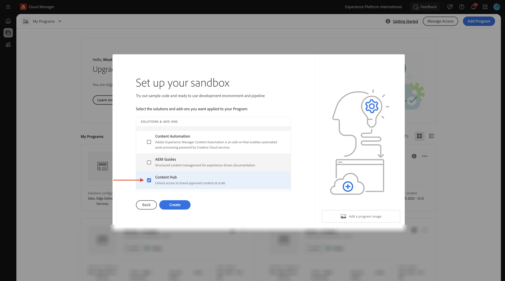
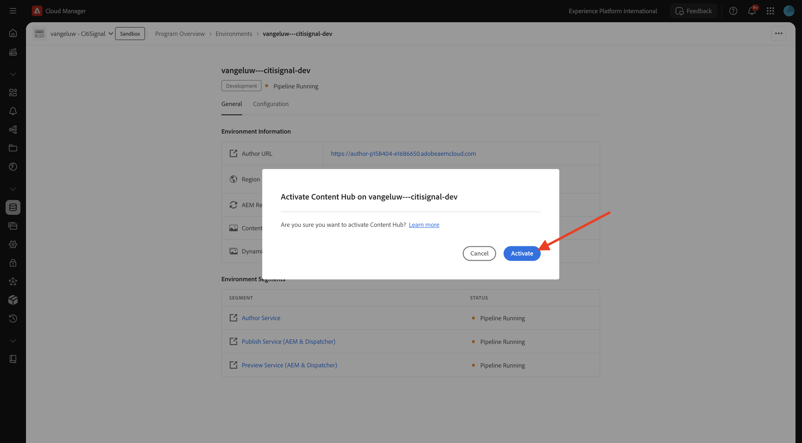
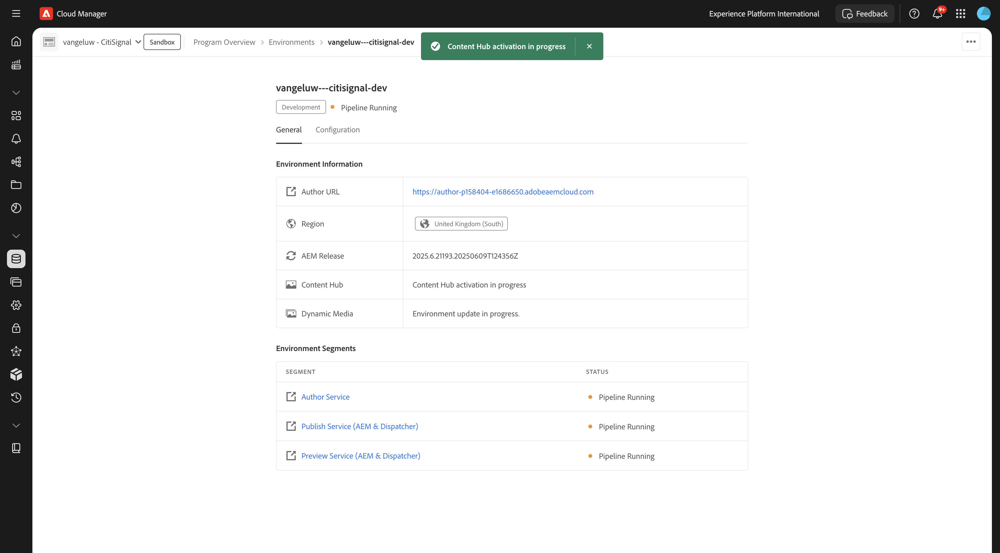

# 1.1.1创建您的Cloud Manager程序

转到[https://my.cloudmanager.adobe.com](https://my.cloudmanager.adobe.com){target="_blank"}。 您应选择的组织是`--aepImsOrgName--`。 然后你将看到类似这样的内容。 单击&#x200B;**添加程序**。

对于&#x200B;**计划名称**，请使用`--aepUserLdap-- - CitiSignal AEM+ACCS`。 选择选项&#x200B;**设置沙盒**。 单击&#x200B;**继续**。

确保选中以下选项：

- 站点
- Forms
- 资产

单击&#x200B;**Assets**&#x200B;的箭头以打开选项列表。

确保选中以下选项：

- Content Hub

向下滚动列表。

确保选中以下选项：

- Edge Delivery Services
- Dynamic Media

单击&#x200B;**创建**。

创建环境将需要一些时间，即10到20分钟。

创建环境并准备使用后，您将收到一封电子邮件确认，之后您可以返回此处。

收到电子邮件确认后，请返回[https://my.cloudmanager.adobe.com](https://my.cloudmanager.adobe.com){target="_blank"}。 然后，您会看到项目的状态已更改为&#x200B;**就绪**。 单击您的项目以将其打开。

查看选项卡&#x200B;**管道**。 单击3个点&#x200B;**...**，然后单击&#x200B;**运行**。

单击&#x200B;**运行**。

接下来，单击&#x200B;**环境**&#x200B;选项卡上的3个点&#x200B;**...**，然后单击&#x200B;**查看详细信息**。

然后，您将看到环境详细信息，包括&#x200B;**作者**&#x200B;环境的URL，在下个练习中您将需要该URL。

查看&#x200B;**Content Hub**&#x200B;行，然后选择&#x200B;**单击以激活**。

单击&#x200B;**激活**。

**Content Hub**&#x200B;激活现已开始。 这可能需要10分钟或更长时间。

大约10分钟后，将完成&#x200B;**Content Hub**&#x200B;的激活。
接下来，查看&#x200B;**Dynamic Media**&#x200B;行，并选择&#x200B;**单击以激活**。

单击&#x200B;**激活**。

**Dynamic Media**&#x200B;激活现已开始。 这可能需要10分钟或更长时间。

大约10分钟后，将完成&#x200B;**Dynamic Media**&#x200B;的激活。

管道运行完成后，您可以继续下一个练习。

下一步：[设置您的AEM CS环境](./ex2.md){target="_blank"}

返回[Adobe Experience Manager Cloud Service和Edge Delivery Services](./aemcs.md){target="_blank"}

[返回所有模块](./../../../overview.md){target="_blank"}
