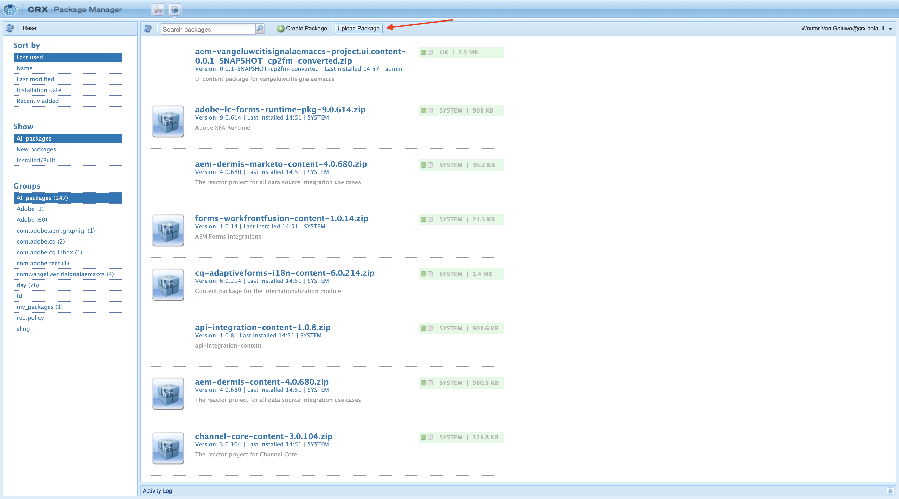
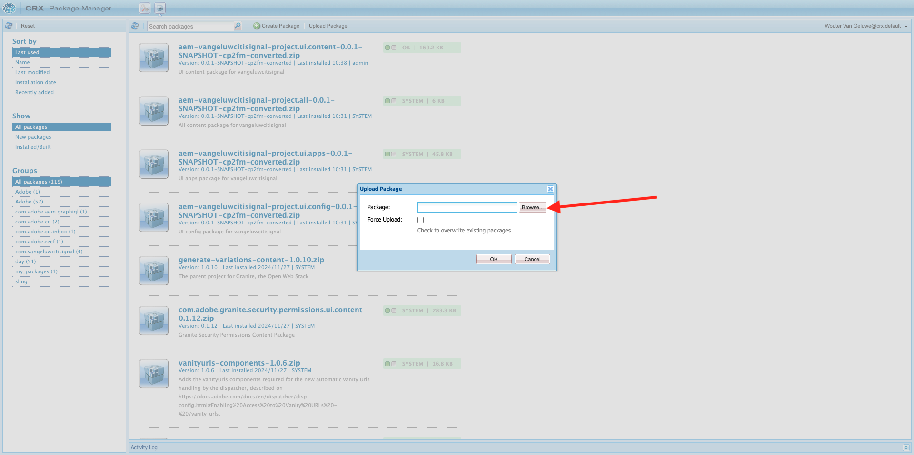
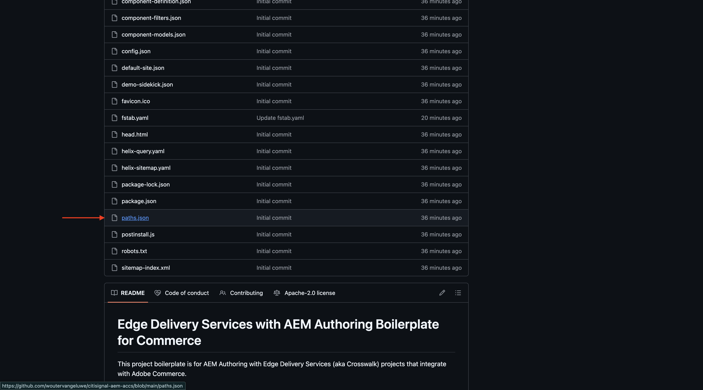

# 1.1.2设置您的AEM CS环境

## 1.1.2.1设置您的GitHub存储库

转到[https://github.com](https://github.com){target="_blank"}。 单击&#x200B;**登录**。

输入您的凭据。 单击&#x200B;**登录**。

登录后，您将看到您的GitHub功能板。

转到[https://github.com/adobe-rnd/aem-boilerplate-xcom](https://github.com/adobe-rnd/aem-boilerplate-xcom){target="_blank"}。 你会看到这个。 单击&#x200B;**使用此模板**，然后单击&#x200B;**新建存储库**。

对于&#x200B;**存储库名称**，请使用`citisignal-aem-accs`。 将可见性设置为&#x200B;**私有**。 单击&#x200B;**创建存储库**。

几秒钟后，您将创建存储库。

接下来，转到[https://github.com/apps/aem-code-sync](https://github.com/apps/aem-code-sync){target="_blank"}。 单击&#x200B;**安装**&#x200B;或&#x200B;**配置**。

单击GitHub用户帐户旁边的&#x200B;**继续**&#x200B;按钮。

单击GitHub用户帐户旁边的&#x200B;**配置**。

单击&#x200B;**仅选择存储库**，然后添加刚刚创建的存储库。

向下滚动并单击&#x200B;**保存**。

然后您会获得此确认。

## 1.1.2.2更新文件fstab.yaml

在您的GitHub存储库中，单击以打开文件`fstab.yaml`。

单击&#x200B;**编辑**&#x200B;图标。

您现在需要更新第3行字段&#x200B;**url**&#x200B;的值。

您需要通过特定AEM Sites CS环境的URL与GitHub存储库的设置替换当前值。

这是URL的当前值： `https://author-p130360-e1272151.adobeaemcloud.com/bin/franklin.delivery/adobe-rnd/aem-boilerplate-xcom/main`。

URL有3个部分需要更新

`https://XXX/bin/franklin.delivery/YYY/ZZZ/main`

XXX应替换为您的AEM CS创作环境的URL。

应将YYYY替换为您的GitHub用户帐户。

ZZZ应该被替换为您在上一个练习中使用的GitHub存储库的名称。

您可以通过转到[https://my.cloudmanager.adobe.com](https://my.cloudmanager.adobe.com){target="_blank"}来查找AEM CS创作环境的URL。 单击您的&#x200B;**程序**&#x200B;以将其打开。

接下来，单击&#x200B;**环境**&#x200B;选项卡上的3个点&#x200B;**...**，然后单击&#x200B;**查看详细信息**。

然后，您将看到环境详细信息，包括&#x200B;**作者**&#x200B;环境的URL。 复制URL。

XXX = `author-p166717-e1786231.adobeaemcloud.com`

对于GitHub用户帐户名称，您可以在浏览器的URL中轻松找到它。 在此示例中，用户帐户名称为`woutervangeluwe`。

YYYY = `woutervangeluwe`

对于GitHub存储库名称，您还可以在GitHub中打开的浏览器窗口中找到它。 在这种情况下，存储库名称为`citisignal`。

ZZZ = `citisignal-aem-accs`

这3个值组合在一起，导致需要在文件`fstab.yaml`中配置此新URL。

`https://author-p166717-e1786231.adobeaemcloud.com/bin/franklin.delivery/woutervangeluwe/citisignal-aem-accs/main`

单击&#x200B;**提交更改……**。

单击&#x200B;**提交更改**。

文件`fstab.yaml`现已更新。

## 1.1.2.3上传CitiSignal资产和站点

转到[https://my.cloudmanager.adobe.com](https://my.cloudmanager.adobe.com){target="_blank"}。 单击您的&#x200B;**程序**&#x200B;以将其打开。

接下来，单击创作环境的URL。

单击&#x200B;**使用Adobe登录**。

然后，您将看到创作环境。

您的URL将如下所示：`https://author-p166717-e1786231.adobeaemcloud.com/ui#/aem/aem/start.html?appId=aemshell`

您现在需要访问AEM的&#x200B;**CRX包管理器**&#x200B;环境。 为此，请从URL中删除`ui#/aem/aem/start.html?appId=aemshell`并将其替换为`crx/packmgr`，这意味着您的URL现在应如下所示：
`https://author-p166717-e1786231.adobeaemcloud.com/crx/packmgr`。
按&#x200B;**Enter**&#x200B;以加载包管理器环境

接下来，单击&#x200B;**上传包**。

单击&#x200B;**浏览**&#x200B;以查找要上载的包。

要上传的包名为&#x200B;**citisignal-assets.zip**，可从此处下载： [https://one-adobe-tech-insiders.s3.us-west-2.amazonaws.com/one-adobe/citisignal_aem_accs.zip](https://one-adobe-tech-insiders.s3.us-west-2.amazonaws.com/one-adobe/citisignal_aem_accs.zip){target="_blank"}。

选择包`citisignal_aem_accs.zip`并单击&#x200B;**打开**。

接下来，单击&#x200B;**确定**。

随后将上传包。 接下来，在刚刚上传的包上单击&#x200B;**安装**。

单击&#x200B;**安装**。

几分钟后，将安装您的包。

现在可以关闭此窗口。

## 1.1.2.4发布CitiSignal资产

转到[https://my.cloudmanager.adobe.com](https://my.cloudmanager.adobe.com){target="_blank"}。 单击您的&#x200B;**程序**&#x200B;以将其打开。

接下来，单击创作环境的URL。

单击&#x200B;**使用Adobe登录**。

然后，您将看到创作环境。 单击&#x200B;**Assets**。

单击&#x200B;**文件**。

单击以选择文件夹&#x200B;**CitiSignal**，然后单击&#x200B;**管理发布**。

单击&#x200B;**下一步**。

单击&#x200B;**发布**。

您的资产现已发布。

## 1.1.2.5发布CitiSignal网站

单击屏幕左上角的&#x200B;**Adobe Experience Manager**&#x200B;产品名称，然后单击&#x200B;**Assets**&#x200B;旁边的&#x200B;**箭头**。

接下来，单击&#x200B;**站点**。

然后，您应该会看到之前安装包之后创建的&#x200B;**CitiSignal**&#x200B;网站。

要将您的站点链接到之前创建的GitHub存储库，您需要创建&#x200B;**Edge Delivery Services配置**。

要执行此操作，第一步是创建&#x200B;**云配置**。

为此，请单击屏幕左上角的&#x200B;**Adobe Experience Manager**&#x200B;产品名称，然后单击&#x200B;**工具**&#x200B;图标，然后选择&#x200B;**常规**。 单击以打开&#x200B;**配置浏览器**。

您应该会看到此内容。 单击&#x200B;**创建**

将字段&#x200B;**标题**&#x200B;和&#x200B;**名称**&#x200B;设置为`CitiSignal`。 启用&#x200B;**云配置**&#x200B;的复选框。

单击&#x200B;**创建**。

然后您应该拥有此项。

接下来，您需要更新刚刚创建的&#x200B;**云配置**&#x200B;的某些字段。

为此，请单击屏幕左上角的&#x200B;**Adobe Experience Manager**&#x200B;产品名称，然后单击&#x200B;**工具**&#x200B;图标，然后选择&#x200B;**云服务**。 单击以打开&#x200B;**Edge Delivery Services配置**。

选择&#x200B;**CitiSignal**，单击&#x200B;**创建**&#x200B;并选择&#x200B;**配置**。

您现在需要填写字段&#x200B;**组织**&#x200B;和&#x200B;**站点名称**。 为此，请首先查看GitHub存储库的URL。

- **组织**：使用您的GitHub组织名称的名称，在此示例中为`woutervangeluwe`
- **站点名称**：使用GitHub存储库的名称，该名称应为`citisignal-aem-accs`。

单击&#x200B;**保存并关闭**。

然后您应该拥有此项。 启用新创建的Edge云配置前面的复选框，然后单击&#x200B;**发布**。

## 1.1.2.6更新文件路径.json

在您的GitHub存储库中，单击以打开文件`paths.json`。

单击&#x200B;**编辑**&#x200B;图标。

您现在需要在第3、4、5、6、7和10行上更新以`aem-boilerplate-commerce`替换文本`CitiSignal`。

单击&#x200B;**提交更改**。

单击&#x200B;**提交更改**。

文件`paths.json`现已更新。

## 1.1.2.7发布CitiSignal网站

单击屏幕左上角的&#x200B;**Adobe Experience Manager**&#x200B;产品名称，然后选择&#x200B;**站点**。

接下来，单击&#x200B;**CitiSignal**&#x200B;前面的复选框。 然后，单击&#x200B;**管理发布**。

单击&#x200B;**下一步**。

单击&#x200B;**包括子设置**。

单击选中&#x200B;**包括子项**&#x200B;复选框，然后单击取消选中其他复选框。 单击&#x200B;**确定**。

单击&#x200B;**发布**。

然后你将被送回这里。 单击&#x200B;**CitiSignal**，选中&#x200B;**索引**&#x200B;前面的复选框，然后单击&#x200B;**编辑**。

您的网站随后将在&#x200B;**通用编辑器**&#x200B;中打开。

现在，在将XXX替换为您的GitHub用户帐户（本例中为`main--citisignal-aem-accs--XXX.aem.page`）之后，您可以通过转到`main--citisignal-aem-accs--XXX.aem.live`和/或`woutervangeluwe`来访问您的网站。

在此示例中，完整URL将变为：
`https://main--citisignal-aem-accs--woutervangeluwe.aem.page`和/或`https://main--citisignal-aem-accs--woutervangeluwe.aem.live`。

可能需要一些时间才能正确显示所有资源，因为它们需要先发布。

您随后将看到以下内容：

## 1.1.2.8测试页性能

转到[https://pagespeed.web.dev/](https://pagespeed.web.dev/){target="_blank"}。 输入URL并单击&#x200B;**分析**。

然后，您会看到您的网站在移动和桌面可视化图表中均获得了高分：

**移动设备**：

**桌面**：

下一步：[开发自定义块](./ex3.md){target="_blank"}

返回[Adobe Experience Manager Cloud Service和Edge Delivery Services](./aemcs.md){target="_blank"}

[返回所有模块](./../../../overview.md){target="_blank"}
