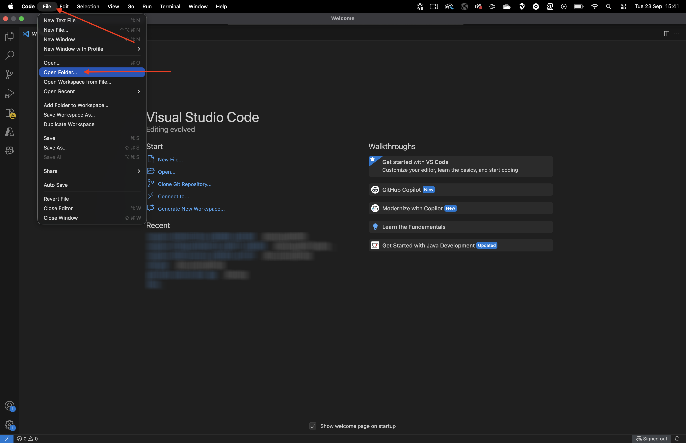
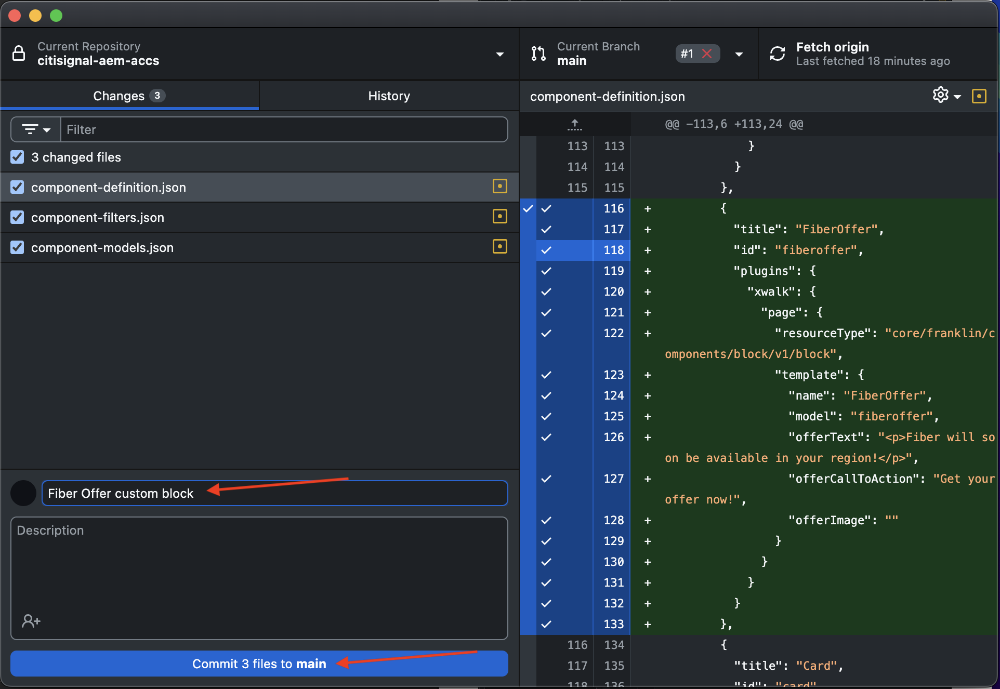
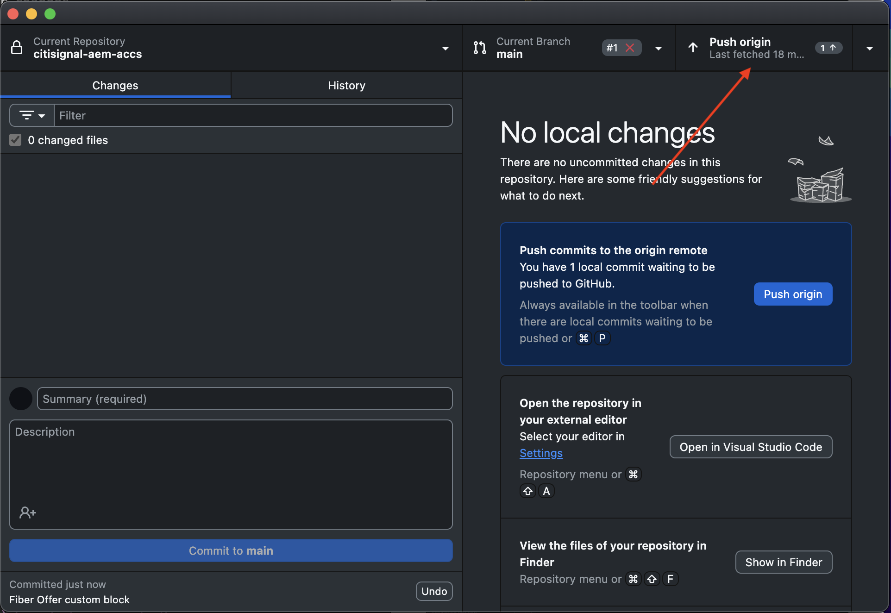
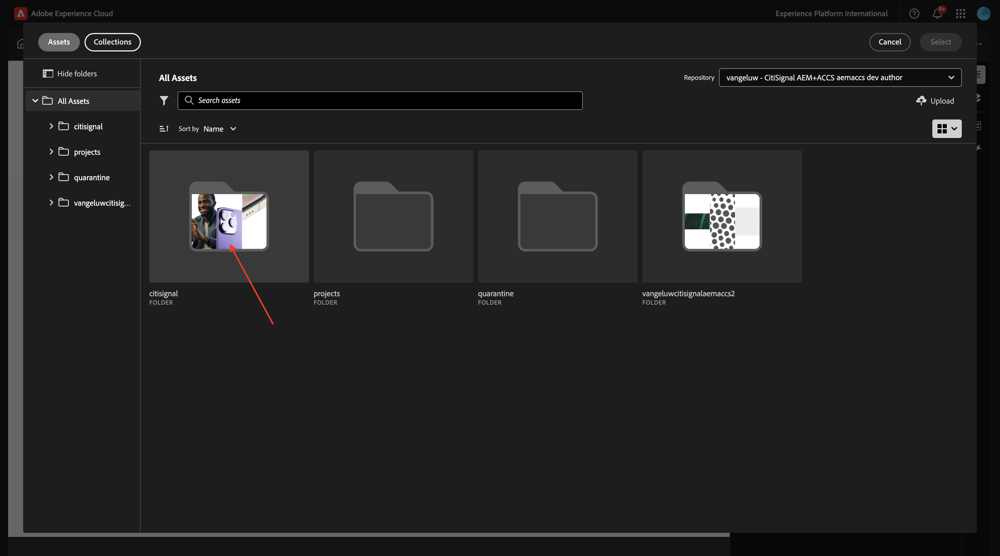
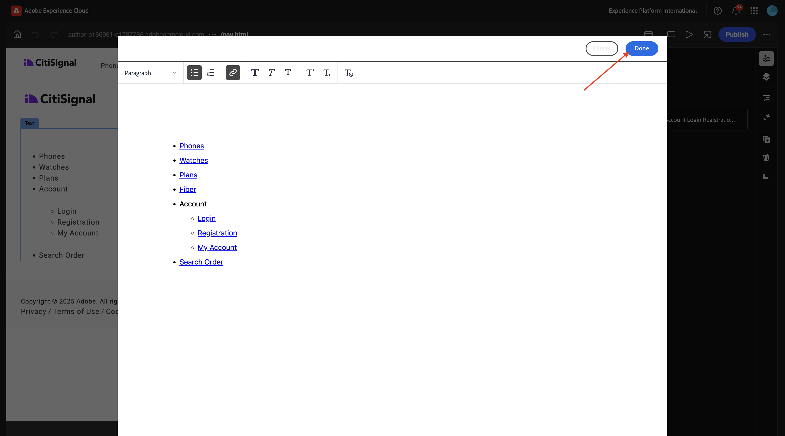

# 1.1.4开发基本自定义块

## 1.1.4.1设置您的本地开发环境

转到[https://desktop.github.com/download/](https://desktop.github.com/download/){target="_blank"}，下载并安装&#x200B;**Github Desktop**。

{zoomable="yes"}

安装Github Desktop后，转到您在上一个练习中创建的GitHub存储库。 单击&#x200B;**&lt;>代码**，然后单击&#x200B;**使用GitHub Desktop打开**。

{zoomable="yes"}

然后，将在GitHub Desktop中打开您的GitHub存储库。 请随时更改&#x200B;**本地路径**。 单击&#x200B;**克隆**。

{zoomable="yes"}

现在将创建一个本地文件夹。

{zoomable="yes"}

打开Visual Studio Code。 转到&#x200B;**文件** > **打开文件夹**。

{zoomable="yes"}

选择GitHub安装程序用于&#x200B;**citisignal**&#x200B;的文件夹。

{zoomable="yes"}

现在，您将在Visual Studio Code中看到该文件夹处于打开状态，此时您已准备好创建新块。

{zoomable="yes"}

## 1.1.4.2创建基本自定义块

Adobe建议您分三步开发块：

- 创建块的定义和模型，查看它并将其用于生产。
- 使用新块创建内容。
- 实施新块的修饰和样式。

### component-definition.json

在Visual Studio代码中，打开文件&#x200B;**component-definition.json**。

{zoomable="yes"}

向下滚动直到看到组件&#x200B;**Quote**&#x200B;为止。 将光标设置在最后一个组件的右括号旁边。

{zoomable="yes"}

粘贴此代码并在代码块后面输入逗号&#x200B;**，**：

```json
{
  "title": "FiberOffer",
  "id": "fiberoffer",
  "plugins": {
    "xwalk": {
      "page": {
        "resourceType": "core/franklin/components/block/v1/block",
        "template": {
          "name": "FiberOffer",
          "model": "fiberoffer",
          "offerText": "<p>Fiber will soon be available in your region!</p>",
          "offerCallToAction": "Get your offer now!",
          "offerImage": ""
        }
      }
    }
  }
}
```

保存更改。

{zoomable="yes"}

### component-models.json

在Visual Studio代码中，打开文件&#x200B;**component-models.json**。

{zoomable="yes"}

向下滚动，直到看到最后一个项目。 将光标设置在最后一个组件的右括号旁边。

{zoomable="yes"}

输入逗号&#x200B;**，**，然后按回车键，并在下一行粘贴此代码：

```json
{
  "id": "fiberoffer",
  "fields": [
     {
       "component": "richtext",
       "name": "offerText",
       "value": "",
       "label": "Offer Text",
       "valueType": "string"
     },
     {
       "component": "richtext",
       "valueType": "string",
       "name": "offerCallToAction",
       "label": "Offer CTA",
       "value": ""
     },
     {
       "component": "reference",
       "valueType": "string",
       "name": "offerImage",
       "label": "Offer Image",
        "multi": false
     }
   ]
}
```

保存更改。

{zoomable="yes"}

### component-filters.json

在Visual Studio代码中，打开文件&#x200B;**component-filters.json**。

{zoomable="yes"}

在&#x200B;**部分**&#x200B;下，在当前最后一行后面输入逗号&#x200B;**、**&#x200B;和组件&#x200B;**fiberoffer**&#x200B;的ID。

保存更改。

{zoomable="yes"}

## 1.1.4.3提交更改

现在，您在项目中进行了一些需要提交回GitHub存储库的更改。 为此，请打开&#x200B;**GitHub Desktop**。

然后，您应该会在&#x200B;**更改**&#x200B;下看到刚才编辑的3个文件。 查看更改。

{zoomable="yes"}

输入PR的名称`Fiber Offer custom block`。 单击&#x200B;**提交到主页面**。

{zoomable="yes"}

您应该会看到此内容。 单击&#x200B;**推送来源**。

{zoomable="yes"}

几秒钟后，您的更改已推送到GitHub存储库。

{zoomable="yes"}

在浏览器中，转到您的GitHub帐户，并转到您为CitiSignal创建的存储库。 然后，您应该会看到类似这样的内容，表明您的更改已收到。

{zoomable="yes"}

## 1.1.4.4将您的块添加到页面

现在，您的基本报价块已定义并提交到CitiSignal项目，您可以向现有页面添加&#x200B;**fiberoffer**&#x200B;块。

转到[https://my.cloudmanager.adobe.com](https://my.cloudmanager.adobe.com){target="_blank"}。 单击您的&#x200B;**程序**&#x200B;以将其打开。

{zoomable="yes"}

接下来，单击&#x200B;**环境**&#x200B;选项卡上的3个点&#x200B;**...**，然后单击&#x200B;**查看详细信息**。

{zoomable="yes"}

然后，您将看到环境详细信息。 单击&#x200B;**作者**&#x200B;环境的URL。

>[!NOTE]
>
>您的环境可能处于休眠状态。 如果是这种情况，您需要先解除环境休眠。

{zoomable="yes"}

然后，您应该会看到您的AEM创作环境。 转到&#x200B;**站点**。

{zoomable="yes"}

转到&#x200B;**CitiSignal** > **us** > **en**。

{zoomable="yes"}

单击&#x200B;**创建**&#x200B;并选择&#x200B;**页面**。

{zoomable="yes"}

选择&#x200B;**页面**&#x200B;并单击&#x200B;**下一步**。

{zoomable="yes"}

输入以下值：

- 标题： **CitiSignal光纤**
- 名称： **citisignal-fibre**
- 页面标题： **CitiSignal光纤**

单击&#x200B;**创建**。

{zoomable="yes"}

您应该会看到此内容。

{zoomable="yes"}

单击空白区域以选择&#x200B;**节**&#x200B;组件。 然后，单击右菜单中的加号&#x200B;**+**&#x200B;图标。

{zoomable="yes"}

随后，您应该会在可用块列表中看到自定义块。 单击以将其选中。

{zoomable="yes"}

随后您将看到诸如&#x200B;**选件文本**、**选件CTA**&#x200B;和&#x200B;**选件图像**&#x200B;之类的字段被添加到编辑器中。 单击&#x200B;**选件图像**&#x200B;字段上的&#x200B;**+添加**&#x200B;以选择图像。

{zoomable="yes"}

您应该会看到此内容。 单击以打开文件夹&#x200B;**citisignal**。

{zoomable="yes"}

选择图像&#x200B;**product-enrichment-1.png**。 单击&#x200B;**选择**。

{zoomable="yes"}

然后您应该拥有此项。 单击&#x200B;**发布**。

{zoomable="yes"}

再次单击&#x200B;**发布**。

{zoomable="yes"}

您的新页面现已发布。

## 1.1.4.5将您的新页面添加到导航菜单

在您的AEM Sites概述中，转到&#x200B;**CitiSignal** > **Fragments**，并选中&#x200B;**Header**&#x200B;的复选框。 单击&#x200B;**编辑**。

{zoomable="yes"}

向导航菜单添加一个带有文本`Fiber`的菜单选项。 选择文本&#x200B;**光纤**&#x200B;并单击&#x200B;**链接**&#x200B;图标。

{zoomable="yes"}

输入此&#x200B;**URL** `/us/en//citisignal-fiber`并单击&#x200B;**V**&#x200B;图标进行确认。

{zoomable="yes"}

然后您应该拥有此项。 单击&#x200B;**发布**。

{zoomable="yes"}

再次单击&#x200B;**发布**。

{zoomable="yes"}

现在，在将XXX替换为您的GitHub用户帐户（本示例中为`woutervangeluwe`）之后，您可以通过转到`main--citisignal--XXX.aem.page/us/en/`和/或`main--citisignal--XXX.aem.live/us/en/`查看对您网站的更改。

在此示例中，完整URL将变为：
`https://main--citisignal--woutervangeluwe.aem.page/us/en/`和/或`https://main--citisignal--woutervangeluwe.aem.live/us/en/`。

您应该会看到此内容。 单击&#x200B;**光纤**。

{zoomable="yes"}

这是您的基本自定义块，但现在已呈现在网站上。

{zoomable="yes"}

下一步： [1.1.5高级自定义块](./ex5.md){target="_blank"}

返回[Adobe Experience Manager Cloud Service和Edge Delivery Services](./aemcs.md){target="_blank"}

[返回所有模块](./../../../overview.md){target="_blank"}
