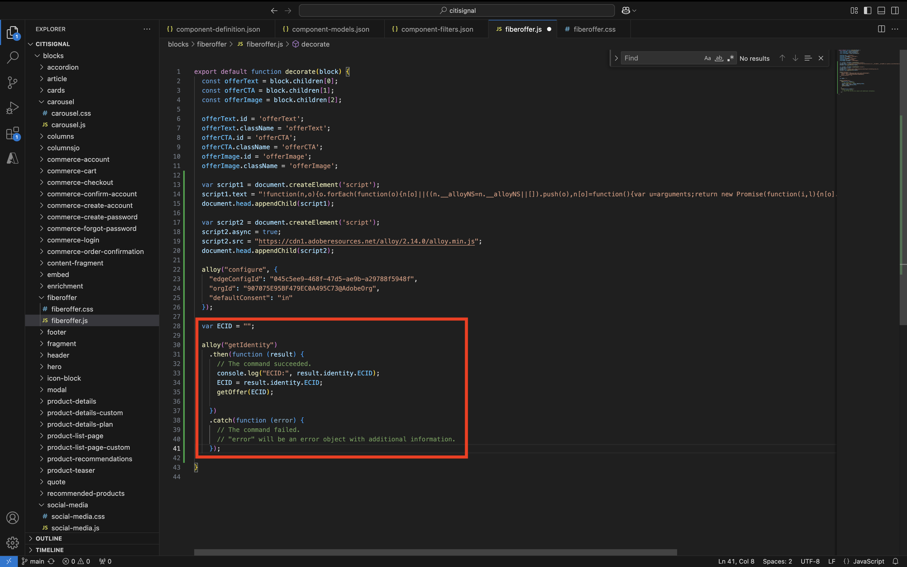

# 1.1.5高级自定义块

在上一个练习中，您配置了一个名为&#x200B;**光纤选件**&#x200B;的基本自定义块，该块在您的网站上显示&#x200B;**选件文本**、**选件CTA**&#x200B;和&#x200B;**选件图像**&#x200B;等字段。

您现在可以继续处理此块。

{zoomable="yes"}

## 1.1.5.1为块设置样式

现在您有一个有效的&#x200B;**光纤选件**&#x200B;块，您可以对其应用样式。

返回Visual Studio Code并打开文件夹&#x200B;**块**。 现在，您应该会看到多个文件夹，每个文件夹都引用了一个特定块。 为了使您的&#x200B;**fiberoffer**&#x200B;块更高级，您现在需要为自定义块创建文件夹。

{zoomable="yes"}

选择文件夹&#x200B;**块**，然后单击&#x200B;**新建文件夹**&#x200B;图标。

{zoomable="yes"}

命名您的文件夹`fiberoffer`并按&#x200B;**Enter**。

{zoomable="yes"}

选择新的&#x200B;**fiberoffer**&#x200B;文件夹，然后单击&#x200B;**新建文件**&#x200B;图标。

{zoomable="yes"}

现已创建新文件。 输入名称&#x200B;**fiberoffer.js**&#x200B;并按Enter。

{zoomable="yes"}

您现在可以通过将以下JavaScript添加到文件&#x200B;**fiberoffer.js**&#x200B;中来实施块修饰。

保存文件。

```js
export default function decorate(block) {
  const offerText = block.children[0];
  const offerCTA = block.children[1];
  const offerImage = block.children[2];

  offerText.id = 'offerText';
  offerText.className = 'offerText';
  offerCTA.id = 'offerCTA';
  offerCTA.className = 'offerCTA';
  offerImage.id = 'offerImage';
  offerImage.className = 'offerImage';
}
```

{zoomable="yes"}

选择新的&#x200B;**fiberoffer**&#x200B;文件夹，然后再次单击&#x200B;**新建文件**&#x200B;图标。

{zoomable="yes"}

现已创建新文件。 输入名称&#x200B;**fiberoffer.css**&#x200B;并按Enter。

{zoomable="yes"}

将以下CSS代码复制并粘贴到新创建的文件中。

```js
.offerText, .offerCTA, .offerImage{
    color: #14161A;
    font-size: 30px;
    padding: 0 0 24px;
    display: flex;
    flex-direction: column;
    margin: 1rem 0;
    text-align: center;
}
```

保存更改。

{zoomable="yes"}

现在，您在项目中进行了一些需要提交回GitHub存储库的更改。 为此，请打开&#x200B;**GitHub Desktop**。

然后，您应该会在&#x200B;**更改**&#x200B;下看到刚才编辑的2个文件。 查看更改。

输入PR的名称`js css`。 单击&#x200B;**提交到主页面**。

{zoomable="yes"}

您应该会看到此内容。 单击&#x200B;**推送来源**。

{zoomable="yes"}

在浏览器中，转到您的GitHub帐户，并转到您为CitiSignal创建的存储库。 然后，您应该会看到类似这样的内容，表明您的更改已收到。

{zoomable="yes"}

现在，在将XXX替换为您的GitHub用户帐户（本示例中为`woutervangeluwe`）之后，您可以通过转到`main--citisignal--XXX.aem.page/us/en/`和/或`main--citisignal--XXX.aem.live/us/en/`查看对您网站的更改。

在此示例中，完整URL将变为：
`https://main--citisignal--woutervangeluwe.aem.page/us/en/`和/或`https://main--citisignal--woutervangeluwe.aem.live/us/en/`。

然后，您应该会看到此内容，并将样式应用于页面。

{zoomable="yes"}

## 1.1.5.2添加逻辑并从外部端点加载数据

在本练习中，您将对Adobe的Web SDK进行“原始”配置，并向Adobe Journey Optimizer Offer Decisioning请求下一个最佳选件。

需要明确的是：此并非旨在作为AEM as a Cloud Service的Web SDK的最佳实践实施。 在下一个练习中，您将使用为此开发的特定插件实施数据收集。

本练习旨在向您展示JavaScript中的一些基本功能，例如加载外部JS库、使用&#x200B;**alloy.js**&#x200B;库、发送请求等。

库&#x200B;**alloy.js**&#x200B;是面向Web SDK的库，通过该库，可以从网站向Adobe的Edge Network发送请求，也可以从网站向Adobe Experience Platform、Adobe Analytics、Adobe Target等应用程序发送请求。

在之前添加的块样式代码下添加以下代码：

```javascript
var script1 = document.createElement('script');
  script1.text = "!function(n,o){o.forEach(function(o){n[o]||((n.__alloyNS=n.__alloyNS||[]).push(o),n[o]=function(){var u=arguments;return new Promise(function(i,l){n[o].q.push([i,l,u])})},n[o].q=[])})}(window,['alloy']);"
  document.head.appendChild(script1);

  var script2 = document.createElement('script');
  script2.async = true;
  script2.src = "https://cdn1.adoberesources.net/alloy/2.14.0/alloy.min.js";
  document.head.appendChild(script2);

  alloy("configure", {
    "edgeConfigId": "045c5ee9-468f-47d5-ae9b-a29788f5948f",
    "orgId": "907075E95BF479EC0A495C73@AdobeOrg",
    "defaultConsent": "in"
  });
```

然后您应该拥有此项。

您添加的第一个脚本标记(script1)是Web SDK使用的函数，用于创建名为&#x200B;**alloy**&#x200B;的窗口对象。

第二个脚本标记(script2)将从Adobe的CDN异步加载alloy.js库。

第三块代码基本上将合金对象配置为将数据发送到特定的Adobe IMS组织和数据流。

在&#x200B;**快速入门**&#x200B;模块中，您已配置名为`--aepUserLdap-- - One Adobe Datastream`的数据流。 上述代码中的字段&#x200B;**edgeConfigId**&#x200B;引用了已配置的数据流的ID。

此时无需更改字段&#x200B;**edgeConfigId**。 在下一个练习中，您将能够使用&#x200B;**MarTech**&#x200B;插件执行此操作。

{zoomable="yes"}

您现在应该拥有此项。

{zoomable="yes"}

接下来，在之前添加的代码下方添加此块。

```javascript
var ECID = "";

  alloy("getIdentity")
    .then(function (result) {
      // The command succeeded.
      console.log("ECID:", result.identity.ECID);
      ECID = result.identity.ECID;
      getOffer(ECID);

    })
    .catch(function (error) {
      // The command failed.
      // "error" will be an error object with additional information.
    });
```

此代码块用于检索Experience Cloud ID (ECID)的值。 ECID是浏览器的唯一设备标识符。

如上面的代码所示，在检索ECID后，将调用另一个函数。 此函数名为&#x200B;**getOffer()**，您下一步将添加该函数。

{zoomable="yes"}

接下来，将以下代码添加到

```javascript
async function getOffer(ECID) {
  var url = "https://edge.adobedc.net/ee/irl1/v1/interact?configId=045c5ee9-468f-47d5-ae9b-a29788f5948f";

  var timestamp = new Date().toISOString();

  var offerRequest = {
    "events": [
      {
        "xdm": {
          "eventType": "decisioning.propositionDisplay",
          "timestamp": timestamp,
          "_experienceplatform": {
            "identification": {
              "core": {
                "ecid": ECID
              }
            }
          },
          "identityMap": {
            "ECID": [
              {
                "id": ECID
              }
            ]
          }
        },
        "query": {
          "personalization": {
            "schemas": [
              "https://ns.adobe.com/personalization/default-content-item",
              "https://ns.adobe.com/personalization/html-content-item",
              "https://ns.adobe.com/personalization/json-content-item",
              "https://ns.adobe.com/personalization/redirect-item",
              "https://ns.adobe.com/personalization/ruleset-item",
              "https://ns.adobe.com/personalization/message/in-app",
              "https://ns.adobe.com/personalization/message/content-card",
              "https://ns.adobe.com/personalization/dom-action"
            ],
            "decisionScopes": [
              "eyJ4ZG06YWN0aXZpdHlJZCI6ImRwczpvZmZlci1hY3Rpdml0eToxYTI3ODk3NzAzYTY5NWZmIiwieGRtOnBsYWNlbWVudElkIjoiZHBzOm9mZmVyLXBsYWNlbWVudDoxYTI0ZGM2MWJmYjJlMjIwIn0=",
              "eyJ4ZG06YWN0aXZpdHlJZCI6ImRwczpvZmZlci1hY3Rpdml0eToxYTI3ODk3NzAzYTY5NWZmIiwieGRtOnBsYWNlbWVudElkIjoiZHBzOm9mZmVyLXBsYWNlbWVudDoxYTI0ZGM0MzQyZjJlMjFlIn0="
            ]
          }
        }
      }
    ]
  }

  try {
    const response = await fetch(url, {
      method: "POST",
      headers: {
        "Content-Type": "application/json"
      },
      body: JSON.stringify(offerRequest),
    });

    if (response.status === 200) {
      var body = await response.json();
      console.log("Offer Decisioning Response: ", body);

      const decisions = body["handle"];

      decisions.forEach(decision => {
        if (decision["type"] == "personalization:decisions") {
          console.log("Offer Decisioning decision detail: ", decision);
          const payloads = decision["payload"];

          if (payloads === undefined || payloads.length == 0) {
            //do nothing
          } else {
            payloads.forEach(payload => {
              if (payload["placement"]["name"] == "Web - Image") {
                console.log("Web-Image payload");
                const items = payload["items"];
                items.forEach(item => {
                  if (item["id"].includes("dps:fallback-offer")) {
                    console.log("Item details: ", item);
                    const deliveryURL = item["data"]["deliveryURL"];

                    document.querySelector("#offerImage").innerHTML = "";
                  } else if (item["id"].includes("dps:personalized-offer")) {
                    console.log("Item details: ", item);
                    const deliveryURL = item["data"]["deliveryURL"];
                    console.log("Web-Image Personalized Offer Content: ", deliveryURL)

                    document.querySelector("#offerImage").innerHTML = "";
                  }
                });
              } else if (payload["placement"]["name"] == "Web - JSON") {
                console.log("Web-JSON payload");
                const items = payload["items"];
                items.forEach(item => {
                  if (item["id"].includes("dps:fallback-offer")) {
                    const content = JSON.parse(item["data"]["content"]);

                    console.log("Web-JSON Fallback Content: ", content)

                    document.querySelector("#offerText").innerHTML = content.text;
                    document.querySelector("#offerCTA").innerHTML = content.cta;
                  } else if (item["id"].includes("dps:personalized-offer")) {
                    const content = JSON.parse(item["data"]["content"]);

                    console.log("Web-JSON Personalized Offer Content: " + content);

                    document.querySelector("#offerText").innerHTML = content.text;
                    document.querySelector("#offerCTA").innerHTML = content.cta;
                  }
                });
              }
            });
          }
          document.querySelector("#offerImage").style.display = "block";
          document.querySelector("#offerText").style.display = "block";
          document.querySelector("#offerCTA").style.display = "block";
        }
      });
    } else {
      console.warn("Offer Decisioning Response unsuccessful:", response.body);
    }
  } catch (error) {
    console.error("Error when getting Offer Decisioning Response:", error);
  }
}
```

非常重要的是，此代码块应粘贴到右括号下方，您可以在此示例的第42行中看到右括号。 您刚刚粘贴的代码是一个单独的函数，它需要在此文件中拥有自己的位置，并且不能嵌套到上述&#x200B;**默认函数**&#x200B;中。

{zoomable="yes"}

您刚刚粘贴的代码块模拟了一个通常由Web SDK/alloy.js发出的请求。 在此示例中，将向&#x200B;**edge.adobedc.net**&#x200B;发出&#x200B;**fetch**&#x200B;请求。

在请求中指定了2个&#x200B;**决策范围**，它们将要求Adobe Journey Optimizer Offer Decisioning就此ECID需要查看哪些选件做出决策。

收到响应后，此代码将解析响应并过滤掉需要显示的图像的URL等，以及包含选件文本和选件CTA等JSON响应等，之后将在网站上显示这些内容。

请记住 — 此方法仅用于支持目的，而不是实施数据收集的最佳实践方法。

保存您的更改。然后，打开&#x200B;**Github Desktop**，为您的PR提供一个名称，然后单击&#x200B;**提交到主文件**。

{zoomable="yes"}

接下来，单击&#x200B;**推送来源**。

{zoomable="yes"}

现在，在将XXX替换为您的GitHub用户帐户（本示例中为`woutervangeluwe`）之后，您可以通过转到`main--citisignal--XXX.aem.page/us/en/`和/或`main--citisignal--XXX.aem.live/us/en/`查看对您网站的更改。

在此示例中，完整URL将变为：
`https://main--citisignal--woutervangeluwe.aem.page/us/en/`和/或`https://main--citisignal--woutervangeluwe.aem.live/us/en/`。

您应该会看到此内容。

{zoomable="yes"}

下一步：[1.1.6 AEM Edge Delivery Services MarTech插件](./ex6.md){target="_blank"}

返回[Adobe Experience Manager Cloud Service和Edge Delivery Services](./aemcs.md){target="_blank"}

[返回所有模块](./../../../overview.md){target="_blank"}
