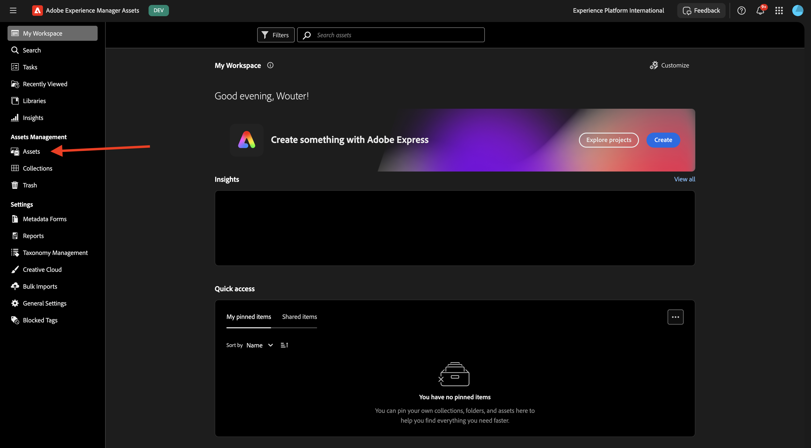
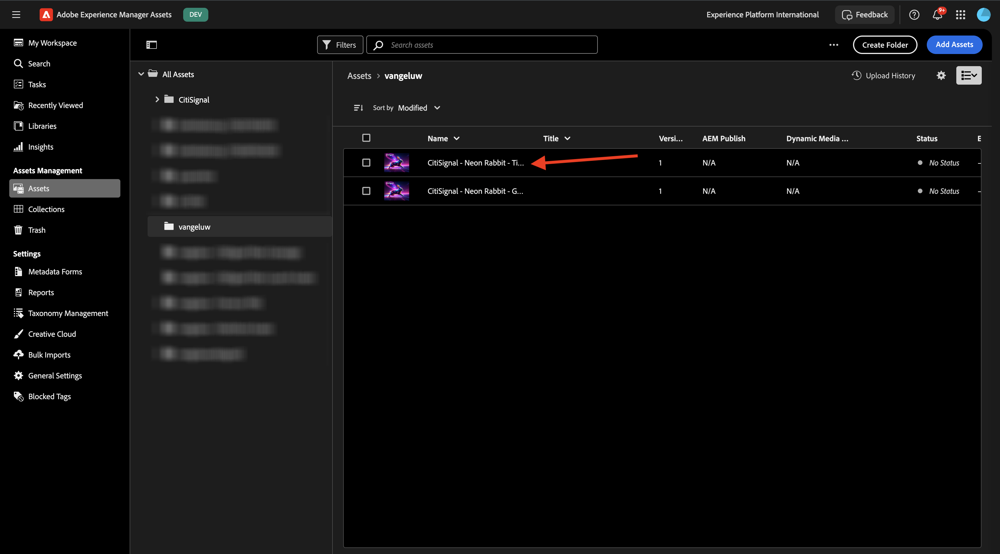

# 1.2.1 AEM Assets快速入门

转到[https://experience.adobe.com/](https://experience.adobe.com/){target="_blank"}。 确保您处于正确的环境，该环境应名为`--aepImsOrgName--`。

打开&#x200B;**Adobe Experience Manager Assets**。

选择分配给您的AEM Assets CS环境。 在这种情况下，要选择的环境是`--aepUserLdap-- - CitiSignal dev author`。

您应该会看到此内容。 转到&#x200B;**Assets**。

您应使用名为`--aepUserLdap-- - CitiSignal Fiber Campaign`的文件夹。 如果该文件夹尚不存在，请单击&#x200B;**创建文件夹**。

输入文件夹的名称`--aepUserLdap--`，然后单击&#x200B;**创建**。

打开新创建的文件夹。 在上一个练习中，您创建了2个名为`CitiSignal - Neon Rabbit - Get On Board Now!.png`和`CitiSignal - Neon Rabbit - Timetravel now!.png`的图像。 如果这些图像尚不存在，您现在需要将这些图像上传到此文件夹中。

如果不再有这些文件，您可以在[此处](./images/CitiSignal_Neon_Rabbit.zip){target="_blank"}下载它们。

单击&#x200B;**添加Assets**。

选择上面提到的2张图像。 单击&#x200B;**打开**。

单击&#x200B;**上传**。

单击其中一个图像将其选定。

单击&#x200B;**详细信息**。

您现在可以看到特定文件的可用元数据。

在右菜单中，转到&#x200B;**节目**。 然后，您将看到所选图像的多个预定义演绎版，并且能够下载它们。

在右菜单中，单击&#x200B;**剪刀**&#x200B;图标。 您发现许多可用的编辑操作，这些操作由Adobe Express提供支持。 单击&#x200B;**删除背景**。

几秒钟后，您应该会看到与此类似的内容，能够应用更改或下载新文件。 关闭弹出窗口。

剪切&#x200B;**裁切图像**。

您可以测试不同裁剪大小的一些变体。

在右菜单中，转到&#x200B;**任务**。 单击&#x200B;**分配任务**。

将&#x200B;**任务标题**&#x200B;设置为`Review image & approve`。 分配您自己。 单击&#x200B;**创建**。

单击通知上的&#x200B;**查看**。

或者，刷新屏幕以查看新创建的任务显示在&#x200B;**相关任务**&#x200B;列表中。 单击&#x200B;**打开**&#x200B;按钮查看任务的详细信息。

然后您应该会看到类似这样的内容。 单击&#x200B;**批准**。

单击&#x200B;**批准**&#x200B;以确认。

您的资源现已在AEM Assets中获得批准。

下一步：[摘要和优点](./summary.md){target="_blank"}

返回[Adobe Experience Manager Assets](./aemassets.md){target="_blank"}

[返回所有模块](./../../../overview.md){target="_blank"}
