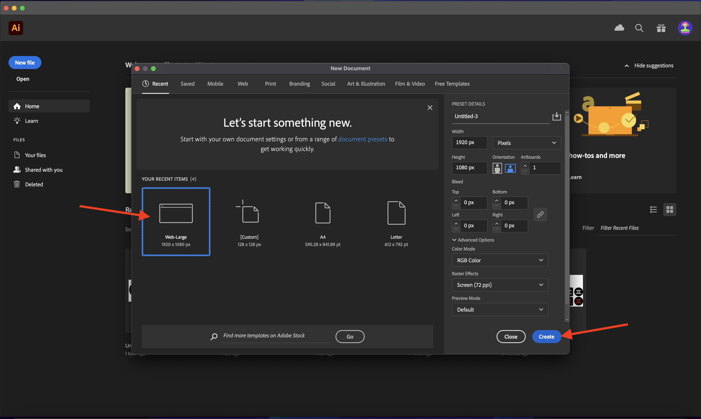
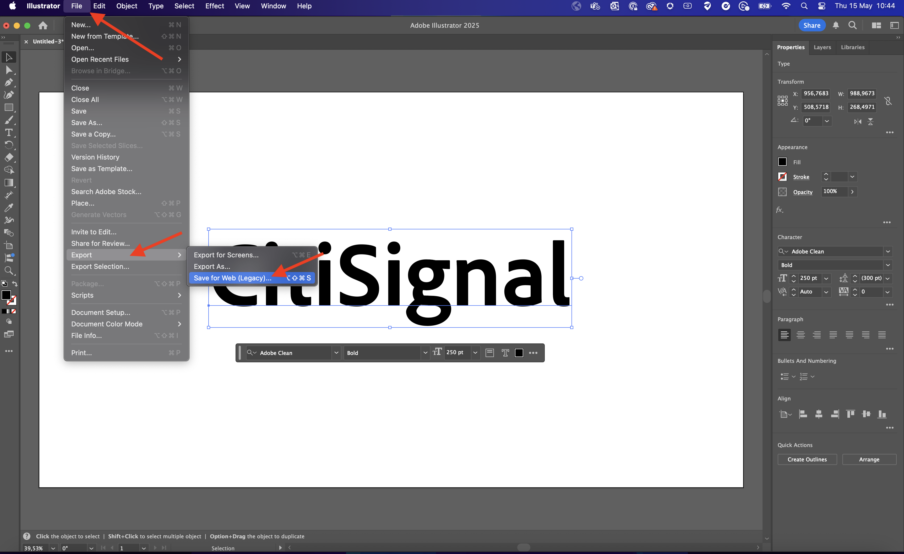
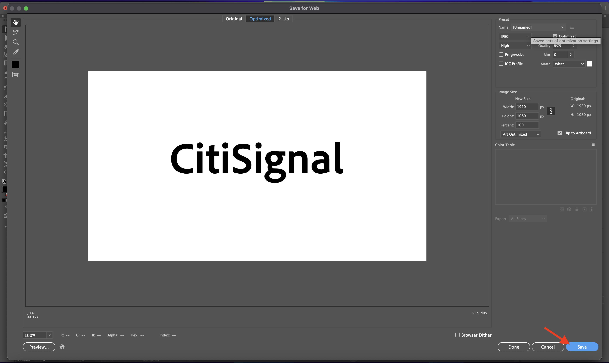
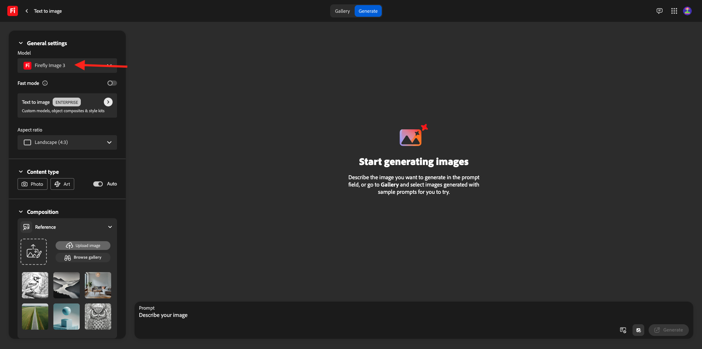
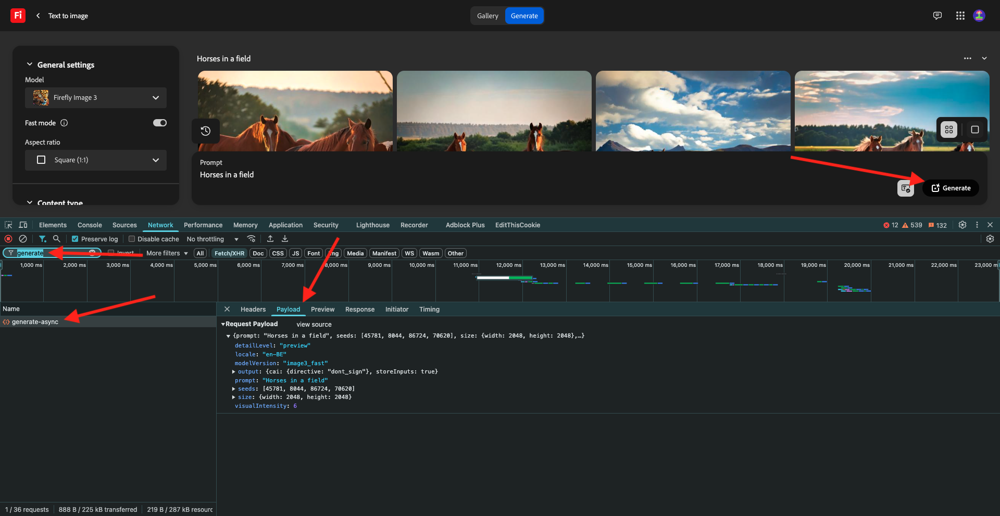
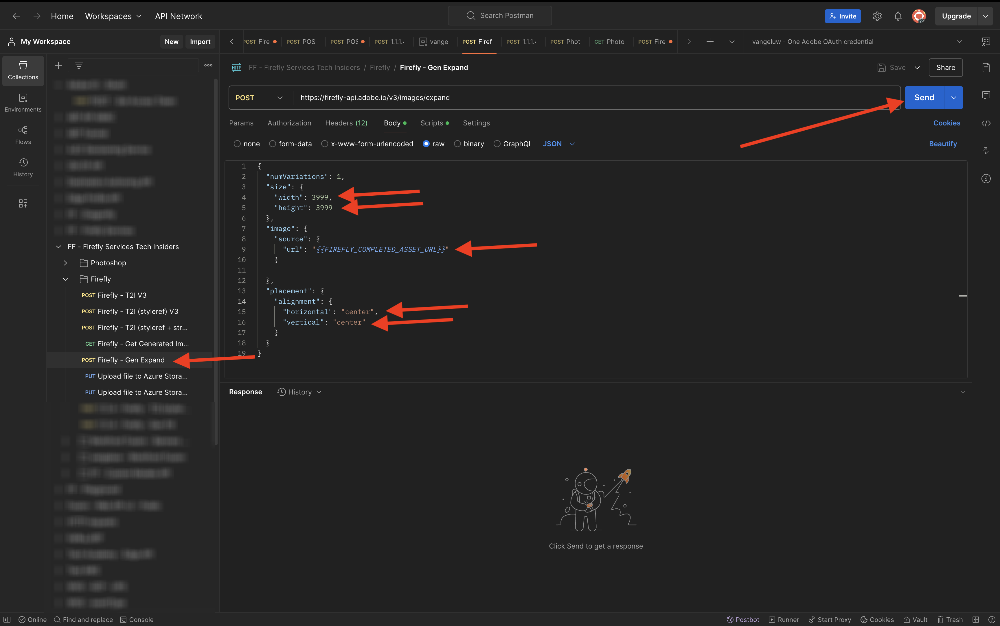
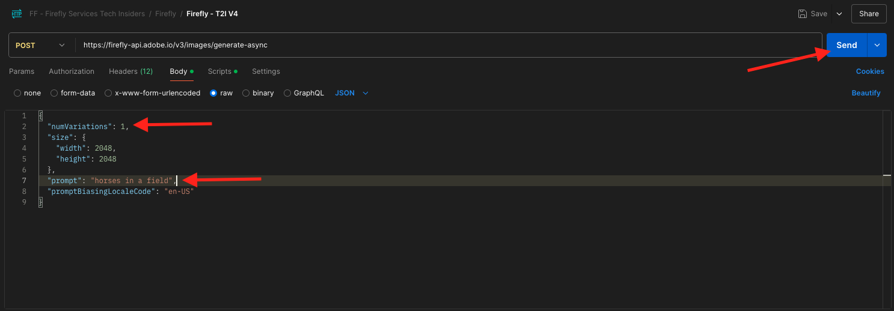

# 1.1.1 Firefly Services快速入门

了解如何使用Postman和Adobe I/O查询Adobe Firefly Services API。

## 1.1.1.1先决条件

在继续此练习之前，您需要完成[您的Adobe I/O项目](./../../../modules/getting-started/gettingstarted/ex6.md)的设置，还需要配置应用程序以与API交互，例如[Postman](./../../../modules/getting-started/gettingstarted/ex7.md)或[PostBuster](./../../../modules/getting-started/gettingstarted/ex8.md)。

## 1.1.1.2浏览firefly.adobe.com — 第1阶段

让我们开始探索Adobe Firefly Services。 对于探究，您首先会看到CitiSignal图像生成示例。 CitiSignal设计团队希望生成CitiSignal品牌名称的霓虹版本。 他们希望使用Adobe Firefly Services来做到这一点。

要实现这一点，首先需要的是CitiSignal品牌名称的黑白版本，它看起来像这样：


### 1.1.1.2.1创建合成参考图像

您可以使用[此示例图像](./images/CitiSignal.jpg)，也可以创建自己的文本进行试验。 请按照Adobe Illustrator中的以下步骤创建自己的图像文件。 如果您选择使用预定义的图像，请跳过以下部分并转到步骤&#x200B;**1.1.1.2。2直接生成图像**。

打开&#x200B;**Adobe Illustrator**。 单击&#x200B;**新建文件**。


选择&#x200B;**Web-Large 1920 x 1080px**。 单击&#x200B;**创建**。



然后您应该拥有此项。 单击&#x200B;**T**&#x200B;文本图标。


然后您应该拥有此项。


将字体类型更改为所选字体，在此示例中字体类型为&#x200B;**Adobe Clean Bold**。


将字体大小更改为所选大小，在此示例中为&#x200B;**250 pt**。


然后您应该拥有此项。


根据需要更改文本，在本例中为&#x200B;**CitiSignal**。


将文件中的文本居中对齐。


转到&#x200B;**文件>导出>保存以用于Web（旧版）**



然后您应该拥有此项。 单击&#x200B;**保存**。



为您的文件提供一个名称并将其保存到桌面。 单击&#x200B;**保存**。


### 1.1.1.2.2生成图像

转到[https://firefly.adobe.com](https://firefly.adobe.com)。 单击&#x200B;**配置文件**&#x200B;图标，并确保您已登录到右侧的&#x200B;**帐户**，它应为`--aepImsOrgName--`。 如果需要，请单击&#x200B;**切换配置文件**&#x200B;以切换到该帐户。


输入提示`neon light lettering on a brick wall of a night club`。 单击&#x200B;**生成**。


然后，您应该有类似于此的内容。 这些图像还没有用处。 在&#x200B;**合成**&#x200B;下，单击&#x200B;**上传图像**。


选择您之前创建的图像，在本例中为&#x200B;**CitiSignal.jpg**。 单击&#x200B;**打开**，然后单击&#x200B;**生成**。


然后，您应该有类似于此的内容。 合成参考的应用还不够好。 若要更改此值，请将&#x200B;**强度**&#x200B;滑块更改为最大值。 再次单击&#x200B;**生成**。


现在，您有几张图像显示了CitiSignal品牌名称的纯新版本，您可以使用该版本进行进一步迭代。


现在，您已学会使用Firefly在几分钟内解决设计问题。

## 1.1.1.3浏览firefly.adobe.com — 第2阶段

转到[https://firefly.adobe.com/generate/image](https://firefly.adobe.com/generate/image)。 您应该会看到此内容。 单击&#x200B;**模型**&#x200B;下拉列表。 您会注意到Adobe Firefly Services有3个可用版本：

- Firefly图像3
- Firefly图像4
- Firefly Image 4 Ultra


>[!NOTE]
>
>Firefly Image 3和Image 4可供使用Adobe Firefly Services的每个人使用，而Firefly Image 4 Ultra需要Firefly Pro许可证。

单击以为此练习选择&#x200B;**Firefly图像3**。



输入提示`Horses in a field`并单击&#x200B;**生成**。


然后，您应该会看到类似以下的内容。


接下来，在浏览器中打开&#x200B;**开发人员工具**。


您应该会看到此内容。 转到&#x200B;**网络**&#x200B;选项卡。 然后，再次单击&#x200B;**生成**。


输入搜索词&#x200B;**generate-async**。 然后，您应该会看到名称为&#x200B;**generate-async**&#x200B;的请求。 选择它，然后转到&#x200B;**有效负荷**，您将在其中查看请求的详细信息。



您在此处看到的请求是发送到Firefly Services服务器端后端的请求。 它包含几个重要参数：

- **prompt**：这是您的提示，请求Firefly应生成哪种图像

- **种子**：在此请求中，种子是以随机方式生成的。 每当Firefly生成图像时，它都会默认通过选取称为种子的随机数来开始此过程。 此随机数决定了每个图像的唯一性，当您要生成各种图像时，这是非常好的。 但是，有时您可能希望跨多个请求生成彼此相似的图像。 例如，当Firefly生成您要使用Firefly的其他选项（例如样式预设、引用图像等）修改的图像时，请在将来的HTTP请求中使用该图像的种子来限制未来图像的随机性，并关注所需的图像。


请再次查看UI。 将&#x200B;**宽高比**&#x200B;更改为&#x200B;**宽屏(16:9)**。


向下滚动到&#x200B;**效果**，转到&#x200B;**主题**&#x200B;并选择一种效果，如&#x200B;**装饰艺术效果**。


确保仍在浏览器中打开&#x200B;**开发人员工具**。 然后，单击&#x200B;**生成**&#x200B;并检查正在发送的网络请求。


现在，当您检查网络请求的详细信息时，将会看到以下内容：

- 与上一个请求相比，**prompt**&#x200B;未发生更改
- 与上一个请求相比，**种子**&#x200B;已更改
- 根据&#x200B;**长宽比**&#x200B;中的更改，**大小**&#x200B;已更改。
- 已添加&#x200B;**样式**，并引用了您选择的&#x200B;**art_deco**&#x200B;效果


在下一个练习中，您需要使用&#x200B;**seed**&#x200B;编号之一。 写下选择的种子号。

>[!NOTE]
>
>种子数是在单击&#x200B;**生成**&#x200B;时选择的随机数。 如果您希望在多个&#x200B;**生成**&#x200B;请求中对生成的图像有一致的外观，请务必记住并指定在以后的请求中选择的&#x200B;**种子号**。

在下一个练习中，您将使用Firefly Services执行类似操作，但随后会使用API而不是UI。 在此示例中，第一个图像的种子号为&#x200B;**142194**，该图像有2匹马头朝对方看着。

## 1.1.1.4 Adobe I/O - access_token

在&#x200B;**Adobe IO - OAuth**&#x200B;集合中，选择名为&#x200B;**POST — 获取访问令牌**&#x200B;的请求，然后选择&#x200B;**发送**。 响应应包含新的&#x200B;**accestoken**。


## 1.1.1.5 Firefly Services API，文本2图像，图像3

现在您拥有了有效且新鲜的access_token，您可以向Firefly Services API发送您的第一个请求了。

从&#x200B;**FF - Firefly Services技术内部人士**&#x200B;收藏集中选择名为&#x200B;**POST - Firefly - T2I V3**&#x200B;的请求。 转到&#x200B;**正文**&#x200B;并验证提示。 单击&#x200B;**发送**。

您在此使用的请求是一个&#x200B;**同步**&#x200B;请求，该请求会在几秒钟内为您提供一个包含所请求图像的响应。

>[!NOTE]
>
>随着Firefly Image 4和Image 4 Ultra的发布，将弃用同步请求以支持异步请求。 在本教程的后面，您将找到有关异步请求的练习。


从响应中复制（或单击）图像URL，然后在Web浏览器中打开该URL以查看图像。


您应该会看到一个美妙的图像，其中描绘了`horses in a field`。


在请求&#x200B;**POST - Firefly - T2I V3**&#x200B;的&#x200B;**Body**&#x200B;中，在字段`"promptBiasingLocaleCode": "en-US"`下添加以下内容，并使用Firefly Services UI随机使用的种子编号之一替换变量`XXX`。 在此示例中，**seed**&#x200B;编号为`142194`。

```json
,
  "seeds": [
    XXX
  ]
```

单击&#x200B;**发送**。 然后，您将收到包含Firefly Services生成的新图像的响应。 打开图像以进行查看。


然后，您应该会看到基于已使用的&#x200B;**种子**&#x200B;而略有差异的新图像。 种子`142194`有2匹马相互注视，两匹马的头相互对视。


接下来，在请求&#x200B;**POST - Firefly - T2I V3**&#x200B;的&#x200B;**Body**&#x200B;中，将以下&#x200B;**样式**&#x200B;对象粘贴到&#x200B;**seed**&#x200B;对象下。 这会将生成的图像的样式更改为&#x200B;**art_deco**。

```json
,
  "contentClass": "art",
  "styles": {
    "presets": [
      "art_deco"
    ],
    "strength": 50
  }
```

然后您应该拥有此项。 单击&#x200B;**发送**。


单击图像URL以将其打开。


您的图像现在发生了一些更改。 应用样式预设时，种子图像的应用方式不再与之前相同。 总的来说，使用生成型人工智能，很难保证输入参数的相同组合能够生成相同的图像。


从请求的&#x200B;**Body**&#x200B;中删除&#x200B;**seed**&#x200B;对象的代码。 单击&#x200B;**发送**，然后单击从响应中获得的图像URL。

```json
,
  "seeds": [
    XXX
  ]
```


您的图像现在又发生了一些更改。


## 1.1.1.6 Firefly Services API，一般扩展

从&#x200B;**FF - Firefly Services技术内部人士**&#x200B;集合中选择名为&#x200B;**POST - Firefly - Gen Expand**&#x200B;的请求，并转到该请求的&#x200B;**正文**。

- **大小**：输入所需分辨率。 此处输入的值应大于图像的原始大小，且不能大于3999。
- **image.source.url**：此字段需要指向需要扩展的图像的链接。 在此示例中，变量用于引用上一个练习中生成的图像。

- **水平对齐方式**：接受的值为： `"center"`，`"left`，`"right"`。
- **垂直对齐**：接受的值为： `"center"`，`"top`，`"bottom"`。



单击响应中包含的图像URL。


您会看到在上一个练习中生成的图像现在已扩展到3999x3999的分辨率。


当更改放置的对齐方式时，输出也将略有不同。 在此示例中，位置被更改为&#x200B;**左，底部**。 单击&#x200B;**发送**，然后单击以打开生成的图像URL。


然后您应该看到原始图像以不同的位置使用，这会影响整个图像。


## 1.1.1.7 Firefly Services API，文本2图像，图像4和图像4 Ultra

### 1.1.1.7.1 image4_standard

从&#x200B;**FF - Firefly Services Tech Insiders**&#x200B;集合中选择名为&#x200B;**POST - Firefly - T2I V4**&#x200B;的请求，并转到该请求的&#x200B;**Headers**。

您会注意到该请求的URL与&#x200B;**Firefly Services API，文本2图像，图像3**&#x200B;请求不同，即&#x200B;**https://firefly-api.adobe.io/v3/images/generate**。 此URL指向&#x200B;**https://firefly-api.adobe.io/v3/images/generate-async**。 在URL中添加&#x200B;**-async**&#x200B;意味着您使用的是异步终结点。

在&#x200B;**标头**&#x200B;变量中，您会注意到名为&#x200B;**x-model-version**&#x200B;的新变量。 这是与Firefly Image 4和Image 4 Ultra交互时所需的标头。 要在生成图像时使用Firefly Image 4或Image 4 Ultra，则应将标头的值设置为`image4_standard`或`image4_ultra`。 在此示例中，您将使用`image4_standard`。


转到请求的&#x200B;**正文**。 您应该会在正文中看到，正在请求4个图像变体。 提示与以前相比没有变化，并且仍在请求生成字段&#x200B;**中的**&#x200B;马。 单击&#x200B;**发送**


然后您会立即得到响应。 与之前使用的同步请求相反，此响应不包含所生成图像的图像URL。 它包含您启动的作业的状态报告的URL，并且包含另一个允许您取消正在运行的作业的URL。


要检查正在运行的作业的状态报告，请从&#x200B;**FF - Firefly技术内部人士**&#x200B;集合中选择名为&#x200B;**GET - Firefly Services — 获取状态报告**&#x200B;的请求。 单击以将其打开，然后单击&#x200B;**发送**。


然后，您将看到刚刚启动的图像生成作业的状态报表。 验证字段&#x200B;**状态**，因为该字段可能设置为&#x200B;**正在运行**，这意味着作业尚未完成。 在此示例中，作业状态设置为&#x200B;**succeeded**，这意味着已生成您请求的图像。


在响应中向下滚动一点，您随后应该会看到Adobe Firefly Services返回的共4个图像变体。 单击（或复制）其中一个图像的URL，然后在浏览器中将其打开。


然后，您应该会在字段&#x200B;**中看到**&#x200B;匹马的超真实图像。


### 1.1.1.7.2 image4_ultra

从&#x200B;**FF - Firefly Services Tech Insiders**&#x200B;集合返回名为&#x200B;**POST - Firefly - T2I V4**&#x200B;的请求，并转到请求的&#x200B;**Headers**。

将变量&#x200B;**x-model-version**&#x200B;更改为`image4_ultra`。 在此示例中，您将使用`image4_standard`。


转到请求的&#x200B;**正文**。 在正文中，将图像变体的数量更改为1，就像Firefly Image 4 Ultra一样，一次只能生成1个图像。 提示与以前相比没有变化，并且仍在请求生成字段&#x200B;**中的**&#x200B;马。 单击&#x200B;**发送**



响应中再次包含已启动作业的状态报告的URL，并且包含另一个允许您取消正在运行的作业的URL。


要检查正在运行的作业的状态报告，请从&#x200B;**FF - Firefly技术内部人士**&#x200B;集合中选择名为&#x200B;**GET - Firefly Services — 获取状态报告**&#x200B;的请求。 单击以将其打开，然后单击&#x200B;**发送**。


然后，您将看到刚刚启动的图像生成作业的状态报表。 验证字段&#x200B;**状态**，因为该字段可能设置为&#x200B;**正在运行**，这意味着作业尚未完成。 在此示例中，作业状态设置为&#x200B;**succeeded**，这意味着已生成您请求的图像。


然后，您应该会在字段&#x200B;**中看到**&#x200B;匹马的超真实图像。


## 后续步骤

转到[使用Microsoft Azure和预签名URL优化您的Firefly进程](./ex2.md){target="_blank"}

返回[Adobe Firefly Services概述](./firefly-services.md){target="_blank"}

返回[所有模块](./../../../overview.md){target="_blank"}
