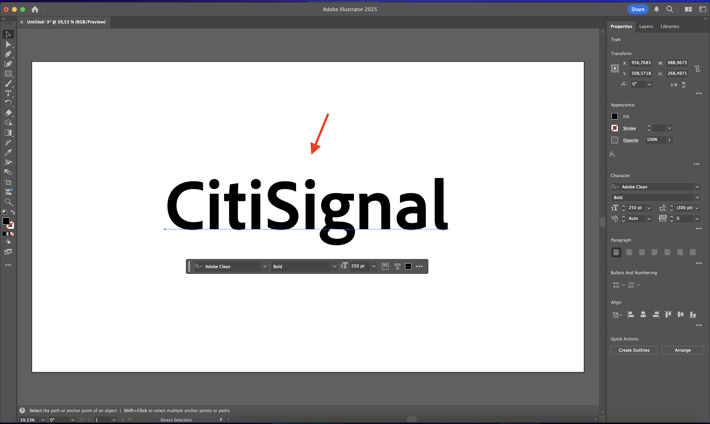
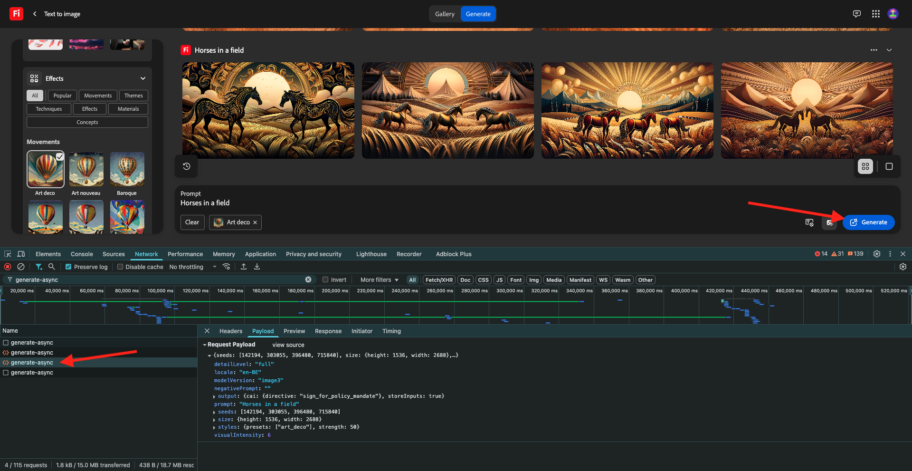
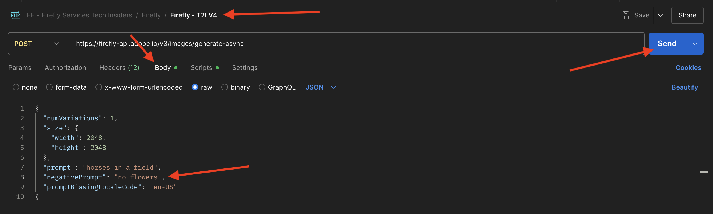

# 1.1.1 Firefly Services快速入门

Firefly Services包括&#x200B;**Firefly API**、**Lightroom API**、**Photoshop API**、**InDesign API**&#x200B;和&#x200B;**内容标记API**。

这些API包将Adobe的创作工具(如Photoshop和Lightroom)的强大功能与前沿的AI/ML功能（如内容标记、创成性填充、文本到图像等）结合起来。

使用Firefly Services，您不仅要创建，还要自动化、扩展内容生产，并利用最新的AI/ML技术来强化工作流程。

在本练习中，您将了解如何使用Postman和Adobe I/O来使用各种Adobe Firefly Services API。

本练习专门针对Firefly API，例如：

- **Firefly生成图像API**：此API用于使用Firefly的模型生成图像
- **Firefly生成类似图像API**：此API用于生成与现有图像类似的图像
- **Firefly扩展图像API**：此API用于将现有图像扩展为更大的宽高比/大小
- **Firefly填充图像API**：此API根据Firefly基于您的提示生成的图像填充现有图像的区域。 这是使用定义需要填充的区域的蒙版来实现的。
- **Firefly生成对象复合API**：此API允许您自行提供输入图像，然后将您的图像与Firefly生成的图像组合以创建图像复合或场景。
- **Firefly自定义模型API**：此API允许您使用自己的Firefly自定义模型，以根据您的Firefly自定义模型生成新图像

## 1.1.1.1先决条件

在继续此练习之前，您需要完成[您的Adobe I/O项目](./../../../modules/getting-started/gettingstarted/ex6.md)的设置，还需要配置应用程序以与API交互，例如[Postman](./../../../modules/getting-started/gettingstarted/ex7.md)或[PostBuster](./../../../modules/getting-started/gettingstarted/ex8.md)。

## 1.1.1.2 API基础知识

有多种类型的API请求：

- **GET**：在尝试从API端点检索信息（如获取状态报告）时，将使用此项
- **POST**：在需要执行新操作时(例如让Adobe Firefly Services生成新图像)，将使用此选项
- **PUT**：用于完全更新现有数据
- **PATCH**：用于有选择地更新现有数据
- **DELETE**：用于删除数据

在使用API时，您还会注意到各个API端点返回的响应代码。

您可能会收到5种不同类型的响应：

- **1xx信息响应**：已收到请求，正在继续进程
- **2xx成功**：已成功接收、理解和接受该请求
- **3xx重定向**：需要执行进一步操作才能完成请求
- **4xx客户端错误**：请求包含语法错误或无法完成
- **5xx服务器错误**：服务器未能完成明显有效的请求

以下是您可能会期望得到的常见响应代码示例：

- **200 OK**：很好，您的请求已成功完成
- **201已创建**：很好，例如，您的图像已创建
- **202 Accepted**：很好，您的请求已被接受，将进行处理
- **401 Unauthorized**：这不是好事，您的访问令牌可能无效
- **403禁止访问**：这不是好事，您可能缺少尝试执行的操作所需的权限
- **404未找到**：这不是好事，可能您尝试访问的URL不存在
- **429请求太多**：这不是好事，您可能已在短时间内发送了多个请求。 请稍后重试。

## 1.1.1.3浏览firefly.adobe.com — 第1阶段

让我们开始探索Adobe Firefly Services。 对于探索，您首先会看一下CitiSignal图像生成示例。 CitiSignal设计团队希望生成CitiSignal品牌名称的霓虹版本。 他们希望使用Adobe Firefly Services来做到这一点。

要实现这一点，首先需要的是CitiSignal品牌名称的黑白版本，它看起来像这样：


### 1.1.1.3.1创建合成参考图像

您可以使用[此示例图像](./images/CitiSignal.jpg)，也可以创建自己的文本进行试验。 请按照Adobe Illustrator中的以下步骤创建自己的图像文件。 如果您选择使用预定义的图像，请跳过以下部分并转到步骤&#x200B;**1.1.1.3。2直接生成图像**。

打开&#x200B;**Adobe Illustrator**。 单击&#x200B;**新建文件**。


选择&#x200B;**Web-Large 1920 x 1080px**。 单击&#x200B;**创建**。


然后您应该拥有此项。 单击&#x200B;**T**&#x200B;文本图标。


然后您应该拥有此项。


将字体类型更改为所选字体，在此示例中字体类型为&#x200B;**Adobe Clean Bold**。


将字体大小更改为所选大小，在此示例中为&#x200B;**250 pt**。


然后您应该拥有此项。


根据需要更改文本，在本例中为&#x200B;**CitiSignal**。


将文件中的文本居中对齐。



转到&#x200B;**文件>导出>保存以用于Web（旧版）**


然后您应该拥有此项。 单击&#x200B;**保存**。


为您的文件提供一个名称并将其保存到桌面。 单击&#x200B;**保存**。


### 1.1.1.3.2生成图像

转到[https://firefly.adobe.com](https://firefly.adobe.com)。 单击&#x200B;**配置文件**&#x200B;图标，并确保您已登录到右侧的&#x200B;**帐户**，它应为`--aepImsOrgName--`。 如果需要，请单击&#x200B;**切换配置文件**&#x200B;以切换到该帐户。


输入提示`neon light lettering on a brick wall of a night club`。 单击&#x200B;**生成**。


然后，您应该有类似于此的内容。 这些图像还没有用处。 在&#x200B;**合成**&#x200B;下，单击&#x200B;**上传图像**。


选择您之前创建的图像，在本例中为&#x200B;**CitiSignal.jpg**。 单击&#x200B;**打开**，然后单击&#x200B;**生成**。


然后，您应该有类似于此的内容。 合成参考的应用还不够好。 若要更改此值，请将&#x200B;**强度**&#x200B;滑块更改为最大值。 再次单击&#x200B;**生成**。


现在，您有几张图像显示了CitiSignal品牌名称的纯新版本，您可以使用该版本进行进一步迭代。


现在，您已学会使用Firefly在几分钟内解决设计问题。

## 1.1.1.4浏览firefly.adobe.com — 第2阶段

转到[https://firefly.adobe.com/generate/image](https://firefly.adobe.com/generate/image)。 您应该会看到此内容。 单击&#x200B;**模型**&#x200B;下拉列表。 您会注意到Adobe Firefly Services有3个可用版本：

- Firefly Image 3
- Firefly图像4
- Firefly Image 4 Ultra


>[!NOTE]
>
>Firefly Image 3和Image 4可供使用Adobe Firefly Services的每个人使用，而Firefly Image 4 Ultra需要Firefly Pro许可证。

单击以为此练习选择&#x200B;**Firefly Image 3**。


输入提示`Horses in a field`并单击&#x200B;**生成**。


然后，您应该会看到类似以下的内容。


接下来，在浏览器中打开&#x200B;**开发人员工具**。


您应该会看到此内容。 转到&#x200B;**网络**&#x200B;选项卡。 然后，再次单击&#x200B;**生成**。


输入搜索词&#x200B;**generate-async**。 然后，您应该会看到名称为&#x200B;**generate-async**&#x200B;的请求。 选择它，然后转到&#x200B;**有效负荷**，您将在其中查看请求的详细信息。


您在此处看到的请求是发送到Firefly Services服务器端后端的请求。 它包含几个重要参数：

- **prompt**：这是您的提示，请求Firefly应生成哪种图像

- **种子**：在此请求中，种子是以随机方式生成的。 每当Firefly生成图像时，它都会默认通过选取称为种子的随机数来开始此过程。 此随机数决定了每个图像的唯一性，当您要生成各种图像时，这是非常好的。 但是，有时您可能希望跨多个请求生成彼此相似的图像。 例如，当Firefly生成您要使用Firefly的其他选项（例如样式预设、引用图像等）修改的图像时，请在将来的HTTP请求中使用该图像的种子来限制未来图像的随机性，并关注所需的图像。


请再次查看UI。 将&#x200B;**宽高比**&#x200B;更改为&#x200B;**宽屏(16:9)**。


向下滚动到&#x200B;**效果**，转到&#x200B;**主题**&#x200B;并选择一种效果，如&#x200B;**装饰艺术效果**。


确保仍在浏览器中打开&#x200B;**开发人员工具**。 然后，单击&#x200B;**生成**&#x200B;并检查正在发送的网络请求。



现在，当您检查网络请求的详细信息时，将会看到以下内容：

- 与上一个请求相比，**prompt**&#x200B;未发生更改
- 与上一个请求相比，**种子**&#x200B;已更改
- 根据&#x200B;**长宽比**&#x200B;中的更改，**大小**&#x200B;已更改。
- 已添加&#x200B;**样式**，并引用了您选择的&#x200B;**art_deco**&#x200B;效果


在下一个练习中，您需要使用&#x200B;**seed**&#x200B;编号之一。 写下选择的种子号。

>[!NOTE]
>
>种子数是在单击&#x200B;**生成**&#x200B;时选择的随机数。 如果您希望在多个&#x200B;**生成**&#x200B;请求中对生成的图像有一致的外观，请务必记住并指定在以后的请求中选择的&#x200B;**种子号**。

在下一个练习中，您将使用Firefly Services执行类似操作，但随后会使用API而不是UI。 在此示例中，第一个图像的种子号为&#x200B;**142194**，该图像有2匹马头朝对方看着。

## 1.1.1.5 Adobe I/O - access_token

在&#x200B;**Adobe IO - OAuth**&#x200B;集合中，选择名为&#x200B;**POST — 获取访问令牌**&#x200B;的请求，然后选择&#x200B;**发送**。 响应应包含新的&#x200B;**access_token**。


## 1.1.1.6 Firefly Services API，文本2图像，图像3

现在您拥有了有效且新鲜的access_token，您可以向Firefly Services API发送您的第一个请求了。

您将在此处使用的请求是一个&#x200B;**异步**&#x200B;请求，该请求为您提供包含已提交作业的URL的响应，这意味着您将需要使用第二个请求来检查作业的状态并访问生成的图像。

>[!NOTE]
>
>随着Firefly Image 4和Image 4 Ultra的发布，将弃用同步请求以支持异步请求。

从&#x200B;**FF - Firefly Services Tech Insiders**&#x200B;收藏集中选择名为&#x200B;**POST - Firefly - T2I V3 async**&#x200B;的请求。 转到&#x200B;**标头**&#x200B;并验证键/值对组合。

| 键 | 值 |
|:-------------:| :---------------:| 
| `x-api-key` | `{{API_KEY}}` |
| `Authorization` | `Bearer {{ACCESS_TOKEN}}` |

此请求中的这两个值都引用了预先定义的环境变量。 `{{API_KEY}}`引用您的Adobe I/O项目的字段&#x200B;**客户端ID**。 在本教程的&#x200B;**快速入门**&#x200B;部分中，您已在Postman中进行配置。

字段&#x200B;**Authorization**&#x200B;的值是位特殊值： `Bearer {{ACCESS_TOKEN}}`。 它包含对您在上一步中生成的&#x200B;**访问令牌**&#x200B;的引用。 当您在&#x200B;**Adobe IO - OAuth**&#x200B;集合中使用请求&#x200B;**POST - Get Access Token**&#x200B;收到&#x200B;**访问令牌**&#x200B;时，Postman中运行了一个脚本，该脚本将字段&#x200B;**access_token**&#x200B;存储为环境变量，该变量现已在请求&#x200B;**POST - Firefly - T2I V3异步**&#x200B;中引用。 请注意特定添加的&#x200B;**Bearer**&#x200B;一词和`{{ACCESS_TOKEN}}`之前的空格。 单词载体区分大小写，并且需要空格。 如果未正确执行此操作，Adobe I/O将返回&#x200B;**401 Unauthorized**&#x200B;错误，因为它无法正确处理您的&#x200B;**访问令牌**。


接下来，转到&#x200B;**正文**&#x200B;并验证提示。 单击&#x200B;**发送**。


然后您会立即得到响应。 此响应不包含已生成图像的图像URL，而是包含您启动的作业的状态报告的URL，并且包含另一个允许您取消正在运行的作业的URL。

>[!NOTE]
>
>您使用的Postman集合已配置为使用动态变量。 例如，由于在PostmanPostman中配置了&#x200B;**脚本**，字段&#x200B;**statusUrl**&#x200B;已存储为动态变量。


要检查正在运行的作业的状态报告，请从&#x200B;**FF - Firefly技术内部人士**&#x200B;集合中选择名为&#x200B;**GET - Firefly Services — 获取状态报告**&#x200B;的请求。 单击以将其打开，然后单击&#x200B;**发送**。 选择所生成图像的URL并在浏览器中将其打开。

>[!NOTE]
>
>您使用的Postman集合已配置为使用动态变量。 例如，上一请求的字段&#x200B;**statusUrl**&#x200B;在Postman中存储为动态变量，现在正将其用作&#x200B;**GET - Firefly — 获取状态报告**&#x200B;请求的URL。


您应该已经收到了类似的响应。 这是已执行的作业的概述。 您可以看到包含所生成图像的字段&#x200B;**url**。 从响应中复制（或单击）图像URL，然后在Web浏览器中打开该URL以查看图像。


您应该会看到一个美妙的图像，其中描绘了`horses in a field`。


在请求&#x200B;**POST - Firefly - T2I V3异步**&#x200B;的&#x200B;**Body**&#x200B;中，在字段`"promptBiasingLocaleCode": "en-US"`下添加以下内容，并使用Firefly Services UI随机使用的种子编号之一替换变量`XXX`。 在此示例中，**seed**&#x200B;编号为`142194`。

```json
,
  "seeds": [
    XXX
  ]
```

单击&#x200B;**发送**。 然后，您将再次收到一个响应，其中包含指向您刚刚提交的作业的状态报告的链接。


要检查正在运行的作业的状态报告，请从&#x200B;**FF - Firefly技术内部人士**&#x200B;集合中选择名为&#x200B;**GET - Firefly Services — 获取状态报告**&#x200B;的请求。 单击以将其打开，然后单击&#x200B;**发送**。 选择所生成图像的URL并在浏览器中将其打开。


然后，您应该会看到基于已使用的&#x200B;**种子**&#x200B;而略有差异的新图像。 种子`142194`有2匹马相互注视，两匹马的头相互对视。


接下来，在请求&#x200B;**POST - Firefly - T2I V3异步**&#x200B;的&#x200B;**Body**&#x200B;中，将以下&#x200B;**样式**&#x200B;对象粘贴到&#x200B;**seed**&#x200B;对象下。 这会将生成的图像的样式更改为&#x200B;**art_deco**。

```json
,
  "contentClass": "art",
  "styles": {
    "presets": [
      "art_deco"
    ],
    "strength": 50
  }
```

然后您应该拥有此项。 单击&#x200B;**发送**。 然后，您将再次收到一个响应，其中包含指向您刚刚提交的作业的状态报告的链接。


要检查正在运行的作业的状态报告，请从&#x200B;**FF - Firefly技术内部人士**&#x200B;集合中选择名为&#x200B;**GET - Firefly Services — 获取状态报告**&#x200B;的请求。 单击以将其打开，然后单击&#x200B;**发送**。 选择所生成图像的URL并在浏览器中将其打开。


您的图像现在发生了一些更改。 应用样式预设时，种子图像的应用方式不再与之前相同。 总的来说，使用生成型人工智能，很难保证输入参数的相同组合能够生成相同的图像。


从&#x200B;**POST - Firefly - T2I V3异步**&#x200B;请求的&#x200B;**Body**&#x200B;中删除&#x200B;**seed**&#x200B;对象的代码。 单击&#x200B;**发送**，然后单击从响应中获得的图像URL。 然后，您将再次收到一个响应，其中包含指向您刚刚提交的作业的状态报告的链接。

```json
,
  "seeds": [
    XXX
  ]
```


要检查正在运行的作业的状态报告，请从&#x200B;**FF - Firefly技术内部人士**&#x200B;集合中选择名为&#x200B;**GET - Firefly Services — 获取状态报告**&#x200B;的请求。 单击以将其打开，然后单击&#x200B;**发送**。 选择所生成图像的URL并在浏览器中将其打开。


您的图像现在又发生了一些更改。


## 1.1.1.7 Firefly Services API，一般扩展

从&#x200B;**FF - Firefly Services Tech Insiders**&#x200B;集合中选择名为&#x200B;**POST - Firefly - Gen Expand异步**&#x200B;的请求，并转到该请求的&#x200B;**正文**。

- **大小**：输入所需分辨率。 此处输入的值应大于图像的原始大小，且不能大于3999。
- **image.source.url**：此字段需要指向需要扩展的图像的链接。 在此示例中，变量用于引用上一个练习中生成的图像。

- **水平对齐方式**：接受的值为： `"center"`，`"left`，`"right"`。
- **垂直对齐**：接受的值为： `"center"`，`"top`，`"bottom"`。


然后，您将再次收到一个响应，其中包含指向您刚刚提交的作业的状态报告的链接。


要检查正在运行的作业的状态报告，请从&#x200B;**FF - Firefly技术内部人士**&#x200B;集合中选择名为&#x200B;**GET - Firefly Services — 获取状态报告**&#x200B;的请求。 单击以将其打开，然后单击&#x200B;**发送**。 选择所生成图像的URL并在浏览器中将其打开。


您会看到在上一个练习中生成的图像现在已扩展到3999x3999的分辨率。


使用&#x200B;**Firefly - T2I V3异步**&#x200B;请求生成新图像。


要检查正在运行的作业的状态报告，请从&#x200B;**FF - Firefly技术内部人士**&#x200B;集合中选择名为&#x200B;**GET - Firefly Services — 获取状态报告**&#x200B;的请求。 单击以将其打开，然后单击&#x200B;**发送**。 选择所生成图像的URL并在浏览器中将其打开。


然后，您应该会看到类似图像。


从&#x200B;**FF - Firefly Services Tech Insiders**&#x200B;集合中选择名为&#x200B;**POST - Firefly - Gen Expand异步**&#x200B;的请求，并转到该请求的&#x200B;**正文**。

当更改放置的对齐方式时，输出也将略有不同。 在此示例中，位置被更改为&#x200B;**左，底部**。 单击&#x200B;**发送**。 然后，您将再次收到一个响应，其中包含指向您刚刚提交的作业的状态报告的链接。


要检查正在运行的作业的状态报告，请从&#x200B;**FF - Firefly技术内部人士**&#x200B;集合中选择名为&#x200B;**GET - Firefly Services — 获取状态报告**&#x200B;的请求。 单击以将其打开，然后单击&#x200B;**发送**。 选择所生成图像的URL并在浏览器中将其打开。


然后您应该看到原始图像以不同的位置使用，这会影响整个图像。


## 1.1.1.8 Firefly Services API，文本2图像，图像4和图像4 Ultra

在最新版本的Firefly Image Model 4中，提供了几项改进：

- Firefly Image Model 4提供2K分辨率输出，具有增强的定义和细节。
- Firefly Image Model 4在文本渲染、人类、动物和建筑方面做出了显着改进。
- Firefly Image Model 4秉承Adobe对IP友好、商业上安全的创新型人工智能的承诺。

Firefly Image Model 4为您提供卓越的人类、动物和详细场景图像，您可以使用图像模型4 Ultra生成具有超逼真的人际交互、建筑元素和复杂景观的图像&#x200B;。

### 1.1.1.8.1 image4_standard

从&#x200B;**FF - Firefly Services Tech Insiders**&#x200B;集合中选择名为&#x200B;**POST - Firefly - T2I V4**&#x200B;的请求，并转到该请求的&#x200B;**Headers**。

您会注意到该请求的URL与&#x200B;**Firefly Services API，文本2图像，图像3**&#x200B;请求不同，即&#x200B;**https://firefly-api.adobe.io/v3/images/generate**。 此URL指向&#x200B;**https://firefly-api.adobe.io/v3/images/generate-async**。 在URL中添加&#x200B;**-async**&#x200B;意味着您使用的是异步终结点。

在&#x200B;**标头**&#x200B;变量中，您会注意到名为&#x200B;**x-model-version**&#x200B;的新变量。 这是与Firefly Image 4和Image 4 Ultra交互时所需的标头。 要在生成图像时使用Firefly Image 4或Image 4 Ultra，则应将标头的值设置为`image4_standard`或`image4_ultra`。 在此示例中，您将使用`image4_standard`。

如果您未将&#x200B;**x-model-version**&#x200B;设置为`image4_standard`或`image4_ultra`，则Firefly Services当前将默认使用`image3`。


转到请求的&#x200B;**正文**。 您应该会在正文中看到，正在请求4个图像变体。 提示与以前相比没有变化，并且仍在请求生成字段&#x200B;**中的**&#x200B;马。 单击&#x200B;**发送**


然后您会立即得到响应。 此响应不包含已生成图像的图像URL，而是包含您启动的作业的状态报告的URL，并且包含另一个允许您取消正在运行的作业的URL。


要检查正在运行的作业的状态报告，请从&#x200B;**FF - Firefly技术内部人士**&#x200B;集合中选择名为&#x200B;**GET - Firefly Services — 获取状态报告**&#x200B;的请求。 单击以将其打开，然后单击&#x200B;**发送**。


然后，您将看到刚刚启动的图像生成作业的状态报表。 验证字段&#x200B;**状态**，因为该字段可能设置为&#x200B;**正在运行**，这意味着作业尚未完成。 在此示例中，作业状态设置为&#x200B;**succeeded**，这意味着已生成您请求的图像。


在响应中向下滚动一点，您随后应该会看到Adobe Firefly Services返回的共4个图像变体。 单击（或复制）其中一个图像的URL，然后在浏览器中将其打开。


然后，您应该会在字段&#x200B;**中看到**&#x200B;匹马的超真实图像。


### 1.1.1.8.2 image4_ultra

从&#x200B;**FF - Firefly Services Tech Insiders**&#x200B;集合返回名为&#x200B;**POST - Firefly - T2I V4**&#x200B;的请求，并转到请求的&#x200B;**Headers**。

将变量&#x200B;**x-model-version**&#x200B;更改为`image4_ultra`。 在此示例中，您将使用`image4_ultra`。


转到请求的&#x200B;**正文**。 在正文中，将图像变体的数量更改为1，就像Firefly Image 4 Ultra一样，一次只能生成1个图像。 提示与以前相比没有变化，并且仍在请求生成字段&#x200B;**中的**&#x200B;马。 单击&#x200B;**发送**


响应中再次包含已启动作业的状态报告的URL，并且包含另一个允许您取消正在运行的作业的URL。


要检查正在运行的作业的状态报告，请从&#x200B;**FF - Firefly技术内部人士**&#x200B;集合中选择名为&#x200B;**GET - Firefly Services — 获取状态报告**&#x200B;的请求。 单击以将其打开，然后单击&#x200B;**发送**。


然后，您将看到刚刚启动的图像生成作业的状态报表。 验证字段&#x200B;**状态**，因为该字段可能设置为&#x200B;**正在运行**，这意味着作业尚未完成。 在此示例中，作业状态设置为&#x200B;**succeeded**，这意味着已生成您请求的图像。


然后，您应该会在字段&#x200B;**中看到**&#x200B;匹马的超真实图像。


### 负面提示

如果您希望请求Firefly不要在将要生成的图像中包含某些内容，您可以在使用API时包含字段`negativePrompt`（此选项当前未向UI公开）。 例如，如果您不希望在执行字段&#x200B;**中的提示**&#x200B;马时包含任何花，则可以在API请求的&#x200B;**Body**&#x200B;中指定此内容：

```
"negativePrompt": "no flowers",
```

从&#x200B;**FF - Firefly Services技术内部人士**&#x200B;集合转到请求&#x200B;**POST - Firefly - T2I V4**，并转到请求的&#x200B;**Body**。 将以上文本粘贴到请求正文中。 单击&#x200B;**发送**。



您应该会看到此内容。


要检查正在运行的作业的状态报告，请从&#x200B;**FF - Firefly技术内部人士**&#x200B;集合中选择名为&#x200B;**GET - Firefly Services — 获取状态报告**&#x200B;的请求。 单击以将其打开，然后单击&#x200B;**发送**。 选择所生成图像的URL并在浏览器中将其打开。


然后您会看到生成的图像，该图像不应包含任何花朵。


## 后续步骤

转到[使用Microsoft Azure和预签名URL优化您的Firefly进程](./ex2.md){target="_blank"}

返回[Adobe Firefly Services概述](./firefly-services.md){target="_blank"}

返回[所有模块](./../../../overview.md){target="_blank"}