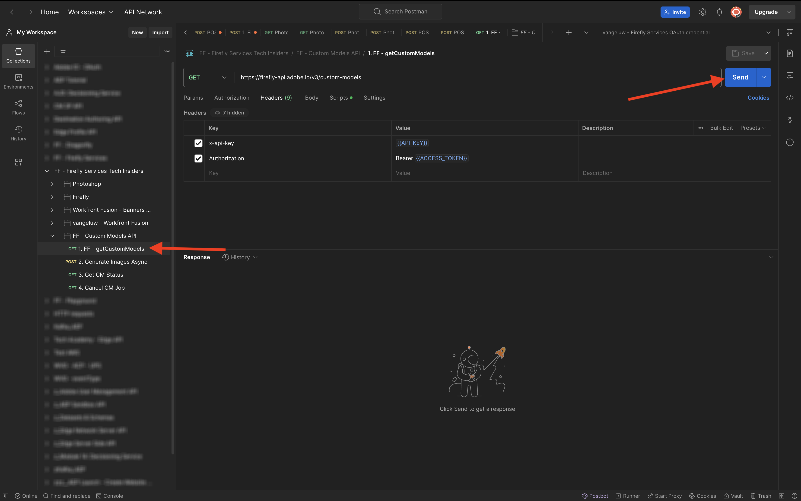

# 1.1.4 Firefly自定义模型API

## 1.1.4.1什么是Firefly自定义模型？

借助Firefly自定义模型，您可以使用文本到图像功能生成与品牌一致的图像变体。 通过使用您自己的图像来训练这些模型，可以生成反映您品牌标识的内容。
转变您的风格或主题以探索新想法、可视化不同环境、生成创新内容并根据特定区段定制内容。

借助Firefly自定义模型，您可以……

- 创建品牌内创意和概念
- 生成具有一致样式的字符主题
- 创建一致的品牌样式以快速扩展营销活动

要实现此目的，Firefly自定义模型支持：

- 自定义主题模型
- 自定义样式模型

### 自定义主题模型

针对特定主题（无论是对象还是字符）培训自定义模型时，目标是识别主题的基本特征，并帮助模型在不同上下文和位置中复制它们。

在训练主题模型时，查找具有以下特征的图像：

- 对象一致性：提供与主体具有相同品牌和模型的图像，同时确保主体在不同图像间的外观不会有很大差异。 避免混合使用多种颜色，并确保图像之间具有共同的主题或图案。 但是，您的主题可能因场景、姿势、服装和背景而异。
- 对象焦点：使用具有清晰焦点的对象图像，而不会造成不必要的干扰。 将主题保持在图像的中心附近，并确保它至少占据图像区域的25%。
- 环境上下文：提供不同视图和上下文中的主题图像，以各种光照条件显示主题。 虽然可以使用白色或透明背景的图像，但最好也混合使用更复杂的环境。
- 避免使用其他对象：避免在背景中使用大型项目或与字符相关的项目。 模型会记住图像中显示的任意大项，这些大项会出现在生成的图像中，类似于训练数据集中的相同项。

### 自定义样式模型

接受样式培训的自定义模型将标识资源的外观，以便在出现提示时生成类似图像。

要训练有效的样式模型，请执行以下操作：

- 提供类似的美学：包括显示各种场景和对象的图像，同时保持相同的外观和风格。
- 使用各种图像：使用尽可能多的图像，以防止模型过多地关注不需要的对象或主体。
- 避免使用任何固定短语：固定模式的权重比其他短语大。 例如，如果每个题注都包含“背景为纯黑色”或“可爱的卡通样式”，则模型将取决于此短语，任何没有此短语的测试提示将不会生成所需的结果。

## 1.1.4.2配置您的自定义模型

转到[https://firefly.adobe.com/](https://firefly.adobe.com/)。 单击&#x200B;**自定义模型**。

{zoomable="yes"}

您可能会看到此消息。 如果是，请单击&#x200B;**同意**&#x200B;以继续。

{zoomable="yes"}

您应该会看到此内容。 单击&#x200B;**训练模型**。

{zoomable="yes"}

配置以下字段：

- **名称**：使用`--aepUserLdap-- - Citi Signal Router Model`
- **培训模式**：选择&#x200B;**主题（技术预览）**
- **概念**：输入`router`
- **保存到**：打开下拉列表并单击&#x200B;**+新建项目**

{zoomable="yes"}

为新项目提供一个名称： `--aepUserLdap-- - Custom Models`。 单击&#x200B;**创建**。

{zoomable="yes"}

您应该会看到此内容。 单击&#x200B;**创建**。

{zoomable="yes"}

现在，您需要提供参考图像以便对自定义模型进行培训。 单击&#x200B;**从您的计算机中选择图像**。

{zoomable="yes"}

在[此处](https://tech-insiders.s3.us-west-2.amazonaws.com/CitiSignal_router.zip)下载参考图像。 解压缩下载文件，这将为您提供此内容。

{zoomable="yes"}

导航到包含下载的图像文件的文件夹。 全部选择并单击&#x200B;**打开**。

{zoomable="yes"}

然后，您会看到正在加载您的图像。

{zoomable="yes"}

几分钟后，您的图像将正确加载。 您可能会看到某些图像有错误，这是由于图像的标题尚未生成或时间不够长所致。 检查每个有错误的图像，并输入符合要求并描述该图像的标题。

{zoomable="yes"}

一旦所有图像都有符合要求的字幕，您仍需要提供示例提示。 输入使用“router”一词的任何提示。 完成此操作后，即可开始训练您的模型。 单击&#x200B;**训练**。

{zoomable="yes"}

你会看到这个。 训练模型可能需要20-30分钟或更长时间。

{zoomable="yes"}

20-30分钟后，您的模型将接受培训并可发布。 单击&#x200B;**发布**。

{zoomable="yes"}

再次单击&#x200B;**发布**。

{zoomable="yes"}

关闭&#x200B;**共享自定义模型**&#x200B;弹出窗口。

{zoomable="yes"}

## 1.1.4.3在UI中使用自定义模型

转到[https://firefly.adobe.com/cme/train](https://firefly.adobe.com/cme/train)。 单击自定义模型以将其打开。

{zoomable="yes"}

单击&#x200B;**预览和测试**。

{zoomable="yes"}

然后，您将看到在执行之前输入的示例提示。

{zoomable="yes"}

## 1.1.4.4为Firefly Services自定义模型API启用自定义模型

自定义模型一旦训练完成，也可以通过API使用。 在练习1.1.1中，您已配置Adobe I/O项目以通过API与Firefly Services交互。

转到[https://firefly.adobe.com/cme/train](https://firefly.adobe.com/cme/train)。 单击自定义模型以将其打开。

{zoomable="yes"}

单击3个点&#x200B;**...**，然后单击&#x200B;**共享**。

{zoomable="yes"}

要访问Firefly自定义模型，需要将该自定义模型共享到Adobe I/O项目的&#x200B;**技术帐户电子邮件**。

若要检索您的&#x200B;**技术帐户电子邮件**，请转到[https://developer.adobe.com/console/projects](https://developer.adobe.com/console/projects)。 单击以打开名为`--aepUserLdap-- One Adobe tutorial`的项目。

{zoomable="yes"}

单击&#x200B;**OAuth服务器到服务器**。

{zoomable="yes"}

单击以复制您的&#x200B;**技术帐户电子邮件**。

{zoomable="yes"}

粘贴您的&#x200B;**技术帐户电子邮件**，然后单击&#x200B;**邀请编辑**。

{zoomable="yes"}

**技术帐户电子邮件**&#x200B;现在应能够访问自定义模型。

{zoomable="yes"}

## 1.1.4.5与Firefly Services自定义模型API交互

在练习1.1.1开始使用Firefly Services时，您将此文件[postman-ff.zip](./../../../assets/postman/postman-ff.zip)下载到本地桌面，然后将该收藏集导入到Postman中。

打开Postman并转到文件夹&#x200B;**FF — 自定义模型API**。

{zoomable="yes"}

打开请求&#x200B;**1。 FF - getCustomModels**&#x200B;并单击&#x200B;**发送**。

{zoomable="yes"}

您应该看到之前创建的名为`--aepUserLdap-- - Citi Signal Router Model`的自定义模型作为响应的一部分。 字段&#x200B;**assetId**&#x200B;是自定义模型的唯一标识符，将在下一个请求中引用。

{zoomable="yes"}

打开请求&#x200B;**2。 生成图像异步**。 在此示例中，您将请求根据自定义模型生成2个变体。 请随时更新在此例中为`a white router on a volcano in Africa`的提示。

单击&#x200B;**发送**。

{zoomable="yes"}

响应包含字段&#x200B;**jobId**。 生成这2个图像的作业正在运行，您可以使用下一个请求来检查状态。

{zoomable="yes"}

打开请求&#x200B;**3。 获取CM状态**&#x200B;并单击&#x200B;**发送**。 然后，您应该看到状态设置为正在运行。

{zoomable="yes"}

几分钟后，再次单击请求&#x200B;**3的**&#x200B;发送&#x200B;**。 获取CM状态** 然后，您应该会看到状态更改为&#x200B;**succeeded**，并且在输出中应该会看到两个图像URL。 单击以打开这两个文件。

{zoomable="yes"}

这是本示例中生成的第一个图像。

{zoomable="yes"}

这是此示例中生成的第二个图像。

{zoomable="yes"}

您现在已经完成了此练习。

## 后续步骤

转到[摘要和优点](./summary.md){target="_blank"}

返回至[使用Photoshop API](./ex3.md){target="_blank"}

返回[Adobe Firefly Services概述](./firefly-services.md){target="_blank"}
