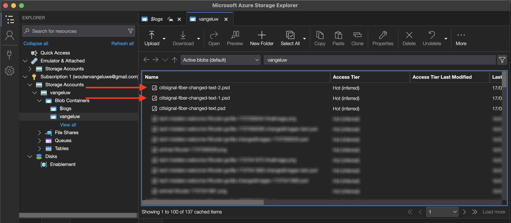
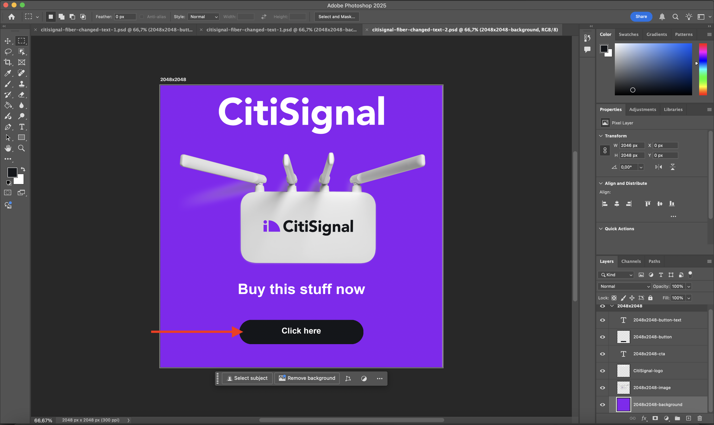
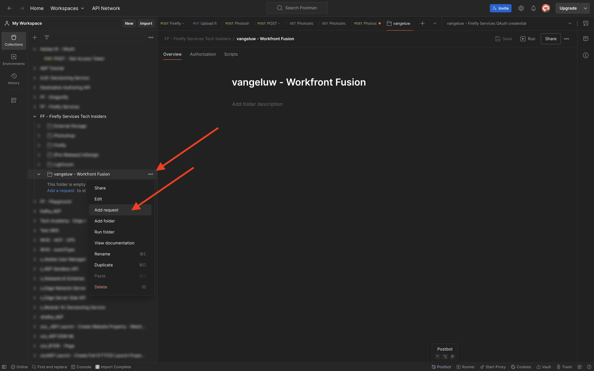

# 1.2.3 Workfront Fusion的流程自动化

了解如何使用Workfront Fusion实现流程自动化。

## 1.2.3.1对多个值迭代

您的方案应如下所示：


到目前为止，您已按静态值更改Photoshop文件中的文本。 要缩放和自动化您的内容创建工作流，需要对值列表进行迭代，并将这些值动态插入到Photoshop文件中。 在接下来的步骤中，您将添加一个用于迭代现有方案中的值的水。

在&#x200B;**Router**&#x200B;节点和&#x200B;**Photoshop更改文本**&#x200B;节点之间，选择&#x200B;**扳手**&#x200B;图标并选择&#x200B;**添加模块**。


搜索`flow`并选择&#x200B;**流量控制**。


选择&#x200B;**迭代器**。


屏幕应如下所示：


虽然现在可以读取CSV文件等输入文件，但您需要定义文本字符串并拆分该CSV文件，从而使用该CSV文件的基本版本。

您可以通过选择&#x200B;**T**&#x200B;图标来查找&#x200B;**拆分**&#x200B;函数，您可以在其中查看所有可用于处理文本值的函数。 选择&#x200B;**拆分**&#x200B;函数，您应该会看到此内容。


split函数需要分号前有一个值数组，并需要您在分号后指定分隔符。 对于此测试，您应该使用包含2个字段的简单数组，**立即购买**&#x200B;和&#x200B;**单击此处**，要使用的分隔符为&#x200B;**，**。

通过替换当前空的&#x200B;**split**&#x200B;函数： `{{split("Buy now, Click here "; ",")}}`，在&#x200B;**数组**&#x200B;字段中输入此值。 选择&#x200B;**确定**。


选择&#x200B;**Photoshop更改文本**&#x200B;以添加某些变量，而不是为输入和输出字段添加静态值。


在&#x200B;**请求内容**&#x200B;中，是文本&#x200B;**单击此处**。 此文本需要替换为您数组中的值。


删除文本&#x200B;**单击此处**，然后通过从&#x200B;**迭代器**&#x200B;节点中选择变量&#x200B;**值**&#x200B;来替换它。 这可确保动态更新Photoshop文档中按钮上的文本。


您还需要更新用于在Azure存储帐户中写入文件的文件名。 如果文件名是静态的，则每个新小版本只覆盖上一个文件，因此会丢失自定义文件。 当前静态文件名是&#x200B;**citisignal-fibre-changed-text.psd**，您现在需要更新它。

将光标置于单词`text`之后。


首先，添加连字符`-`，然后选择值&#x200B;**捆绑订单位置**。 这可确保对于第一次迭代，Workfront Fusion将`-1`添加到文件名，对于第二次迭代`-2`等。 选择&#x200B;**确定**。


保存方案，然后选择&#x200B;**运行一次**。


运行该方案后，返回您的Azure存储资源管理器并刷新文件夹。 然后，您应该会看到2个新创建的文件。



下载并打开每个文件。 按钮上应该有各种文本。 这是文件`citisignal-fiber-changed-text-1.psd`。


这是文件`citisignal-fiber-changed-text-2.psd`。



## 1.2.3.2使用Webhook激活您的方案

到目前为止，您已手动运行方案进行测试。 现在，让我们使用webhook更新您的场景，以便可以从外部环境激活它。

选择&#x200B;**+**，搜索&#x200B;**webhook**，然后选择&#x200B;**Webhook**。


选择&#x200B;**自定义webhook**。

拖动并连接&#x200B;**自定义webhook**&#x200B;节点，以使其连接到画布上的第一个节点，该节点称为&#x200B;**初始化常量**。


选择&#x200B;**自定义webhook**&#x200B;节点。 然后选择&#x200B;**添加**。


将&#x200B;**Webhook名称**&#x200B;设置为`--aepUserLdap-- - Tutorial 1.2`。


选中&#x200B;**获取请求标头**&#x200B;的框。 选择&#x200B;**保存**。


您的Webhook URL现在可用。 复制URL。


打开Postman，并在集合&#x200B;**FF - Firefly Services技术内部人士**&#x200B;中添加新文件夹。


命名您的文件夹`--aepUserLdap-- - Workfront Fusion`。


在刚刚创建的文件夹中，选择3个圆点&#x200B;**...**，然后选择&#x200B;**添加请求**。



将&#x200B;**方法类型**&#x200B;设置为&#x200B;**POST**，并将webhook的URL粘贴到地址栏中。


您需要发送自定义主体，以便可以将外部源中的变量元素提供给Workfront Fusion方案。

转到&#x200B;**正文**&#x200B;并选择&#x200B;**原始**。


将以下文本粘贴到请求正文中。 选择&#x200B;**发送**。

```json
{
	"psdTemplate": "placeholder",
	"xlsFile": "placeholder"
}
```


返回Workfront Fusion，您的自定义Webhook上会显示一条消息： **已成功确定**。


选择&#x200B;**保存**，然后选择&#x200B;**运行一次**。 您的方案现在处于活动状态，但在您再次在Postman中选择&#x200B;**发送**&#x200B;之前不会运行。


在Postman中，再次选择&#x200B;**发送**。


您的方案会再次运行，并像之前一样创建2个文件。


将Postman请求的名称更改为`POST - Send Request to Workfront Fusion Webhook`。


现在需要开始使用变量&#x200B;**psdTemplate**。 您将使用Postman请求中的传入变量，而不是对输入文件在&#x200B;**Photoshop更改文本**&#x200B;节点中的位置进行硬编码。

打开&#x200B;**Photoshop更改文本**&#x200B;节点并转到&#x200B;**请求内容**。 在&#x200B;**inputs**&#x200B;下选择硬编码文件名&#x200B;**citisignal-fibre.psd**&#x200B;并将其删除。


选择变量&#x200B;**psdTemplate**。 选择&#x200B;**确定**，然后保存您的方案。


选择&#x200B;**开启**&#x200B;以打开您的方案。 您的方案现在运行的是不停机。


返回Postman，输入文件名`citisignal-fiber.psd`作为变量&#x200B;**psdTemplate**&#x200B;的值，然后再次选择&#x200B;**发送**&#x200B;以再次运行方案。


通过将PSD模板指定为外部系统提供的变量，您现在构建了一个可重复使用的方案。

现在，您已完成此练习。

## 后续步骤

使用连接器[&#128279;](./ex4.md){target="_blank"}转到1.2.4自动化

返回到[使用Workfront Fusion的Creative工作流自动化](./automation.md){target="_blank"}

返回[所有模块](./../../../overview.md){target="_blank"}
