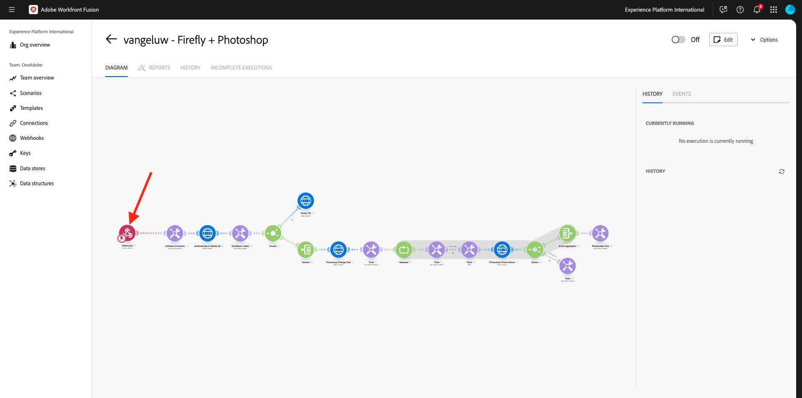
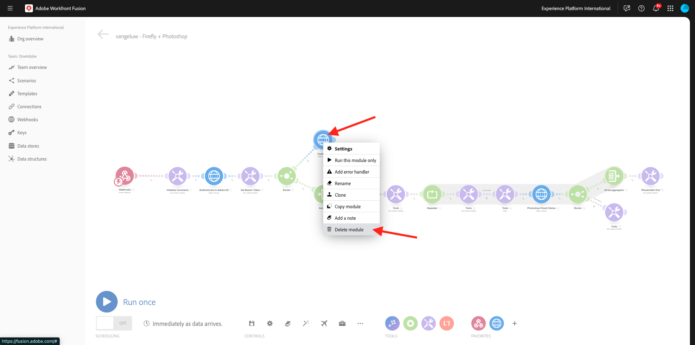
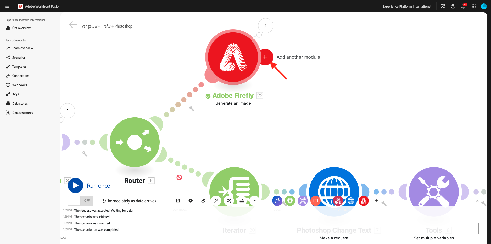
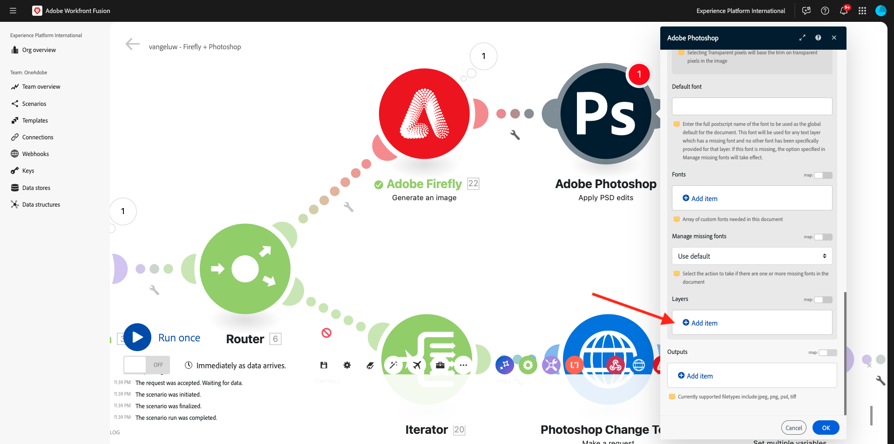
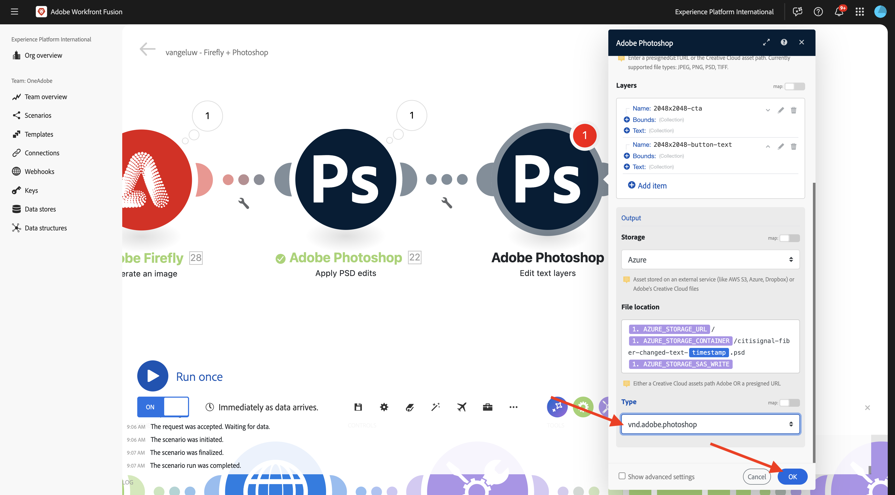

# 1.2.4使用连接器实现自动化

现在，您将开始在Workfront Fusion for Photoshop中使用现成的连接器，并将Firefly Text-2-Image请求和Photoshop请求连接到一个场景中。

## 1.2.4.1复制并准备您的方案

在左侧菜单中，转到&#x200B;**方案**&#x200B;并选择您的文件夹`--aepUserLdap--`。 然后，您应该会看到之前创建的名为`--aepUserLdap-- - Adobe I/O Authentication`的方案。


单击箭头打开下拉菜单，然后选择&#x200B;**克隆**。


将克隆方案的&#x200B;**Name**&#x200B;设置为`--aepUserLdap-- - Firefly + Photoshop`并选择适当的&#x200B;**目标团队**。 单击&#x200B;**添加**&#x200B;添加新的webhook。

>[!NOTE]
>
>您可能看不到用于选择&#x200B;**目标团队**&#x200B;的选项。 仅当您是Workfront Fusion中一个以上团队的用户时，才会显示此选项。 如果没有看到此选项，则仅表示您仅被添加到1个团队，因此不需要选择。


将&#x200B;**Webhook名称**&#x200B;设置为`--aepUserLdap-- - Firefly + Photoshop Webhook`。 单击&#x200B;**保存**。


您应该会看到此内容。 单击&#x200B;**保存**。


您应该会看到此内容。 单击&#x200B;**Webhook**&#x200B;模块。



单击&#x200B;**将地址复制到剪贴板**，然后单击&#x200B;**重新确定数据结构**。


打开Postman。 在您之前使用的同一文件夹中添加新请求。


确保应用以下设置：

- 请求名称： `POST - Send Request to Workfront Fusion Webhook Firefly + Photoshop`
- 请求类型： `POST`
- 请求URL：粘贴您从Workfront Fusion场景的webhook复制的URL。

转到&#x200B;**正文**&#x200B;并将&#x200B;**正文类型**&#x200B;设置为&#x200B;**原始** - **JSON**。 将以下有效负载粘贴到&#x200B;**主体**&#x200B;中。

```json
{
    "psdTemplate": "citisignal-fiber.psd",
    "xlsFile": "placeholder",
    "prompt":"misty meadows",
    "cta": "Buy this now!",
    "button": "Click here to buy!"
}
```

此新有效负载将确保从场景外部提供所有变量信息，而不是在场景中对其进行硬编码。 在企业方案中，组织需要以可重用方式定义方案，这意味着需要提供多个变量作为输入变量，而不是在方案中对其进行硬编码。

然后您应该拥有此项。 单击&#x200B;**发送**。


Workfront Fusion Webhook仍在等待输入。


单击&#x200B;**发送**&#x200B;后，邮件应更改tp **成功确定**。 单击&#x200B;**确定**。


## 1.2.4.2更新Firefly T2I模块

右键单击模块&#x200B;**Firefly T2I**&#x200B;并选择&#x200B;**删除模块**。



单击&#x200B;**+**&#x200B;图标，输入搜索词`firefly`，然后选择&#x200B;**Adobe Firefly**。


选择&#x200B;**生成图像**。


拖放&#x200B;**Adobe Firefly**&#x200B;模块，使其连接到&#x200B;**路由器**&#x200B;模块。


单击&#x200B;**Adobe Firefly**&#x200B;模块以将其打开，然后单击&#x200B;**添加**&#x200B;以创建新连接。


填写以下字段：

- **连接名称**：使用`--aepUserLdap-- - Firefly connection`。
- **环境**：使用&#x200B;**生产**。
- **类型**：使用&#x200B;**个人帐户**。
- **客户端ID**：从名为`--aepUserLdap-- - One Adobe tutorial`的Adobe I/O项目中复制&#x200B;**客户端ID**。
- **客户端密钥**：从名为`--aepUserLdap-- - One Adobe tutorial`的Adobe I/O项目中复制&#x200B;**客户端密钥**。

您可以在[此处](https://developer.adobe.com/console/projects.){target="_blank"}找到Adobe I/O项目的&#x200B;**客户端ID**&#x200B;和&#x200B;**客户端密钥**。


填写完所有字段后，单击&#x200B;**继续**。 然后，将自动验证您的连接。


接下来，选择传入的&#x200B;**自定义webhook**&#x200B;提供给方案的变量&#x200B;**prompt**。


接下来，将&#x200B;**模型版本** **提示符**&#x200B;设置为&#x200B;**image4 standard**。 单击&#x200B;**确定**。


在继续操作之前，需要禁用场景中的旧路由，如同本练习一样，您将只使用当前配置的新路由。 为此，请单击&#x200B;**路由器**&#x200B;模块和&#x200B;**迭代器**&#x200B;模块之间的&#x200B;**扳手**&#x200B;图标，然后选择&#x200B;**禁用路由**。


单击&#x200B;**保存**&#x200B;以保存更改，然后单击&#x200B;**运行一次**&#x200B;以测试配置。


转到Postman，验证请求中的提示，然后单击&#x200B;**发送**。


单击“发送”后，请返回Workfront Fusion并单击&#x200B;**Adobe Firefly**&#x200B;模块上的气泡图标以验证详细信息。


进入&#x200B;**OUTPUT** - **详细信息** > **URL**&#x200B;以查找由&#x200B;**Adobe Firefly**&#x200B;生成的图像的URL。


现在，您应该会看到一个图像，该图像表示您从Postman请求发送的提示，在本例中为&#x200B;**雾状草原**。


## 1.2.4.2更改PSD文件的背景

您现在将更新场景，以使用更多开箱即用连接器使其更智能。 您还将输出从Firefly连接到Photoshop，以便PSD文件的背景图像通过使用Firefly的“生成图像”操作输出动态更改。

您应该会看到此内容。 接下来，将鼠标悬停在&#x200B;**Adobe Firefly**&#x200B;模块上，然后单击&#x200B;**+**&#x200B;图标。



在搜索菜单中，输入`Photoshop`，然后单击&#x200B;**Adobe Photoshop**&#x200B;操作。


选择&#x200B;**应用PSD编辑**。


您应该会看到此内容。 单击&#x200B;**添加**&#x200B;以添加与Adobe Photoshop的新连接。


按如下方式配置连接：

- 连接类型：选择&#x200B;**Adobe Photoshop （服务器到服务器）**
- 连接名称：输入`--aepUserLdap-- - Adobe IO`
- 客户端ID：粘贴您的客户端ID
- 客户端密码：粘贴您的客户端密码

单击&#x200B;**继续**。


要查找您的&#x200B;**客户端ID**&#x200B;和&#x200B;**客户端密钥**，请转到[https://developer.adobe.com/console/home](https://developer.adobe.com/console/home){target="_blank"}并打开名为`--aepUserLdap-- One Adobe tutorial`的Adobe I/O项目。 转到&#x200B;**OAuth服务器到服务器**&#x200B;以查找您的客户端ID和客户端密钥。 复制这些值，并将其粘贴到Workfront Fusion的连接设置中。


单击&#x200B;**继续**&#x200B;后，在验证您的凭据时，将会短暂显示一个弹出窗口。 完成后，您应该会看到此内容。


现在，您需要输入希望Fusion使用的PSD文件的文件位置。 对于&#x200B;**存储**，选择&#x200B;**Azure**，对于&#x200B;**文件位置**，输入`{{1.AZURE_STORAGE_URL}}/{{1.AZURE_STORAGE_CONTAINER}}/{{1.AZURE_STORAGE_SAS_READ}}`。 将光标放在第二个`/`旁边。 然后，查看可用变量并向下滚动以查找变量&#x200B;**psdTemplate**。 单击变量&#x200B;**psdTemplate**&#x200B;以将其选定。


您应该会看到此内容。


一直向下滚动直到看到&#x200B;**图层**。 单击&#x200B;**添加项**。



您应该会看到此内容。 现在，您需要在Photoshop PSD模板中输入用于文件背景的图层的名称。


在文件&#x200B;**citisignal-fibre.psd**&#x200B;中，您将找到用于背景的图层。 在此示例中，该图层名为&#x200B;**2048x2048-background**。


在Workfront Fusion对话框中粘贴名称&#x200B;**2048x2048-background**。


向下滚动，直到看到&#x200B;**输入**。 现在，您需要定义需要插入到背景图层中的内容。 在这种情况下，您需要选择包含动态生成的图像的&#x200B;**Adobe Firefly**&#x200B;模块的输出。

对于&#x200B;**存储**，请选择&#x200B;**外部**。 对于&#x200B;**文件位置**，您需要从&#x200B;**Adobe Firefly**&#x200B;模块的输出复制并粘贴变量`{{XX.details[].url}}`，但您需要使用&#x200B;**Adobe Firefly**&#x200B;模块的序列号替换变量中的&#x200B;**XX**，本例中为&#x200B;**22**。


接下来，向下滚动，直到看到&#x200B;**编辑**。 将&#x200B;**Edit**&#x200B;设置为&#x200B;**Yes**&#x200B;并将&#x200B;**Type**&#x200B;设置为&#x200B;**Layer**。 单击&#x200B;**添加**。


您应该会看到此内容。 接下来，您需要定义操作的输出。 单击&#x200B;**输出**&#x200B;下的&#x200B;**添加项**。


为&#x200B;**存储**&#x200B;选择&#x200B;**Azure**，将此`{{1.AZURE_STORAGE_URL}}/{{1.AZURE_STORAGE_CONTAINER}}/citisignal-fiber-replacedbg.psd{{1.AZURE_STORAGE_SAS_WRITE}}`粘贴到&#x200B;**文件位置**&#x200B;下，并在&#x200B;**类型**&#x200B;下选择&#x200B;**vnd.adobe.photoshop**。 单击以启用&#x200B;**显示高级设置**。


在&#x200B;**高级设置**&#x200B;下，选择&#x200B;**是**以覆盖同名文件。
单击**添加**。


然后您应该拥有此项。 单击&#x200B;**确定**。


单击&#x200B;**保存**&#x200B;以保存更改，然后单击&#x200B;**运行一次**&#x200B;以测试配置。


转到Postman，验证请求中的提示，然后单击&#x200B;**发送**。


您应该会看到此内容。 单击&#x200B;**Adobe Photoshop — 应用PSD编辑**&#x200B;模块上的气泡。


您现在可以看到已成功生成新的PSD文件并将其存储在您的Microsoft Azure存储帐户中。


## 1.2.4.3更改PSD文件的文本图层

接下来，将鼠标悬停在&#x200B;**Adobe Photoshop — 应用PSD编辑**&#x200B;模块上，然后单击&#x200B;**+**&#x200B;图标。


选择&#x200B;**Adobe Photoshop**。


选择&#x200B;**编辑文本图层**。


您应该会看到此内容。 首先，选择您之前已配置的Adobe Photoshop连接，该连接应名为`--aepUserLdap-- Adobe IO`。

您现在需要定义上一步的输出文件&#x200B;**输入文件**&#x200B;的位置，在&#x200B;**图层**&#x200B;下，您需要为每个需要更改文本的图层单击“**+添加项**”。


对于&#x200B;**输入文件**，为&#x200B;**输入文件存储**&#x200B;选择&#x200B;**Azure**，并确保从上一个请求&#x200B;**Adobe Photoshop — 应用PSD编辑**&#x200B;中选择输出，您可以如下定义： ``{{XX.data[].`_links`.renditions[].href}}`` (将XX替换为上一个模块Adobe Photoshop — 应用PSD编辑的序列号)。

接下来，单击&#x200B;**图层**&#x200B;下的&#x200B;**+添加项**&#x200B;以开始添加需要更新的文本图层。


有2项需要更改，需要更新文件&#x200B;**citisignal-fibre.psd**&#x200B;中的CTA文本和按钮文本。

要查找层名称，请打开文件&#x200B;**citisignal-fibre.psd**。 在文件中，您会注意到包含行动号召的层名为&#x200B;**2048x2048-cta**。


在文件&#x200B;**citisignal-fibre.psd**&#x200B;中，您还会注意到包含call to action的层名为&#x200B;**2048x2048-button-text**。


您首先需要配置需要对层&#x200B;**2048x2048-cta**&#x200B;进行的更改。 在对话框的&#x200B;**名称**&#x200B;下输入名称&#x200B;**2048x2048-cta**。


向下滚动直到看到&#x200B;**文本** > **内容**。 从Webhook有效负载中选择变量&#x200B;**cta**。 单击&#x200B;**添加**。


您应该会看到此内容。 单击&#x200B;**图层**&#x200B;下的&#x200B;**+添加项**&#x200B;开始添加需要更新的文本图层。


在对话框的&#x200B;**名称**&#x200B;下输入名称&#x200B;**2048x2048-button-text**。


向下滚动直到看到&#x200B;**文本** > **内容**。 从Webhook有效负载中选择变量&#x200B;**按钮**。 单击&#x200B;**添加**。


您应该会看到此内容。


向下滚动，直到看到&#x200B;**输出**。 对于&#x200B;**存储**，请选择&#x200B;**Azure**。 对于&#x200B;**文件位置**，请输入以下位置。 请注意，在文件名中添加了变量`{{timestamp}}`，用于确保生成的每个文件都有唯一名称。 此外，将&#x200B;**Type**&#x200B;设置为&#x200B;**vnd.adobe.photoshop**。

`{{1.AZURE_STORAGE_URL}}/{{1.AZURE_STORAGE_CONTAINER}}/citisignal-fiber-changed-text-{{timestamp}}.psd{{1.AZURE_STORAGE_SAS_WRITE}}`


将&#x200B;**Type**&#x200B;设置为&#x200B;**vnd.adobe.photoshop**。 单击&#x200B;**确定**。



单击&#x200B;**保存**&#x200B;以保存更改。


## 1.2.4.4 Webhook响应

将这些更改应用于Photoshop文件后，您现在需要配置&#x200B;**Webhook响应**，该响应将发送回激活此方案的应用程序。

将鼠标悬停在模块&#x200B;**Adobe Photoshop — 编辑文本图层**&#x200B;上并单击&#x200B;**+**&#x200B;图标。


搜索`webhooks`并选择&#x200B;**Webhook**。


选择&#x200B;**Webhook响应**。


您应该会看到此内容。 将以下有效负载粘贴到&#x200B;**主体**&#x200B;中。

```json
{
    "newPsdTemplate": ""
}
```


复制并粘贴变量`{{XX.data[]._links.renditions[].href}}`并用最后&#x200B;**Adobe Photoshop — 编辑文本图层**&#x200B;模块的序列号替换&#x200B;**XX**，在本例中为&#x200B;**30**。


启用&#x200B;**显示高级设置**&#x200B;的复选框，然后单击&#x200B;**添加项**。


在&#x200B;**键**&#x200B;字段中，输入`Content-Type`。 在&#x200B;**值**&#x200B;字段中，输入`application/json`。 单击&#x200B;**添加**。


然后您应该拥有此项。 单击&#x200B;**确定**。


单击&#x200B;**自动对齐**。


您应该会看到此内容。 单击&#x200B;**保存**&#x200B;以保存您的更改，然后单击&#x200B;**运行一次**&#x200B;以测试您的方案。


返回Postman并单击&#x200B;**发送**。 此处使用的提示是&#x200B;**雾状草根**。


随后将激活该方案，一段时间后，将在Postman中显示一个响应，其中包含新创建的PSD文件的URL。


提醒您：一旦场景在Workfront Fusion中运行，您就可以通过单击每个模块上方的气泡来查看有关每个模块的信息。


通过使用Azure Storage Explorer，您可以在Azure Storage Explorer中双击新创建的PSD文件来查找并打开该文件。


然后，您的文件应如下所示，其背景将被&#x200B;**雾状草原**&#x200B;的背景所取代。


如果您再次运行场景，然后使用其他提示从Postman发送新请求，您将看到场景变得多么容易且可重复使用。 在此示例中，使用的新提示为&#x200B;**sunny desert**。


几分钟后，使用新背景生成了新的PSD文件。


## 后续步骤

转到[1.2.5 Frame.io和Workfront Fusion](./ex5.md){target="_blank"}

返回到[使用Workfront Fusion的Creative工作流自动化](./automation.md){target="_blank"}

返回[所有模块](./../../../overview.md){target="_blank"}
