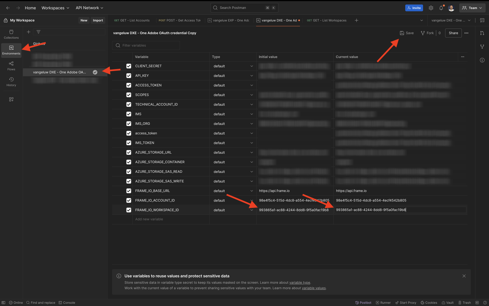
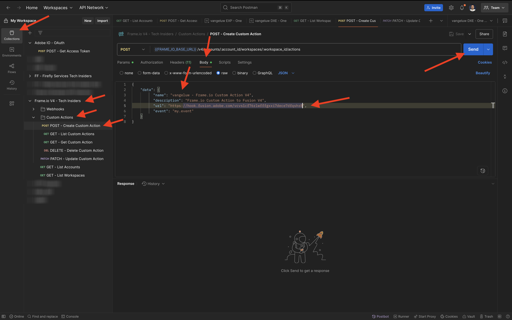
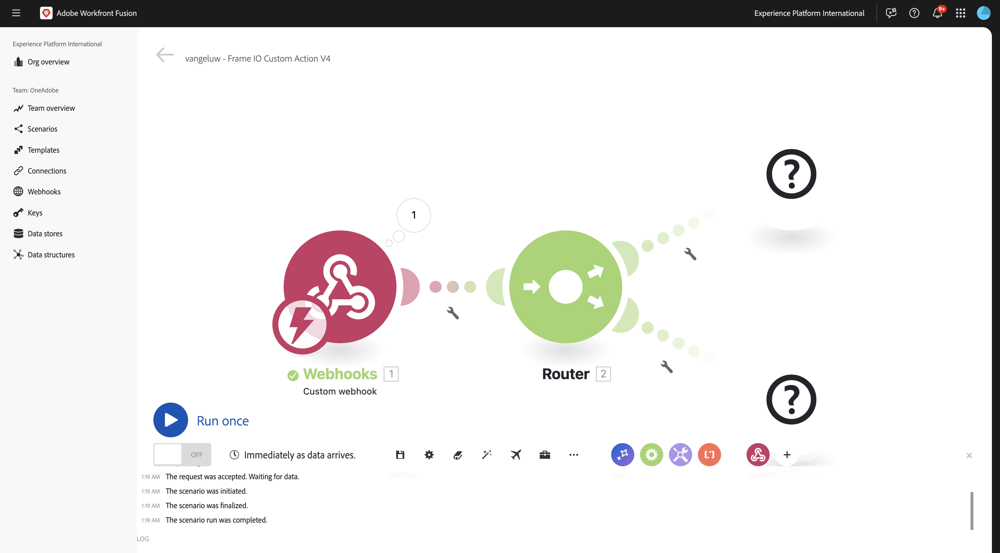
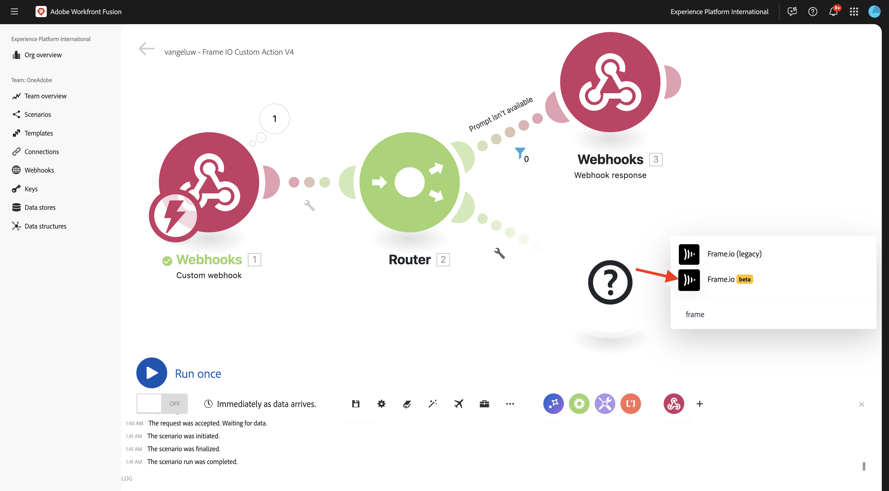
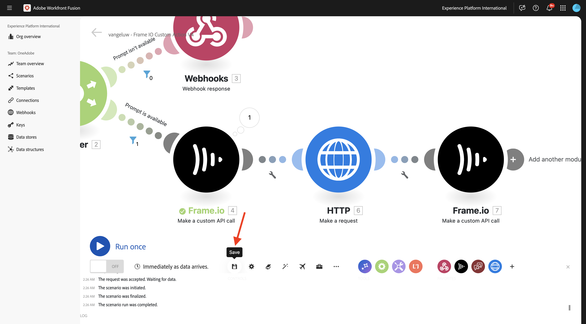

# 1.2.3 Frame.io和Workfront Fusion

在上一个练习中，您配置了场景`--aepUserLdap-- - Firefly + Photoshop`并配置了一个传入webhook以触发该场景，并在场景成功完成时配置了一个webhook响应。 然后，您使用Postman触发了该方案。 Postman是一个非常出色的测试工具，但在实际商业情景中，商业用户不会使用Postman触发情景。 相反，他们会使用其他应用程序，并且希望其他应用程序在Workfront Fusion中激活场景。 在本练习中，您将对Frame.io执行同样的操作。

>[!NOTE]
>
>此练习是为Frame.io V4创建的。 本练习中使用的以下某些功能当前以alpha语言提供，尚未正式提供。

## 1.2.3.1先决条件

在继续此练习之前，您需要完成[您的Adobe I/O项目](./../../../modules/getting-started/gettingstarted/ex6.md)的设置，包括将&#x200B;**Frame.io API**&#x200B;添加到Adobe I/O项目，还需要配置应用程序以与API交互，例如[Postman](./../../../modules/getting-started/gettingstarted/ex7.md)或[PostBuster](./../../../modules/getting-started/gettingstarted/ex8.md)。

## 1.2.3.2正在访问Frame.io

转到[https://next.frame.io/](https://next.frame.io/){target="_blank"}。


单击实例图标以验证您当前登录到的实例。 选择您有权访问的实例，应为`--aepImsOrgName--`。

单击&#x200B;**+新建项目**&#x200B;以在Frame.io中创建自己的项目。


选择&#x200B;**空白**&#x200B;模板，然后为您的项目输入名称`--aepUserLdap--`。 单击&#x200B;**新建项目**。


然后，您将在左侧菜单中看到您的项目。 单击&#x200B;**+**&#x200B;图标，然后选择&#x200B;**新建文件夹**。


输入名称`CitiSignal Fiber Campaign`，然后双击该文件夹以将其打开。


单击&#x200B;**上传**。


在前面的练习中，您下载了[citisignal-fiber.psd](./../../../assets/ff/citisignal-fiber.psd){target="_blank"}。 选择该文件并单击&#x200B;**打开**。


然后，文件&#x200B;**citisignal-fibre.psd**&#x200B;将在新创建的文件夹中可用。


## 1.2.3.3 Workfront Fusion和Frame.io

在上一个练习中，您创建了方案`--aepUserLdap-- - Firefly + Photoshop`，该方案以自定义webhook开始，以webhook响应结束。 随后使用Postman测试了Webhook的使用情况，但显然，这种场景的要点是由外部应用程序调用。 如前所述，Frame.io将是该练习，但在Frame.io和`--aepUserLdap-- - Firefly + Photoshop`之间还需要另一个Workfront Fusion场景。 现在，您将配置该方案。

转到[https://experience.adobe.com/](https://experience.adobe.com/){target="_blank"}。 打开&#x200B;**Workfront Fusion**。


在左侧菜单中，转到&#x200B;**方案**&#x200B;并选择您的文件夹`--aepUserLdap--`。 单击&#x200B;**创建新方案**。


使用名称`--aepUserLdap-- - Frame IO Custom Action V4`。


单击画布上的&#x200B;**问号对象**。 在搜索框中输入文本`webhook`，然后单击&#x200B;**Webhooks**。


单击&#x200B;**自定义webhook**。


单击&#x200B;**添加**&#x200B;创建新的webhook url。


对于&#x200B;**Webhook名称**，请使用`--aepUserLdap-- - Frame IO Custom Action Webhook`。 单击&#x200B;**保存**。


您应该会看到此内容。 将此屏幕保持打开状态，并且不要触摸，因为您将在下一步中需要它。 在下一步中，您必须通过单击&#x200B;**将地址复制到剪贴板**&#x200B;来复制webhook URL。


## 1.2.3.4 Frame.io V4自定义操作API

转到Postman并打开请求&#x200B;**POST — 获取集合** Adobe IO - OAuth **中的访问令牌**。 验证&#x200B;**参数**&#x200B;下的字段&#x200B;**作用域**。 字段&#x200B;**范围**&#x200B;应包含范围`frame.s2s.all`。 如果它丢失，请添加它。 接下来，单击&#x200B;**发送**&#x200B;以请求新的&#x200B;**access_token**。


接下来，在集合&#x200B;**Frame.io V4 - Tech Insiders**&#x200B;中打开请求&#x200B;**GET - List Accounts**。 单击&#x200B;**发送**。


然后，您应该会看到包含一个或多个帐户的类似响应。 查看响应并找到您正在使用的Frame.io V4帐户的字段&#x200B;**id**。 您可以在Frame.io V4用户界面中找到帐户的名称：


复制字段&#x200B;**id**&#x200B;的值。


在左侧菜单中，转到&#x200B;**环境**&#x200B;并选择您正在使用的环境。 在&#x200B;**`FRAME_IO_ACCOUNT_ID`**&#x200B;初始值&#x200B;**列和**&#x200B;当前值&#x200B;**列中查找变量**&#x200B;并粘贴您从上一个请求获得的&#x200B;**id**。 单击&#x200B;**保存**。


在左侧菜单中，返回&#x200B;**收藏集**。 在集合&#x200B;**Frame.io V4 - Tech Insiders**&#x200B;中打开请求&#x200B;**GET - List Workspaces**。 单击&#x200B;**发送**。


然后，您应该会看到包含一个或多个帐户的类似响应。 查看响应并找到您正在使用的Frame.io V4 Workspace的字段&#x200B;**id**。 复制字段&#x200B;**id**&#x200B;的值。


在左侧菜单中，转到&#x200B;**环境**&#x200B;并选择您正在使用的环境。 在&#x200B;**`FRAME_IO_WORKSPACE_ID`**&#x200B;初始值&#x200B;**列和**&#x200B;当前值&#x200B;**列中查找变量**&#x200B;并粘贴您从上一个请求获得的&#x200B;**id**。 单击&#x200B;**保存**。



在左侧菜单中，返回&#x200B;**收藏集**。 在集合&#x200B;**Frame.io V4 - Tech Insiders**&#x200B;的&#x200B;**自定义操作**&#x200B;文件夹中打开请求&#x200B;**POST — 创建自定义操作**。

转到请求的&#x200B;**正文**。 将字段&#x200B;**name**&#x200B;更改为`--aepUserLdap--  - Frame.io Custom Action V4`，然后将字段&#x200B;**url**&#x200B;更改为您从Workfront Fusion复制的Webhook URL的值。

单击&#x200B;**发送**。



您的Frame.io V4自定义操作现已创建。


返回[https://next.frame.io/](https://next.frame.io/){target="_blank"}，并转到您在项目&#x200B;**中创建的** CitiSignal Fibre Campaign`--aepUserLdap--`文件夹。 刷新页面。


刷新页面后，单击资产&#x200B;**citisignal-fiber.psd**&#x200B;上的3个点&#x200B;**...**，然后打开&#x200B;**自定义操作**&#x200B;菜单。 之后，您应该会看到之前创建的自定义操作出现在显示的菜单中。 单击自定义操作`--aepUserLdap-- - Frame IO Custom Action Fusion V4`。


然后，您应该会看到类似的&#x200B;**自定义操作**&#x200B;弹出窗口。 此弹出窗口是Frame.io与Workfront Fusion之间通信的结果。


将屏幕更改回Workfront Fusion。 现在，您应该看到&#x200B;**已成功确定**&#x200B;显示在自定义Webhook对象中。 单击&#x200B;**确定**。


单击&#x200B;**运行一次**&#x200B;以启用测试模式，然后再次测试与Frame.io的通信。


返回到Frame.io并再次单击自定义操作`--aepUserLdap-- - Frame IO Custom Action Fusion V4`。


将屏幕切换回Workfront Fusion。 您现在应该会看到绿色复选标记，以及显示&#x200B;**1**&#x200B;的气泡。 单击气泡可查看详细信息。


气泡的详细视图显示了从Frame.io收到的数据。 您应会看到各种ID。例如，字段&#x200B;**resource.id**&#x200B;显示资产&#x200B;**citisignal-fibre.psd**&#x200B;的Frame.io中的唯一ID。


现在，Frame.io与Workfront Fusion之间的通信已建立，您可以继续配置。

## 1.2.3.5提供对Frame.io的自定义表单响应

在Frame.io中调用自定义操作时，Frame.io预期会收到来自Workfront Fusion的响应。 如果您回想一下您在上一个练习中构建的场景，则需要多个变量才能更新标准Photoshop PSD文件。 这些变量在您使用的有效载荷中定义：

```json
{
    "psdTemplate": "citisignal-fiber.psd",
    "xlsFile": "placeholder",
    "prompt":"misty meadows",
    "cta": "Buy this now!",
    "button": "Click here to buy!"
}
```

因此，为了成功运行方案`--aepUserLdap-- - Firefly + Photoshop`，需要诸如&#x200B;**prompt**、**cta**、**button**&#x200B;和&#x200B;**psdTemplate**&#x200B;之类的字段。

前3个字段&#x200B;**prompt**、**cta**、**button**&#x200B;需要用户输入，当用户调用自定义操作时，需要在Frame.io中收集这些输入。 因此，在Workfront Fusion中需要完成的第一件事是检查这些变量是否可用，如果不可用，Workfront Fusion应回复到Frame.io，请求输入这些变量。 要实现这一点，可使用Frame.io中的表单。

返回到Workfront Fusion并打开您的方案`--aepUserLdap-- - Frame IO Custom Action`。 将鼠标悬停在&#x200B;**自定义webhook**&#x200B;对象上，然后单击&#x200B;**+**&#x200B;图标以添加另一个模块。


搜索`Flow Control`并单击&#x200B;**流量控制**。


单击选择&#x200B;**路由器**。


您应该会看到此内容。



单击&#x200B;**？**&#x200B;对象，然后单击以选择&#x200B;**Webhooks**。


选择&#x200B;**Webhook响应**。


您应该会看到此内容。


复制以下JSON代码并将其粘贴到字段&#x200B;**正文**&#x200B;中。


```json
{
  "title": "What do you want Firefly to generate?",
  "description": "Enter your Firefly prompt.",
  "fields": [
    {
      "type": "text",
      "label": "Prompt",
      "name": "Prompt",
      "value": ""
    },
    {
      "type": "text",
      "label": "CTA Text",
      "name": "CTA Text",
      "value": ""
    },
    {
      "type": "text",
      "label": "Button Text",
      "name": "Button Text",
      "value": ""
    }
  ]
}
```

单击图标以清理和美化JSON代码。 然后，单击&#x200B;**确定**。


单击&#x200B;**保存**&#x200B;以保存更改。


接下来，您需要设置一个过滤器，以确保场景的此路径仅在没有提示可用时运行。 单击&#x200B;**扳手**&#x200B;图标，然后选择&#x200B;**设置筛选器**。


配置以下字段：

- **标签**：使用`Prompt isn't available`。
- **条件**：使用`{{1.data.Prompt}}`。
- **基本运算符**：选择&#x200B;**不存在**。

>[!NOTE]
>
>可以使用以下语法手动指定Workfront Fusion中的变量： `{{1.data.Prompt}}`。 变量中的数字引用场景中的模块。 在此示例中，您可以看到场景中的第一个模块名为&#x200B;**Webhooks**，其序列号为&#x200B;**1**。 这意味着变量`{{1.data.Prompt}}`将访问序列号为1的模块中的字段&#x200B;**data.Prompt**。 序列号有时可能不同，因此，在复制/粘贴此类变量时请务必注意，并始终验证使用的序列号是否正确。

单击&#x200B;**确定**。


您应该会看到此内容。 首先单击&#x200B;**保存**&#x200B;图标，然后单击&#x200B;**运行一次**&#x200B;以测试您的方案。


您应该会看到此内容。


返回到Frame.io并再次单击资产`--aepUserLdap-- - Frame IO Custom Action Fusion`citisignal-fibre.psd **上的自定义操作**。


现在，您应该会在Frame.io中看到一个提示。 不要填写字段，也不要提交表单。 此提示基于您刚刚配置的Workfront Fusion响应显示。


切换回Workfront Fusion，然后单击&#x200B;**Webhook响应**&#x200B;模块上的气泡。 您将在&#x200B;**INPUT**&#x200B;下看到包含表单的JSON有效负载的正文。 再次单击&#x200B;**运行一次**。


您应该会再次看到此内容。


返回到Frame.io并按照指示填写字段。

- **提示**：通过空间的未来激光束
- **CTA**：立即旅行时间！
- **按钮文本**：加入讨论区！

单击&#x200B;**提交**。


然后，您应该会在Frame.io中看到一个弹出窗口，它看起来像这样。


切换回Workfront Fusion，然后单击&#x200B;**自定义webhook**&#x200B;模块上的气泡。 在操作1中的&#x200B;**输出**&#x200B;下，您现在可以看到一个新的&#x200B;**数据**&#x200B;对象，该对象包含&#x200B;**按钮文本**、**CTA文本**&#x200B;和&#x200B;**提示**&#x200B;之类的字段。 由于这些用户输入变量可在场景中使用，因此您有足够的空间继续配置。


## 1.2.3.6从Frame.io检索文件位置

如前所述，此方案需要诸如&#x200B;**prompt**、**cta**、**button**&#x200B;和&#x200B;**psdTemplate**&#x200B;之类的字段才能正常工作。 前3个字段现在已可用，但仍缺少要使用的&#x200B;**psdTemplate**。 **psdTemplate**&#x200B;现在将引用Frame.io位置，因为文件&#x200B;**citisignal-fibre.psd**&#x200B;托管在Frame.io中。 为了检索该文件的位置，您需要在Workfront Fusion中配置并使用Frame.io连接。

返回到Workfront Fusion并打开您的方案`--aepUserLdap-- - Frame IO Custom Action V4`。 将鼠标悬停在&#x200B;**上？**&#x200B;模块，单击&#x200B;**+**&#x200B;图标以添加另一个模块并搜索`frame`。 单击&#x200B;**Frame.io**。


单击&#x200B;**Frame.io**。



单击&#x200B;**进行自定义API调用**。


要使用Frame.io连接，您需要先对其进行配置。 单击&#x200B;**添加**&#x200B;以执行此操作。


选择&#x200B;**连接类型** **IMS服务器到服务器**，并输入名称`--aepUserLdap-- - Adobe I/O - Frame.io S2S`。


接下来，您需要输入在&#x200B;**快速入门**&#x200B;模块中配置的Adobe I/O项目的&#x200B;**客户端ID**&#x200B;和&#x200B;**客户端密钥**。 您可以在&#x200B;**此处**&#x200B;找到Adobe I/O项目的&#x200B;**客户端ID**&#x200B;和[客户端密钥](https://developer.adobe.com/console/projects.){target="_blank"}。


返回到Workfront Fusion中的场景。 将&#x200B;**客户端ID**&#x200B;和&#x200B;**客户端密钥**&#x200B;的值粘贴到连接设置窗口中其各自的字段中。 单击&#x200B;**继续**。 您的连接现在将由Workfront Fusion进行测试。


如果连接测试成功，它将自动显示在&#x200B;**连接**&#x200B;下。 您现在已成功连接，需要完成配置以从Frame.io获取所有资源详细信息，包括文件位置。 为此，您需要使用&#x200B;**资源ID**。


字段&#x200B;**资源ID**&#x200B;作为初始&#x200B;**自定义webhook**&#x200B;通信的一部分由Frame.io共享到Workfront Fusion，可在字段&#x200B;**resource.id**&#x200B;下找到。

对于模块&#x200B;**Frame.io — 进行自定义API调用**，请使用URL： `/v4/accounts/{{1.account_id}}/files/{{1.resource.id}}`。

>[!NOTE]
>
>可以使用以下语法手动指定Workfront Fusion中的变量： `{{1.account_id}}`和`{{1.resource.id}}`。 变量中的数字引用场景中的模块。 在此示例中，您可以看到场景中的第一个模块名为&#x200B;**Webhooks**，其序列号为&#x200B;**1**。 这意味着变量`{{1.account_id}}`和`{{1.resource.id}}`将从序列号为1的模块中访问该字段。 序列号有时可能不同，因此，在复制/粘贴此类变量时请务必注意，并始终验证使用的序列号是否正确。

接下来，单击&#x200B;**查询字符串**&#x200B;下的&#x200B;**+添加项**。


输入这些值，然后单击&#x200B;**添加**。

| 键 | 值 |
|:-------------:| :---------------:| 
| `include` | `media_links.original` |


您现在应该拥有此项。 单击&#x200B;**确定**。


接下来，您需要设置一个过滤器，以确保场景的此路径仅在没有提示可用时运行。 单击&#x200B;**扳手**&#x200B;图标，然后选择&#x200B;**设置筛选器**。


配置以下字段：

- **标签**：使用`Prompt is available`。
- **条件**：使用`{{1.data.Prompt}}`。
- **基本运算符**：选择&#x200B;**存在**。

>[!NOTE]
>
>可以使用以下语法手动指定Workfront Fusion中的变量： `{{1.data.Prompt}}`。 变量中的数字引用场景中的模块。 在此示例中，您可以看到场景中的第一个模块名为&#x200B;**Webhooks**，其序列号为&#x200B;**1**。 这意味着变量`{{1.data.Prompt}}`将访问序列号为1的模块中的字段&#x200B;**data.Prompt**。 序列号有时可能不同，因此，在复制/粘贴此类变量时请务必注意，并始终验证使用的序列号是否正确。

单击&#x200B;**确定**。


您现在应该看到此内容。 保存更改，然后单击&#x200B;**运行一次**&#x200B;以测试您的方案。


返回到Frame.io并再次单击资产`--aepUserLdap-- - Frame IO Custom Action Fusion V4`citisignal-fibre.psd **上的自定义操作**。


现在，您应该会在Frame.io中看到一个提示。 不要填写字段，也不要提交表单。 此提示基于您刚刚配置的Workfront Fusion响应显示。


切换回Workfront Fusion。 再次单击&#x200B;**运行一次**。


返回到Frame.io并按照指示填写字段。 单击&#x200B;**提交**。

- **提示**：通过空间的未来激光束
- **CTA**：立即旅行时间！
- **按钮文本**：加入讨论区！


切换回Workfront Fusion并单击&#x200B;**Frame.io上的气泡 — 进行自定义API调用**&#x200B;模块。


在&#x200B;**OUTPUT** > **Body** > **data**&#x200B;下，您现在可以看到有关特定资产&#x200B;**citisignal-fiber.psd**&#x200B;的大量元数据。


此用例所需的特定信息是文件&#x200B;**citisignal-fibre.psd**&#x200B;的位置URL，您可以通过向下滚动到字段&#x200B;**media_links** > **原始** > **download_url**&#x200B;来查找该文件。


您现在拥有此用例运行所需的所有信息（**prompt**、**cta**、**button**&#x200B;和&#x200B;**psdTemplate**）。

## 1.2.3.7调用Workfront方案

在上一个练习中，您已配置方案`--aepUserLdap-- - Firefly + Photoshop`。 现在，您需要对此场景进行细微更改。

在另一个选项卡中打开方案`--aepUserLdap-- - Firefly + Photoshop`，然后单击第一个&#x200B;**Adobe Photoshop — 应用PSD编辑**&#x200B;模块。 现在，您应该看到输入文件已配置为使用Microsoft Azure中的动态位置。 鉴于在此使用案例中，输入文件不再存储在Microsoft Azure中，而是使用Frame.io存储，因此您需要更改这些设置。


将&#x200B;**存储**&#x200B;更改为&#x200B;**外部**&#x200B;并将&#x200B;**文件位置**&#x200B;更改为仅使用从传入&#x200B;**自定义webhook**&#x200B;模块获取的&#x200B;**psdTemplate**&#x200B;变量。 单击&#x200B;**确定**，然后单击&#x200B;**保存**&#x200B;以保存更改。


单击&#x200B;**自定义webhook**&#x200B;模块，然后单击&#x200B;**将地址复制到剪贴板**。 您需要复制URL，因为在其他情况下您将需要使用它。


返回方案`--aepUserLdap-- - Frame IO Custom Action V4`。 将鼠标悬停在&#x200B;**Frame.io上 — 进行自定义API调用**&#x200B;模块并单击&#x200B;**+**&#x200B;图标。


输入`http`，然后单击&#x200B;**HTTP**。


选择&#x200B;**发出请求**。


将自定义webhook的URL粘贴到字段&#x200B;**URL**&#x200B;中。 将&#x200B;**方法**&#x200B;设置为&#x200B;**发布**。


将&#x200B;**Body type**&#x200B;设置为&#x200B;**Raw**&#x200B;并将&#x200B;**Content type**&#x200B;设置为&#x200B;**JSON (application/json)**。
将以下JSON有效负载粘贴到字段**请求内容**&#x200B;中，并启用&#x200B;**分析响应**&#x200B;的复选框。

```json
{
    "psdTemplate": "citisignal-fiber.psd",
    "xlsFile": "placeholder",
    "prompt":"misty meadows",
    "cta": "Buy this now!",
    "button": "Click here to buy!"
}
```

您现在已配置静态有效负载，但需要使用之前收集的变量将其变为动态有效负载。


对于字段&#x200B;**psdTemplate**，请用变量&#x200B;**替换静态变量** citisignal-fibre.psd **`Body > data > media_links > original > download_url`**。


对于字段&#x200B;**prompt**、**cta**&#x200B;和&#x200B;**button**，请用Frame.io的传入webhook请求插入到方案中的动态变量替换静态变量，这些字段为&#x200B;**data.Prompt**、**data.CTA Text**&#x200B;和&#x200B;**data.Button Text**。

此外，启用&#x200B;**解析响应**&#x200B;的复选框。

单击&#x200B;**确定**。


单击&#x200B;**保存**&#x200B;以保存更改。


## 1.2.3.8在Frame.io中保存新资源

调用另一个Workfront Fusion场景后，将生成一个可用的新Photoshop PSD模板。 该PSD文件需要存储回Frame.io中，这是此方案中的最后一步。

将鼠标悬停在&#x200B;**HTTP上 — 发出请求**&#x200B;模块并单击&#x200B;**+**&#x200B;图标。


选择&#x200B;**Frame.io**。


选择&#x200B;**进行自定义API调用**。


将自动选择Frame.io连接。


对于模块&#x200B;**Frame.io — 进行自定义API调用**，请使用URL： `/v4/accounts/{{1.account_id}}/folders/{{4.body.data.parent_id}}/files/remote_upload`。

>[!NOTE]
>
>如前所述，可以使用以下语法手动指定Workfront Fusion中的变量： `{{1.account_id}}`和`{{4.body.data.parent_id}}`。 变量中的数字引用场景中的模块。
>在此示例中，您可以看到场景中的第一个模块名为&#x200B;**Webhooks**，其序列号为&#x200B;**1**。 这意味着变量`{{1.account_id}}`将从序列号为1的模块中访问该字段。
>在此示例中，您可以看到场景中的第四个模块名为&#x200B;**Frame.io — 进行自定义API调用**，其序列号为&#x200B;**4**。 这意味着变量`{{4.body.data.parent_id}}`将从序列号为4的模块中访问该字段。
>如果模块的序列号不同，则必须更新上述URL中的变量以链接到正确的模块。


将字段&#x200B;**方法**&#x200B;更改为&#x200B;**POST**。

将以下JSON代码段复制并粘贴到字段&#x200B;**正文**&#x200B;中。

```json
{
  "data": {
    "name": "citisignal-fiber-{{timestamp}}.psd",
    "source_url": "{{6.data.newPsdTemplate}}"
  }
}
```

>[!NOTE]
>
>可以使用以下语法手动指定Workfront Fusion中的变量： `{{6.data.newPsdTemplate}}`。 变量中的数字引用场景中的模块。 在此示例中，您可以看到方案中的第六个模块名为&#x200B;**HTTP — 发出请求**，其序列号为&#x200B;**6**。 这意味着变量`{{6.data.newPsdTemplate}}`将访问序列号为6的模块中的字段&#x200B;**data.newPsdTemplate**。
>如果模块的序列号不同，则必须更新上述URL中的变量以链接到正确的模块。

单击&#x200B;**确定**。


单击&#x200B;**保存**&#x200B;以保存更改。



## 1.2.3.9测试您的端到端用例

单击方案&#x200B;**中的**&#x200B;运行一次`--aepUserLdap-- - Frame IO Custom Action`。


返回到Frame.io并再次单击资产`--aepUserLdap-- - Frame IO Custom Action Fusion V4`citisignal-fibre.psd **上的自定义操作**。


现在，您应该会在Frame.io中看到一个提示。 不要填写字段，也不要提交表单。 此提示基于您刚刚配置的Workfront Fusion响应显示。


切换回Workfront Fusion。 单击方案&#x200B;**中的**&#x200B;运行一次`--aepUserLdap-- - Frame IO Custom Action V4`。


在Workfront Fusion中，打开方案`--aepUserLdap-- - Firefly + Photoshop`，同时在该方案中单击&#x200B;**运行一次**。


返回到Frame.io并按照指示填写字段。 单击&#x200B;**提交**。

- **提示**：通过空间的未来激光束
- **CTA**：立即旅行时间！
- **按钮文本**：加入讨论区！


1-2分钟后，您应该会在Frame.io中看到自动显示的新资源。 双击新资源以将其打开。


现在，您可以清楚地看到所有用户输入变量均已自动应用。


您现在已成功完成此练习。

## 后续步骤

转到[1.2.6 Frame.io to Fusion to AEM Assets](./ex6.md){target="_blank"}

返回到[使用Workfront Fusion的Creative工作流自动化](./automation.md){target="_blank"}

返回[所有模块](./../../../overview.md){target="_blank"}

