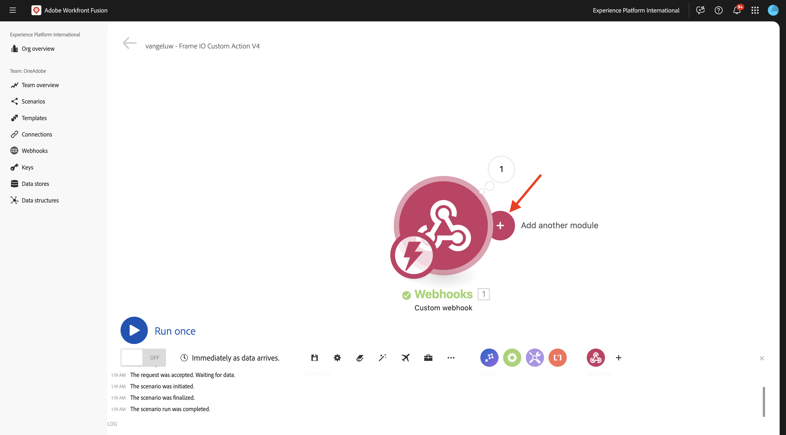
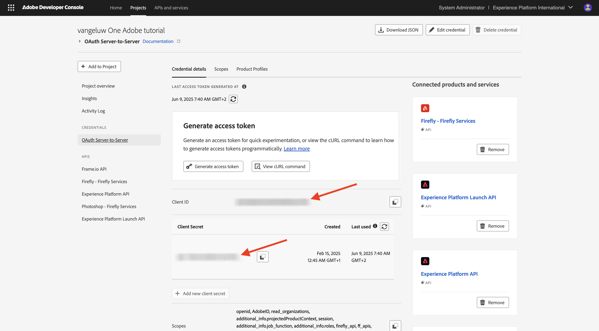
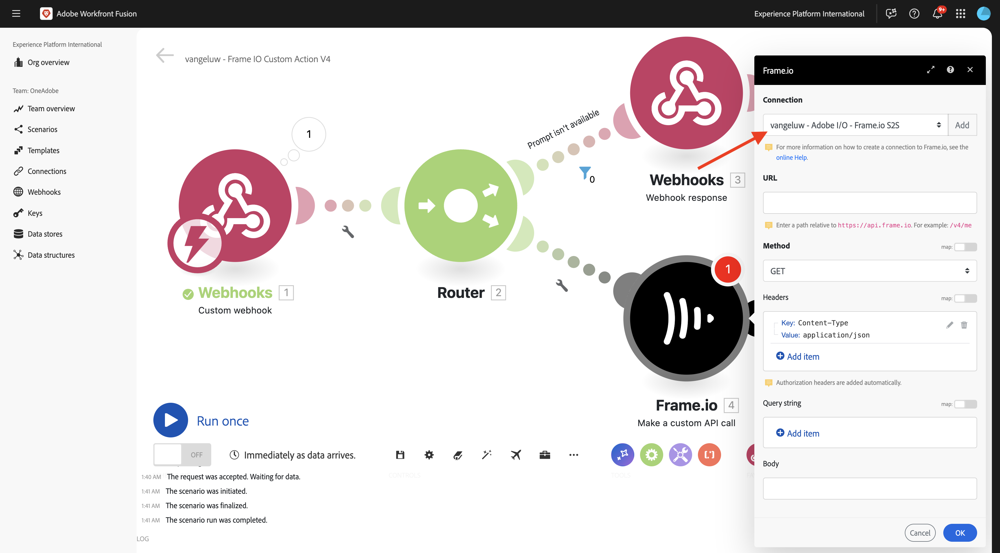

# 1.2.5 Frame.io和Workfront Fusion

在上一个练习中，您配置了场景`--aepUserLdap-- - Firefly + Photoshop`并配置了一个传入webhook以触发该场景，并在场景成功完成时配置了一个webhook响应。 然后，您使用Postman触发了该方案。 Postman是一个非常出色的测试工具，但在实际商业情景中，商业用户不会使用Postman触发情景。 相反，他们会使用其他应用程序，并且希望其他应用程序在Workfront Fusion中激活场景。 在本练习中，您将对Frame.io执行同样的操作。

>[!NOTE]
>
>要成功完成此练习，您需要成为Frame.io帐户中的管理员用户。 以下练习是为Frame.io V3创建的，将在Frame.io V4的稍后阶段进行更新。

## 1.2.5.1正在访问Frame.io

转到[https://app.frame.io/projects](https://app.frame.io/projects){target="_blank"}。

单击&#x200B;**+图标**&#x200B;以在Frame.io中创建自己的项目。


输入名称`--aepUserLdap--`并单击&#x200B;**创建项目**。


然后，您将在左侧菜单中看到您的项目。
在前面的练习中，您将[citisignal-fibre.psd](./../../../assets/ff/citisignal-fiber.psd){target="_blank"}下载到桌面。 选择该文件，然后将其拖放到刚刚创建的项目文件夹中。


## 1.2.5.2 Workfront Fusion和Frame.io

在上一个练习中，您创建了方案`--aepUserLdap-- - Firefly + Photoshop`，该方案以自定义webhook开始，以webhook响应结束。 随后使用Postman测试了Webhook的使用情况，但显然，这种场景的要点是由外部应用程序调用。 如前所述，Frame.io将是该练习，但在Frame.io和`--aepUserLdap-- - Firefly + Photoshop`之间还需要另一个Workfront Fusion场景。 现在，您将配置该方案。

转到[https://experience.adobe.com/](https://experience.adobe.com/){target="_blank"}。 打开&#x200B;**Workfront Fusion**。


在左侧菜单中，转到&#x200B;**方案**&#x200B;并选择您的文件夹`--aepUserLdap--`。 单击&#x200B;**创建新方案**。


使用名称`--aepUserLdap-- - Frame IO Custom Action`。


单击画布上的&#x200B;**问号对象**。 在搜索框中输入文本`webhook`，然后单击&#x200B;**Webhooks**。


单击&#x200B;**自定义webhook**。


单击&#x200B;**添加**&#x200B;创建新的webhook url。


对于&#x200B;**Webhook名称**，请使用`--aepUserLdap-- - Frame IO Custom Action Webhook`。 单击&#x200B;**保存**。


您应该会看到此内容。 将此屏幕保持打开状态，并且不要触摸，因为您将在下一步中需要它。 在下一步中，您必须通过单击&#x200B;**将地址复制到剪贴板**&#x200B;来复制webhook URL。


转到[https://developer.frame.io/](https://developer.frame.io/){target="_blank"}。 单击&#x200B;**开发人员工具**，然后选择&#x200B;**自定义操作**。


单击&#x200B;**创建自定义操作**。


输入以下值：

- **名称**：使用`--aepUserLdap-- - Frame IO Custom Action Fusion`
- **描述**：使用`--aepUserLdap-- - Frame IO Custom Action Fusion`
- **事件**：使用`fusion.tutorial`。
- **URL**：输入您刚刚在Workfront Fusion中创建的webhook的URL
- **团队**：选择适当的Frame.io团队，在本例中为&#x200B;**一个Adobe教程**。

单击&#x200B;**提交**。


您应该会看到此内容。


返回[https://app.frame.io/projects](https://app.frame.io/projects){target="_blank"}。 刷新页面。


刷新页面后，单击资产&#x200B;**citisignal-fiber.psd**&#x200B;上的3个点&#x200B;**...**。 之后，您应该会看到之前创建的自定义操作出现在显示的菜单中。 单击自定义操作`--aepUserLdap-- - Frame IO Custom Action Fusion`。


您应该会看到类似的&#x200B;**成功！**&#x200B;弹出窗口。 此弹出窗口是Frame.io与Workfront Fusion之间通信的结果。


将屏幕更改回Workfront Fusion。 您现在应该看到&#x200B;**已成功确定**&#x200B;显示在自定义Webhook对象中。 单击&#x200B;**确定**。


单击&#x200B;**运行一次**&#x200B;以启用测试模式，然后再次测试与Frame.io的通信。


返回到Frame.io并再次单击自定义操作`--aepUserLdap-- - Frame IO Custom Action Fusion`。


将屏幕切换回Workfront Fusion。 您现在应该会看到绿色复选标记，以及显示&#x200B;**1**&#x200B;的气泡。 单击气泡可查看详细信息。


气泡的详细视图显示了从Frame.io收到的数据。 您应会看到各种ID。例如，字段&#x200B;**resource.id**&#x200B;显示资产&#x200B;**citisignal-fibre.psd**&#x200B;的Frame.io中的唯一ID。


现在，Frame.io与Workfront Fusion之间的通信已建立，您可以继续配置。

## 1.2.5.3提供对Frame.io的自定义表单响应

在Frame.io中调用自定义操作时，Frame.io预期会收到来自Workfront Fusion的响应。 如果您回想一下您在上一个练习中构建的场景，则需要多个变量才能更新标准Photoshop PSD文件。 这些变量在您使用的有效载荷中定义：

```json
{
    "psdTemplate": "citisignal-fiber.psd",
    "xlsFile": "placeholder",
    "prompt":"misty meadows",
    "cta": "Buy this now!",
    "button": "Click here to buy!"
}
```

因此，为了成功运行方案`--aepUserLdap-- - Firefly + Photoshop`，需要诸如&#x200B;**prompt**、**cta**、**button**&#x200B;和&#x200B;**psdTemplate**&#x200B;之类的字段。

前3个字段&#x200B;**prompt**、**cta**、**button**&#x200B;需要用户输入，当用户调用自定义操作时，需要在Frame.io中收集这些输入。 因此，在Workfront Fusion中需要完成的第一件事是检查这些变量是否可用，如果不可用，Workfront Fusion应回复到Frame.io，请求输入这些变量。 要实现这一点，可使用Frame.io中的表单。

返回到Workfront Fusion并打开您的方案`--aepUserLdap-- - Frame IO Custom Action`。 将鼠标悬停在&#x200B;**自定义webhook**&#x200B;对象上，然后单击&#x200B;**+**&#x200B;图标以添加另一个模块。



搜索`Flow Control`并单击&#x200B;**流量控制**。


单击选择&#x200B;**路由器**。


您应该会看到此内容。


单击&#x200B;**？**&#x200B;对象，然后单击以选择&#x200B;**Webhooks**。


选择&#x200B;**Webhook响应**。


您应该会看到此内容。


复制以下JSON代码并将其粘贴到字段&#x200B;**正文**&#x200B;中。


```json
{
  "title": "What do you want Firefly to generate?",
  "description": "Enter your Firefly prompt.",
  "fields": [
    {
      "type": "text",
      "label": "Prompt",
      "name": "Prompt",
      "value": ""
    },
    {
      "type": "text",
      "label": "CTA Text",
      "name": "CTA Text",
      "value": ""
    },
    {
      "type": "text",
      "label": "Button Text",
      "name": "Button Text",
      "value": ""
    }
  ]
}
```

单击图标以清理和美化JSON代码。 然后，单击&#x200B;**确定**。


单击&#x200B;**保存**&#x200B;以保存更改。


接下来，您需要设置一个过滤器，以确保场景的此路径仅在没有提示可用时运行。 单击&#x200B;**扳手**&#x200B;图标，然后选择&#x200B;**设置筛选器**。


配置以下字段：

- **标签**：使用`Prompt isn't available`。
- **条件**：使用`{{1.data.Prompt}}`。
- **基本运算符**：选择&#x200B;**不存在**。

>[!NOTE]
>
>可以使用以下语法手动指定Workfront Fusion中的变量： `{{1.data.Prompt}}`。 变量中的数字引用场景中的模块。 在此示例中，您可以看到场景中的第一个模块名为&#x200B;**Webhooks**，其序列号为&#x200B;**1**。 这意味着变量`{{1.data.Prompt}}`将访问序列号为1的模块中的字段&#x200B;**data.Prompt**。 序列号有时可能不同，因此，在复制/粘贴此类变量时请务必注意，并始终验证使用的序列号是否正确。

单击&#x200B;**确定**。


您应该会看到此内容。 首先单击&#x200B;**保存**&#x200B;图标，然后单击&#x200B;**运行一次**&#x200B;以测试您的方案。


您应该会看到此内容。


返回到Frame.io并再次单击资产&#x200B;**citisignal-fibre.psd**&#x200B;上的自定义操作`--aepUserLdap-- - Frame IO Custom Action Fusion`。


现在，您应该会在Frame.io中看到一个提示。 不要填写字段，也不要提交表单。 此提示基于您刚刚配置的Workfront Fusion响应显示。


切换回Workfront Fusion，然后单击&#x200B;**Webhook响应**&#x200B;模块上的气泡。 您将在&#x200B;**INPUT**&#x200B;下看到包含表单的JSON有效负载的正文。 再次单击&#x200B;**运行一次**。


您应该会再次看到此内容。


返回到Frame.io并按照指示填写字段。 单击&#x200B;**提交**。


您应该会看到&#x200B;**成功！**&#x200B;弹出窗口。


切换回Workfront Fusion，然后单击&#x200B;**自定义webhook**&#x200B;模块上的气泡。 在操作1中的&#x200B;**输出**&#x200B;下，您现在可以看到一个新的&#x200B;**数据**&#x200B;对象，该对象包含&#x200B;**按钮文本**、**CTA文本**&#x200B;和&#x200B;**提示**&#x200B;之类的字段。 由于这些用户输入变量可在场景中使用，因此您有足够的空间继续配置。


## 1.2.5.4从Frame.io检索文件位置

如前所述，此方案需要诸如&#x200B;**prompt**、**cta**、**button**&#x200B;和&#x200B;**psdTemplate**&#x200B;之类的字段才能正常工作。 前3个字段现在已可用，但仍缺少要使用的&#x200B;**psdTemplate**。 **psdTemplate**&#x200B;现在将引用Frame.io位置，因为文件&#x200B;**citisignal-fibre.psd**&#x200B;托管在Frame.io中。 为了检索该文件的位置，您需要在Workfront Fusion中配置并使用Frame.io连接。

返回到Workfront Fusion并打开您的方案`--aepUserLdap-- - Frame IO Custom Action`。 将鼠标悬停在&#x200B;**上？**&#x200B;模块，单击&#x200B;**+**&#x200B;图标以添加另一个模块并搜索`frame`。 单击&#x200B;**Frame.io**。


单击&#x200B;**Frame.io （旧版）**。


单击&#x200B;**获取资产**。


要使用Frame.io连接，您需要先对其进行配置。 单击&#x200B;**添加**&#x200B;以执行此操作。


打开&#x200B;**连接类型**&#x200B;下拉列表。


选择&#x200B;**Frame.io API密钥**&#x200B;并输入名称`--aepUserLdap-- - Frame.io Token`。


要获取API令牌，请转到[https://developer.frame.io/](https://developer.frame.io/){target="_blank"}。 单击&#x200B;**开发人员工具**，然后选择&#x200B;**令牌**。



单击&#x200B;**创建令牌**。


使用&#x200B;**描述** `--aepUserLdap-- - Frame.io Token`并单击&#x200B;**选择所有作用域**。


向下滚动并单击&#x200B;**提交**。


您的令牌现已创建。 单击&#x200B;**复制**&#x200B;以将其复制到剪贴板。


返回到Workfront Fusion中的场景。 将令牌粘贴到&#x200B;**您的Frame.io API密钥**&#x200B;字段中。 单击&#x200B;**确定**。 您的连接现在将由Workfront Fusion进行测试。


如果连接测试成功，它将自动显示在&#x200B;**连接**&#x200B;下。 您现在已成功连接，需要完成配置以从Frame.io获取所有资源详细信息，包括文件位置。 为此，您需要提供&#x200B;**资产ID**。



作为初始&#x200B;**自定义webhook**&#x200B;通信的一部分，Frame.io已将&#x200B;**资源ID**&#x200B;共享到Workfront Fusion，该资源ID可在字段&#x200B;**resource.id**&#x200B;下找到。 选择&#x200B;**resource.id**&#x200B;并单击&#x200B;**确定**。


您现在应该看到此内容。 保存更改，然后单击&#x200B;**运行一次**&#x200B;以测试您的方案。


返回到Frame.io并再次单击资产&#x200B;**citisignal-fibre.psd**&#x200B;上的自定义操作`--aepUserLdap-- - Frame IO Custom Action Fusion`。


现在，您应该会在Frame.io中看到一个提示。 不要填写字段，也不要提交表单。 此提示基于您刚刚配置的Workfront Fusion响应显示。


切换回Workfront Fusion。 再次单击&#x200B;**运行一次**。


返回到Frame.io并按照指示填写字段。 单击&#x200B;**提交**。


切换回Workfront Fusion并单击&#x200B;**Frame.io上的气泡 — 获取资源**&#x200B;模块。


您现在可以看到有关特定资产&#x200B;**citisignal-fiber.psd**&#x200B;的大量元数据。


此用例所需的特定信息是文件&#x200B;**citisignal-fibre.psd**&#x200B;的位置URL，您可以通过向下滚动到字段&#x200B;**Original**&#x200B;来查找该文件。


您现在拥有此方案运行所需的所有字段（**prompt**、**cta**、**button**&#x200B;和&#x200B;**psdTemplate**）。

## 1.2.5.5调用Workfront方案

在上一个练习中，您已配置方案`--aepUserLdap-- - Firefly + Photoshop`。 现在，您需要对此场景进行细微更改。

在另一个选项卡中打开方案`--aepUserLdap-- - Firefly + Photoshop`，然后单击第一个&#x200B;**Adobe Photoshop — 应用PSD编辑**&#x200B;模块。 现在，您应该看到输入文件已配置为使用Microsoft Azure中的动态位置。 鉴于在此使用案例中，输入文件不再存储在Microsoft Azure中，而是使用Frame.io存储，因此您需要更改这些设置。


将&#x200B;**存储**&#x200B;更改为&#x200B;**外部**&#x200B;并将&#x200B;**文件位置**&#x200B;更改为仅使用从传入&#x200B;**自定义webhook**&#x200B;模块获取的&#x200B;**psdTemplate**&#x200B;变量。 单击&#x200B;**确定**，然后单击&#x200B;**保存**&#x200B;以保存更改。


单击&#x200B;**自定义webhook**&#x200B;模块，然后单击&#x200B;**将地址复制到剪贴板**。 您需要复制URL，因为在其他情况下您将需要使用它。


返回方案`--aepUserLdap-- - Frame IO Custom Action`。 将鼠标悬停在&#x200B;**Frame.io上 — 获取资源**&#x200B;模块并单击&#x200B;**+**&#x200B;图标。


输入`http`，然后单击&#x200B;**HTTP**。


选择&#x200B;**发出请求**。


将自定义webhook的URL粘贴到字段&#x200B;**URL**&#x200B;中。 将&#x200B;**方法**&#x200B;设置为POST**。


将&#x200B;**Body type**&#x200B;设置为&#x200B;**Raw**&#x200B;并将&#x200B;**Content type**&#x200B;设置为&#x200B;**JSON (application/json)**。
将以下JSON有效负载粘贴到字段&#x200B;**请求内容**&#x200B;中，并启用&#x200B;**分析响应**&#x200B;的复选框。

```json
{
    "psdTemplate": "citisignal-fiber.psd",
    "xlsFile": "placeholder",
    "prompt":"misty meadows",
    "cta": "Buy this now!",
    "button": "Click here to buy!"
}
```

您现在已配置静态有效负载，但需要使用之前收集的变量将其变为动态有效负载。


对于字段&#x200B;**psdTemplate**，将静态变量&#x200B;**citisignal-fibre.psd**&#x200B;替换为变量&#x200B;**Original**。


对于字段&#x200B;**prompt**、**cta**&#x200B;和&#x200B;**button**，请用Frame.io的传入webhook请求插入到方案中的动态变量替换静态变量，这些字段为&#x200B;**data.Prompt**、**data.CTA Text**&#x200B;和&#x200B;**data.Button Text**。

单击&#x200B;**确定**。


单击&#x200B;**保存**&#x200B;以保存更改。


## 1.2.5.6在Frame.io中保存新资源

调用另一个Workfront Fusion场景后，将生成一个可用的新Photoshop PSD模板。 该PSD文件需要存储回Frame.io中，这是此方案中的最后一步。

将鼠标悬停在&#x200B;**HTTP上 — 发出请求**&#x200B;模块并单击&#x200B;**+**&#x200B;图标。


选择&#x200B;**Frame.io（旧版）**。


选择&#x200B;**创建资产**。


将自动选择Frame.io连接。


选择以下选项：

- **团队ID**：选择适当的团队ID，在本例中为`One Adobe Tutorial`。
- **项目ID**：使用`--aepUserLdap--`。
- **文件夹ID**：使用`root`。
- **类型**：使用`File`。


对于字段&#x200B;**Name**，您可以使用变量，如&#x200B;**timestamp**（或将其更改为对您更有意义的内容）。 您可以在&#x200B;**日期和时间**&#x200B;选项卡下找到预定义的变量&#x200B;**时间戳**。


对于字段&#x200B;**Source URL**，请使用以下JSON代码。

```json
{{6.data.newPsdTemplate}}
```

>[!NOTE]
>
>可以使用以下语法手动指定Workfront Fusion中的变量： `{{6.data.newPsdTemplate}}`。 变量中的数字引用场景中的模块。 在此示例中，您可以看到方案中的第六个模块名为&#x200B;**HTTP — 发出请求**，其序列号为&#x200B;**6**。 这意味着变量`{{6.data.newPsdTemplate}}`将访问序列号为6的模块中的字段&#x200B;**data.newPsdTemplate**。 序列号有时可能不同，因此，在复制/粘贴此类变量时请务必注意，并始终验证使用的序列号是否正确。

单击&#x200B;**确定**。


单击&#x200B;**保存**&#x200B;以保存更改。


最后，您需要设置一个过滤器，以确保方案的此路径仅在提示可用时运行。 单击&#x200B;**扳手**&#x200B;图标，然后选择&#x200B;**设置筛选器**。


配置以下字段：

- **标签**：使用`Prompt is available`。
- **条件**：使用`{{1.data.Prompt}}`。
- **基本运算符**：选择&#x200B;**存在**。

>[!NOTE]
>
>可以使用以下语法手动指定Workfront Fusion中的变量： `{{1.data.Prompt}}`。 变量中的数字引用场景中的模块。 在此示例中，您可以看到场景中的第一个模块名为&#x200B;**Webhooks**，其序列号为&#x200B;**1**。 这意味着变量`{{1.data.Prompt}}`将访问序列号为1的模块中的字段&#x200B;**data.Prompt**。 序列号有时可能不同，因此，在复制/粘贴此类变量时请务必注意，并始终验证使用的序列号是否正确。

单击&#x200B;**确定**。


单击&#x200B;**保存**&#x200B;以保存更改。


## 1.2.5.7测试您的端到端用例

单击方案`--aepUserLdap-- - Frame IO Custom Action`中的&#x200B;**运行一次**。


返回到Frame.io并再次单击资产&#x200B;**citisignal-fibre.psd**&#x200B;上的自定义操作`--aepUserLdap-- - Frame IO Custom Action Fusion`。


现在，您应该会在Frame.io中看到一个提示。 不要填写字段，也不要提交表单。 此提示基于您刚刚配置的Workfront Fusion响应显示。


切换回Workfront Fusion。 单击方案`--aepUserLdap-- - Frame IO Custom Action`中的&#x200B;**运行一次**。


在Workfront Fusion中，打开方案`--aepUserLdap-- - Firefly + Photoshop`，同时在该方案中单击&#x200B;**运行一次**。


返回到Frame.io并按照指示填写字段。 单击&#x200B;**提交**。


1-2分钟后，您应该会在Frame.io中看到自动显示的新资源。 双击新资源以将其打开。


现在，您可以清楚地看到所有用户输入变量均已自动应用。


您现在已成功完成此练习。

## 后续步骤

转到[1.2.6 Frame.io to Fusion to AEM Assets](./ex6.md){target="_blank"}

返回到[使用Workfront Fusion的Creative工作流自动化](./automation.md){target="_blank"}

返回[所有模块](./../../../overview.md){target="_blank"}

