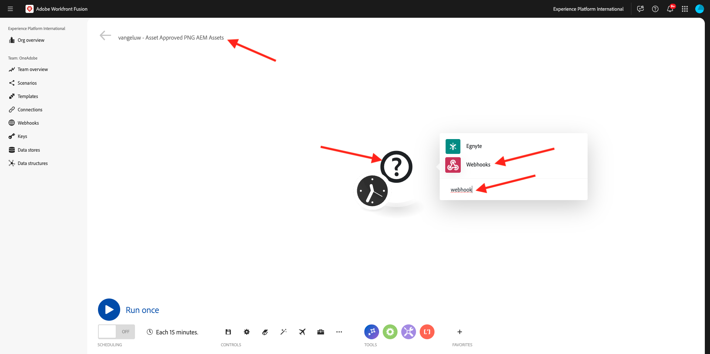
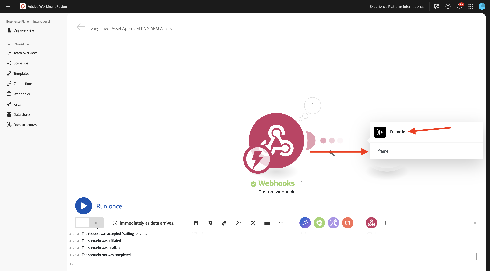
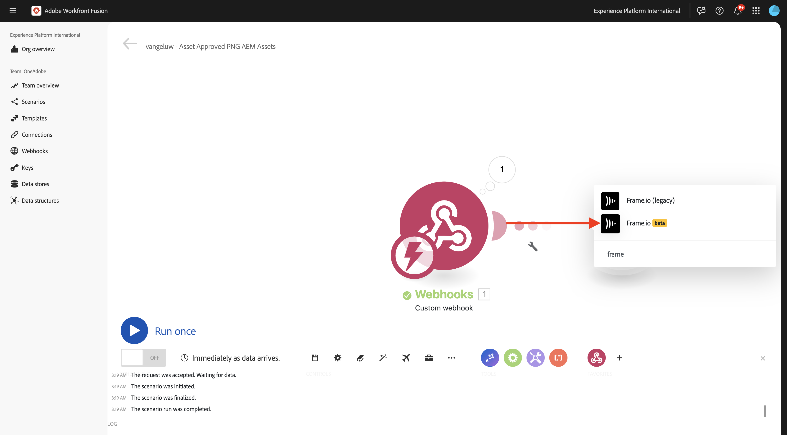
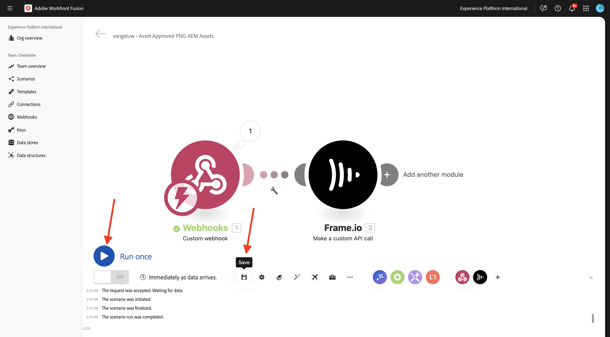
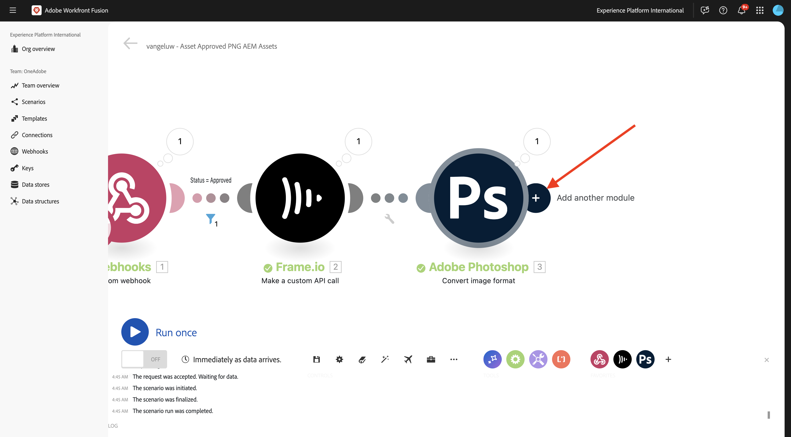

# 1.2.6帧I/O到Workfront Fusion到AEM Assets

>[!IMPORTANT]
>
>要完成本练习，您需要有权访问有效的AEM Assets CS Author环境。 如果您按照练习[Adobe Experience Manager Cloud Service和Edge Delivery Services](./../../../modules/asset-mgmt/module2.1/aemcs.md){target="_blank"}，您将有权访问此类环境。

>[!IMPORTANT]
>
>如果您之前已使用Author环境配置了AEM Assets CS项目，则可能是您的AEM CS沙盒已休眠。 鉴于解除此类沙盒的休眠需要10-15分钟，最好现在开始解除休眠过程，以免以后卡住。

在上一个练习中，您配置了一个方案，该方案使用Adobe Firefly、Adobe Photoshop API和Workfront Fusion自动生成Photoshop PSD文件的变体。 该方案的输出是一个新的Photoshop PSD文件。

但是，业务团队不需要PSD文件，他们需要PNG文件或JPG文件。 在本练习中，您将配置一种新的自动化方法，一旦帧I/O中的资产获得批准，就会生成一个PNG文件，并且该PNG文件会自动存储在AEM Assets中。

## 1.2.6.1创建新方案

转到[https://experience.adobe.com/](https://experience.adobe.com/){target="_blank"}。 打开&#x200B;**Workfront Fusion**。

在左侧菜单中，转到&#x200B;**方案**&#x200B;并选择您的文件夹`--aepUserLdap--`。 单击&#x200B;**创建新方案**。

使用名称`--aepUserLdap-- - Asset Approved PNG AEM Assets`。 接下来，单击&#x200B;**？**&#x200B;模块，输入搜索词`webhook`，然后单击&#x200B;**Webhooks**。

单击&#x200B;**自定义webhook**。

单击&#x200B;**添加**&#x200B;创建新的webhook。

使用名称`--aepUserLdap-- - Frame.io Webhook`。 单击&#x200B;**保存**。

您应该会看到此内容。 单击&#x200B;**将地址复制到剪贴板**。

## 1.2.6.2在Frame.io中配置Webhook

转到[https://developer.frame.io/](https://developer.frame.io/){target="_blank"}。 单击&#x200B;**开发人员工具**，然后选择&#x200B;**Webhooks**。

单击&#x200B;**创建Webhook**。

输入以下值：

- **名称**：使用`--aepUserLdap-- - Asset Labels Updated`
- **URL**：输入您刚刚在Workfront Fusion中创建的webhook的URL
- **团队**：选择适当的Frame.io团队，在本例中为&#x200B;**一个Adobe教程**。

向下滚动并启用&#x200B;**资产标签 — 已更新**&#x200B;旁边的复选框。 单击&#x200B;**提交**。

您应该会看到此内容。

转到[https://app.frame.io/projects](https://app.frame.io/projects){target="_blank"}，然后转到您之前创建的文件夹，该文件夹应命名为`--aepUserLdap--`。 双击以打开在上一个练习中创建的资源。

然后您应该会看到类似这样的内容。 单击字段&#x200B;**无状态**&#x200B;并将状态更改为&#x200B;**正在进行**。

切换回Workfront Fusion。 您现在应该看到连接是&#x200B;**已成功确定**。

单击&#x200B;**保存**&#x200B;以保存更改，然后单击&#x200B;**运行一次**&#x200B;以进行快速测试。

切换回Frame.io并单击字段&#x200B;**In Progress**&#x200B;并将状态更改为&#x200B;**需要审核**。

切换回Workfront Fusion，然后单击&#x200B;**自定义webhook**&#x200B;模块上的气泡。

气泡的详细视图显示了从Frame.io收到的数据。 您应会看到各种ID。例如，字段&#x200B;**resource.id**&#x200B;显示资产&#x200B;**citisignal-fibre.psd**&#x200B;的Frame.io中的唯一ID。

## 1.2.6.3从Frame.io获取资源详细信息

现在，Frame.io与Workfront Fusion之间的通信已通过自定义webhook建立，您应该获得有关其状态标签已更新的资源的更多详细信息。 为此，您将再次使用Workfront Fusion中的Frame.io连接器，类似于上一个练习。

单击&#x200B;**？**&#x200B;模块并输入搜索词`frame`。 单击&#x200B;**Frame.io**。

单击&#x200B;**Frame.io（旧版）**。

单击&#x200B;**获取资产**。

验证该连接是否设置为您在上一个练习中创建的、应命名为`--aepUserLdap-- - Frame.io Token`的连接。

接下来，您需要提供&#x200B;**资产ID**。 作为初始&#x200B;**自定义webhook**&#x200B;通信的一部分，Frame.io已将&#x200B;**资源ID**&#x200B;共享到Workfront Fusion，该资源ID可在字段&#x200B;**resource.id**&#x200B;下找到。 选择&#x200B;**resource.id**&#x200B;并单击&#x200B;**确定**。

单击&#x200B;**保存**&#x200B;以保存更改，然后单击&#x200B;**运行一次**&#x200B;以测试配置。

切换回Frame.io并单击字段&#x200B;**需要审核**&#x200B;并将状态更改为&#x200B;**正在进行**。

返回到Workfront Fusion并单击&#x200B;**Frame.io — 获取资源**&#x200B;模块上的气泡。 然后，您应该会看到类似的概述。

在Frame.io提供的资源详细信息中，您可以找到名为&#x200B;**Label**&#x200B;且设置为&#x200B;**in_progress**&#x200B;的字段。 您以后必须使用该字段来配置过滤器。

## 1.2.6.4转换为PNG

将鼠标悬停在模块&#x200B;**Frame.io上 — 获取资源**&#x200B;并单击&#x200B;**+**&#x200B;图标。

输入搜索词`photoshop`，然后单击&#x200B;**Adobe Photoshop**。

单击&#x200B;**转换图像格式**。

验证字段&#x200B;**Connection**&#x200B;是否正在使用您之前创建的名为`--aepUserLdap-- - Adobe IO`的连接。

在&#x200B;**Input**&#x200B;下，将字段&#x200B;**Storage**&#x200B;设置为&#x200B;**External**，并将&#x200B;**File Location**&#x200B;设置为使用模块&#x200B;**Frame.io返回的变量** Original **— 获取资源**。

接下来，单击&#x200B;**输出**&#x200B;下的&#x200B;**添加项**。

对于&#x200B;**输出**&#x200B;配置，将字段&#x200B;**Storage**&#x200B;设置为&#x200B;**Fusion内部存储**，将&#x200B;**Type**&#x200B;设置为&#x200B;**image/png**。 单击&#x200B;**保存**。

单击&#x200B;**确定**。

单击&#x200B;**保存**&#x200B;以保存更改。

接下来，您应该设置一个过滤器，以确保仅对状态为&#x200B;**已批准**&#x200B;的资源渲染PNG文件。 为此，请单击模块&#x200B;**Frame.io — 获取资源**&#x200B;和&#x200B;**Adobe Photoshop — 转换图像格式**&#x200B;之间的&#x200B;**扳手**&#x200B;图标，然后选择&#x200B;**设置过滤器**。

配置以下字段：

- **标签**：使用`Is Asset Approved`。
- **条件**：从&#x200B;**Frame.io的响应中选择字段** Label **— 获取资源**&#x200B;模块。
- **基本运算符**：选择&#x200B;**等于**。
- **值**： `approved`。

单击&#x200B;**确定**。

单击&#x200B;**保存**&#x200B;以保存更改，然后单击&#x200B;**运行一次**&#x200B;以测试配置。

切换回Frame.io并单击字段&#x200B;**In Progress**&#x200B;并将状态更改为&#x200B;**Approved**。

返回Workfront Fusion。 此时，您应会看到场景中的所有模块均已成功执行。 单击&#x200B;**Adobe Photoshop — 转换图像格式**&#x200B;模块上的气泡。

在执行&#x200B;**Adobe Photoshop — 转换图像格式**&#x200B;模块的详细信息中，您可以看到现在生成了PNG文件。 接下来，将该文件存储在AEM Assets CS中。

## 1.2.6.5在AEM Assets CS中存储PNG

将鼠标悬停在&#x200B;**Adobe Photoshop — 转换图像格式**&#x200B;模块上，然后单击&#x200B;**+**&#x200B;图标。

输入搜索词`aem`并选择&#x200B;**AEM Assets**。

单击&#x200B;**上传资产**。

您现在需要配置与AEM Assets CS的连接。 单击&#x200B;**添加**。

使用以下设置：

- **连接类型**： **AEM Assets as a Cloud Service**。
- **连接名称**： `--aepUserLdap-- AEM Assets CS`。
- **实例URL**：复制AEM Assets CS创作环境的实例URL，它应该如下所示： `https://author-pXXXXX-eXXXXXXX.adobeaemcloud.com`。
- **访问详细信息填写选项**：选择&#x200B;**提供JSON**。

您现在需要提供JSON格式的&#x200B;**技术帐户凭据**。 要实现此目的，请使用AEM Cloud Manager执行多个步骤。 在执行此操作时，请保持此屏幕处于打开状态。

转到[https://my.cloudmanager.adobe.com](https://my.cloudmanager.adobe.com){target="_blank"}。 您应选择的组织是`--aepImsOrgName--`。 然后你将看到类似这样的内容。 单击以打开您的程序，该程序应名为`--aepUserLdap-- - Citi Signal`。

单击3个点&#x200B;**...**&#x200B;并选择&#x200B;**Developer Console**。

单击&#x200B;**使用Adobe登录**。

随后将转到&#x200B;**Developer Console**。 单击&#x200B;**新建技术帐户**。

然后您应该会看到类似这样的内容。 将完整的JSON有效负载复制到剪贴板。

返回到Workfront Fusion，并将完整的JSON有效负载粘贴到&#x200B;**JSON格式的技术帐户凭据**&#x200B;字段中。 单击&#x200B;**继续**。

随后将验证您的连接，如果成功，将在AEM Assets模块中自动选择您的连接。 下一步要做的就是配置文件夹。 在本练习中，您应该创建一个新的专用文件夹。

要创建新的专用文件夹，请转到[https://experience.adobe.com](https://experience.adobe.com/){target="_blank"}。 确保选择正确的Experience Cloud实例，应为`--aepImsOrgName--`。 然后单击&#x200B;**Experience Manager Assets**。

在AEM Assets CS环境中单击&#x200B;**选择**，该环境应命名为`--aepUserLdap-- - Citi Signal dev`。

转到&#x200B;**资源**&#x200B;并单击&#x200B;**创建文件夹**。

输入名称`--aepUserLdap-- - Frame.io PNG`并单击&#x200B;**创建**。

随后将创建您的文件夹。

返回到Workfront Fusion，单击&#x200B;**单击此处选择文件夹**，然后选择文件夹`--aepUserLdap-- - Frame.io PNG`。

验证目标是否设置为`--aepUserLdap-- - Frame.io PNG`。 然后在&#x200B;**Source文件**&#x200B;下，选择&#x200B;**映射**。

在&#x200B;**文件名**&#x200B;下，选择变量`{{3.filenames[]}}`。

在&#x200B;**数据**&#x200B;下，选择变量`{{3.files[]}}`。

>[!NOTE]
>
>可以使用以下语法手动指定Workfront Fusion中的变量： `{{3.filenames[]}}`。 变量中的数字引用场景中的模块。 在此示例中，您可以看到场景中的第三个模块名为&#x200B;**Adobe Photoshop — 转换图像格式**，其序列号为&#x200B;**3**。 这意味着变量`{{3.filenames[]}}`将访问序列号为3的模块中的字段&#x200B;**文件名[]**。 序列号有时可能不同，因此，在复制/粘贴此类变量时请务必注意，并始终验证使用的序列号是否正确。

单击&#x200B;**确定**。

单击&#x200B;**保存**&#x200B;以保存更改。

接下来，您需要为刚刚创建的技术帐户设置特定权限。 在&#x200B;**Cloud Manager**&#x200B;的&#x200B;**Developer Console**&#x200B;中创建该帐户时，向其授予&#x200B;**读取**&#x200B;访问权限，但对于此用例，需要&#x200B;**写入**&#x200B;访问权限。 为此，您可以转到AEM CS创作环境。

转到[https://my.cloudmanager.adobe.com](https://my.cloudmanager.adobe.com){target="_blank"}。 您应选择的组织是`--aepImsOrgName--`。 单击以打开您的程序，该程序应名为`--aepUserLdap-- - Citi Signal`。 然后你将看到类似这样的内容。 单击作者URL。

单击&#x200B;**使用Adobe登录**。

转到&#x200B;**设置** > **安全性** > **用户**。

单击以打开技术帐户用户帐户。

转到&#x200B;**组**&#x200B;并将此技术帐户用户添加到组&#x200B;**DAM-Users**。

单击&#x200B;**保存并关闭**。

返回Workfront Fusion。 单击&#x200B;**运行一次**&#x200B;以测试您的方案。

切换回Frame.io并确保资产状态再次更改为&#x200B;**已批准**。

>[!NOTE]
>
>您可能需要先将其更改为&#x200B;**进行中**&#x200B;或&#x200B;**需要审核**，然后再更改为&#x200B;**已批准**。

您的Workfront Fusio方案随后将被激活，并应成功完成。 通过查看&#x200B;**AEM Assets**&#x200B;模块上的气泡中的信息，您已经看到PNG文件已成功存储在AEM Assets CS中。

返回AEM Assets CS并打开文件夹`--aepUserLdap-- - Frame.io PNG`。 现在，您应该会看到作为Workfront Fusion场景的一部分生成的PNG文件。 双击文件以将其打开。

现在，您可以查看有关生成的PNG文件的元数据的更多详细信息。

您现在已成功完成此练习。

## 后续步骤

转到[使用Workfront Fusion进行Creative工作流自动化的摘要和好处](./summary.md){target="_blank"}

返回到[使用Workfront Fusion的Creative工作流自动化](./automation.md){target="_blank"}

返回[所有模块](./../../../overview.md){target="_blank"}
