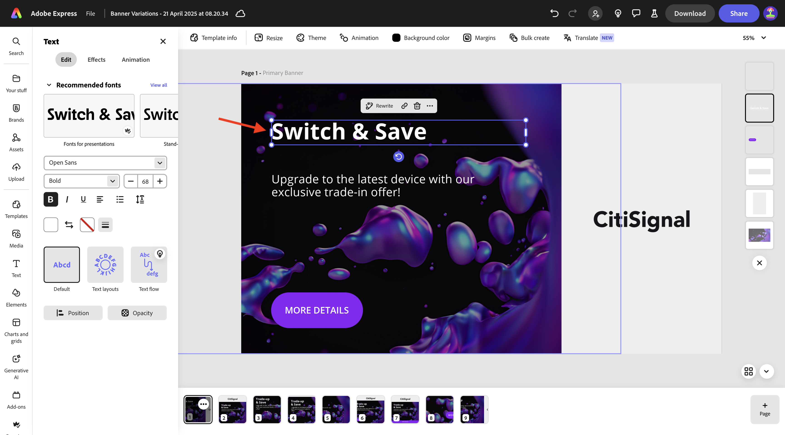
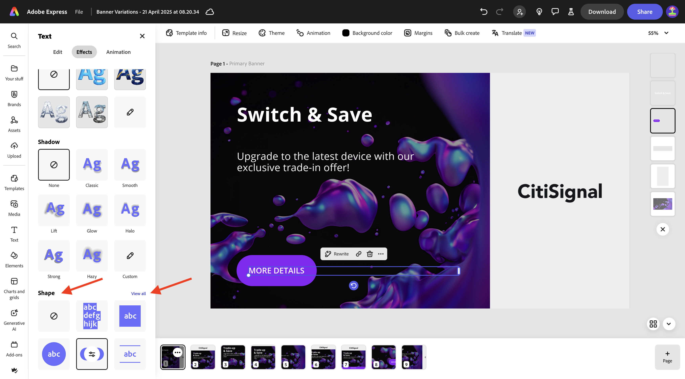
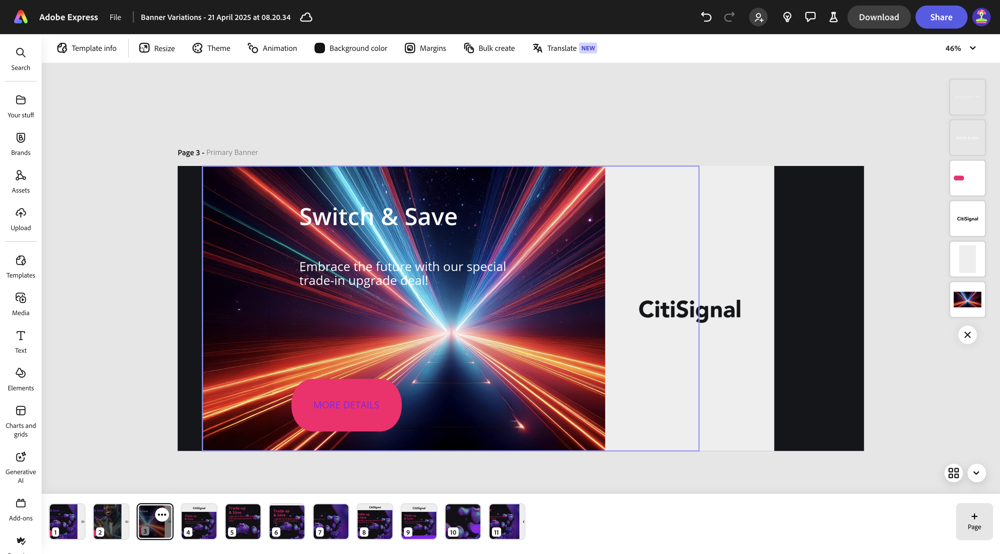

# 1.3.1 Adobe Express快速入门

## 1.3.1.1登录到Adobe Express

打开新的无痕浏览器窗口，然后转到[https://www.adobe.com/home](https://www.adobe.com/home){target="_blank"}。 使用您的&#x200B;**公司或学校帐户**&#x200B;登录，然后选择帐户&#x200B;**`--aepImsOrgName--`**。

Adobe Express可作为贵组织许可证的一部分提供给您。 要确保您有权访问Adobe Express，您需要检查您是否登录到正确的组织。 为此，请单击&#x200B;**配置文件**&#x200B;图标，然后验证哪个帐户处于活动状态。 您应使用的帐户名为`--aepImsOrgName--`。

单击&#x200B;**切换配置文件**&#x200B;以更改帐户。

从菜单中选择正确的帐户，在本例中为&#x200B;**Experience Platform International**（但可能是其他组织）。

在正确的帐户激活后，转到&#x200B;**应用程序**&#x200B;并单击&#x200B;**Adobe Express**&#x200B;卡片上的&#x200B;**开始**。

您现在已登录&#x200B;**Adobe Express**。

## 1.3.1.2从品牌模板开始

在Adobe Express中，转到&#x200B;**品牌**。 您的品牌模板库目前可能为空。 CitiSignal之前定义了一个品牌模板，您现在应重复使用该现有模板。

为此，请转到[https://www.adobe.com/files/link/1c2f92cf-17bc-4d11-6031-dbd251e6cb57](https://www.adobe.com/files/link/1c2f92cf-17bc-4d11-6031-dbd251e6cb57)。

您应该会看到此内容。 单击3个点&#x200B;**...**。

选择&#x200B;**制作副本**。

大约一分钟后，您应该会看到一条消息，确认您已制作品牌模板的个人副本。

返回Adobe Express，转到&#x200B;**品牌**，然后刷新页面。 您现在应该看到&#x200B;**CitiSignal (Telco)**&#x200B;品牌模板。 单击以打开&#x200B;**CitiSignal (Telco)**&#x200B;品牌模板。

然后，您应该会看到资源库，如徽标、字体、颜色、模板等。

转到&#x200B;**快速模板**，然后单击以打开模板&#x200B;**横幅变体**。

单击&#x200B;**启动新文件**。

您应该会看到此内容。

单击显示&#x200B;**TradeUp &amp; Save**&#x200B;的文本框。 然后，选择&#x200B;**重写**&#x200B;并选择样式，然后单击&#x200B;**生成**。

选择一个变量，然后单击&#x200B;**替换**。

然后，您应该会看到更新的文本。

接下来，单击文本&#x200B;**更多详细信息**。

选择&#x200B;**效果**。

转到&#x200B;**形状**&#x200B;并单击&#x200B;**查看全部**。

单击&#x200B;**finetune**&#x200B;按钮。 更改&#x200B;**形状大小**，然后单击颜色按钮。

通过从&#x200B;**CitiSignal颜色主题**&#x200B;中选择其他颜色来更改颜色。

然后，您应该会看到已更改的按钮。

接下来，转到&#x200B;**品牌**，然后单击&#x200B;**应用品牌**。 然后，您应该会看到图像的外观发生了更改。

请注意，您还可以通过单击&#x200B;**齿轮**&#x200B;图标来详细了解&#x200B;**应用品牌**&#x200B;设置。

接下来，单击您正在处理的图像上的3个点&#x200B;**...**，然后单击&#x200B;**复制**。

然后，您应该会看到一个完全相同的新图像。 单击屏幕右侧的背景图层。

>[!IMPORTANT]
>
>要完成本练习，您需要有权访问有效的AEM Assets CS Author环境。 如果您按照练习[Adobe Experience Manager Cloud Service和Edge Delivery Services](./../../../modules/asset-mgmt/module2.1/aemcs.md){target="_blank"}，您将有权访问此类环境。

在左侧菜单中转到&#x200B;**Assets**，选择您的应名为`--aepUserLdap-- - CitiSignal dev`的AEM Assets CS存储库。 接下来，转到文件夹&#x200B;**citisignal**。

选择图像&#x200B;**homepage-hero-1.png**。 然后，您应该会看到背景图层的变化。

按指示选择文本框并单击&#x200B;**重写**。 选择&#x200B;**重新短语**，然后选择特定样式。 单击&#x200B;**生成**。

选择变体并单击&#x200B;**替换**。

您应该会看到此内容。 接下来，单击页面底部的3个圆点&#x200B;**...**，然后单击&#x200B;**复制**。

在新创建的图像上，转到&#x200B;**媒体**&#x200B;并单击&#x200B;**生成图像**。

选择&#x200B;**横向(4:3)**。

输入提示`laser beams running through space`并单击&#x200B;**生成**。

然后，您应该会看到由Adobe Firefly生成的图像。 请注意，生成图像的图层一直位于顶部。

向下移动新生成的图像，并将其放在上一个背景图层的顶部。

通过单击旧背景图层并选择&#x200B;**删除**&#x200B;来删除该背景图层。

调整图像，使其覆盖整个画布。

选择文本框&#x200B;**切换并保存**&#x200B;以将字体颜色更改为&#x200B;**白色**。

将字体颜色更改为&#x200B;**白色**。

选择另一个文本框以将字体颜色更改为&#x200B;**白色**。

将字体颜色更改为&#x200B;**白色**。

接下来，单击&#x200B;**调整大小**&#x200B;并输入自定义分辨率&#x200B;**2600** x **1080**。 确保选中&#x200B;**展开图像**&#x200B;的复选框。 单击&#x200B;**调整大小**。

您应该会看到此内容。

几分钟后，您将看到图像的一些新变体。 选择一个，然后单击&#x200B;**保留**。

您应该会看到此内容。

移动并调整图像，以使其填充可用空间。

接下来，单击&#x200B;**翻译**。

选择一些语言，如&#x200B;**法语**、**荷兰语**&#x200B;和&#x200B;**西班牙语**。 确保仅选择您正在处理的特定页面，在本例中为&#x200B;**第3**&#x200B;页。 单击&#x200B;**翻译**。

随后将生成翻译。

然后，您应该会看到正在创建许多新页面。 单击&#x200B;**关闭**&#x200B;图标。

验证翻译并根据需要进行更改，例如，在此示例中翻译不是最佳的。

根据需要更新文本。

您的资产现已准备就绪。

## 后续步骤

转到Adobe Express中的[动画和视频](./ex2.md){target="_blank"}

返回[Adobe Express和Adobe Experience Cloud](./express.md){target="_blank"}

返回[所有模块](./../../../overview.md){target="_blank"}
