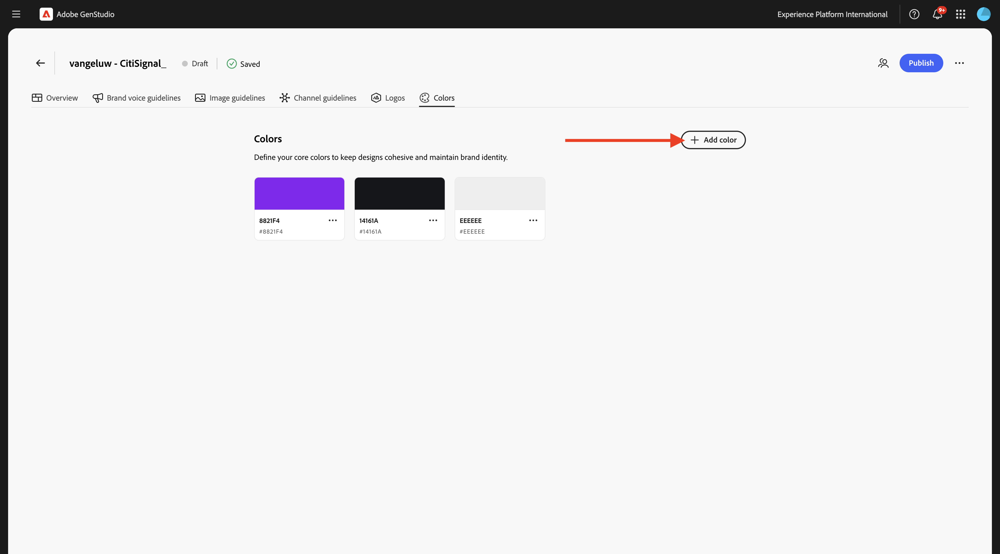
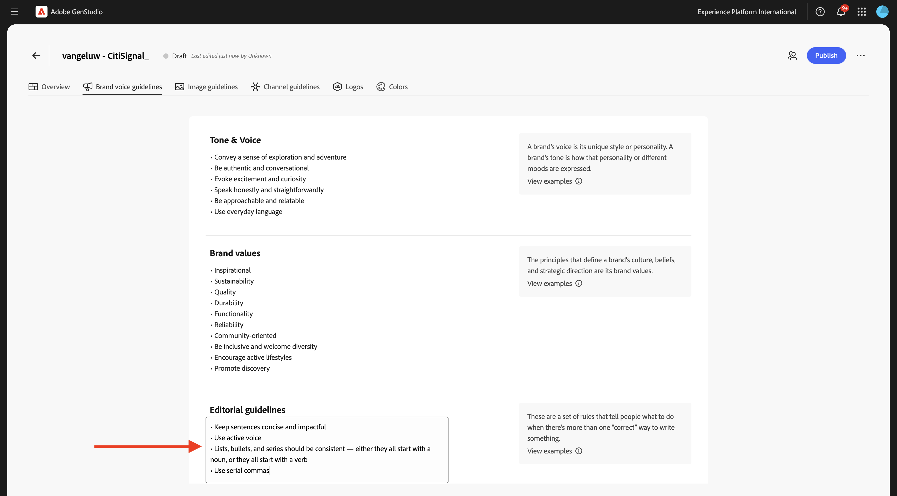
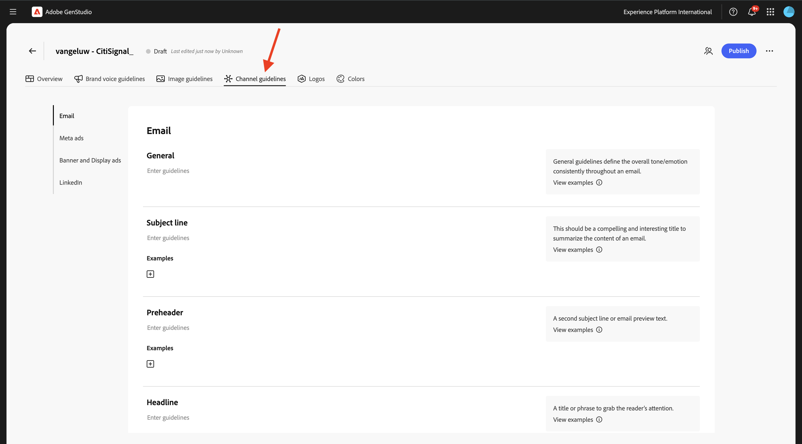

# 1.3.1配置：Brand

品牌可将组织、产品、服务或概念与其他人区分开来。 品牌的某些方面是客观的，如商标，而其他方面则是主观的，如语调。

GenStudio for Performance Marketing利用来自您品牌的丰富品牌信息，将其与产品和角色信息相结合，并构建全面的品牌识别。 此品牌标识用于指导使用Adobe的创作AI技术创建品牌上内容。

要开始创建您自己的品牌，请执行以下步骤。

转到[https://experience.adobe.com/](https://experience.adobe.com/){target="_blank"}。 打开&#x200B;**GenStudio**。


您应该会看到此内容。


使用GenStudio for Performance Marketing的第一件事是配置您的品牌。 单击&#x200B;**品牌**&#x200B;图标。


单击&#x200B;**+添加品牌**。


为您的品牌输入名称`--aepUserLdap-- - CitiSignal`。 选择&#x200B;**手动添加**，然后单击&#x200B;**添加品牌**。


## 1.3.1.1颜色

您应该会看到此内容。 单击&#x200B;**颜色**。


单击&#x200B;**+添加颜色**。


有4种不同的颜色可添加：

- `#8821F4`
- `#14161A`
- `#EEEEEE`
- `#FF006C`

输入颜色`#8821F4`的十六进制代码。 单击&#x200B;**添加**。


单击&#x200B;**+添加颜色**。


输入颜色`#14161A`的十六进制代码。 单击&#x200B;**添加**。


单击&#x200B;**+添加颜色**。


输入颜色`#EEEEEE `的十六进制代码。 单击&#x200B;**添加**。


单击&#x200B;**+添加颜色**。



输入颜色`#FF006C `的十六进制代码。 单击&#x200B;**添加**。


您现在应该拥有此项。


## 1.3.1.2徽标

将文件[CitiSignal-GSPeM-assets.zip](../../../assets/gspem/CitiSignal-GSPeM-assets.zip)下载到您的桌面并解压缩。


接下来，转到&#x200B;**徽标**。 单击&#x200B;**+添加徽标**。


单击&#x200B;**浏览**。


转到&#x200B;**CitiSignal-GSPeM-assets** > **徽标**&#x200B;文件夹并选择这些文件。 单击&#x200B;**打开**。


然后您应该拥有此项。 单击&#x200B;**添加徽标**。


然后您应该拥有此项。


## 1.3.1.3品牌语音准则

接下来，转到&#x200B;**品牌语音指南**。


对于&#x200B;**音调和语音**，使用此：

```
• Convey a sense of exploration and adventure
• Be authentic and conversational
• Evoke excitement and curiosity
• Speak honestly and straightforwardly
• Be approachable and relatable
• Use everyday language
```


对于&#x200B;**品牌值**，使用此：

```
• Inspirational
• Sustainability
• Quality
• Durability
• Functionality
• Reliability
• Community-oriented
• Be inclusive and welcome diversity
• Encourage active lifestyles
• Promote discovery
```


对于&#x200B;**编辑指南**，请使用以下内容：

```
• Keep sentences concise and impactful
• Use active voice
• Lists, bullets, and series should be consistent — either they all start with a noun, or they all start with a verb
• Use serial commas
```



对于&#x200B;**编辑限制**，请使用以下内容：

```
• Avoid activity-specific jargon unless it’s widely adopted
• Avoid promoting the skill level or experience level of the user of our outdoor equipment
• Avoid technical language or jargon
```


## 1.3.1.4图像准则

接下来，转到&#x200B;**图像指南**。


将&#x200B;**内容类型**&#x200B;设置为&#x200B;**Art**，对于&#x200B;**Description**，使用此：

```
Capture candid, unposed shots of real people and futuristic animals engaging with technology in their daily lives to convey authenticity and relatability.
```


对于&#x200B;**合成**，使用此：

```
Focus on the experiences, speed and emotions of using technology, rather than just the products themselves.
```


对于&#x200B;**环境**，使用此：

```
Highlight futuristic, clean, and professional settings that reflect innovation and connectivity.
```


对于&#x200B;**颜色**，使用此：

```
Use a palette inspired by technology, including sleek metallics, cool purple and blue, and neutral tones.
```


对于&#x200B;**照明**，使用此：

```
Utilize bright, natural lighting to create a welcoming and dynamic atmosphere.
```


对于&#x200B;**情绪**，使用此：

```
Each image should evoke a feeling of speed, innovation and being part of the future.
```


对于&#x200B;**Restrictions**，使用此：

```
Avoid cluttered or busy backgrounds that detract from the main subject.
```


## 1.3.1.4渠道准则

接下来，转到&#x200B;**渠道准则**。



对于&#x200B;**电子邮件**，请使用以下值：

- **常规**

```
• Use simple, short sentences
• Be clear and concise
• Invoke a sense of adventure and exploration
```

- **主题行**

```
• Limit to less than 8 words
• Provide specific details about what’s inside the email
• Use sentence case
• Do not use end punctuation
```

- **预编译标头**

```
• Limit to less than 80 characters
• Provide specific details about what’s inside the email
• Use sentence case
• Use ending punctuation
```

- **标题**

```
• Limit to less than 12 words
• Generate excitement through compelling and exciting statements
• Use sentence case
```

- **Sub-headline**：暂时留空

- **正文**

```
• Limit to less than 120 words
• Use bullet points for lists containing more than 3 items
• Use between 0 to 4 headings within the body to separate main ideas
• Use sentence case
• Use ending punctuation
```

- **Call-to-action (CTA)**

```
• Limit to between 1 to 3 short words
• Limit to less than 20 characters
• Use an action-oriented verb as the first word and intended action the end-user should take
• Avoid ending punctuation
• Use title case
```


对于&#x200B;**元广告**，请使用以下值：

- **常规**

```
• Use simple, short sentences
• Be clear and concise
• Invoke a sense of adventure and exploration
• Make product names prominent
• Use community-building concepts and language
```

- **标题**

```
• Limit  to less than 8 words
• Limit to less than 27 characters
• Make it clear what action the reader should take
• Use sentence case
• Avoid ending punctuation
```

- **正文**

```
• Limit to less than 125 characters
• Use sentence case
• Use ending punctuation
```

- **在图像文本上**：暂时留空


对于&#x200B;**横幅和显示广告**，请使用以下值：

- **常规**

```
• Make readers feel inspired, interested, and sure of the next step
• Avoid word repetition
• Make product names prominent
```

- **标题**

```
• Clearly state the main benefit of the offer
• Use sentence case
• Use ending punctuation
• Limit to less than 60 characters
```

- **Sub-headline**：暂时留空

- **正文**

```
• Communicate the benefits of clicking into the offer
• Use sentence case
• Use ending punctuation
```

- **Call-to-action (CTA)**

```
• Limit to between 1 to 3 short words
• Limit to less than 20 characters
• Use an action-oriented verb as the first word
• Use title case
• Avoid ending punctuation
```


对于&#x200B;**LinkedIn**，请使用以下值：

- **常规**：暂时留空

- **Headline**：暂时留空

- **描述**：暂时留空

- **介绍性文本**：暂时留空

- **在图像文本上**：暂时留空


最后，转到&#x200B;**概述**。 现在，您可以查看所有配置的概述。 还有最后一件事要做。 单击&#x200B;**何时使用此品牌**&#x200B;下的&#x200B;**+添加**。


输入以下文本并单击&#x200B;**保存更改**。

```
This is the default brand for CitiSignal marketing campaign. Use the CitiSignal brand for all brand and product campaigns that don't require specific guidelines.
```


单击&#x200B;**发布**。


再次单击&#x200B;**发布**。


您的品牌现已发布，该品牌现在可用于创建品牌内容。 单击&#x200B;**完成**。


## 后续步骤

转到[配置：角色、产品和模板](./ex2.md){target="_blank"}

返回[GenStudio for Performance Marketing](./genstudio.md){target="_blank"}

返回[所有模块](./../../../overview.md){target="_blank"}
