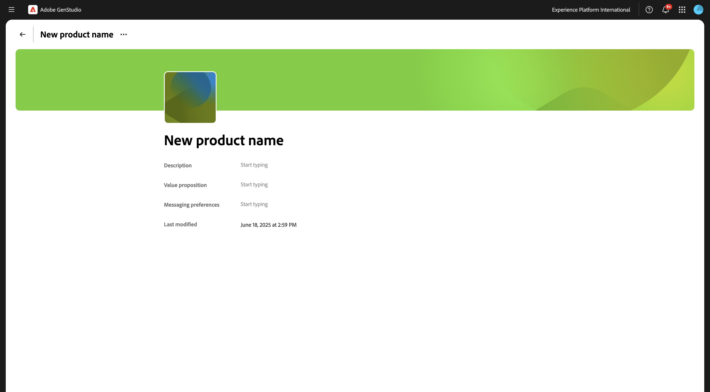
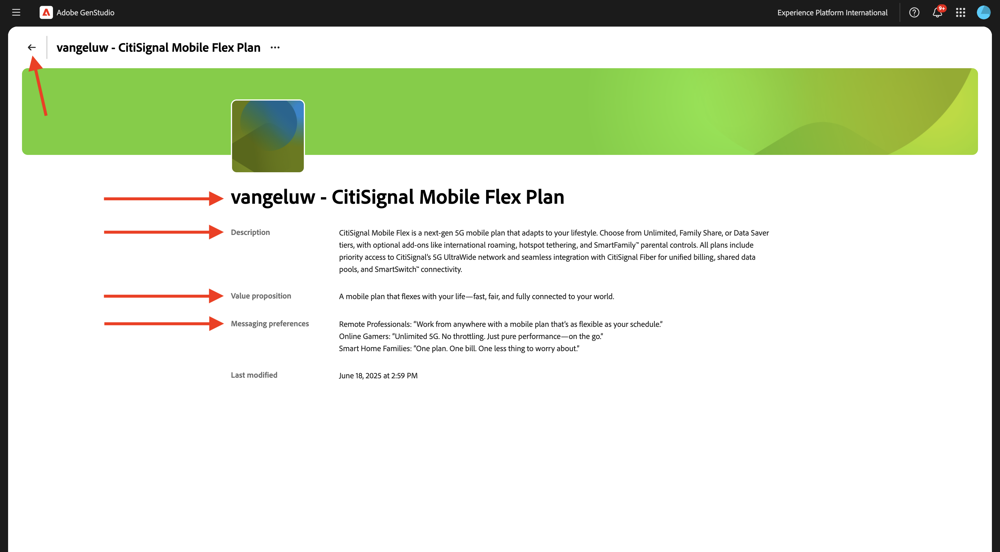

# 1.3.2配置：角色、产品和模板

转到[https://experience.adobe.com/](https://experience.adobe.com/){target="_blank"}。 打开&#x200B;**GenStudio**。


## 1.3.2.1产品

GenStudio for Performance Marketing中的产品利用对产品规范、优势和独特因素的深入了解来生成有影响力的内容。

产品包含特定产品的所有元素，如图像、描述和价值主张，以创建有凝聚力的品牌呈现。 利用Adobe的高级AI技术，GenStudio for Performance Marketing准则（品牌、产品和角色）可协作来生成引人注目的内容，这些内容展示您产品的强项，并确保所有消息传递的一致性。

若要开始创建自己的产品，请单击3个圆点&#x200B;**...**，然后选择&#x200B;**产品**。


单击&#x200B;**+添加产品**。


选择&#x200B;**手动添加**&#x200B;并单击&#x200B;**继续**。


您应该会看到此内容。



对于产品名称，请使用`--aepUserLdap-- - CitiSignal Mobile Flex Plan`。

对于字段&#x200B;**Description**，使用此：

```
CitiSignal Mobile Flex is a next-gen 5G mobile plan that adapts to your lifestyle. Choose from Unlimited, Family Share, or Data Saver tiers, with optional add-ons like international roaming, hotspot tethering, and SmartFamily™ parental controls. All plans include priority access to CitiSignal’s 5G UltraWide network and seamless integration with CitiSignal Fiber for unified billing, shared data pools, and SmartSwitch™ connectivity. 
```

对于字段&#x200B;**值建议**，请使用以下内容：

```
A mobile plan that flexes with your life—fast, fair, and fully connected to your world.
```

对于字段&#x200B;**消息首选项**，请使用以下内容：

```
Remote Professionals: “Work from anywhere with a mobile plan that’s as flexible as your schedule.”
Online Gamers: “Unlimited 5G. No throttling. Just pure performance—on the go.”
Smart Home Families: “One plan. One bill. One less thing to worry about.”
```

您的产品配置现在应如下所示。 单击&#x200B;**返回**&#x200B;图标。



单击&#x200B;**+添加产品**。


选择&#x200B;**手动添加**&#x200B;并单击&#x200B;**继续**。


您应该会看到此内容。


对于产品名称，请使用`--aepUserLdap-- - CitiSignal Fiber Max`。

对于字段&#x200B;**Description**，使用此：

```
CitiSignal Fiber Max is our premium residential internet plan, engineered for households that demand uncompromising speed, stability, and coverage. With symmetrical speeds up to 2 Gbps, it’s ideal for remote professionals juggling Zoom calls and cloud apps, gamers chasing millisecond precision, and families running dozens of smart devices. The plan includes a Wi-Fi 6E router, optional mesh extenders for whole-home coverage, and proactive network monitoring. 
```

对于字段&#x200B;**值建议**，请使用以下内容：

```
Power your work, play, and home with the fastest, most reliable fiber internet—built for the way you live today and tomorrow.
```

对于字段&#x200B;**消息首选项**，请使用以下内容：

```
Remote Professionals: “Stay connected, stay productive—no matter how many meetings or megabytes your day demands.”
Online Gamers: “Zero lag. Zero mercy. Dominate with 2 Gbps fiber and ultra-low ping.”
Smart Home Families: “Every room. Every device. Always on. Welcome to whole-home harmony.”
```

您的产品配置现在应如下所示。 单击&#x200B;**返回**&#x200B;图标。


然后，您应该会看到配置的2个产品。


## 1.3.2.2角色

角色提供了对客户细分的真实描述，包括他们的信息、兴趣、痛点、偏好和行为特征。

GenStudio for Performance Marketing利用准则的强大功能（品牌、产品和角色）和Adobe的创作AI技术，为您的目标客户策划个性化的营销内容&#x200B;。

若要开始创建角色，请单击3个圆点&#x200B;**...**，然后选择&#x200B;**角色**。


单击&#x200B;**+添加角色**。


选择&#x200B;**手动添加**&#x200B;并单击&#x200B;**继续**。


您应该会看到此内容。


对于角色名称，使用`--aepUserLdap-- - Smart Home Families`。

对于字段&#x200B;**Description**，使用此：

```
These are tech-forward households with multiple connected devices—smart TVs, thermostats, security systems, voice assistants, and more. They value convenience, automation, and seamless connectivity across the home. They often have children and are concerned about online safety, parental controls, and whole-home coverage.
```

对于字段&#x200B;**消息首选项**，请使用以下内容：

```
Friendly, family-oriented tone
Visuals showing whole-home coverage and device compatibility
Messaging that highlights security, parental controls, and easy setup
Bundled offers (e.g., mesh Wi-Fi, smart home consultations)
How-to content or setup guides for non-tech-savvy users
```

您的角色配置现在应如下所示。 单击&#x200B;**返回**&#x200B;图标。


单击&#x200B;**+添加角色**。


选择&#x200B;**手动添加**&#x200B;并单击&#x200B;**继续**。


您应该会看到此内容。


对于角色名称，使用`--aepUserLdap-- - Online Gamers`。

对于字段&#x200B;**Description**，使用此：

```
This persona includes competitive and casual gamers who demand ultra-fast, low-latency internet. They often stream gameplay, participate in multiplayer matches, and use voice chat platforms. They are highly sensitive to lag, jitter, and packet loss, and they’re vocal about their experiences online. Many are early adopters of new tech and value performance above all else.
```

对于字段&#x200B;**消息首选项**，请使用以下内容：

```
Bold, energetic tone with gaming lingo
Metrics like ping time, jitter, and upload/download speeds
Visuals showing latency improvements or side-by-side comparisons
Endorsements from gaming influencers or esports teams
Promotions tied to gaming platforms or bundles (e.g., free months of Xbox Game Pass)
```

您的角色配置现在应如下所示。 单击&#x200B;**返回**&#x200B;图标。


单击&#x200B;**+添加角色**。


选择&#x200B;**手动添加**&#x200B;并单击&#x200B;**继续**。


您应该会看到此内容。


对于角色名称，使用`--aepUserLdap-- - Remote Professionals`。

对于字段&#x200B;**Description**，使用此：

```
These are knowledge workers, freelancers, consultants, and hybrid employees who rely on a stable, high-speed internet connection to maintain productivity from home. Their workdays are filled with video calls, cloud-based collaboration, and large file transfers. They often use multiple devices simultaneously and expect seamless performance across all of them. Many are tech-savvy and value proactive customer support and service transparency.
```

对于字段&#x200B;**消息首选项**，请使用以下内容：

```
Clear, professional tone with a focus on productivity and reliability
Testimonials or case studies from similar professionals
Visuals like speed comparison charts and uptime guarantees
Emphasis on 24/7 support and service-level agreements
Messaging that highlights “work-from-anywhere” flexibility
```

您的角色配置现在应如下所示。 单击&#x200B;**返回**&#x200B;图标。


然后，您应该会看到配置的3个角色。


## 1.3.2.3模板

GenStudio for Performance Marketing使内容创建者能够使用模板快速生成一致的品牌营销内容。 模板通过提供包括预配置布局和设计元素的起点，显着减少了生成新内容所需的时间和精力。

虽然GenStudio for Performance Marketing不支持在应用程序中直接创建模板，但您可以使用流行的设计工具(如Adobe InDesign、Illustrator或Express)轻松设计和准备模板。 设计完成后，您可以对其进行调整以用于GenStudio for Performance Marketing。 在本练习中，您将将许多预定义的模板导入GenStudio for Performance Marketing。

在上一个练习中，您将[CitiSignal-GSPeM-assets.zip](../../../assets/gspem/CitiSignal-GSPeM-assets.zip)文件下载到桌面并解压缩。 该文件夹包含4个示例模板，您现在需要将这些模板导入GenStudio。


转到&#x200B;**内容** > **模板**。 单击&#x200B;**+添加模板**。


选择&#x200B;**元广告**，然后单击&#x200B;**浏览**。


在包含下载的&#x200B;**CitiSignal-GSPeM-assets**&#x200B;文件的文件夹中，导航到文件夹&#x200B;**模板**。 选择文件&#x200B;**citisignal-meta-ad.html**，然后单击&#x200B;**打开**。


您应该会看到此内容。 单击&#x200B;**下一步**。


单击&#x200B;**下一步**。


将此用于字段&#x200B;**模板名称**：
`--aepUserLdap---citisignal-meta-ad`并将长宽比设置为&#x200B;**1:1**。 单击&#x200B;**发布模板**。


您的模板现已保存，并可在模板库中使用。


单击&#x200B;**+添加模板**。


选择&#x200B;**横幅和显示广告**，然后单击&#x200B;**浏览**。


在包含下载的&#x200B;**CitiSignal-GSPeM-assets**&#x200B;文件的文件夹中，导航到文件夹&#x200B;**模板**。 选择文件&#x200B;**citisignal-displaytemplate-300x250.html**，然后单击&#x200B;**打开**。


您应该会看到此内容。 单击&#x200B;**下一步**。


单击&#x200B;**下一步**。


将此用于字段&#x200B;**模板名称**：
`--aepUserLdap---citisignal-displaytemplate-300x250`并将&#x200B;**广告宽度**&#x200B;和&#x200B;**广告高度**&#x200B;设置为&#x200B;**300x250**。 单击&#x200B;**发布模板**。


您的模板现已保存，并可在模板库中使用。


单击&#x200B;**+添加模板**。


选择&#x200B;**横幅和显示广告**，然后单击&#x200B;**浏览**。


在包含下载的&#x200B;**CitiSignal-GSPeM-assets**&#x200B;文件的文件夹中，导航到文件夹&#x200B;**模板**。 选择文件&#x200B;**citisignal-displaytemplate-300x600.html**，然后单击&#x200B;**打开**。


您应该会看到此内容。 单击&#x200B;**下一步**。


单击&#x200B;**下一步**。


将此用于字段&#x200B;**模板名称**：
`--aepUserLdap---citisignal-displaytemplate-300x600`并将&#x200B;**广告宽度**&#x200B;和&#x200B;**广告高度**&#x200B;设置为&#x200B;**300x600**。 单击&#x200B;**发布模板**。


您的模板现已保存，并可在模板库中使用。


单击&#x200B;**+添加模板**。


选择&#x200B;**横幅和显示广告**，然后单击&#x200B;**浏览**。


在包含下载的&#x200B;**CitiSignal-GSPeM-assets**&#x200B;文件的文件夹中，导航到文件夹&#x200B;**模板**。 选择文件&#x200B;**citisignal-displaytemplate-970x250.html**，然后单击&#x200B;**打开**。


您应该会看到此内容。 单击&#x200B;**下一步**。


单击&#x200B;**下一步**。


将此用于字段&#x200B;**模板名称**：
`--aepUserLdap---citisignal-displaytemplate-970x250`并将&#x200B;**广告宽度**&#x200B;和&#x200B;**广告高度**&#x200B;设置为&#x200B;**970x250**。 单击&#x200B;**发布模板**。


您的模板现已保存，并可在模板库中使用。


您现在已经配置了下一次练习所需的模板。

## 后续步骤

转到[Campaign Activation to Meta](./ex3.md){target="_blank"}

返回[GenStudio for Performance Marketing](./genstudio.md){target="_blank"}

返回[所有模块](./../../../overview.md){target="_blank"}
