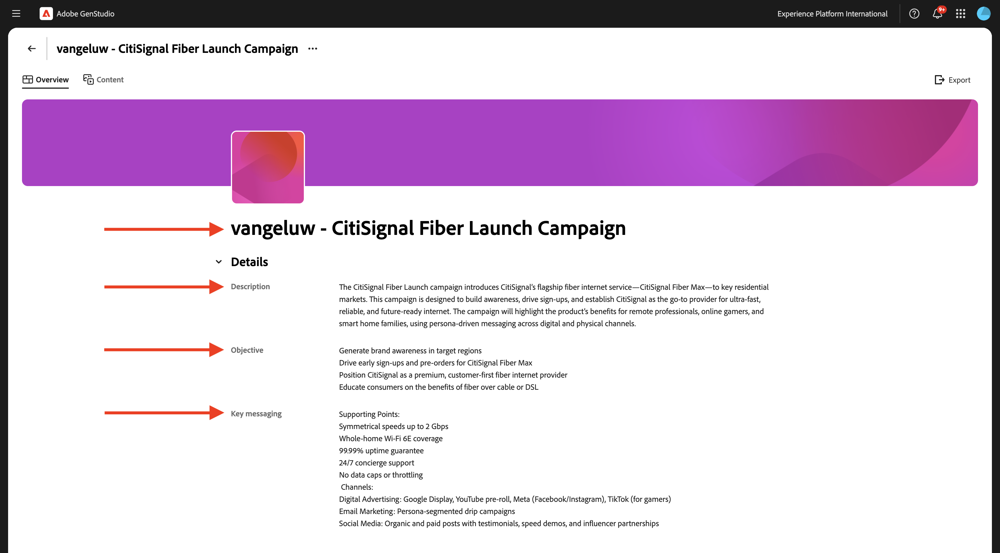
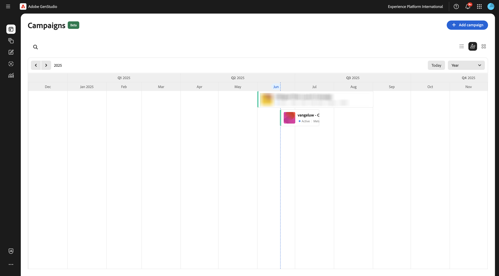
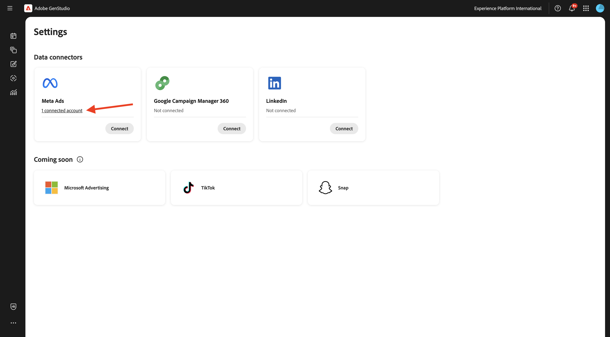
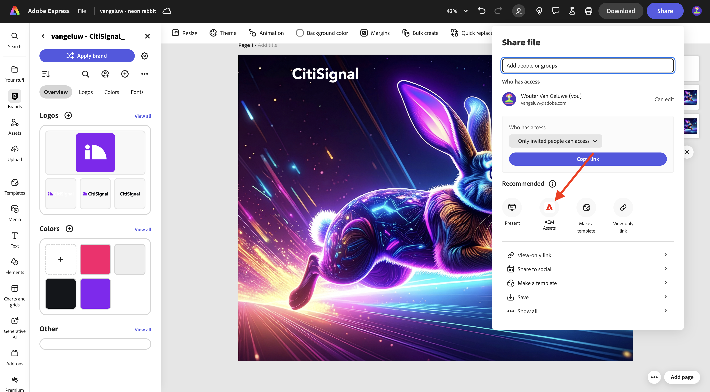
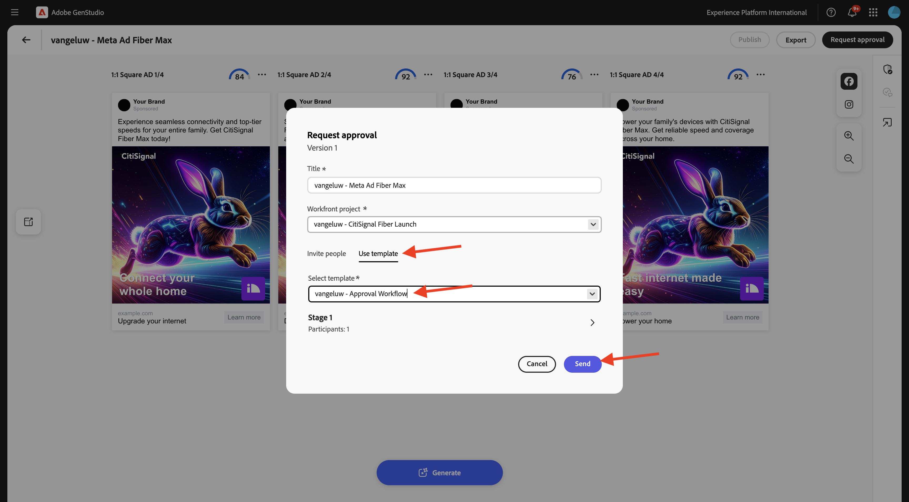
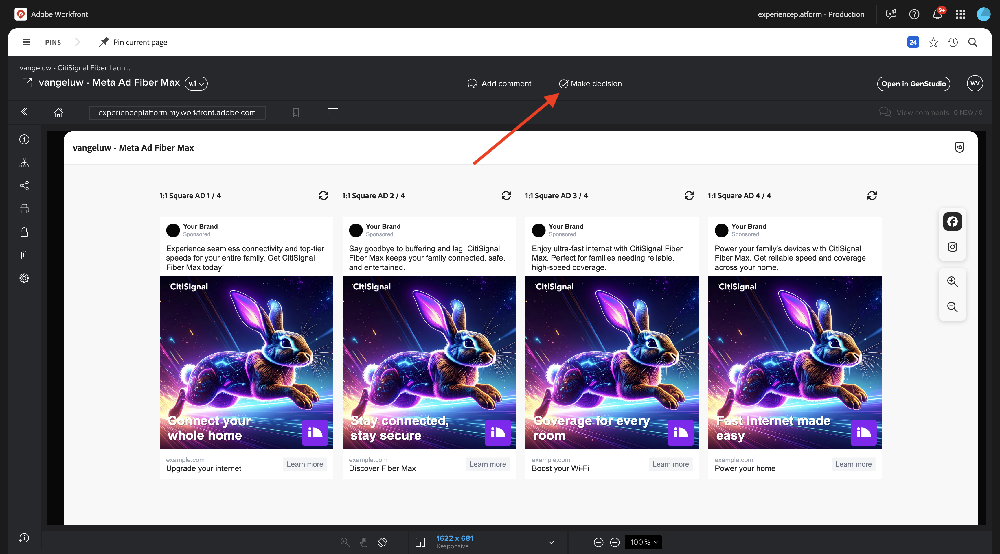
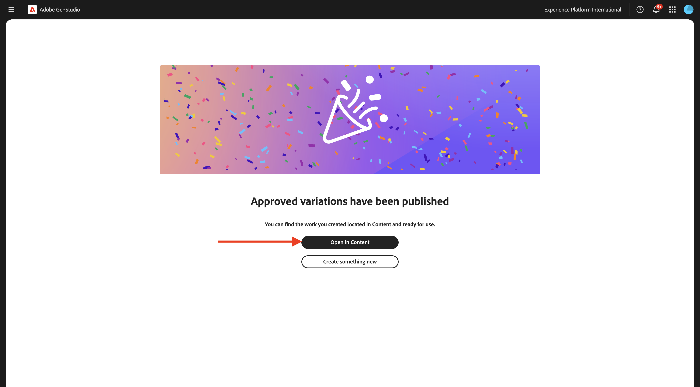

# 1.3.3 Campaign对元数据的激活

>[!IMPORTANT]
>
>要完成本练习，您需要有权访问启用了AEM Content Hub的有效AEM Assets CS创作环境。 如果您按照练习[Adobe Experience Manager Cloud Service和Edge Delivery Services](./../../../modules/asset-mgmt/module2.1/aemcs.md){target="_blank"}，您将有权访问此类环境。

>[!IMPORTANT]
>
>要执行本练习中的所有步骤，您需要具有对现有Adobe Workfront环境的访问权限，并且在该环境中，您需要创建项目和审批工作流。 如果您使用Adobe Workfront[学习练习](./../../../modules/workflow-planning/module1.2/workfront.md){target="_blank"}工作流管理，您将拥有所需的设置。

>[!IMPORTANT]
>
>如果您之前已使用Author和AEM Assets环境配置了AEM Assets CS项目，则可能是您的AEM CS沙盒已休眠。 鉴于解除此类沙盒的休眠需要10-15分钟，最好现在就启动解除休眠过程，这样以后就不必等待它。

## 1.3.3.1创建营销活动

在&#x200B;**GenStudio for Performance Marketing**&#x200B;中，转到左侧菜单中的&#x200B;**促销活动**。 单击&#x200B;**+添加营销活动**。


然后，您应该会看到空的活动概述。


对于字段名称，请使用`--aepUserLdap-- - CitiSignal Fiber Launch Campaign`。

对于字段&#x200B;**Description**，请使用以下文本。

```
The CitiSignal Fiber Launch campaign introduces CitiSignal’s flagship fiber internet service—CitiSignal Fiber Max—to key residential markets. This campaign is designed to build awareness, drive sign-ups, and establish CitiSignal as the go-to provider for ultra-fast, reliable, and future-ready internet. The campaign will highlight the product’s benefits for remote professionals, online gamers, and smart home families, using persona-driven messaging across digital and physical channels.
```

对于字段&#x200B;**目标**，请使用以下文本。

```
Generate brand awareness in target regions
Drive early sign-ups and pre-orders for CitiSignal Fiber Max
Position CitiSignal as a premium, customer-first fiber internet provider
Educate consumers on the benefits of fiber over cable or DSL
```

对于字段&#x200B;**关键消息**，请使用以下文本。

```
Supporting Points:
Symmetrical speeds up to 2 Gbps
Whole-home Wi-Fi 6E coverage
99.99% uptime guarantee
24/7 concierge support
No data caps or throttling
 Channels:
Digital Advertising: Google Display, YouTube pre-roll, Meta (Facebook/Instagram), TikTok (for gamers)
Email Marketing: Persona-segmented drip campaigns
Social Media: Organic and paid posts with testimonials, speed demos, and influencer partnerships
Out-of-Home (OOH): Billboards, transit ads in suburban commuter corridors
Local Events: Pop-up booths at tech expos, family festivals, and gaming tournaments
Direct Mail: Personalized flyers with QR codes for early sign-up discounts
 
Target Regions:
Primary Launch Markets:
Denver Metro Area, CO
Austin, TX
Raleigh-Durham, NC
Salt Lake City, UT
Demographic Focus:
Suburban neighborhoods with high remote work density
Areas with high smart home adoption
Zip codes with underserved or dissatisfied cable customers
```

然后，您应该拥有以下权限：



向下滚动查看更多字段：


对于字段&#x200B;**开始**，将其设置为今天的日期。

对于字段&#x200B;**End**，将其设置为自即日起1个月的日期。

对于字段&#x200B;**状态**，将其设置为&#x200B;**活动**。

对于字段&#x200B;**渠道**，请将其设置为&#x200B;**Meta**，**电子邮件**，**付费媒体**，**显示**。

对于字段&#x200B;**Regions**，请选择所选区域。

对于字段&#x200B;**References** > **Products**&#x200B;的字段：选择产品`--aepUserLdap-- - CitiSignal Fiber Max`。

**引用** > **角色**：选择角色`--aepUserLdap-- - Remote Professionals`、`--aepUserLdap-- - Online Gamers`、`--aepUserLdap-- - Smart Home Families`

您应该会看到以下内容：


您的营销活动现已准备就绪。 单击&#x200B;**箭头**&#x200B;以返回。


然后，您将在列表中看到营销活动。 单击日历视图图标以将视图更改为营销活动日历。


然后，您应该会看到营销活动日历，该日历可让您更直观地了解哪些营销活动在哪个时刻处于活动状态。



## 1.3.3.2设置与元的连接

>[!IMPORTANT]
>
>要设置与Meta的连接，您需要具有可用的Meta用户帐户，并且需要将该用户帐户添加到Meta Business帐户。

要设置到Meta的连接，请单击3个点&#x200B;**...**，然后选择&#x200B;**设置**。


单击&#x200B;**元广告**&#x200B;的&#x200B;**连接**。


使用您的元帐户登录。 单击&#x200B;**继续**。


如果您的帐户关联到Meta Business帐户，您将能够选择已在Meta中配置的业务组合。


成功建立连接后，单击显示&#x200B;**X已连接帐户**&#x200B;的行。



然后，您应该会看到连接到GenStudio for Performance Marketing的元业务帐户的详细信息。


## 1.3.3.3创建新资源

转到[https://firefly.adobe.com/](https://firefly.adobe.com/){target="_blank"}。 输入提示`a neon rabbit running very fast through space`并单击&#x200B;**生成**。


然后，您将看到正在生成的多个图像。 选择您最喜欢的图像，单击图像上的&#x200B;**共享**&#x200B;图标，然后选择&#x200B;**在Adobe Express中打开**。


然后，您将看到刚刚生成的图像在Adobe Express中可用于编辑。 您现在需要在图像上添加CitiSignal徽标。 为此，请转到&#x200B;**品牌**。


然后，您应该会看到在GenStudio for Performance Marketing中创建的CitiSignal品牌模板出现在Adobe Express中。 单击以选择应命名为`--aepUserLdap-- - CitiSignal`的品牌模板。


转到&#x200B;**徽标**&#x200B;并单击&#x200B;**白色** Citisignal徽标将其放到图像上。


将CitiSignal徽标放在图像的顶部，中间不远。


接下来，单击&#x200B;**共享**。


选择&#x200B;**AEM Assets**。



单击&#x200B;**选择文件夹**。


选择您的AEM Assets CS存储库（应命名为`--aepUserLdap-- - CitiSignal`），然后选择文件夹`--aepUserLdap-- - CitiSignal Fiber Campaign`。 单击&#x200B;**选择**。


您应该会看到此内容。 单击&#x200B;**上传1项资源**。 您的图像现在将上传到AEM Assets CS。


转到[https://experience.adobe.com/](https://experience.adobe.com/){target="_blank"}。 打开&#x200B;**Experience Manager Assets**。


选择您的AEM Assets CS环境，应将其命名为`--aepUserLdap-- - CitiSignal dev`。


转到&#x200B;**Assets**，然后双击文件夹`--aepUserLdap-- - CitiSignal Fiber Campaign`。


然后，您应该会看到类似以下的内容。 双击图像`--aepUserLdap-- - neon rabbit`。


随后将显示图像`--aepUserLdap-- - neon rabbit`。 将&#x200B;**状态**&#x200B;更改为&#x200B;**已批准**，然后单击&#x200B;**保存**

>[!IMPORTANT]
>
>如果图像的状态未设置为&#x200B;**已批准**，则图像在GenStudio for Performance Marketing中将不可见。 在GenStudio for Performance Marketing中，只能访问已批准的资源。


切换回GenStudio for Performance Marketing。 在左侧菜单中，转到&#x200B;**Assets**&#x200B;并选择您的AEM Assets CS存储库，该存储库应名为`--aepUserLdap-- - CitiSignal`。 然后，您将看到之前创建并批准的图像在GenStudio for Performance Marketing中可用。


## 1.3.3.4创建和批准元广告

在左侧菜单中，转到&#x200B;**创建**。 选择&#x200B;**元**。


选择您之前导入的&#x200B;**元广告**&#x200B;模板（名为`--aepUserLdap---citisignal-meta-ad`）。 单击&#x200B;**使用**。


您应该会看到此内容。 将广告名称更改为`--aepUserLdap-- - Meta Ad Fiber Max`。

在&#x200B;**参数**&#x200B;下，选择以下选项：

- **品牌**： `--aepUserLdap-- - CitiSignal`
- **语言**： `English (US)`
- **角色**： `--aepUserLdap-- - Smart Home Families`
- **产品**： `--aepUserLdap-- - CitiSignal Fiber Max`

单击&#x200B;**从内容中选择**。


选择资源`--aepUserLdap-- - neon rabbit.png`。 单击&#x200B;**使用**。


输入提示`focus on lightning fast internet for big families`并单击&#x200B;**生成**。


然后您应该会看到类似这样的内容。 您的广告现在已准备好进行审查和批准。 为此，请单击&#x200B;**请求审批**，这将连接到Adobe Workfront。


选择您的应名为`--aepUserLdap-- - CitiSignal Fiber Launch`的Adobe Workfront项目。 在&#x200B;**邀请联系人**&#x200B;下输入您自己的电子邮件地址，并确保您的角色已设置为&#x200B;**审批者**。


或者，您也可以使用Adobe Workfront中的现有审批工作流。 为此，请单击&#x200B;**使用模板**&#x200B;并选择模板`--aepuserLdap-- - Approval Workflow`。 单击&#x200B;**发送**。



单击&#x200B;**在Workfront中查看评论**，您现在将被发送到Adobe Workfront校对UI。


在Adobe Workfront Proof UI中，单击&#x200B;**做出决定**。



选择&#x200B;**已批准**&#x200B;并单击&#x200B;**做出决策**。


单击&#x200B;**发布**。


选择您的营销活动`--aepUserLdap-- - CitiSignal Fiber Launch Campaign`并单击&#x200B;**发布**。


单击&#x200B;**在Content**&#x200B;中打开。



现在，4个元广告在&#x200B;**内容** > **体验**&#x200B;下可用。


## 1.3.3.5将广告发布到元

选择其中一个广告，然后单击&#x200B;**激活**。


从列表中选择一个&#x200B;**Call to action**&#x200B;并输入示例URL。 单击&#x200B;**下一步**。


选择元帐户、链接的Facebook页面、元营销活动和元广告集。

为添加项命名，使用`--aepUserLdap-- Fiber Max Ad`。

单击&#x200B;**下一步**。


单击&#x200B;**发布**。


单击&#x200B;**确定**。


您的广告状态现在设置为&#x200B;**正在发布**，这可能需要几分钟的时间。


几分钟后，广告的状态将更改为&#x200B;**已发布**。 这意味着广告已从GenStudio for Performance Marketing发送到Meta。 这并不意味着广告已经在Meta中发布！ 在Meta Business帐户中制作和发布广告仍有许多步骤需要执行，以便用户在各种元平台上查看。

单击&#x200B;**查看详细信息**。


单击&#x200B;**打开**，您将转到您的元业务帐户。

>[!IMPORTANT]
>
>如果您无权访问连接到环境的Meta Business帐户，则无法在Meta中显示此广告。


以下是您刚刚创建，但现在位于Meta中的广告的概述。


您现在已经完成了此练习。

## 后续步骤

转到[摘要和优点](./summary.md){target="_blank"}

返回[GenStudio for Performance Marketing](./genstudio.md){target="_blank"}

返回[所有模块](./../../../overview.md){target="_blank"}
