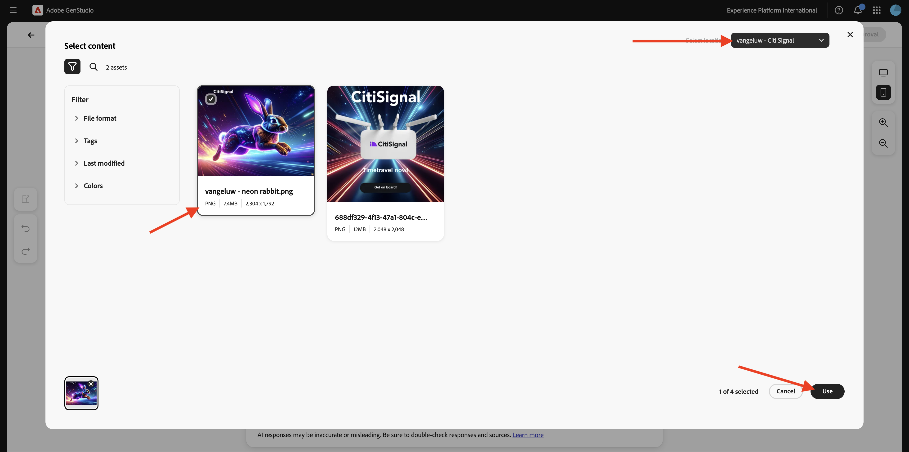
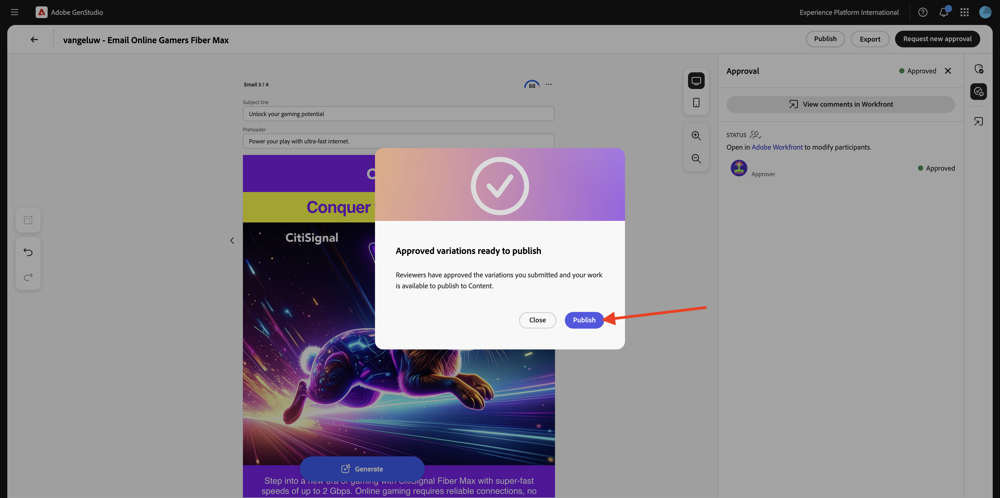
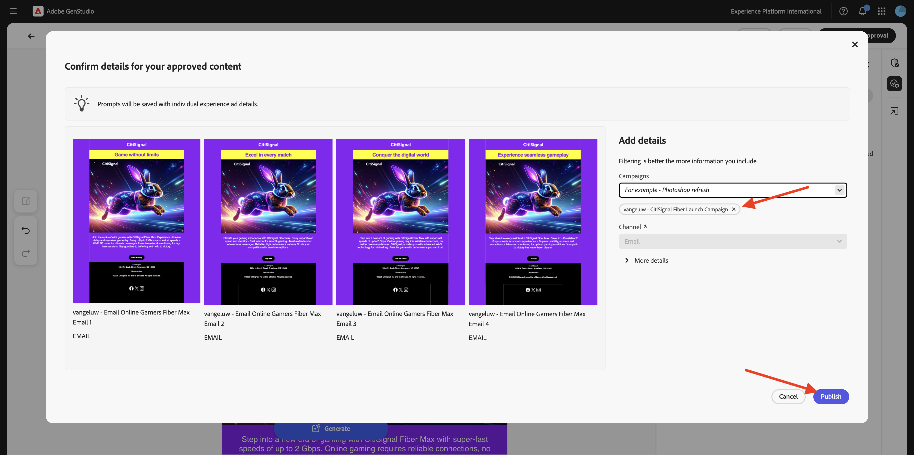
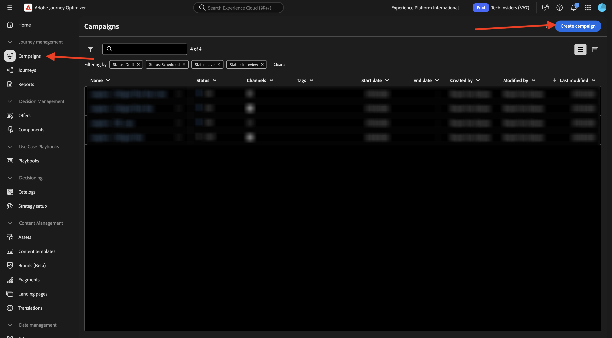
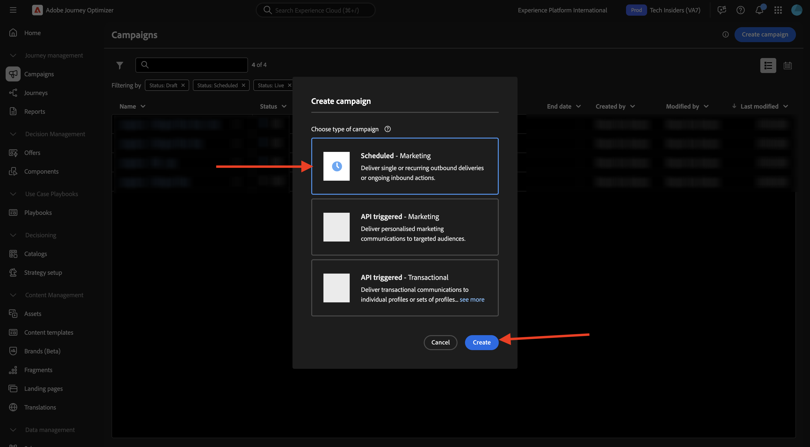
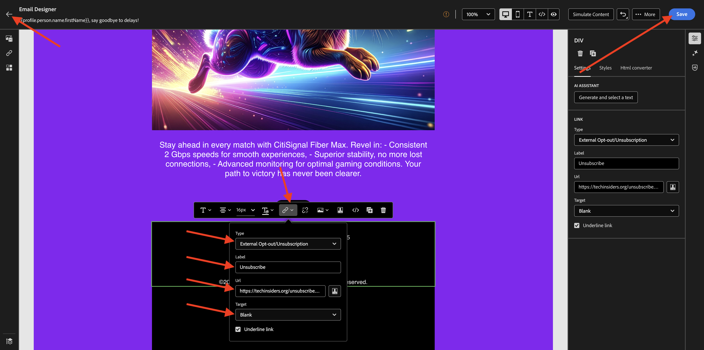

# 1.3.4为AJO创建电子邮件体验

>[!IMPORTANT]
>
>要完成此练习，您需要具有为与Adobe Journey Optimizer集成（当前为测试版）而配置的GenStudio for Performance Marketing环境的访问权限。

>[!IMPORTANT]
>
>要执行本练习中的所有步骤，您需要具有对现有Adobe Workfront环境的访问权限，并且在该环境中，您需要创建项目和审批工作流。 如果您使用Adobe Workfront[学习练习](./../../../modules/asset-mgmt/module2.2/workfront.md){target="_blank"}工作流管理，您将拥有所需的设置。

## 1.3.4.1创建和批准电子邮件体验

在左侧菜单中，转到&#x200B;**创建**。 选择&#x200B;**电子邮件**。


选择您之前导入的&#x200B;**电子邮件**&#x200B;模板（名为`--aepUserLdap---citisignal-email-template`）。 单击&#x200B;**使用**。


您应该会看到此内容。 将广告名称更改为`--aepUserLdap-- - Email Online Gamers Fiber Max`。


在&#x200B;**参数**&#x200B;下，选择以下选项：

- **品牌**： `--aepUserLdap-- - CitiSignal`
- **语言**： `English (US)`
- **角色**： `--aepUserLdap-- - Smart Home Families`
- **产品**： `--aepUserLdap-- - CitiSignal Fiber Max`

单击&#x200B;**从内容中选择**。


选择资源`--aepUserLdap-- - neon rabbit.png`。 单击&#x200B;**使用**。



输入提示`convince online gamers to start playing online multiplayer games using CitiSignal internet`并单击&#x200B;**生成**。


然后，您应该会看到类似这样的内容，其中正在生成4个电子邮件变体。 默认视图显示&#x200B;**移动设备**&#x200B;视图，您可以通过单击&#x200B;**计算机**&#x200B;图标切换到桌面视图。


对于每封电子邮件，都会自动计算合规性得分。 单击分数可查看更多详细信息。


单击&#x200B;**查看并修复问题**。


然后，您可以查看有关优化复杂性得分可执行的操作的更多详细信息。


接下来，单击&#x200B;**请求审批**，这将连接到Adobe Workfront。


选择您的应名为`--aepUserLdap-- - CitiSignal Fiber Launch`的Adobe Workfront项目。 在&#x200B;**邀请联系人**&#x200B;下输入您自己的电子邮件地址，并确保您的角色已设置为&#x200B;**审批者**。


或者，您也可以使用Adobe Workfront中的现有审批工作流。 为此，请单击&#x200B;**使用模板**&#x200B;并选择模板`--aepuserLdap-- - Approval Workflow`。 单击&#x200B;**发送**。


单击&#x200B;**在Workfront中查看评论**，您现在将被发送到Adobe Workfront校对UI。


在Adobe Workfront Proof UI中，单击&#x200B;**做出决定**。


选择&#x200B;**已批准**&#x200B;并单击&#x200B;**做出决策**。


单击&#x200B;**发布**。



选择您的营销活动`--aepUserLdap-- - CitiSignal Fiber Launch Campaign`并单击&#x200B;**发布**。



单击&#x200B;**在Content**&#x200B;中打开。


现在，4个电子邮件体验在&#x200B;**内容** > **体验**&#x200B;下可用。


## 1.3.4.2在AJO中创建营销活动

通过转到[Adobe Experience Cloud](https://experience.adobe.com)登录Adobe Journey Optimizer。 单击&#x200B;**Journey Optimizer**。


您将被重定向到Journey Optimizer中的&#x200B;**主页**&#x200B;视图。 首先，确保使用正确的沙盒。 要使用的沙盒名为`--aepSandboxName--`。 然后，您将进入沙盒&#x200B;**的**&#x200B;主页`--aepSandboxName--`视图。


您现在将创建一个营销活动。 上一个练习基于事件的历程依赖于传入体验事件或受众进入或退出来触发1个特定客户的历程，与此不同的是，营销活动面向整个受众一次，其中包含新闻稿、一次性促销活动或通用信息等独特内容，或者定期发送类似内容，如实例生日营销活动和提醒。

在菜单中，转到&#x200B;**营销活动**&#x200B;并单击&#x200B;**创建营销活动**。



选择&#x200B;**计划 — 营销**，然后单击&#x200B;**创建**。



在营销活动创建屏幕上，配置以下内容：

- **名称**： `--aepUserLdap--  - Online Gamers CitiSignal Fiber Max`。
- **描述**：面向在线游戏玩家的光纤营销活动

单击&#x200B;**操作**。


单击&#x200B;**+添加操作**，然后选择&#x200B;**电子邮件**。


然后，选择现有的&#x200B;**电子邮件配置**，然后单击&#x200B;**编辑内容**。


你会看到这个。 对于&#x200B;**主题行**，请使用以下内容：

```
{{profile.person.name.firstName}}, say goodbye to delays!
```

接下来，单击&#x200B;**编辑内容**。


单击&#x200B;**导入HTML**。


接下来，单击&#x200B;**Adobe GenStudio for Performance Marketing**&#x200B;的按钮。


此时，您应该会看到一个弹出窗口，其中显示了在GenStudio for Performance Marketing中发布的所有电子邮件体验。 选择一个可用的电子邮件体验，然后单击&#x200B;**使用**。


选择您自己的AEM Assets CS存储库（应命名为`--aepUserLdap-- - CitiSignal dev`），然后单击&#x200B;**导入**。


您应该会看到此内容。 选择缺少的图像按钮，然后单击&#x200B;**选择资产**。


转到与&#x200B;**GenStudio.zip.....类似的文件夹**&#x200B;并选择图像`--aepUserLdap-- - neon rabbit.png`。 单击&#x200B;**选择**


您应该会看到此内容。


向下滚动到页脚，选择&#x200B;**取消订阅**&#x200B;一词，然后单击&#x200B;**链接**&#x200B;图标。


将&#x200B;**Type**&#x200B;设置为&#x200B;**外部选择退出/取消订阅**，并将URL设置为`https://techinsiders.org/unsubscribe.html`（取消订阅链接的URL不允许为空）。

单击&#x200B;**保存**，然后单击屏幕左上角的&#x200B;**箭头**&#x200B;以返回营销活动配置。



转到&#x200B;**受众**。


单击&#x200B;**选择受众**。


选择在线游戏玩家订阅列表的受众，其名称应为`--aepUserLdap--_SL_Interest_Online_Gaming`。 单击&#x200B;**保存**。


单击&#x200B;**查看以激活**。


如果您的营销活动配置没有问题，则可以单击&#x200B;**激活**。


随后将激活您的营销活动，这可能需要几分钟的时间。


几分钟后，该营销活动将处于活动状态，并且电子邮件将发送到您选择的订阅列表。


您现在已经完成了此练习。

## 后续步骤

转到[摘要和优点](./summary.md){target="_blank"}

返回[GenStudio for Performance Marketing](./genstudio.md){target="_blank"}

返回[所有模块](./../../../overview.md){target="_blank"}
