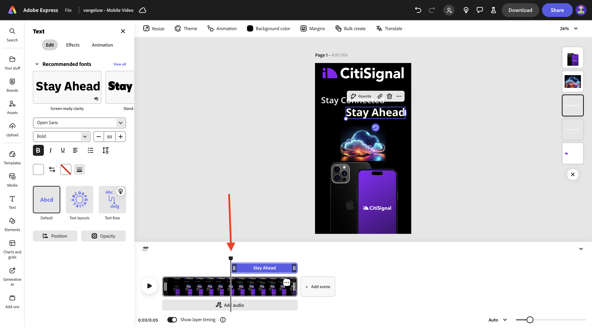
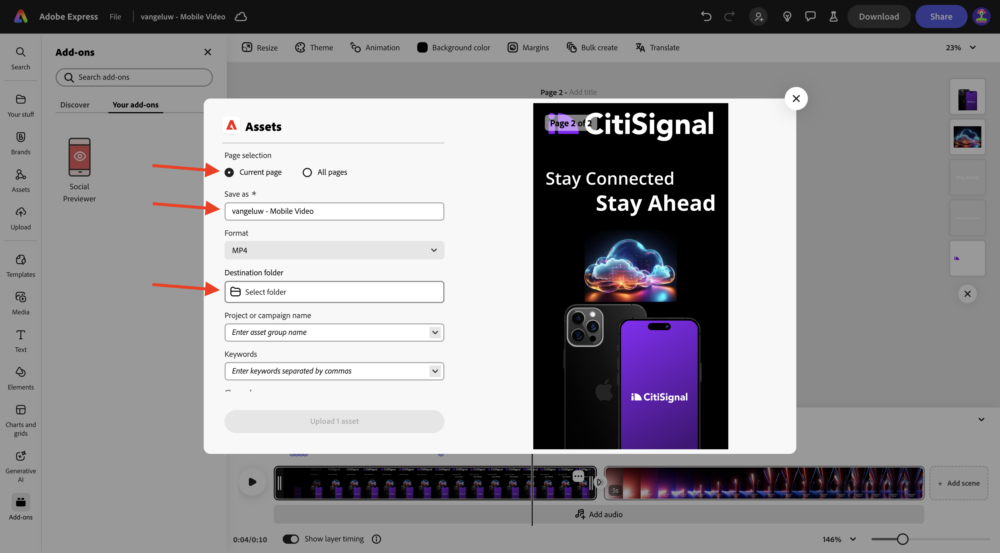
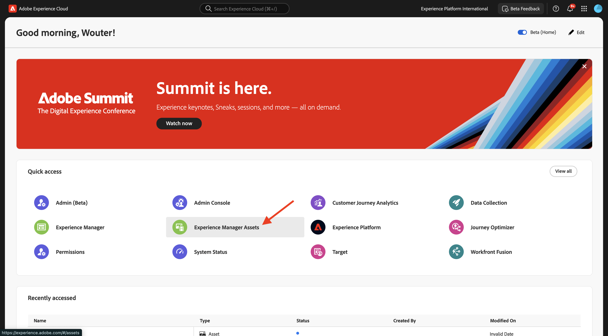

# 1.4.2 Adobe Express中的动画和视频

在开始本练习之前，请从[https://tech-insiders.s3.us-west-2.amazonaws.com/one-adobe/Adobe_Express.zip](https://tech-insiders.s3.us-west-2.amazonaws.com/one-adobe/Adobe_Express.zip){target="_blank"}下载所需的资产，并将其解压缩到桌面上。

## 1.4.2.1创建视频

转到[https://new.express.adobe.com/](https://new.express.adobe.com/){target="_blank"}。 单击&#x200B;**+**&#x200B;图标以创建新的&#x200B;**映像**。

转到&#x200B;**视频**，然后选择&#x200B;**移动设备视频**。

您应该会看到此内容。

选择&#x200B;**背景颜色**，然后选择&#x200B;**黑色**。

接下来，您应该添加&#x200B;**CitiSignal**&#x200B;徽标。 转到&#x200B;**品牌**&#x200B;并选择白色CitiSignal徽标。 单击3个点&#x200B;**...**&#x200B;并选择&#x200B;**放置**。

将CitiSignal徽标居中于图像顶部。

转到&#x200B;**文本**，然后选择&#x200B;**添加您的文本**。

输入文本`Stay Connected`并将文本框放置在如下图所示的类似位置。

转到&#x200B;**文本**，然后选择&#x200B;**添加您的文本**。 输入文本`Stay Ahead`。

将文本框放置在如下图所示的类似位置。

选择文本为&#x200B;**保持连接**&#x200B;的第一个文本框。 转到&#x200B;**品牌**，转到&#x200B;**字体**。 单击第一个字体上的3个点&#x200B;**...**，然后单击&#x200B;**应用**。

选择带有文本&#x200B;**提前显示**&#x200B;的第二个文本框。 转到&#x200B;**品牌**，转到&#x200B;**字体**。 单击第3种字体上的3个点&#x200B;**...**，然后单击&#x200B;**应用**。

您应该会看到此内容。 转到&#x200B;**媒体**&#x200B;并选择&#x200B;**生成图像**。

输入提示`futuristic looking transparent cloud on a black background`并单击&#x200B;**生成**。

选择&#x200B;**横向(4:3)**。

您应该会看到此内容。 选择一个变体。

将生成的图像居中。 转到&#x200B;**媒体**，然后单击&#x200B;**从设备上传**。

导航到桌面上的文件夹&#x200B;**Adobe_Express**，其中包含您之前下载的资源。 选择文件&#x200B;**CitiSignalPhoneLogo.png**，然后单击&#x200B;**打开**。

您应该会看到此内容。

向下拖动图像，使其看起来与下图类似。

将项目名称更改为`--aepUserLdap-- - Mobile Video`。

转到&#x200B;**动画**，然后单击&#x200B;**滑动**&#x200B;动画。

单击&#x200B;**播放**&#x200B;图标以测试您的动画。

选择文本框&#x200B;**保持领先**。

调整文本框&#x200B;**保持领先**&#x200B;的时间线滑块，使其在中途开始。

选择&#x200B;**CitiSignal**&#x200B;徽标。

打开&#x200B;**幻灯片**&#x200B;操作的详细信息设置，并将持续时间更改为2.5秒。

接下来，单击&#x200B;**下载**。 选择&#x200B;**文件格式** **MP4**&#x200B;并将&#x200B;**视频分辨率**&#x200B;设置为&#x200B;**1080p**。 单击&#x200B;**下载**。

随后将生成您的视频文件，并将其下载到您的计算机。 您的第一个视频现已准备就绪。

## 1.4.2.2添加到您的视频

关闭&#x200B;**时间轴**&#x200B;视图。

单击3个点&#x200B;**...**&#x200B;并选择&#x200B;**复制**。

随后将生成一个新页面。 单击&#x200B;**编辑时间线**&#x200B;开始处理新页面。

单击&#x200B;**+添加场景**。

然后，您应该会看到正在添加的新场景。

导航到桌面上的文件夹&#x200B;**Adobe_Express**，其中包含您之前下载的资源。 选择文件&#x200B;**`AdobeStock_648887461_trimmed.mp4`**&#x200B;并单击&#x200B;**打开**。

然后，您的视频文件将被添加到新场景中。

在这2个场景的中间单击，然后选择&#x200B;**添加过渡**。

单击&#x200B;**跳至黑色**。

将&#x200B;**持续时间**&#x200B;更改为2秒。 您可以随时单击&#x200B;**播放**&#x200B;按钮以测试您的过渡。

转到&#x200B;**文本**，然后单击&#x200B;**添加您的文本**。

输入文本`with lightning fast speed from CitiSignal`。 通过单击&#x200B;**居中对齐**&#x200B;将文本居中对齐。

将字体大小更改为&#x200B;**60**。

## 1.4.2.3在Adobe Express中使用加载项

转到&#x200B;**加载项**&#x200B;并搜索加载项&#x200B;**Social Previewer**。

单击&#x200B;**+添加**&#x200B;添加加载项。

选择加载项&#x200B;**社交预览器**&#x200B;并单击&#x200B;**Instagram帖子**&#x200B;预览选项。 您现在可以轻松预览您的帖子在最常见的社交媒体平台上的外观。

## 1.4.2.4在Adobe Express中创建新模板

接下来，单击“**共享**”按钮，然后选择“**创建模板**”。

使用名称`--aepUserLdap-- - Mobile Video`，选择品牌&#x200B;**CitiSignal (Telco)**，然后单击&#x200B;**保存模板**。

您的视频模板现已保存在品牌模板中。

## 1.4.2.5在AEM Assets CS中保存您的视频

再次单击&#x200B;**共享**，然后选择&#x200B;**保存到云**。 选择&#x200B;**AEM Assets**。

选择&#x200B;**当前页面**。 使用名称`--aepUserLdap-- - Mobile Video`，然后单击&#x200B;**选择文件夹**。

选择文件夹&#x200B;**`--aepUserLdap-- - Frame.io PNG`**&#x200B;并单击&#x200B;**选择**。

单击&#x200B;**上传1项资源**。

转到[https://experience.adobe.com/](https://experience.adobe.com/){target="_blank"}并单击&#x200B;**Experience Manager Assets**。

选择您的AEM Assets CS环境，应将其命名为`--aepUserLdap-- - Citi Signal dev`。

在&#x200B;**Assets**&#x200B;中，导航到文件夹&#x200B;**`--aepUserLdap-- - Frame.io PNG`**。 双击资产&#x200B;**`--aepUserLdap-- - Mobile Video`**&#x200B;以将其打开。

您在Adobe Express中创建的视频现在可在Adobe Experience Manager Assets中使用。

## 后续步骤

转到[在Adobe Express中批量创建Assets](./ex3.md){target="_blank"}

返回[Adobe Express和Adobe Experience Cloud](./express.md){target="_blank"}

返回[所有模块](./../../../overview.md){target="_blank"}
