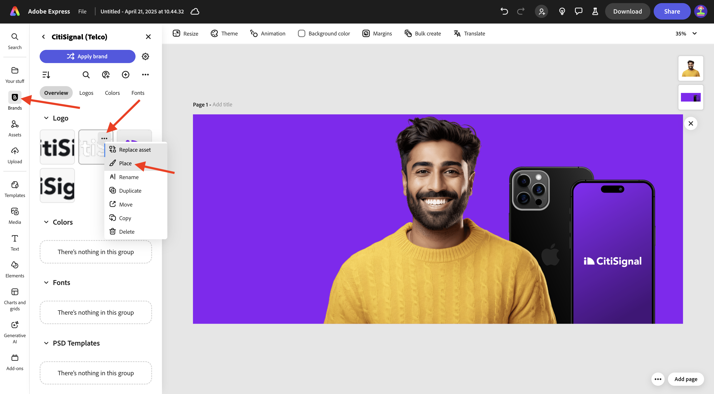
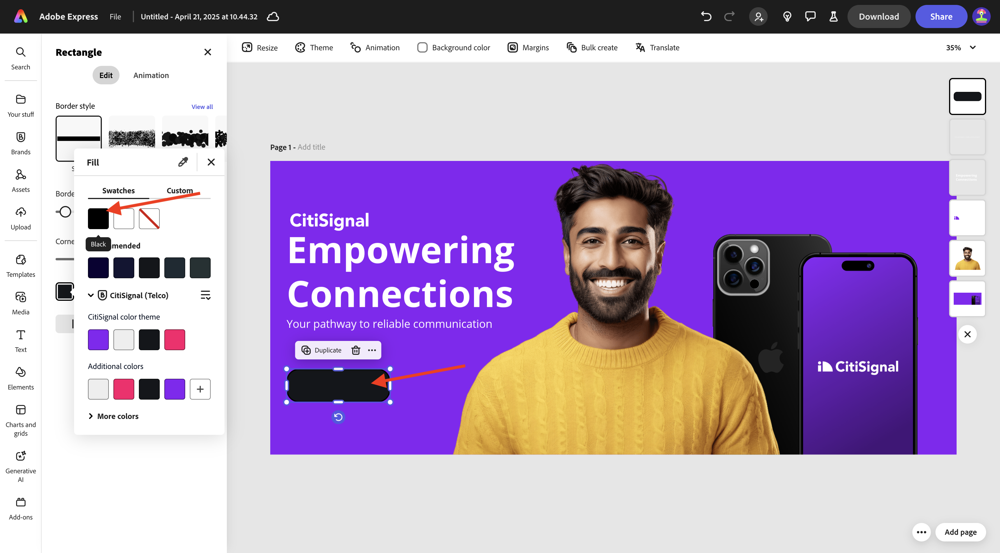
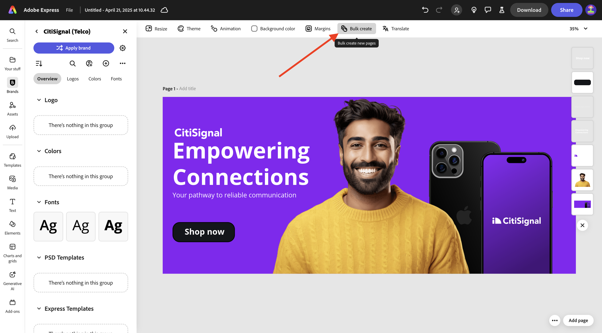

# 1.4.3在Adobe Express中批量创建Assets

在开始本练习之前，请从[https://one-adobe-tech-insiders.s3.us-west-2.amazonaws.com/one-adobe/Adobe_Express.zip](https://one-adobe-tech-insiders.s3.us-west-2.amazonaws.com/one-adobe/Adobe_Express.zip){target="_blank"}下载所需的资产，并将其解压缩到桌面上。

## 1.4.3.1创建您的基本资产

转到[https://new.express.adobe.com/](https://new.express.adobe.com/){target="_blank"}。 单击&#x200B;**+**&#x200B;图标以创建新的&#x200B;**映像**。

选择&#x200B;**照片**，然后选择&#x200B;**上传媒体**。

导航到桌面上的文件夹&#x200B;**Adobe_Express**，其中包含您之前下载的资源。 选择文件&#x200B;**banner.png**&#x200B;并单击&#x200B;**打开**。

您应该会看到此内容。 选择&#x200B;**编辑图像**。

接下来，转到&#x200B;**媒体**&#x200B;并选择&#x200B;**上传图像**。 导航到桌面上的文件夹&#x200B;**Adobe_Express**，其中包含您之前下载的资源。 选择文件&#x200B;**man.png**&#x200B;并单击&#x200B;**打开**。

您应该会看到此内容。

接下来，您应该添加&#x200B;**CitiSignal**&#x200B;徽标。 转到&#x200B;**品牌**&#x200B;并选择白色CitiSignal徽标。 单击3个点&#x200B;**...**&#x200B;并选择&#x200B;**放置**。

调整CitiSignal徽标图像的位置，以反映下图中相同的位置。

转到&#x200B;**文本**&#x200B;并单击&#x200B;**添加您的文本**。

在新文本框中，添加文本`Empowering Connections`。 将文本框拖动到如下图所示的类似位置。 接下来，转到&#x200B;**品牌**，转到&#x200B;**字体**。 单击第3种字体上的3个点&#x200B;**...**，然后单击&#x200B;**应用**。

接下来，将字体颜色更改为&#x200B;**白色**。

再次转到&#x200B;**文本**&#x200B;并单击&#x200B;**添加您的文本**。

在新文本框中，输入文本`Your pathway to reliable communication`。 将文本框的位置调整为位于上一个文本框下，类似于下面的图像。

转到&#x200B;**Brands**，转到&#x200B;**Fonts**，然后单击第二个字体上的3个点&#x200B;**...**。 然后，单击&#x200B;**应用**。

然后您应该拥有此项。 接下来，转到&#x200B;**元素**，转到&#x200B;**形状**，然后单击圆角矩形形状。

然后，您的图像上将会显示一个新的圆角矩形形状。 调整大小和位置，使其看起来像按钮。 然后，将圆角矩形的颜色更改为&#x200B;**黑色**。

再次转到&#x200B;**文本**&#x200B;并单击&#x200B;**添加您的文本**。

在新文本框中输入文本`Shop now`，并将文本框的位置更改为以按钮为中心。 转到&#x200B;**Brands**，转到&#x200B;**Fonts**，然后单击第三个字体上的3个点&#x200B;**...**。 然后，单击&#x200B;**应用**。

您应该会看到此内容。

## 在Adobe Express中批量创建1.4.3.2

接下来，单击&#x200B;**批量创建**。

您应该会看到此内容。 单击&#x200B;**浏览**。

导航到桌面上的文件夹&#x200B;**Adobe_Express**&#x200B;中的&#x200B;**Express Bulk Create**，该文件夹包含您之前下载的资源。 选择文件&#x200B;**CTA-options.csv**，然后单击&#x200B;**打开**。

您应该会看到此内容。 单击&#x200B;**下一步**。

单击&#x200B;**连接元素**。

选择包含文本&#x200B;**您的可靠通信路径**&#x200B;的文本框。 然后单击&#x200B;**Element 1**&#x200B;按钮并将其链接到CSV文件中的字段，在本例中是字段&#x200B;**Subhead**。

接下来，选择包含文本&#x200B;**立即购买**&#x200B;的文本框。

然后单击“**元素1**”按钮，并将其链接到CSV文件中的字段，在本例中是字段&#x200B;**CTA**。

您应该会看到此内容。 接下来，单击人员的图像。

单击按钮&#x200B;**元素1**。

然后您会看到此弹出窗口。 单击&#x200B;**浏览**。

导航到桌面上的文件夹&#x200B;**Adobe_Express**&#x200B;中的&#x200B;**Express Bulk Create**，该文件夹包含您之前下载的资源。 选择6-7个图像文件，然后单击&#x200B;**打开**。

你会看到这个。 将不同的图像拖放到资源的每个变体中。 单击&#x200B;**完成**

然后，您将看到正在生成的图像的变体。 单击&#x200B;**创建页面**。

您的变体现已准备就绪，您可以单独检查每个变体以进行审查和验证。

您现在已经完成了此练习。

## 后续步骤

转到[摘要和优点](./summary.md){target="_blank"}

返回[Adobe Express和Adobe Experience Cloud](./express.md){target="_blank"}

返回[所有模块](./../../../overview.md){target="_blank"}