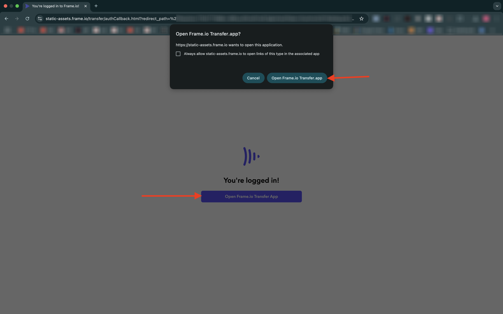
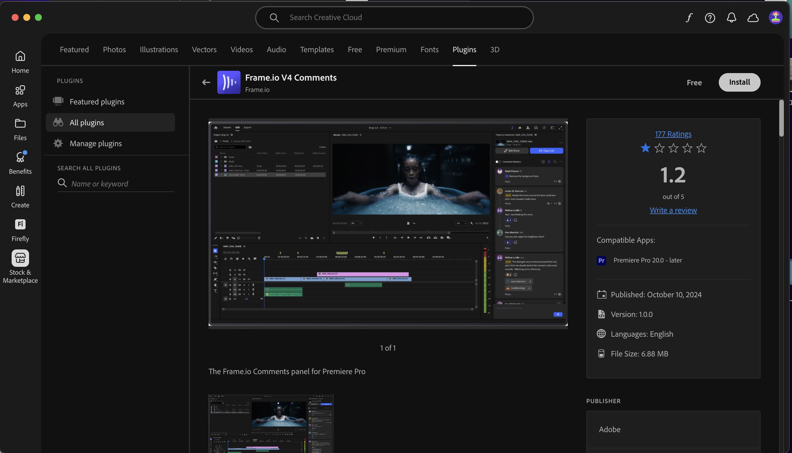
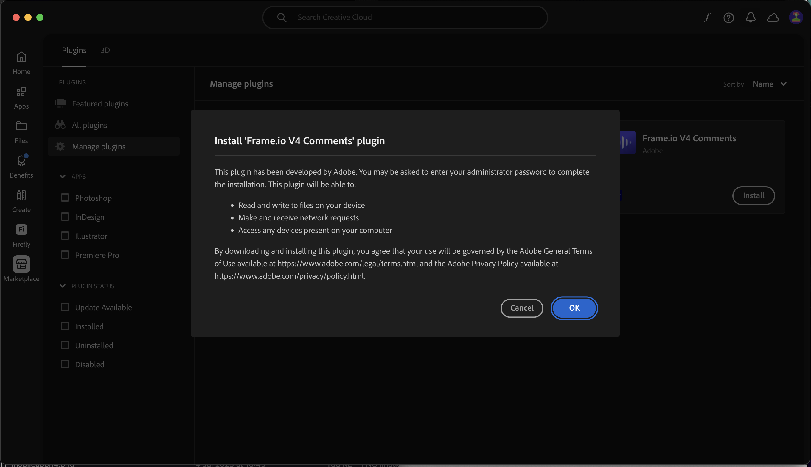

# 1.5.1 Frame.io快速入门

>[!NOTE]
>
> 下面的屏幕截图显示了正在使用的特定环境。 在阅读本教程时，您的环境很可能具有不同的名称。 当您注册本教程时，系统已为您提供了要使用的环境详细信息，请按照这些说明操作。

转到[https://next.frame.io/](https://next.frame.io/)。 确保您已登录到环境`--aepImsOrgName--`。

如果您未登录到右环境，请单击左下角的徽标，然后单击以选择需要使用的环境。

## 1.5.1.1创建您的工作区和项目

单击&#x200B;**+新建Workspace**。

对于工作区名称，使用： `--aepUserLdap--`。 单击&#x200B;**保存**。

您的工作区现已创建。 接下来，您应该创建一个新项目。 单击&#x200B;**+新建项目**。

选择&#x200B;**空白**&#x200B;并使用名称`CitiSignal`。 单击&#x200B;**新建项目**。

您的项目现已创建。 您现在需要在项目中上传资产。 单击&#x200B;**上传**。

将这些文件[https://tech-insiders.s3.us-west-2.amazonaws.com/Frame.io_Assets.zip](https://tech-insiders.s3.us-west-2.amazonaws.com/Frame.io_Assets.zip)下载到您的桌面并将它们解压缩到您的桌面上。

选择所有文件并单击&#x200B;**打开**。

>[!NOTE]
>
>正如您在屏幕快照中所看到的，此时未选择文件夹&#x200B;**Sound Effects**。 这是因为手动上传不支持上传文件夹。 几分钟后，您将安装Frame.io Transfer应用程序，您将使用该应用程序上载该文件夹及其文件。

几分钟后，您将会看到您的文件在Frame.io中变得可用。

您现在已手动上传文件，但可以更好、更快速地向Frame.io上传和下载文件。 最好的方法是使用Frame.io传输应用程序。

## 1.5.1.2下载并配置Frame.io传输应用

转到[https://frame.io/transfer](https://frame.io/transfer)并下载计算机的版本。

安装应用程序，然后将其打开。

应用程序打开时，需要您登录。 单击&#x200B;**登录**。

输入您的Adobe帐户的电子邮件地址，然后单击&#x200B;**开始**。

成功验证后，单击&#x200B;**打开Frame.io传输应用**。

您应该会看到此内容。 要选择正确的环境，请单击以打开下拉列表。

选择要用于本教程的环境，即`--aepImsOrgName--`。

然后，您应该会看到之前创建的工作区和项目，以及手动上传的文件。

单击&#x200B;**上传**。

转到您之前使用的文件夹，其中包含您之前下载的解压缩文件。 选择文件夹&#x200B;**声音效果**&#x200B;并单击&#x200B;**上传**。

随后将上载您的文件。

上传后，您将看到新文件夹在Frame.io中变得可用。

## 1.5.1.3设置Adobe Premiere Pro Beta

您已将Adobe Premiere Pro Beta作为快速入门模块的一部分安装。 要将Frame.io与Adobe Premiere Pro Beta结合使用，您可以利用为此集成开发的插件。

打开Creative Cloud应用并搜索`frame.io`。

在搜索结果中向下滚动以查找插件&#x200B;**Frame.io V4注释**。 单击它。

您应该会看到此内容。 单击&#x200B;**安装**。

如果Adobe Premiere Pro Beta处于打开状态，您需要先&#x200B;**关闭**，然后才能安装该插件。

单击&#x200B;**确定**。 插件正在安装中。

安装该插件后，在计算机上打开Adobe Premiere Pro Beta 。

## 后续步骤

转到[-](./ex1.md){target="_blank"}

返回[使用Frame.io简化您的工作流](./frameio.md){target="_blank"}

返回[所有模块](./../../../overview.md){target="_blank"}
