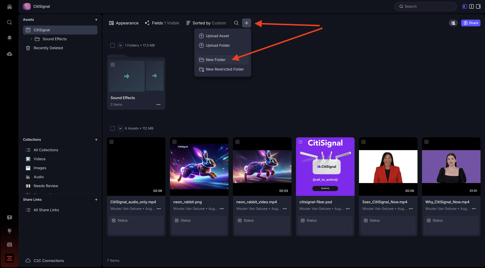
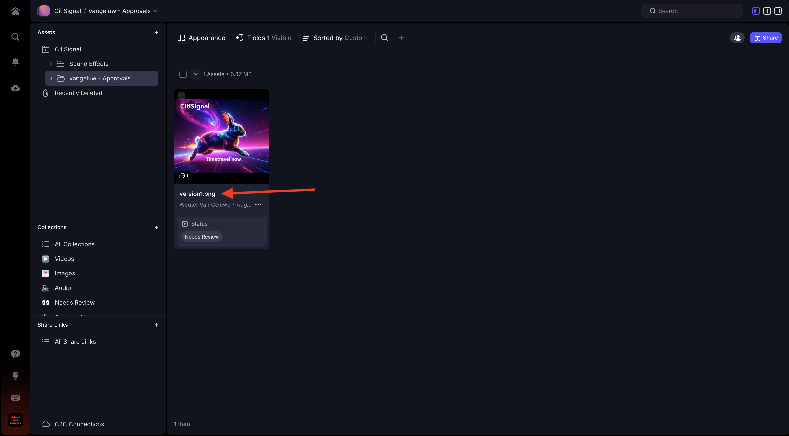

# 1.5.2使用Frame.io进行审批

>[!NOTE]
>
> 下面的屏幕截图显示了正在使用的特定环境。 在阅读本教程时，您的环境很可能具有不同的名称。 当您注册本教程时，系统已为您提供了要使用的环境详细信息，请按照这些说明操作。

要在Frame.io中完成审批工作流，您需要具有资产。 在本练习中，您将首先使用Adobe Firefly和Adobe Express自行创建该资源。 一旦您拥有资产，您就可以将其上传到Frame.io，并最终获得批准。

## 1.5.2.1使用Adobe Firefly Services和Adobe Express创建资源

转到[https://firefly.adobe.com/](https://firefly.adobe.com/){target="_blank"}。 输入提示`a neon rabbit running very fast through space`并单击&#x200B;**生成**。

然后，您将看到正在生成的多个图像。 选择您最喜欢的图像，单击图像上的&#x200B;**共享**&#x200B;图标，然后选择&#x200B;**在Adobe Express中打开**。

然后，您将看到刚刚生成的图像在Adobe Express中可用于编辑。 您现在需要在图像上添加CitiSignal徽标。 为此，请转到&#x200B;**品牌**。

然后，您应该会看到CitiSignal品牌模板。 在GenStudio for Performance Marketing中创建的区段会显示在Adobe Express中。 单击以选择名称中包含`CitiSignal`的品牌模板。

转到&#x200B;**徽标**&#x200B;并单击&#x200B;**白色** Citisignal徽标将其放到图像上。

将CitiSignal徽标放在图像的顶部，中间不远。

转到&#x200B;**文本**。

单击&#x200B;**添加您的文本**。

输入文本`Timetravel now!`，更改字体颜色和字体大小，将文本设置为&#x200B;**粗体**，以便您拥有与此类似的图像。

接下来，单击&#x200B;**共享**。

单击&#x200B;**...显示所有**。

向下滚动并选择&#x200B;**下载**。

单击&#x200B;**下载**。

然后，您的资产将位于本地计算机上。

## 1.5.2.2在Frame.io中批准您的资源

转到[https://next.frame.io/](https://next.frame.io/)。 确保您已登录到环境`--aepImsOrgName--`。

如果您未登录到右环境，请单击左下角的徽标，然后单击以选择需要使用的环境。

转到名为`--aepUserLdap--`的工作区，然后打开文件夹&#x200B;**CitiSignal**。 单击&#x200B;**+**&#x200B;图标，然后选择&#x200B;**新建文件夹**。

命名文件夹`--aepUserLdap-- - Approvals`。 双击文件夹以将其打开。

现在，您会将在上一个练习中创建的文件上传到此文件夹中。 单击&#x200B;**上传**。

选择文件并单击&#x200B;**打开**。

然后您应该拥有此项。 双击文件以将其打开。

启用图标以留下锚定评论。

输入备注，如`Change CTA to "Get on board now!"`。 单击&#x200B;**发送**&#x200B;图标以共享您的评论。

然后您应该拥有此项。 转到&#x200B;**字段**。

在&#x200B;**状态**&#x200B;字段中，将状态更改为&#x200B;**需要审阅**。

然后您应该拥有此项。 单击箭头返回文件夹。

单击3个点&#x200B;**...**&#x200B;并选择&#x200B;**重命名**。

将文件名更改为`version1.png`。

## 1.5.2.3在Adobe Express中进行设计更改

转到[https://new.express.adobe.com/your-stuff/files](https://new.express.adobe.com/your-stuff/files)并再次打开您之前创建的图像。

将CTA文本更改为`Get On Board Now!`。

单击&#x200B;**共享**，然后选择&#x200B;**下载**。

单击&#x200B;**下载**。

然后，您将在本地计算机上下载新图像。 将文件重命名为`version2.png`。

## 1.5.2.4在Frame.io中审批版本2

在Frame.io中的文件夹中，单击&#x200B;**+**&#x200B;图标并选择&#x200B;**上传资产**。

选择文件&#x200B;**version2.png**&#x200B;并单击&#x200B;**打开**。

接下来，将文件&#x200B;**version2.png**&#x200B;拖动到文件&#x200B;**version1.png**&#x200B;的顶部。 此操作将在Frame.io中启用版本栈叠。

您应该会看到此内容。

单击图像上的3个点&#x200B;**...**，然后选择&#x200B;**比较版本**。

然后，您应该会看到此比较视图，其中显示了文件的两个版本。 转到&#x200B;**字段**。

将字段&#x200B;**状态**&#x200B;更改为&#x200B;**已批准**。

然后您应该拥有此项。 单击箭头图标以返回文件夹视图。

单击这3个圆点&#x200B;**...**，然后选择&#x200B;**下载**，以防您要在其他应用程序中使用此文件。

## 后续步骤

[1.5.3 Frame.io和Premiere Pro](./ex3.md){target="_blank"}

返回[使用Frame.io简化您的工作流](./frameio.md){target="_blank"}

返回[所有模块](./../../../overview.md){target="_blank"}
