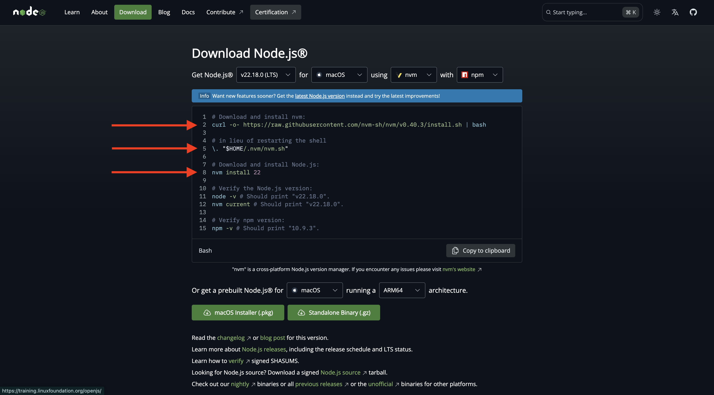

# 1.6.1 Adobe IO和App Builder

## 1.6.1.1创建您的Adobe I/O项目

转到[https://developer.adobe.com/console/home](https://developer.adobe.com/console/home){target="_blank"}。

确保在屏幕右上角选择正确的实例。 您的实例为`--aepImsOrgName--`。

>[!NOTE]
>
> 以下屏幕截图显示了正在选择的特定组织。 在阅读本教程时，您的组织很可能具有不同的名称。 当您注册本教程时，系统已为您提供了要使用的环境详细信息，请按照这些说明操作。

接下来，选择&#x200B;**从模板**&#x200B;创建项目。

选择&#x200B;**App Builder**。

输入名称`--aepUserLdap-- GSPeM EXT`。 单击&#x200B;**保存**。

然后您应该会看到类似这样的内容。

## 1.6.1.2配置开发环境

要创建、提交和部署可扩展应用程序，您计算机上的本地开发环境应安装以下应用程序和包：

- Node.js（版本20.x或更高版本）
- npm（与Node.js打包）
- Adobe Developer命令行界面(CLI)

如果您的计算机上尚未安装这些应用程序或软件包，请按照以下步骤操作。

### Node.js和npm

转到[https://nodejs.org/en/download](https://nodejs.org/en/download)。 随后，您应该看到该视图，并显示许多需要执行以安装Node.js和npm的终端命令。 此处显示的命令适用于MacBook。

首先，打开一个新的终端窗口。 粘贴并执行屏幕快照中第2行中提到的命令：

`curl -o- https://raw.githubusercontent.com/nvm-sh/nvm/v0.40.3/install.sh | bash`

接下来，执行屏幕快照中的第5行命令：

`\. "$HOME/.nvm/nvm.sh"`

成功执行这两个命令后，请运行此命令：

`node -v`

您应该会看到返回的版本号。

接下来，运行此命令：

`npm -v`

您应该会看到返回的版本号。

如果最后2个命令成功返回了版本号，则说明这2个功能的配置成功。

### Adobe Developer命令行界面(CLI)

要安装Adobe Developer命令行界面(CLI)，请在终端窗口中运行以下命令：

`npm install -g @adobe/aio-cli`

运行此命令可能需要几分钟的时间，最终结果应类似于此：

Adobe Developer命令行界面(CLI)现在也已成功安装。

现在，您已设置能够运行App Builder项目的基本元素。

## 后续步骤

转到[创建您的AWS S3存储段](./ex2.md){target="_blank"}

返回至[GenStudio for Performance Marketing — 可扩展性](./genstudioext.md){target="_blank"}

返回[所有模块](./../../../overview.md){target="_blank"}
