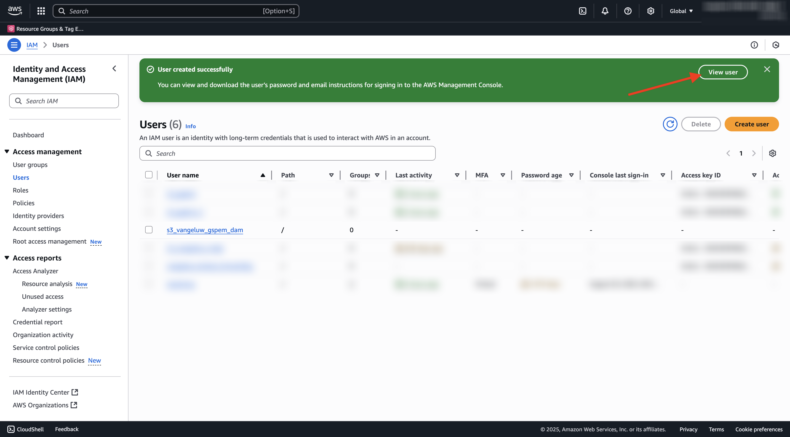

# 1.6.2创建您的AWS S3存储段

## 1.6.2.1创建您的S3存储段

转到[https://console.aws.amazon.com](https://console.aws.amazon.com)并登录。

>[!NOTE]
>
>如果您还没有AWS帐户，请使用您的个人电子邮件地址创建一个新的AWS帐户。

登录后，您将被重定向到&#x200B;**AWS管理控制台**。

在搜索栏中，搜索&#x200B;**s3**。 单击第一个搜索结果： **S3 — 云中的可扩展存储**。

您随后将看到&#x200B;**Amazon S3**&#x200B;主页。 单击&#x200B;**创建存储桶**。

在&#x200B;**创建存储桶**&#x200B;屏幕中，使用名称`--aepUserLdap---gspem-dam`。

保留所有其他默认设置。 向下滚动并单击&#x200B;**创建存储桶**。

然后，您会看到正在创建存储段，并且会被重定向到Amazon S3主页。

## 设置访问S3存储段的权限

下一步是设置对S3存储段的访问权限。

为此，请转到[https://console.aws.amazon.com/iam/home](https://console.aws.amazon.com/iam/home)。

AWS资源的访问权限由Amazon Identity and Access Management (IAM)控制。

您现在可以看到此页面。

在左侧菜单中，单击&#x200B;**用户**。 您随后将看到&#x200B;**用户**&#x200B;屏幕。 单击&#x200B;**创建用户**。

接下来，配置您的用户：

- 用户名：使用`s3_--aepUserLdap--_gspem_dam`

单击&#x200B;**下一步**。

然后，您将会看到此权限屏幕。 单击&#x200B;**直接附加策略**。

输入搜索词&#x200B;**s3**&#x200B;以查看所有相关的S3策略。 选择策略&#x200B;**AmazonS3FullAccess**。 向下滚动并单击&#x200B;**下一步**。

检查您的配置。 单击&#x200B;**创建用户**。

你会看到这个。 单击&#x200B;**查看用户**。

单击&#x200B;**安全凭据**，然后单击&#x200B;**创建访问密钥**。

选择&#x200B;**在AWS**&#x200B;外部运行的应用程序。 向下滚动并单击&#x200B;**下一步**。

单击&#x200B;**创建访问密钥**

你会看到这个。 单击&#x200B;**显示**&#x200B;查看您的访问密钥：

您的&#x200B;**访问密钥**&#x200B;现已显示。

>[!IMPORTANT]
>
>将凭据存储在计算机上的文本文件中。
>
> - 访问密钥ID： ...
> - 访问密钥： ...
>
> 单击&#x200B;**完成**&#x200B;后，您将再也看不到您的凭据！

单击&#x200B;**完成**。

您现在已成功创建一个AWS S3存储桶，并创建了一个有权访问此存储桶的用户。

## 1.6.2.2将Assets上传到您的S3存储桶

在搜索栏中，搜索&#x200B;**s3**。 单击第一个搜索结果： **S3 — 云中的可扩展存储**。

单击以打开您新创建的S3存储段，它应该命名为`--aepUserLdap---gspem-dam`。

单击&#x200B;**上传**。

您应该会看到此内容。

您可以在[此处](./../../asset-mgmt/module2.2/images/CitiSignal_Neon_Rabbit.zip){target="_blank"}下载CitiSignal图像文件。

将文件导出到桌面。

获取该文件夹中的2个图像文件，并将其放入S3存储桶上传窗口。 单击&#x200B;**上传**。

您应该会看到此内容。 您的S3存储段、图像文件和IAM用户现在可供外部DAM应用程序使用。

## 后续步骤

转到[创建外部DAM应用程序](./ex3.md){target="_blank"}

返回至[GenStudio for Performance Marketing — 可扩展性](./genstudioext.md){target="_blank"}

返回[所有模块](./../../../overview.md){target="_blank"}
