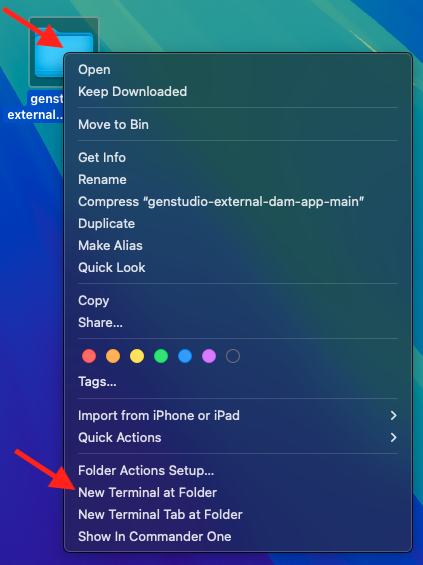
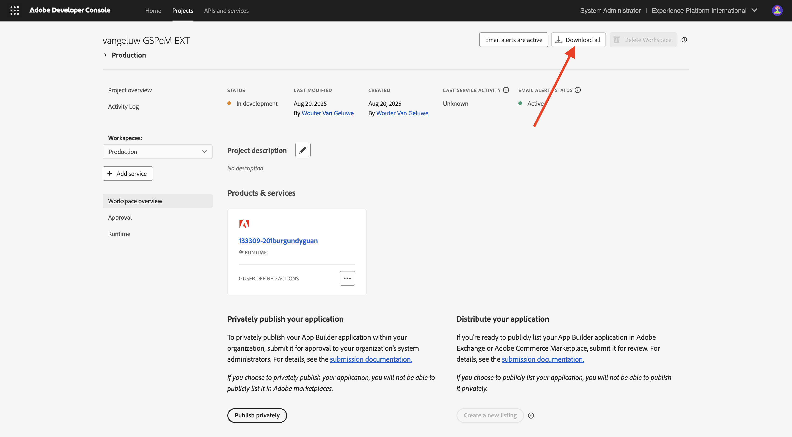
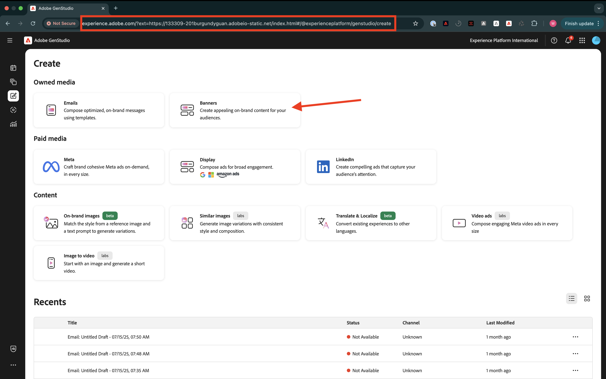

# 1.6.3创建和部署外部DAM应用程序

## 1.6.3.1下载示例应用程序文件

转到[https://github.com/woutervangeluwe/genstudio-external-dam-app](https://github.com/woutervangeluwe/genstudio-external-dam-app)。 单击&#x200B;**代码**，然后选择&#x200B;**下载ZIP**。


将zip文件解压缩到桌面上。


## 1.6.3.2配置Adobe Developer命令行界面

右键单击&#x200B;**genstudio-external-dam-app-main**&#x200B;文件夹，然后选择&#x200B;**新建位于文件夹中的终端**。



您应该会看到此内容。 输入命令`aio login`。 此命令将重定向到您的浏览器，并期待您登录。


成功登录后，您应该会在浏览器中看到此内容。


然后，浏览器将重定向回终端窗口。 您应该会看到一条显示&#x200B;**登录成功**&#x200B;的消息，以及浏览器返回的长令牌。


下一步是配置将用于外部DAM应用程序的实例和Adobe IO项目。

为此，您需要从之前配置的Adobe IO项目下载文件。

转到[https://developer.adobe.com/console/home](https://developer.adobe.com/console/home){target="_blank"}并打开您之前创建的名为`--aepUserLdap-- GSPeM EXT`的项目。 打开&#x200B;**生产**&#x200B;工作区。


单击&#x200B;**全部下载**。 这将下载一个JSON文件。



将JSON文件从&#x200B;**Downloads**&#x200B;目录复制到外部DAM应用程序的根目录中。


返回终端窗口。 输入命令`aio app use XXX-YYY-Production.json`。

>[!NOTE]
>
>您需要在上面的命令中更改文件的名称以匹配文件的名称。

命令运行后，您的外部DAM应用程序现在将连接到您之前创建的App Builder的Adobe IO项目。


## 1.6.3.3安装GenStudio可扩展性SDK

接下来，您需要安装&#x200B;**GenStudio可扩展性SDK**。 您可以在此处找到有关SDK的更多详细信息：[https://github.com/adobe/genstudio-extensibility-sdk](https://github.com/adobe/genstudio-extensibility-sdk)。

要安装SDK，请在终端窗口中运行此命令：

`npm install @adobe/genstudio-extensibility-sdk`


几分钟后，将安装SDK。


## 1.6.3.4在Visual Studio Code中查看外部DAM应用程序

打开Visual Studio Code。 单击&#x200B;**打开……**&#x200B;打开文件夹。


选择包含您之前下载的应用程序的&#x200B;**genstudio-external-dam-app-main**&#x200B;文件夹。 单击&#x200B;**打开**。


单击以打开文件&#x200B;**.env**。


**.env**&#x200B;文件由您在上一步中运行的命令`aio app use`创建，它包含使用App Builder连接到Adobe IO项目所需的信息。


现在，您需要将以下详细信息添加到&#x200B;**.env**&#x200B;文件，以便外部DAM应用程序可以连接到您之前创建的AWS S3存储段。

```
AWS_ACCESS_KEY_ID=
AWS_SECRET_ACCESS_KEY=
AWS_REGION=
AWS_BUCKET_NAME=
```

在上一个练习中创建IAM用户后，字段&#x200B;**`AWS_ACCESS_KEY_ID`**&#x200B;和&#x200B;**`AWS_SECRET_ACCESS_KEY`**&#x200B;可用。 系统要求您写下这些值，您现在可以复制这些值。


字段&#x200B;**`AWS_REGION`**&#x200B;可以从AWS S3 Home视图中获取，位于存储段名称旁边。 在此示例中，区域是&#x200B;**us-west-2**。


字段&#x200B;**`AWS_BUCKET_NAME`**&#x200B;应为`--aepUserLdap---gspem-dam`。

此信息允许您更新每个变量的值。

```
AWS_ACCESS_KEY_ID=XXX
AWS_SECRET_ACCESS_KEY=YYY
AWS_REGION=us-west-2
AWS_BUCKET_NAME=--aepUserLdap---gspem-dam
```

您现在应将此文本粘贴到`.env`文件中。 别忘了保存更改。


接下来，返回终端窗口。 运行此命令：

`export $(grep -v '^#' .env | xargs)`


最后，您需要更改将显示在GenStudio for Performance Marketing中的标签，以便您可以将外部DAM应用程序与其他集成区分开来。 为此，请打开文件&#x200B;**Constants.ts**，可通过在资源管理器中向下钻取到&#x200B;**src/genstudiopm > web-src > src**&#x200B;来查找该文件。

需要将第14行更改为

`export const extensionLabel: string = "--aepUserLdap-- - External S3 DAM";`

别忘了保存更改。


## 1.6.3.5运行外部DAM应用程序

在终端窗口中，运行命令`aio app run`。 1-2分钟后，您应该会看到此内容。

>[!NOTE]
>
>当您首次运行`aio app run`时，您可能会被重定向到浏览器以接受新证书。 如果发生这种情况，请接受证书，然后您可以继续执行以下步骤。


现在，您已确认您的应用程序正在运行。 下一步是部署它。

首先，按&#x200B;**CTRL+C**&#x200B;以停止应用程序运行。 然后，输入命令`aio app deploy`。 此命令会将您的代码部署到Adobe IO。

因此，您将收到一个类似的URL来访问已部署的应用程序：

`https://133309-201burgundyguan.adobeio-static.net/index.html`


为了进行测试，您现在可以通过将`?ext=`添加为上述URL的前缀来将该URL用作查询字符串参数。 这将导致此查询字符串参数：

`?ext=https://133309-201burgundyguan.adobeio-static.net/index.html`

转到[https://experience.adobe.com/genstudio/create](https://experience.adobe.com/genstudio/create)。


接下来，将查询字符串参数添加到&#x200B;**#**&#x200B;之前。 您的新URL应如下所示：

`https://experience.adobe.com/?ext=https://133309-201burgundyguan.adobeio-static.net/index.html#/@experienceplatform/genstudio/create`

页面将正常加载。 单击&#x200B;**横幅**&#x200B;开始创建新横幅。



选择模板并单击&#x200B;**使用**。


单击&#x200B;**从内容中选择**。


然后，您应该能够选择外部DAM，它应该从下拉列表中命名为`--aepUserLdap-- - External S3 DAM`。


您应该会看到此内容。 选择图像&#x200B;**neon_rabbit_banner.jpg**&#x200B;并单击&#x200B;**使用**。


现在，您已从S3存储桶中运行的外部DAM中选择了一个图像。 选择图像后，您现在可以按照练习[1.3.3.4创建和批准元广告](./../module1.3/ex3.md#create--approve-meta-ad)中记录的常规工作流程。


在本地计算机上更改代码时，您需要重新部署应用程序。 当您重新部署时，请使用以下终端命令：

`aio app deploy --force-build --force-deploy`


您的应用程序现已准备就绪，可供发布。

## 后续步骤

转到[单独发布您的应用程序](./ex4.md){target="_blank"}

返回至[GenStudio for Performance Marketing — 可扩展性](./genstudioext.md){target="_blank"}

返回[所有模块](./../../../overview.md){target="_blank"}
